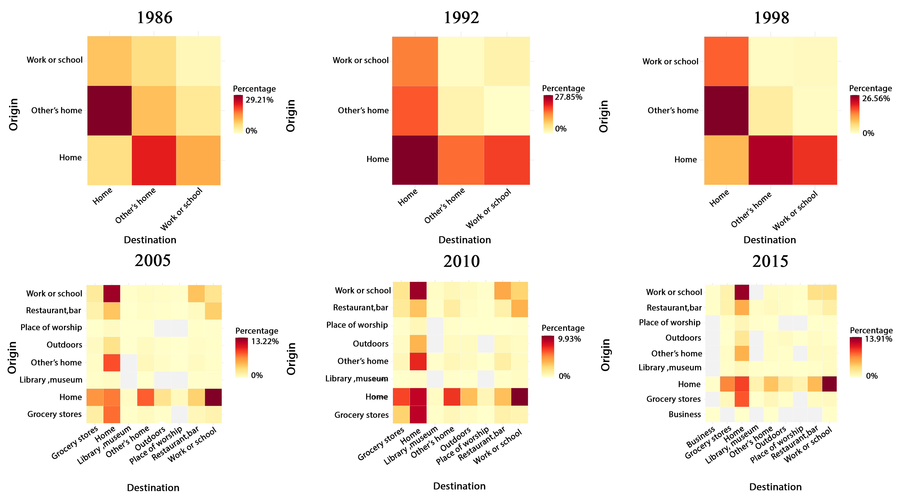
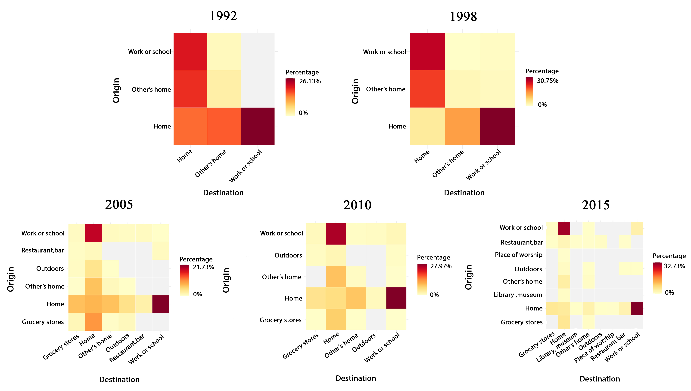
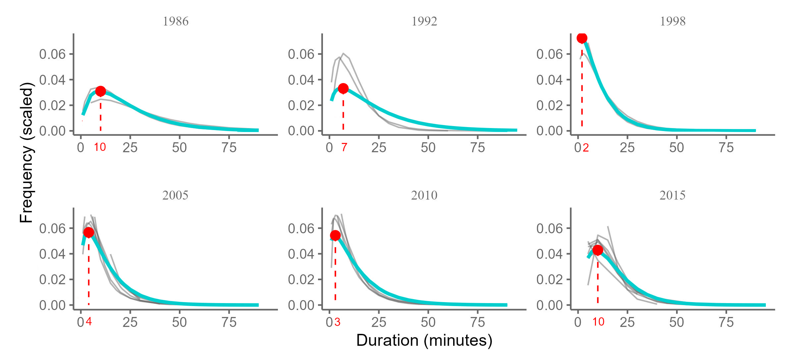
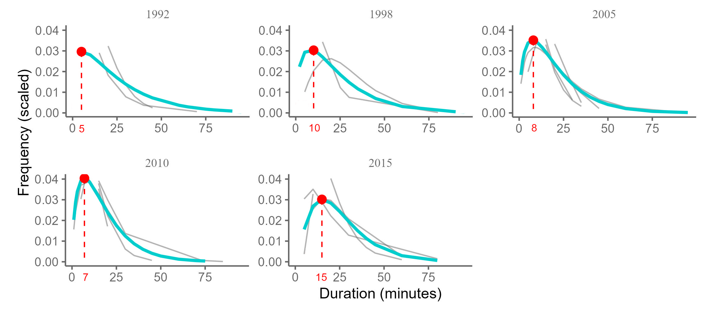

# A Historical Analysis of the Evolution of Active Travel Behaviour in Canada {#math-sci}

## Abstract

#ALL THIS SHOULD HAVE ALREADY BEEN DONE IN THE NOTEBOOKS IN FOLDER data-inputs; here you should be calling analysis-ready data

This research delves into urban planning, focusing on sustainable mobility and utilizing a historical approach to analyze active travel behavior in Canada. The main objective of this study is an in-depth examination of impedance functions, which are important tools in accessibility analysis because they capture traveler responses to the geographical distance between origins and destinations. This study empirically calibers these functions by leveraging time-use data and assessing the propensity for walking or cycling to various destinations, including home, work, school, grocery stores, restaurants, sports venues, etc. Utilizing data from Canada's General Social Survey (GSS) Cycles 2, 7, 12, 19, 24, and 29, the research offers a comprehensive historical view of active mobility trends over the past 35 years. These surveys, primarily focused on time use, furnish detailed information on travel duration via active modes such as cycling and walking, along with the purpose of each trip. The analysis concentrates on Canadian Census Metropolitan Areas (CMAs), revealing patterns in active travel. The findings indicate a preference for walking to grocery stores and other retail outlets, particularly after work or school. Cycling trips, conversely, are most frequently directed toward sports centers and arenas after work or school. The study uncovers pronounced distance-decay effects in active travel, highlighting the impact of distance on travel mode choices. This study not only sheds light on the behaviors of active travelers in Canada during the examined period but also offers valuable impedance functions. These findings are instrumental for future active accessibility analyses within the Canadian context, providing insights and tools for urban planning to foster sustainable travel behaviors.

Keywords: Impedance function, Accessibility, Active travel mode

## Introduction

There has been an increasing interest in urban and transportation planning regarding the concept that cities can influence travel behavior. This is accomplished by creating an environment that prioritizes accessibility and provides a range of transportation options. This ultimately encourages the adoption of sustainable modes of transportation that are more convenient and attractive, such as walking, cycling, and using public transport. In this context, accessibility refers to the ease individuals can reach desired destinations, essential services, and various amenities in their urban environment [@iacono2008access]. As a result, In the past few decades, active transportation modes have garnered significant interest in urban mobility research and policy-making, primarily for their prospective role in enhancing urban sustainability [@hino2014built; @lamiquiz2015effects]. To illustrate this, there has been an increase in research focusing on non-motorized transportation methods, including walking, cycling, and public transportation, as their importance in promoting sustainable mobility solutions has been recognized [@handy1993regional; @clifton2001evaluating; @frank2001built; @krizek2005perspectives; @sallis2004active; @vandenbulcke2009mapping; @wu2019measuring]. It is important to note that walking and cycling accessibility are closely linked, and both active transport modes contribute to the overall concept of "active accessibility" or "non-motorized accessibility." By considering and improving active accessibility in urban and transportation planning, cities can create an environment that facilitates and encourages active modes of transport. This approach helps reduce dependence on private vehicles and promotes healthier and more sustainable travel behavior among residents.

In recent decades, a large body of literature has contributed to assessing the accessibility of active transportation. These studies agree that there are two primary components for measuring accessibility: (1) the location and attractiveness of urban opportunities (benefit side) and (2) the barrier to travel from the origin in the network to the destination (cost side). In particular, calculating accessibility using impedance functions has become an important research topic that has received much attention from scholars in the fields of transportation planning, urban geography, and sustainable development [@frank2005linking; @krizek2005perspectives; @currie2010quantifying; @iacono2010; @yang2012walking; @millward2013active; @nassir2016utility; @saghapour2017measuring; @wu2019measuring]. In its various forms, the impedance function serves as a measure of the willingness to travel a certain distance to achieve desired goals. It is a valuable tool for analyzing spatial patterns of travel behavior [@taylor1975distance; @fotheringham1981spatial; @kwan1998space; @eldridge1991warped; @luoma1993threshold; @papa2012gravity; @yang2012walking; @millward2013active; @vale2017influence]. According to these definitions, areas with higher accessibility are those characterized by a lower impedance when traveling to desirable destinations. In other words, the greater the distance between two points, the less likely they can be reached on foot or by bike [@hansen1959accessibility; @pirie1979measuring; @handy1997measuring; @geurs2001accessibility; @bhat2002development; @church2003measuring; @kwan2003recent; @geurs2004; @levinson2005access; @cascetta2013new]. So, there needs to be more information on the willingness of some individuals to walk or cycle greater distances. Equally, there needs to be more data on how distance affects the nature of the activity, the desirability of the destinations, and the characteristics of those embarking on the trip in different contexts. Hence, it is imperative to investigate the evolution of impedance function over time due to its inherently dynamic nature, which fluctuates in response to the evolution of transportation networks and shifts in urban spatial configurations [@iacono2008access; @iacono2010]. Luoma, Mikkonen, and Palomaki (1993) provided evidence highlighting a diminishing distance decay parameter over time, attributing this trend to enhanced travel velocities and the maturation of transportation infrastructures [@luoma1993threshold]. Subsequent research by Mikkonen and Luoma (1999) delved into elucidating the factors behind these noted shifts in the parameters of gravity models over periods [@mikkonen1999parameters].

Various impedance functions have been utilized to describe the distribution of walking and cycling trips, both in general and for specific purposes [@iacono2008access; @iacono2010; @larsen2010beyond; @yang2012walking; @millward2013active; @vale2017influence; @li2020approach]. When assessing accessibility using impedance functions, different cost decay functions have been employed, including **threshold functions** (e.g., step function) and **smooth cost decay functions** (e.g., inverse-potential, log-normal, logistic, exponential square-root, and half-life function) [@de2009exponential; @reggiani2011accessibility; @osth2016new; @itf2017linking]. Scholars place significant emphasis on selecting an appropriate impedance function, leading to a diverse range of functions being employed. These various specifications primarily vary in their treatment of the influence of distance, consequently impacting the accessibility measurement. However, negative exponential distance-decay functions are commonly used in assessing non-motorized accessibility, capturing the willingness of individuals to walk or cycle to destinations [@handy1997measuring; @geurs2001accessibility; @iacono2010; @vega2012using; @millward2013active; @vale2017influence; @li2020approach]. The merit of this function lies in its ability to attribute decreasing influences to more remote opportunities, thereby offering a more accurate estimation for shorter journeys, especially those undertaken by non-motorized modes [@iacono2010; @kanafani1983transportation; @fotheringham1989spatial].

In addition to determining the form of the impedance function, the analyst must also specify the variable used to measure impedance, which can be either time, cost, or a combination of both. Previous studies have employed both of these measures, and there are instances where the generalized cost concept has also been applied. The choice between time and distance as the impedance variable has been found to be acceptable based on previous research [@iacono2010; @hull2012accessibility; @sun2012measuring; @lowry2012using; @vasconcelos2012evaluation ]. However, when it comes to non-motorized travel modes, extracting accurate travel times from existing network models can be challenging, which limits the options and makes distance a more practical choice [@handy1997measuring; @iacono2010; @yang2012walking; @arranz2019measuring]. Furthermore, researchers specializing in active modes of transportation have faced challenges stemming from a need for more objective data concerning walking and cycling behavior. Estimating specialized impedance functions specific to non-motorized modes requires appropriate travel survey data that can capture pedestrian and cycle behavior. Often, researchers have resorted to relying on retrospective questionnaires, which assess subjective aspects such as the frequency and duration of walking and cycling activities. Notably, regional household travel surveys, including trips made by non-motorized modes, have been employed for this purpose [@iacono2010; @millward2013active].

In contrast to these localized surveys, some datasets provide a nationwide perspective, encompassing travel for various trip purposes and offering insights into details like travel episode origins, destinations, and time-based lengths. This comprehensive approach furnishes a more holistic understanding of active transportation behavior. Nevertheless, only some studies, such as Yang et al. (2012), have examined active travel behavior nationally. Addressing the previously identified gaps and precisely the challenge of using uniform decay curves, such as the negative exponential function for both cycling and walking in accessibility assessments, this study endeavors to identify the most appropriate distance decay function for various destinations and time periods.  Our research delves into the complexities of actual travel behavior, emphasizing active transportation modes. We utilize historical data from the General Social Survey (GSS) from 1986 to 2015 in Canada to calculate the impedance function for cycling and walking trips. By doing so, this study conducts a comparative analysis of travel behaviors associated with these two modes.

Moreover, we recognize that non-work travel encompasses a spectrum of trip intentions and diverse traveler behaviors, making the impedance function an essential analytical tool for examining non-work accessibility. Grengs (2015) emphasizes the importance of crafting distinct functions for each travel purpose, a principle that guides our analysis [@grengs2015nonwork]. Our investigation will encompass a variety of trip intents, ranging from commutes to homes, workplaces, or educational institutions to social visits, outdoor activities, business trips, shopping, cultural outings to libraries, museums, or theaters, dining out, and engaging in religious practices. By drawing on a nationally representative sample of Canadian residents, our research intends to bridge the empirical data gap concerning the frequency and duration of typical pedestrian and cycling trips for different purposes. In doing so, it aspires to provide a nuanced understanding of active travel behavior. Ultimately, this comprehensive analysis seeks to contribute meaningfully to the ongoing conversation on active transportation, shedding light on its role in shaping travel behavior and accessibility.


## Background

Accessibility is conceptualized as the potential to access geographically dispersed opportunities, considering the challenges associated with reaching them [@paez2012measuring]. The positioning of resources concerning users, the transportation infrastructure, and how spatial relations and distances impact the potential utilization of amenities are fundamental considerations in accessibility and mobility modeling. Typically, the effect of distance on potential use is expressed by "Impedance functions" or "Distance Decay functions" [@hansen1959accessibility; @koenig1980indicators; @fotheringham1981spatial]. These functions are integral in transportation planning, commonly incorporated into forecasting models to interpret urban travel behaviors for each mode. They are typically shaped from estimates grounded in sample data distributions that mirror fluctuations in individuals' propensity to travel different distances to reach opportunities. This importance is underscored by their prevalent use in understanding accessibility to specific locations and areas covered by different services [@hsiao1997use; @zhao2003forecasting; @iacono2010; @li2020approach]. Fundamentally, accessing opportunities is tied to the travel costs to a destination. Indeed, the main goal of the impedance function is to depict the diminishing intensity of interaction as the separation between locations augments. These functions delineate how an increase in distance or associated travel costs inversely affects potential usage; in essence, distant facilities are less likely to be used compared to those in closer proximity[@hansen1959accessibility; @koenig1980indicators; @fotheringham1981spatial; @skov2001estimation]. In addition, the impedance function captures people's tendency to reduce the number of trips they take exponentially as the distance increases. The ''distance-decay'' effect suggests that adding one unit of distance to a long trip is less significant than adding one unit to a shorter trip [@carrothers1956historical]. The essence of the impedance function, as highlighted by Carrothers (1956), suggests a nuanced understanding of travel behavior, particularly in how distance or time additions impact trips of varying lengths. This concept is further elaborated upon by the idea that the perceived friction or impedance per unit of distance does not remain constant but diminishes with increasing distance. Essentially, any additional distance or time incurred is felt more acutely for shorter trips, creating a higher friction or impedance against movement. This phenomenon is due to the disproportionately greater friction per unit of distance for shorter distances compared to longer ones. Conversely, when considering longer movements, an additional unit of distance or time becomes relatively less significant. For example, in an urban context, the friction against movement within a densely populated area for a given distance is generally higher than the same distance in a less densely developed space. This implies that the effect of an extra mile or minute is more substantial when added to a shorter trip than to a longer one. Hence, the impedance function reflects this diminishing sensitivity to distance or time increments as the length of the trip increases, aligning with the principle that the impact of additional distance or time diminishes as the total trip length extends.

Examining impedance functions concerning different transportation modes and destinations is a valuable foundation for comprehending the travel behavior attributed to each mode. The parameters of impedance functions offer insights into the spatial coverage provided by each mode of transportation. By segmenting modal trips based on their purposes, comparing the distribution of trips between various purposes for each transportation mode (work-related and non-work purposes) becomes possible. Empirically derived impedance functions offer valuable evidence that can be utilized to examine and substantiate various claims about travel behavior, thus supporting urban planning endeavors. For instance, the current interest in creating "livable" communities revolves around loosely held assumptions regarding individuals' willingness to walk and cycle to different destinations. A common belief is that people are generally willing to walk up to a quarter of a mile to access most locations [@untermann1984accommodating]. However, there remains limited information regarding whether specific individuals are open to walking or cycling longer distances and, if so, how much farther they are willing to travel. Moreover, there needs to be more evidence concerning the influence of trip characteristics, destination attractiveness, and individual characteristics on the impact of distance on walking and cycling behaviors[@geurs2006accessibility].

Since Hansen's foundational research, various categories of accessibility measures have been developed, such as active-based, infrastructure-based, individual-based, and utility-based indicators [@hansen1959accessibility; @geurs2004]. Accessibility metrics, particularly those of the gravity type or potential measures, have been extensively utilized in active modes [@miller2005place]. These measures primarily stem from the gravity model, where an impedance function weighs opportunities. In fact, these are designed by weighting opportunities within an area according to an attraction measure and then diminishing each based on an impedance measure [for example, @geertman1995gis; @handy1993regional]. Equation 2.1 expresses the general representation of the accessibility equation:

\begin{equation}
A_{ik}^{pt} = \sum_{j=1}^J g(O_j^t) f(C_{ij}^p)
\label{eq:gen}
\end{equation}

Research demonstrates that two primary types of accessibility indicators are predominantly used in studies. According to equation \@ref(eq:gen), the first one revolves around **Opportunities**, which are weighted by an impedance (characterized by a relevant decreasing function of travel cost or time required to access these opportunities. The accessibility measure $A^ {pt}_{ik}$ signifies accessibility from an origin i at a specific time t to a particular destination type k tailored for an individual of type p. The function $g(O^t_{jk})$ quantifies the appeal of opportunities categorized under type k at destination j, accessible at time t. Simultaneously, $f(C^p_{ij})$ represents the impedance while traveling from origin i to destination j for a person belonging to type p. It's worth noting that the functional form $f()$ delineates an impedance decay function. Meanwhile, $C^p_{ij}$ signifies the generalized travel cost, potentially encompassing factors such as time, distance, and exertion.

Within the gravity model, the second variable concerns the cost associated with the spatial gap between a trip's start and end points (origins and destinations). Moreover, the third pivotal variable, crucial for constructing this model, involves the mathematical formulation delineating the travel impedance between origins and destinations. This "cost" can be articulated in terms of physical distance, travel duration, financial outlay, or a fusion of these elements. Among these, travel duration emerges as the chief cost measure and is the metric chosen for this particular investigation[@handy1993regional; @fotheringham1989spatial; @grengs2004measuring; @hess2005access]. In fact, when selecting a format for the impedance function, the researcher must determine which variable (time, cost, or both) will measure impedance. Historically, both these measures have been employed, with specific instances incorporating the concept of generalized cost [@handy1997measuring]. For non-motorized travel modes, however, the prevalent choice is distance, attributed to the challenges in obtaining precise travel times from existing network models designed for walking and bicycling. Previous studies indicate that adopting either time or distance as the impedance variable is appropriate [@handy1997measuring]. While the first two variables are derived from the attributes of the built environment, the impedance parameter captures aspects of human behavior, making its determination an intricate undertaking.

The second type pertains to the **Cumulative-opportunity** metrics, often referred to as **isochronic indices**. These evaluate accessibility by determining the number or proportion of opportunities available within a specified travel duration or distance from a reference point. These metrics avoid making presumptions about travel decay. They utilize a rectangular function, categorizing travel as "acceptable" within certain thresholds and "unacceptable" beyond them. One of the main complexities with these metrics is deciding on the appropriate cutoff point. This decision can be based on prevailing mobility patterns of the population, or it can mirror established norms, conventions, or the researcher's informed projections [@vickerman1974accessibility]. This metric can be interpreted as a specialized solution of Equation 2.2. In this context, the impedance function is designated as 1 when $C_{ij}< x$ and 0 when $C_{ij} > x$.


\begin{equation}
C_{ij} =
\begin{cases}
  1 & \text{if } c_{ij} \le x \\
  0 & \text{if } c_{ij} > x
\end{cases}
\label{eq:Rectangular form of impedance function}
\end{equation}

The study of travel behaviors has resulted in the development of various mathematical functions that have been carefully developed by comparing observed walking and cycling trips with predefined mathematical distributions over time. The choice of the impedance function is critical, as it is deeply intertwined with the gravitational force of travel, subsequently influencing accessibility evaluation outcomes [@breheny1978measurement; @kwan1998space; @talen1998assessing]. It should be noted that the domain of transportation research has seen an increased focus on various formulations related to accessibility. Pre-eminent research in this domain has been presented by the likes of Song (1996), Handy and Niemeier (1997), Handy and Clifton (2001), and Iacono et al. (2010)[@song1996some; @handy1997measuring; @clifton2001evaluating; @iacono2010]. While the majority of these studies focus on automobile transportation, Iacono et al. (2010), Millward et al. (2013), and Vale et al. (2017) investigate active modes of transportation, such as walking and cycling. Their findings show that the attractiveness of destinations declines significantly beyond a mile.

The choice of the most appropriate impedance function and the associated parameters can significantly vary, especially when considering different modes of travel, particularly within the realm of active transportation, as well as the specific purpose of the journey [@iacono2008access; @iacono2010; @larsen2010beyond; @millward2013active]. In the domain of impedance function modeling for travel behavior analysis, both a simple inverse power function and a negative exponential function, typically based on distance or travel time, are frequently employed. However, these conventional models have been criticized for their rapid attenuation near the origin, as highlighted in Ingram's seminal work in 1971. Ingram pointed out that these traditional functions tend to diminish more quickly than empirical data would suggest, particularly in proximity to the starting point of travel. To address this limitation, he proposed the use of a modified Gaussian function. This alternative model is characterized by a slower decline rate near the origin and a less steep fall-off at greater distances, providing a more realistic representation of travel behavior over varying distances. The modified Gaussian function holds distinct advantages over its counterparts, including a slower rate of decline in proximity to the origin and a more gradual approach to zero as distances increase, setting it apart from the rapid decay exhibited by the negative exponential and inverse power functions[@ingram1971concept]. Despite the theoretical promise of the Gaussian function, as proposed by Ingram (1971), our comprehensive review of the existing literature did not reveal any specific research applications of this function to assess accessibility within the context of active transportation. To our knowledge, only Kwan (1998) stands out as the sole researcher to have employed a Gaussian function to evaluate automobile accessibility [@kwan1998space; @vale2017influence]. This absence of utilization in the active transportation context underscores a notable research gap, leaving the opportunity for future investigations to explore the potential advantages and implications of adopting the modified Gaussian function for assessing accessibility in walking and cycling.

Researchers, from Stewart (1941) to Haggett (2001), have reached a consensus regarding the non-linear nature of inverse distance-decay functions in human geographical applications [@stewart1941inverse; @taylor1971distance; @taylor1983distance; @johnston1973frictions;@robinsonm; @haggett2001geography]. At the same time, simplistic functions may not aptly reflect the observed data on distance-interaction intensity graphs, and intricate distance-decay functions have been promoted by Taylor (1983) and Robinson (1998). Among these functions, bell-shaped curves, such as the Tanner function, March's function, and the Box-Cox function, have gained prominence, directed by multiple parameters [@richardson1969elements;@gaudry1981inverse; @taylor1983distance; @mandel1997disaggregate; @robinsonm; @tiefelsdorf2003misspecifications;@de2011modelling; @paez2012measuring; @halas2014distance; @martinez2013new; @van2001accessibility]. Mozolin et al. (2000) introduced an approach that integrates distance and employment numbers, visualized in a 3D diagrammatic representation [@mozolin2000trip]. However, while these functions provide precise fits for specific scenarios, their general application across varying contexts may be limited.

As mentioned, the choice of impedance functions plays a pivotal role in modeling accessibility, particularly when analyzing travel behavior within urban environments. Among the various mathematical forms that can represent impedance functions, the negative exponential function has emerged as the dominant choice in traditional transportation planning models and recent studies [@meyer1984urban; @gutierrez1996european; @kwan1998space; @apparicio2008comparing; @iacono2008access; @iacono2010; @larsen2010beyond; @millward2013active]. Its prevalence in the literature can be attributed to several factors, including its compatibility with travel behavior theory and its ability to effectively estimate shorter trips, particularly those associated with non-motorized modes of transportation. As Song (1996) noted in his examination of alternative accessibility measures, the negative exponential form $(e ^-\beta x)$ stands out as the most useful in explaining population distribution due to its gradual decline, which aligns with empirical data and accurately captures the influence of proximity on accessibility [@song1996some]. This choice of impedance function aligns with the rationale that a more gradual decline near the origin is essential for estimating shorter trips, a characteristic highly relevant to active modes of transportation, such as walking and cycling. This preference for the negative exponential form is further corroborated by the work of Kanafani (1983), who highlighted its suitability for modeling non-motorized modes, emphasizing its capacity to better estimate shorter trips compared to the power function. The ubiquity of the negative exponential form in recent studies and its adaptability to various urban contexts make it a well-suited candidate for estimating impedance functions, as indicated by a record of numerous empirical applications [@kanafani1983transportation; @fotheringham1989spatial; @de2009exponential; @iacono2010; @signorino2011gravity; @prins2014many].

Furthermore, recent investigations into impedance functions have shed light on their effectiveness in modeling walking accessibility, with particular attention to the negative exponential form. In the study conducted by Vale and Pereira (2017), which examined 20 pedestrian accessibility measures, both the modified Gaussian and exponential functions were found to be robust choices for accurately modeling walking accessibility. These findings corroborate the suitability of the negative exponential form for capturing the nuanced patterns of walking behavior within urban areas. Vale and Pereira's research introduced a novel cumulative Gaussian function that considers cumulative opportunities at close distances (e.g., 200 or 400 meters) and a modified Gaussian curve for longer distances. These functions showcase the adaptability and versatility of impedance modeling, especially in the context of active travel and pedestrian accessibility analysis [@vale2017influence]. Thus, while alternative impedance functions may be considered in specific scenarios, the dominance of the negative exponential form underscores its utility as a fundamental choice for estimating impedance functions, mainly when dealing with active modes of transportation and urban accessibility modeling. We present a detailed exposition of the most widely recognized impedance functions to further elaborate on this aspect. These include the inverse power, negative exponential, modified Gaussian, logarithmic normal distribution, cumulative opportunities (both rectangular and linear), gamma, and Log-logistic decay functions. Each model offers a unique lens through which the relationship between distance or travel time and accessibility can be understood, thereby providing a comprehensive toolkit for urban planners and researchers to analyze and predict travel patterns in various contexts.

- **Inverse Power equation** 

The Inverse Power function is defined as (\@ref(eq:inverse)):

\begin{equation}
f(t_{ij}) =
\begin{cases}
  1 & \text{if } t_{ij} \le 1 \\
  t_{ij}^{-\beta} & \text{otherwise}
\end{cases}
\label{eq:inverse}
\end{equation}

This function posits that impedance is inversely proportional to travel time $(t_{ij})$ (represents the travel time between location i (origin) and location j (destination))raised to the power of $\beta$, a parameter to be estimated. For travel times less than or equal to one unit, the impedance is set to 1, reflecting a baseline accessibility. As the travel time increases beyond one unit, the function decays according to the power of $\beta$, indicating a diminishing probability of a traveler choosing a destination as the distance increases.


- **Negative Exponential equation** 

The Negative Exponential function (\@ref(eq:negative-exponential)) is given by:

\begin{equation}
f(t_{ij}) = e^{-\beta t_{ij}}
\label{eq:negative-exponential}
\end{equation}

This model suggests that impedance decreases exponentially with increasing travel time $(t_{ij})$. The parameter $\beta$ represents the decay rate, with higher values indicating a faster decrease in accessibility with increasing travel time. This function is widely used due to its simplicity and ability to model the rapid drop-off in accessibility over distance.

- **Modified Gaussian equation** 

The Modified Gaussian function is expressed as (\@ref(eq:modified-gaussian)):

\begin{equation}
f(t_{ij}) = e^{-\frac{t_{ij}^2}{2}}
\label{eq:modified-gaussian}
\end{equation}

This function follows a Gaussian distribution pattern, implying that the impedance decreases in a bell-shaped curve as travel time increases, with a slower decline near the origin and a less steep drop at larger distances. It captures the gradual reduction in accessibility with distance more realistically than the exponential or power functions.

- **Logarithmic normal distribution function equation** 

Presented as Equation \@ref(eq:logarithmic-normal)[@wu2019measuring]:

\begin{equation}
f(c_{ij}) = \alpha \frac{1}{\sqrt{2\pi} x \sigma} e^{-\frac{(\ln t - \mu)^2}{2\sigma^2}}
\label{eq:logarithmic-normal}
\end{equation}

Here, the variable $x$ represents the distance traveled in active modes. The parameters, represented as $\alpha$, $\mu$, and $\sigma$, hold significant importance in this analysis as they undergo estimation. Together, these parameters exert control over the shape of the curve under investigation. The function accounts for impedance distribution across different travel times in a log-normal format, offering a more nuanced view of accessibility. [@wu2019measuring].

- **Cumulative Opportunities Rectangular Function** 

Defined as Equation \@ref(eq:cumulative-rectan):

\begin{equation}
f(t_{ij}) =
\begin{cases}
  1 & \text{if } t_{ij} \le t \\
  0 & \text{otherwise}
\end{cases}
\label{eq:cumulative-rectan}
\end{equation}

This function assumes a binary approach to accessibility. For travel times $(t_{ij})$ below a certain threshold $t$, full accessibility (value 1) is granted. Beyond this threshold, accessibility rapidly drops to zero, representing a stark division between accessible and inaccessible areas.

- **Cumulative Opportunities Linear** 

The equation of cumulative opportunities linear is as follows (Equation \@ref(eq:cumulative-linear)): 

\begin{equation}
f(t_{ij}) =
\begin{cases}
  1 - \frac{t_{ij}}{\bar{t}} & \text{if } t_{ij} \le \bar{t} \\
  0 & \text{otherwise}
\end{cases}
\label{eq:cumulative-linear}
\end{equation}

This linear function provides a gradual decrease in accessibility with an increase in travel time up to a particular average time $\bar{t}$. Beyond this average time, accessibility is considered zero. This model is beneficial for representing a more gradual decay in accessibility than the abrupt drop-off in the rectangular model.

- **Gamma distribution** 

The formula of this function is presented below  (Equation \@ref(eq:gamma-imped))

\begin{equation}
f(c_{ij}) = 
\begin{cases}
\frac{1}{\sigma^\alpha\Gamma(\alpha)} c_{ij}^{\alpha-1} \cdot e^{-\frac{c_{ij}}{\sigma}} & \text{if } 0 \leq c_{ij} < \infty  \text{ and } \alpha, \sigma > 0 \\
0 & \text{otherwise}
\end{cases}
\label{eq:gamma-imped}
\end{equation}

The Gamma function introduces a flexible model, parameterized by $\alpha$ and $\sigma$, to represent impedance. This function can adjust its shape significantly based on the parameter values, offering a versatile tool for modeling various types of decay patterns in travel behavior.


- **Log-logistic decay functions** 

The log-logistic function was displayed in Equation \@ref(eq:log-logistic-decay-functions).

\begin{equation}
f(c_{ij}) = \frac {1}{1+ \exp(a + b\ln c_{ij})}
\label{eq:log-logistic-decay-functions}
\end{equation}

In this context, the variable $c_{ij}$ denotes the travel time between locations $i$ and $j$, while parameters $a$ and $b$ are the subject of estimation. In this log-logistic model, the impedance is a function of the natural logarithm of travel time $\ln c_{ij}$. Parameters $a$and $b$ define the steepness of the decay curve. This function is helpful for scenarios where a logistic decay pattern is more representative of the travel behavior being modeled [@thorsen1999network].


- **Beta distribution**

The Beta distribution has probability density function (\@ref(eq:beta-functions))


\begin{equation}
f(c_{ij}) = 
\begin{cases}
\frac{1}{B(\alpha, \beta)} c_{ij}^{\alpha - 1}(1 - c_{ij})^{\beta - 1} & \text{if } 0 \leq c_{ij} < \infty \\
0 & \text{otherwise}
\end{cases}
\label{eq:beta-functions}
\end{equation}

The Equation \@ref(eq:beta-functions) represents the probability density function of the Beta distribution, a continuous probability distribution with two shape parameters. In this formula, $c_{ij}$is a specific impedance or cost between a point $i$ and point $j$ which is between 0 and 1, inclusive. It represents the possible outcomes of the Beta distribution, where $c_{ij}$ is the probability of an event occurring. $\alpha$ is the first shape parameter, and $\beta$ is the second shape parameter. These parameters control the shape of the Beta distribution, where both are positive and more than 0. They can be any positive real numbers, and they determine the behavior of the probability density function, dictating where most of the distribution's "weight" is. The term $B(\alpha, \beta)$ in the denominator is the Beta function, which is a normalization constant to ensure that the total probability integrates to 1 over the interval from 0 to 1. The Beta function is related to the Gamma function and is defined for positive values of $\alpha$ and $\beta$. It ensures that the probability density function is scaled correctly. This formula gives us the likelihood of $c_{ij}$ when the distribution is defined by particular $\alpha$ and $\beta$ parameters.

- **Poisson distribution**

\begin{equation}
P(c_{ij} = k) = \frac{\lambda^k e^{-\lambda}}{k!}, \quad \text{for } k = 0, 1, 2, \ldots
\label{eq:poisson-functions}
\end{equation}

The Poisson distribution (\@ref(eq:poisson-functions)) is a discrete probability distribution that expresses the likelihood of a given number of events occurring within a fixed interval of time or space, assuming these events occur with a known constant mean rate and independently of the time since the last event. It is named after the French mathematician Siméon Denis Poisson. In Equation \@ref(eq:poisson-functions), $P(c_{ij} =k)$ represents the probability that the impedance between point $i$ and point $j$ is exactly $k$. The impedance could refer to various factors such as travel time, cost, or distance that might impede the movement or flow between these two points.$\lambda$ is the average rate of impedance observed in the system or estimated from data. It represents the expected number of impedances that occur over a given interval. In the context of accessibility, it could be the average number of barriers or frictions encountered when traveling between different locations. $k$ is the actual observed number of impedances; for example, this could be the actual number of barriers experienced on a particular route. The use of the Poisson distribution to model impedance is based on the assumption that the events (or impedances) occur randomly and independently within a given spatial or temporal frame of reference.


-  **Weibull distribution**

The Weibull distribution with shape $\alpha$ and scale $\theta$ has a probability density function as follows:

\begin{equation}
f(c_{ij}) =
\begin{cases}
\left( \frac{\alpha}{\theta}\right) \left( \frac{c_{ij}}{\theta}\right)^{\alpha - 1} e^{-\left(\frac{c_{ij}}{\theta}\right)^\alpha} & \text{if } 0 \leq c_{ij} \\
0 & \text{otherwise}
\end{cases}
\label{eq:weibull-functions}
\end{equation}

The Weibull distribution (Equation \@ref(eq:weibull-functions)) is a continuous probability distribution used to model various data types, particularly where the data shows a changing failure rate over time. This flexibility makes the Weibull distribution especially suited to reliability analysis, life data analysis, and modeling failure times. $f(c_{ij})$ represents the probability density function (pdf) of the Weibull distribution, with $c_{ij}$ being the variable of interest. here, $c_{ij}$ would represent the impedance value, such as time or cost associated with traveling between two points. $\alpha$ is the shape parameter of the Weibull distribution. It determines the form of the probability distribution function and can indicate whether the failure rate is increasing, constant, or decreasing over time. In fact,it would shape the distribution of impedance experiences, such as whether impedances are more common as trips get longer or shorter. $\theta$ is the scale parameter of the Weibull distribution. It stretches or compresses the distribution along the horizontal axis and is akin to the 'characteristic life' in reliability terminology.

Based on the above description, the inverse power, negative exponential, and modified Gaussian functions consistently diminish the influence of opportunities as travel time increases, governed by an impedance parameter $\beta$ that incorporates travel cost considerations. Originating from early gravity models of spatial interaction [@stewart1948demographic; @zipf1949human], the inverse power function exhibits a rapid decrease in opportunity influence as travel time lengthens. While power functions draw parallels with Newtonian physics, their direct applicability to human travel behavior has faced scrutiny [@sen2012gravity]. In contrast, the negative exponential function adopts a more gradual approach. Supported by robust theoretical foundations rooted in entropy maximization [@wilson1971family] and choice behavior theory [@fotheringham1989spatial], this function has emerged as a de facto standard in applied accessibility analysis due to its theoretically sound underpinnings. On the other hand, the modified Gaussian function displays a considerably gentler decline in influence near its origin and an overall slower decay rate. 

## Materials and Methods

### The GSS survey

IIt is critical to have appropriate travel survey data that includes pedestrian and cycling activities to derive impedance functions appropriate for non-motorized modes. The optimal approach would involve a dedicated survey, intricately designed to capture these specific behaviors predominantly, or data collected from Global Positioning Systems---an option that typically has higher costs. When these specific datasets are unavailable, a broader regional household travel survey can be employed, provided it encompasses trips made by non-motorized means [@iacono2010]. In this research, we utilized data from the General Social Survey (GSS), which is administered by Statistics Canada, to delve into active travel behavior in Canada. The GSS provides a comprehensive cross-sectional snapshot of the Canadian population through telephone surveys established in 1985. The study area for the GSS encompasses the entirety of Canada, from the famous cities like Toronto, Vancouver, and Montreal to the more serene and remote locations in provinces like Newfoundland and Labrador, Nunavut, and Yukon. It ensures a diverse and comprehensive representation of the Canadian demographic and lifestyle mosaic by casting such a wide net. These surveys encompass an array of socio-demographic inquiries combined with questions concentrating on specific core themes, such as health, time use, and aspects like social support and aging (Statistics Canada, 2015). One of the standout features of the GSS is its recurring "time use" cycle, which delves into the daily activities of Canadians. This cycle captures the amount of time individuals allocate to various tasks and the sequence, location, and concurrent activities, offering a holistic view of Canadians' daily lives. The questions within this cycle have been adapted and refined over the years to reflect the changing dynamics of daily life, ensuring that the data remains pertinent and contemporary.

In order to investigate the historical active travel behavior in Canada, Six GSS cycles were thoroughly considered for this study, namely those from 1986, 1992, 1998, 2005, 2010, and 2015. The 1986 cycle is notable because it was the first national random sample examining Canadian time-use patterns. Data filtering was essential given the research focus on travel behavior, particularly walking and cycling. It required an exhaustive extraction of entries relevant to these two travel modes. Each GSS Cycle is derived from two microdata sources: the Main and Episode files.  The Main file comprises questionnaire responses and associated data from participants, while the Episode files furnish detailed insights into every activity episode reported by the respondents. For this study, we employed the episode files to establish a comprehensive dataset for impedance function analysis. This dataset encompasses variables such as individual ID, start time, end time, time duration, origins and destinations of each walking and cycling trip, and weight. It should be noted that each record represents a single activity in a respondent's day, ensuring that all episodes collectively span twenty-four hours (or 1440 minutes). The weight parameter signifies the number of time-use episodes that a particular record in the Episode File represents.

Before diving into the analysis, performing preliminary steps to ensure data consistency across different time-use surveys was essential. Over the years, these surveys used diverse coding schemes for activities and contexts. Therefore, harmonizing these coding systems was crucial. The classifications of various activities have evolved from 1986 to 2015. To achieve uniformity, we synchronized the activity categories from 2005, 2010, and 2015 and similarly aligned those from 1986, 1992, and 1998. As a result, for the earlier years (1986, 1992, and 1998), trip origins and destinations were categorized as "home," "other's home," and "work or school." In the later years (2005, 2010, and 2015), these categories expanded to include "Restaurant, bar or club," "Place of worship," "Grocery store, other stores or mall," "outdoors," and "Library, museum or theater." Additionally, it is essential to note that the 1986 dataset solely comprises walking data, with no records of cycling trips for that year. This careful standardization of data across different periods was fundamental for a coherent and accurate analysis of travel behavior trends.

The decision to tap into the time series data of the GSS is motivated by the opportunity it offers to discern and analyze evolving patterns over an extended time frame. This approach spans three decades and facilitates a comprehensive longitudinal assessment of walking and cycling trends in Canada. This depth of temporal coverage is instrumental in capturing the nuances and shifts in travel behaviors over time.

### Estimating impedance function parameters

The foundation of our study rested upon the calculation of impedance functions for walking and cycling trips in each of the six years (1986, 1992, 1998, 2005, 2010, and 2015) under investigation. As mentioned before, the impedance function is a fundamental construct for examining travel behavior, encapsulating the factors influencing the ease or difficulty of traversing a particular route. Diving deeper into travel behavior variations, we acknowledged that behaviors are shaped by the mode of travel (such as walking or cycling), the trip's purpose, and the location specifics of the trip's origin and destination [@geurs2006accessibility; @iacono2008access; @iacono2010; @larsen2010beyond; @millward2013active]. This insight underscored the challenge of generalizing a single impedance function, given that different travel modes and purposes necessitate differing functions. So, in this research, we endeavored to compute the impedance function individually for each destination and mode of transportation. We employed the R programming language to initiate this process and leveraged the "fitdistrplus" package. Our approach was methodical, commencing with a comprehensive exploratory analysis. We generated skewness and kurtosis graphs, providing valuable visual representations of the distributional characteristics inherent in the travel time duration for walking and cycling trips each year.

The selection of an appropriate probability distribution was pivotal in our analysis. By closely scrutinizing the skewness and kurtosis graphs, we aimed to identify the probability distribution that most faithfully mirrored the empirical characteristics of our data. This step was crucial to ensure the subsequent calculations accurately captured the underlying travel behavior. In the quest for the optimal distribution, we systematically evaluated various probability distribution models, including but not limited to the normal, gamma, exponential, and Weibull distributions. Our choice of the most suitable distribution hinged on statistical metrics, including the Akaike Information Criterion (AIC) and Bayesian Information Criterion (BIC). These criteria facilitated a quantitative assessment of the goodness of fit for different distributional models. Additionally, we leveraged the maximum likelihood estimation (MLE) method, utilizing the Nelder-Mead optimization algorithm available within the {fitdistrplus} package [@delignette2015fitdistrplus]. It ensured precise estimation of distribution parameters, underlining the rigor of our impedance function calculation.

Following a thorough process of model selection and parameter estimation, we calculated the impedance function. This crucial component assesses the resistance or difficulties associated with walking and cycling trips for each year and destination, considering the different weights of various factors. In defining the impedance function, we identified travel time as the critical metric for measuring trip impedance (cost). This choice is based on the premise that walking and cycling usually do not incur direct monetary costs, aligning with the concepts presented in previous research [@hamidi2014applying]. This approach allows for a more precise evaluation of the impediments pedestrians and cyclists face over time and across different destinations.

## Results and discusion

### Descriptive analysis of walking and cycling trips from 1986 to 2015

The General Social Survey (GSS) data emerged as an invaluable repository in our detailed examination of active travel behavior in Canada. It provided a comprehensive view of individual preferences and behaviors about active modes of transportation, specifically walking and cycling. By focusing on the years 1986 to 2015, we sought to capture the evolution of active travel against the backdrop of crucial urban development changes, societal shifts in attitudes towards health and the environment, and modifications in transportation infrastructure and policies.

```{r load_pkgs, include = FALSE, message=FALSE}
# List of packages required for this analysis
#pkg <- c("dplyr", "ggplot2", "knitr", "bookdown", "fitdistrplus", "tidyverse", "readxl", "splitstackshape","tibble", "readr", "tabulate", "janitor", "flextable", "tidyr", "gt", "xtable", "kableExtra")

# Load packages
library(dplyr) # A Grammar of Data Manipulation
library(here)
library(ggplot2) # Create Elegant Data Visualisations Using the Grammar of Graphics
library(knitr) # A General-Purpose Package for Dynamic Report Generation in R
library(fitdistrplus) # Help to Fit of a Parametric Distribution to Non-Censored or Censored Data
library(tidyverse) # Easily Install and Load the 'Tidyverse'
library(readxl) # Read Excel Files 
library(splitstackshape) # Stack and Reshape Datasets After Splitting Concatenated Values
library(tibble) # Simple Data Frames
library(readr) # Read Rectangular Text Data
library(tabulate) # Pretty Console Output for Tables
library(janitor) # Simple Tools for Examining and Cleaning Dirty Data
library(flextable) # Functions for Tabular Reporting
library(tidyr) # Tidy Messy Data
library(xtable) # Export Tables to LaTeX or HTML
library(extrafont) # Tools for Using Fonts
library(kableExtra)
library(reshape2)
library(RColorBrewer)
```


```{r Load the dataset, echo=FALSE, include=FALSE}
# Load the dataset
load(paste0(here(), "/data/walking_1986.Rda"))
load(paste0(here(), "/data/walking_1992.Rda"))
load(paste0(here(), "/data/walking_1998.Rda"))
load(paste0(here(), "/data/walking_2005.Rda"))
load(paste0(here(), "/data/walking_2010.Rda"))
load(paste0(here(), "/data/walking_2015.Rda"))
load(paste0(here(), "/data/cycling_1992.Rda"))
load(paste0(here(), "/data/cycling_1998.Rda"))
load(paste0(here(), "/data/cycling_2005.Rda"))
load(paste0(here(), "/data/cycling_2010.Rda"))
load(paste0(here(), "/data/cycling_2015.Rda"))
```


```{r creating an integrated data, include=FALSE,  cache=FALSE}
# creating an integrated data frame from 1992 to 2015
trip <- rbind(walking_2015, cycling_2015, walking_2010, cycling_2010, walking_2005, cycling_2005, cycling_1998, walking_1998, walking_1992, cycling_1992, walking_1986)

# Change cyclingtrip in cycling_2010 to cycling 
unique_modes <- unique(trip$MODE)
print(unique_modes)
trip$MODE[trip$MODE == "cyclingtrip"] <- "cycling"

# Change the name of some values in the dest column in the dataset 
# Ensure that 'dest_label' is the correct column name
trip <- trip %>%
  mutate(dest_label = case_when(
    dest_label == "Restaurant/bar" ~ "Restaurant, bar or club",
    dest_label == "Outdoors away from home" ~ "outdoors",
    dest_label == "Library" ~ "Library, museum or theatre",
    TRUE ~ dest_label  # This line ensures other values remain unchanged
  ))
```


```{r, echo=FALSE, cache=FALSE}

# Assuming 'trip' is your initial data frame and it's already been loaded.

# Filter out trips with DURATION greater than 90
trip_filtered <- trip %>%
  filter(DURATION <= 90)

# Calculate the count of trips for each mode and year
trip_counts <- trip_filtered %>%
  group_by(YEAR, MODE) %>%
  summarise(Count = n(), .groups = "drop") %>%
  pivot_wider(names_from = YEAR, values_from = Count)

# Process the data for the desired format
stats_data <- trip_filtered %>%
  group_by(YEAR, MODE) %>%
  summarise(
    min = min(DURATION),
    mean = mean(DURATION),
    max = max(DURATION),
    .groups = "drop"
  ) %>%
  pivot_longer(cols = c(min, mean, max), names_to = "Statistic", values_to = "Value") %>%
  pivot_wider(names_from = YEAR, values_from = Value)

# Combining counts and stats_data
final_data <- bind_rows(
  trip_counts %>% mutate(Statistic = "Count"),
  stats_data
) %>%
  mutate(MODE = factor(MODE, levels = c("walking", "cycling"))) %>%
  arrange(MODE, Statistic) %>%
  dplyr::select(MODE, Statistic, everything()) %>%
  mutate(across(where(is.numeric), ~ round(.x, 0)))

# Create a new 'label_mode' column that labels the mode at the first occurrence
final_data <- final_data %>%
  group_by(MODE) %>%
  mutate(label_mode = if_else(row_number() == 1, as.character(MODE), "")) %>%
  ungroup() %>%
  dplyr::select(-MODE) %>%
  rename(MODE = label_mode) %>%
  relocate(MODE, .before = 1)

# Ensure that 'MODE' column is a factor with levels in the order you want them to appear
final_data$MODE <- factor(final_data$MODE, levels = unique(final_data$MODE))

# Rename the 'MODE' column to 'Mode' before generating the table
final_data <- final_data %>%
  rename(Mode = MODE)

# Generate the table with the corrected mode labels
styled_table_13 <- final_data %>%
  kable(format = "latex", booktabs = TRUE, longtable = TRUE, 
        caption = "\\label{tab:table_13}Descriptive Analysis of Active Transportation Modes: Walking and Cycling Statistics from 1986 to 2015", 
        align = c('l', 'l', rep('c', ncol(final_data) - 2))) %>%
  kable_styling(full_width = FALSE, latex_options = c("striped"), font_size = 12) %>%
  column_spec(1, bold = TRUE) %>%
  add_header_above(c(" " = 2, "Year" = ncol(final_data) - 2)) %>%  # Corrected this line
  collapse_rows(columns = 1, valign = "top", latex_hline = "major") 

# Print the table
styled_table_13

```


Our primary method was rooted in descriptive analysis. We parsed vast quantities of data to discern overarching patterns and trends. A salient feature emerging from this analysis was the duration of trips undertaken.Table 2.1 contains a detailed compilation of descriptive statistics showing the fluctuating patterns of walking and cycling trips between 1986 and 2015. The data is categorized under two principal modes of transit: walking and cycling, with each category further explored through four statistical metrics: count, maximum (max), mean, and minimum (min), each quantified in minutes. In the walking trips section, the 'count' metric represents the number of recorded trips for each year. The journey began in 1986 with 384 recorded walking trips, escalating to 1,473 by 1992, indicating a burgeoning preference for walking during this period. The peak was reached in 1998 with 1,657 trips, which increased to an unprecedented 5,517 trips by 2005, possibly reflecting societal shifts toward healthier lifestyles or environmental concerns. However, post-2005, a downward trend emerged, with counts reducing to 4,360 trips in 2010 and further to 2,796 in 2015, possibly due to changing urban landscapes or the advent of alternative transportation modes. 

The 'max' time invested in walking trips is a constant 90 minutes across the years, suggesting a stable group of individuals who consistently engage in longer-duration walks, perhaps for exercise or leisure. However, the 'mean' walking time varies: it starts at 24 minutes in 1986, drops to 17 minutes in 1992, and finally to 10 minutes in 1998. This trend reverses slightly to 12 minutes in both 2005 and 2010 and ascends to 16 minutes in 2015. This fluctuation in average walking time could reflect evolving urban designs, societal pace, or changing durations in individuals' routines. The 'min' walking time, initially stable at 1 minute, drops to nonexistence in 2005 and 2010, then rebounds to 5 minutes in 2015, perhaps echoing the introduction and subsequent enforcement of minimum exercise guidelines.

For cycling trips, data is absent for 1986. Starting in 1992, 126 trips are noted, dipping marginally to 119 in 1998, then more than doubling to 325 by 2005—indicative of a surge in cycling popularity, potentially driven by environmental campaigns or improvements in cycling infrastructure. The count declined to 214 trips in 2010 but experienced a marginal recovery to 217 trips by 2015. The 'max' cycling time experiences a gradual reduction from 90 minutes in the early years to 80 minutes by 2015, possibly reflecting advancements in bicycle technology or changes in cyclists’ behaviors. The 'mean' time initially recedes from 24 minutes in 1992 to 18 minutes in 2005, then modestly increases, culminating at 22 minutes in 2015, suggesting that the average trip becomes slightly longer, which could be due to several factors such as increased commuting distances or a rise in recreational cycling. The 'min' cycling time shows a sharp decline to 1 minute in 2005 and 2010, paralleling the walking trend, before climbing back to 5 minutes in 2015, which could indicate cycling's growing popularity as a short-distance travel alternative.

As highlighted in Table \ref{tab:table_13}, throughout the 30 years under study, the duration of walking trips was consistently lower than that of cycling trips. To quantify this discrepancy, the mean duration for walking trips was approximately 33% of the corresponding duration for cycling trips, underscoring the inherent differences in these modes of transportation. An intriguing trend was observed between the years 1986 to 2005. The average duration of walking and cycling trips decreased significantly over the last two decades. Various factors might have precipitated this trend, such as urban sprawl, increased reliance on motorized transport, or societal preferences for faster modes of transportation. However, the subsequent decade (2005-2015) witnessed a marked reversal in this trend. The average duration for walking and cycling trips stabilized and began showing signs of resurgence. It could indicate many factors: growing urbanization leading to more accessible destinations, increased awareness and initiatives promoting health and sustainability, changes in urban planning that prioritize active modes of travel and improving required infrastructure, or a combination of these elements. This resurgence suggests a renewed and possibly growing affinity towards walking and cycling as viable modes of transportation.

```{r Trip, echo=FALSE, cache=FALSE, warning=FALSE, results="asis"}


# Filter for walking and cycling trips, selected years, and duration <= 90
trip_stats_data <- trip %>%
  filter(MODE %in% c("walking", "cycling"), YEAR %in% c(1986, 1992, 1998), DURATION <= 90) %>%
  group_by(YEAR, dest_label, MODE) %>%
  summarise(
    Count = n(),
    min = min(DURATION),
    median = median(DURATION),
    max = max(DURATION),
    .groups = "drop"
  )

# Calculate percentages
total_counts <- trip_stats_data %>% group_by(YEAR, MODE) %>% summarise(total_count = sum(Count), .groups = "drop")
trip_stats_data <- left_join(trip_stats_data, total_counts, by = c("YEAR", "MODE"))
trip_stats_data$Percentage <- round((trip_stats_data$Count / trip_stats_data$total_count) * 100, 1)

# Group by YEAR, MODE, and dest, then summarize
trip_stats_data <- trip_stats_data %>%
  group_by(YEAR, MODE, dest_label) %>%
  summarise(
    Count = sum(Count),
    min = min(min),  # Minimum of minimum durations per group
    median = median(median),  # Median of median durations per group
    max = max(max),  # Maximum of maximum durations per group
    total_count = sum(total_count),
    Percentage = mean(Percentage),
    .groups = "drop"
  )

# Pivot data for the table layout
wide_data <- trip_stats_data %>%
  pivot_wider(
    id_cols = c(dest_label, MODE),
    names_from = YEAR,
    values_from = c(min, median, max, Percentage)
  )

# Adjust column names for clarity and consistency
wide_data <- wide_data %>%
 dplyr::select(
    dest_lable, MODE,
    min_1986, median_1986, max_1986, Percentage_1986,
    min_1992, median_1992, max_1992, Percentage_1992,
    min_1998, median_1998, max_1998, Percentage_1998
  )

# Arrange rows based on MODE and then the decreasing percentage of year 1998
wide_data <- wide_data %>% 
  arrange(MODE, desc(Percentage_1998))

wide_data <- wide_data %>% 
  rename(
    P_86 = Percentage_1986,
   P_92 = Percentage_1992,
    P_98 = Percentage_1998,
   min_86 = min_1986,
   min_92 = min_1992,
   min_98 = min_1998,
   med_86 = median_1986,
   med_92 = median_1992,
   med_98 = median_1998,
   max_86 = max_1986,
   max_92 = max_1992,
   max_98 = max_1998
  )

# Create a new 'label_mode' column that labels the mode at the first occurrence
wide_data <- wide_data %>%
  group_by(MODE) %>%
  mutate(label_mode = if_else(row_number() == 2, as.character(MODE), "")) %>%
  ungroup() %>%
  dplyr::select(-MODE) %>%
  rename(MODE = label_mode) %>%
  relocate(MODE, .before = 2)

styled_table_14 <- wide_data %>%
  kable(
    format = "latex", 
    booktabs = TRUE, 
    longtable = TRUE, 
    caption = "\\label{tab:table_14}Comparative Trip Statistics by Transportation Mode and Destination: 1986, 1992, and 1998",
    col.names = c("Destination", "Mode","Minimum","Median","Maximum", "Percentage", "Minimum","Median","Maximum", "Percentage", "Minimum","Median","Maximum", "Percentage")
  ) %>%
  kable_styling(full_width = FALSE, latex_options=c("striped", "scale_down"), font_size = 6) %>%
  column_spec(1:14, width = "1cm") %>%
  add_header_above(c(" " = 2, "1986" = 4, "1992" = 4, "1998" = 4)) %>%
  row_spec(0, bold = TRUE, align = "c") %>%
  column_spec(6, border_right = TRUE) %>%
  column_spec(10, border_right = TRUE) %>%
  landscape()

styled_table_14


```

```{r echo=FALSE, cache=FALSE, warning=FALSE}


# Filter for walking and cycling trips, selected years, and duration <= 90
trip_stats_data <- trip %>%
  filter(MODE %in% c("walking", "cycling"), YEAR %in% c(2005, 2010, 2015), DURATION <= 90) %>%
  group_by(YEAR, dest_label, MODE) %>%
  summarise(
    Count = n(),
    min = min(DURATION),
    median = median(DURATION),
    max = max(DURATION),
    .groups = "drop"
  )

# Calculate percentages
total_counts <- trip_stats_data %>% group_by(YEAR, MODE) %>% summarise(total_count = sum(Count), .groups = "drop")
trip_stats_data <- left_join(trip_stats_data, total_counts, by = c("YEAR", "MODE"))
trip_stats_data$Percentage <- round((trip_stats_data$Count / trip_stats_data$total_count) * 100, 1)

# Group by YEAR, MODE, and dest, then summarize
trip_stats_data <- trip_stats_data %>%
  group_by(YEAR, MODE, dest_label) %>%
  summarise(
    Count = sum(Count),
    min = min(min),  # Minimum of minimum durations per group
    median = median(median),  # Median of median durations per group
    max = max(max),  # Maximum of maximum durations per group
    total_count = sum(total_count),
    Percentage = mean(Percentage),
    .groups = "drop"
  )

# Pivot data for the table layout
wide_data <- trip_stats_data %>%
  pivot_wider(
    id_cols = c(dest_label, MODE),
    names_from = YEAR,
    values_from = c(min, median, max, Percentage)
  )


# Adjust column names for clarity and consistency
wide_data <- wide_data %>%
 dplyr::select(
    dest_label, MODE,
    min_2005, median_2005, max_2005, Percentage_2005,
    min_2010, median_2010, max_2010, Percentage_2010,
    min_2015, median_2015, max_2015, Percentage_2015
  )

# Arrange rows based on MODE and then the decreasing percentage of year 2015
wide_data <- wide_data %>% 
  arrange(MODE, desc(Percentage_2015))

wide_data <- wide_data %>% 
  rename(
    P_05 = Percentage_2005,
   P_10 = Percentage_2010,
    P_15 = Percentage_2015,
   min_05 = min_2005,
   min_10 = min_2010,
   min_15 = min_2015,
   med_05 = median_2005,
   med_10 = median_2010,
   med_15 = median_2015,
   max_05 = max_2005,
   max_10 = max_2010,
   max_15 = max_2015
  )

# Create a new 'label_mode' column that labels the mode at the first occurrence
wide_data <- wide_data %>%
  group_by(MODE) %>%
  mutate(label_mode = if_else(row_number() == 2, as.character(MODE), "")) %>%
  ungroup() %>%
  dplyr::select(-MODE) %>%
  rename(MODE = label_mode) %>%
  relocate(MODE, .before = 2)


styled_table_15 <- wide_data %>%
  kable(
    format = "latex", 
    booktabs = TRUE, 
    longtable = TRUE, 
    align = c(rep("c", ncol(wide_data))),
    caption = "\\label{tab:table_15}Comparative Trip Statistics by Transportation Mode and Destination: 2005, 2010, and 2015",
    col.names = c("Destination", "Mode","Minimum","Median","Maximum", "Percentage", "Minimum","Median","Maximum", "Percentage", "Minimum","Median","Maximum", "Percentage")
  ) %>%
  kable_styling(full_width = FALSE, latex_options=c("striped", "scale_down"), font_size = 6) %>%
  column_spec(1:14, width = "1cm") %>%
  add_header_above(c(" " = 2, "2005" = 4, "2010" = 4, "2015" = 4)) %>%
  row_spec(0, bold = TRUE, align = "c") %>%
  column_spec(6, border_right = TRUE) %>%
  column_spec(10, border_right = TRUE) %>%
  landscape()

styled_table_15


```

Tables \ref{tab:table_14} and \ref{tab:table_15} thoroughly explore trip statistics by transportation mode and destination for the years 1986, 1992, 1998, 2005, 2010, and 2015. These tables detail the minimum, median, and maximum trip durations, accompanied by their respective percentages, which reflect the proportion of trips within each category. The temporal measures are presented in minutes. An analytical comparison of the tables reveals evolving patterns in transportation behaviors over time, with a particular emphasis on walking and cycling.

Table \ref{tab:table_14} reveals that for the year 1986, the dataset is limited to walking trips, as cycling data is not available, possibly indicating a lack of cycling infrastructure or lower cycling popularity at that time. Walking to home destinations represents a significant portion of trips, with a median duration of 15 minutes and a maximum of 90 minutes. Also, walking trips to one's home had a median duration of 15 minutes and a maximum of 90, accounting for over 40% of trips, suggesting walking was a reasonably common mode of travel. In contrast, trips to work or school were less frequent, at 14.6%, with similar median and maximum durations. Walking trips to one's home had a median duration of 15 minutes and a maximum of 90, accounting for over 40% of trips, suggesting walking was a reasonably common mode of travel. In contrast, trips to work or school were less frequent, at 14.6%, with similar median and maximum durations mirroring those to home, indicating that walking served as a secondary mode of commute.

By 1992, cycling data appears, indicating an introduction or increased adoption of this mode of travel. The median cycling times to home and other destinations are relatively low at 20 and 10 minutes, respectively. However, the maximum times are substantial (90 and 70 minutes), suggesting some cyclists were willing to travel longer distances. Walking trips to home still dominate, with an increased percentage of nearly 59% and the median time remaining 10 minutes. The data might suggest an increasing tendency to reside closer to workplaces or schools or improved pedestrian access. Moreover, the percentages, reflective of the trip count, showed that over half of the commutes to home were done by bicycle. The presence of cycling trips to work or school is not recorded, which might suggest limited adoption or data collection constraints for this purpose. In 1998, walking trips to one's home accounted for 61.2% of the total trips, a substantial increase from 43.5% in 1986. The median duration of these trips remained consistent at 10 minutes over the years, with a maximum duration of 90 minutes. This indicates a strong preference for walking as a mode of transport to home, possibly due to various factors such as the proximity of residential areas to city centers, increased walkability of cities, or a heightened societal focus on physical health and environmental consciousness.

In comparison, walking trips to work or school comprised 20.5% of trips in 1998, a slight increase from 14.6% in 1986. The median duration for these trips was 6.5 minutes, notably lower than for walking trips home. It could suggest that work or school destinations were, on average, closer to the individuals' starting points or that there was a selective preference for walking to work or school only when the distance was relatively short. The percentage of walking trips to 'other' destinations was 28.2%, with a median duration of 5 minutes and a maximum of 90 minutes. The 'other' category likely encompasses a variety of destinations such as shopping, leisure activities, or social visits, which may be more dispersed in location, hence the broader range in trip durations.

Moving to Table 2.3, by 2005, a variety of destinations are included, such as grocery stores and restaurants, indicating a more detailed analysis of trip purposes. Cycling to work or school sees a high median time of 15 minutes and a maximum of 75 minutes, illustrating that cycling has become a more prominent mode of transportation for longer distances, possibly due to improved cycling infrastructure or increased environmental awareness. In addition, In 2005, the destination with the maximum percentage of walking was the trip to home, holding a significant 44.3%. It suggests that walking to work or school was the most common trip purpose among pedestrians. The second most common walking trip was to work or school, with a percentage of 17.1%, followed by grocery store destinations at 12.5%. The least common walking destinations were Library, museum, and theater locations, which held a negligible percentage, possibly due to their infrequency or distance from residential areas. The destination with the highest percentage for cycling was also to home, at 48.9%. This percentage, while higher than that of walking, reflects a considerable number of individuals opting to cycle for their commutes. The second and third most popular cycling destinations were work or school (22.5%), followed by grocery stores (10.2%).

By 2010, the median durations for cycling to work or school increased to 15.0 minutes. The trend shifts slightly between 2005 to 2010. The maximum percentage for walking trips remained home, albeit decreased to 43.6%. The second most common destination for walking was work or school at 15%, followed by grocery stores at 13.3%. The least common was again library, museum, and theater locations, similar to 2005, suggesting a consistent pattern over the years.
Cycling to home reached its peak in 2010, with the highest percentage at 51.4%, overtaking walking for this destination and indicating a surge in cycling's popularity for commuting. However, the second destination remains work or school with 25.7%, and the third destination was changed to restaurants and bars, which increased to 10.3%.


In 2015, the median time for cycling trips to home and work or school decreased (15.0 and 10.0 minutes, respectively) compared to 2010, which might indicate more efficient cycling conditions or a shift in the locations of homes relative to workplaces. Walking trips maintain a steady percentage, especially to home, which could signal a consistent preference for walking as a reliable and health-conscious mode of transportation. In 2015, walking home with 46.7 was the most popular destination for walking. Also, walking to work or school increased to 17.1%, tying with cycling for the destination with the highest percentage. It suggests a balancing out of the preferences between the two modes for commuting. The third most common walking trip was to grocery stores, which increased to 12.7%, and the fourth was trips to restaurants at 8.9%. The least common walking destination was to places of worship or business, which had the smallest percentage, reflecting their specific and potentially less frequent nature.
Cycling, while experiencing a decrease in the percentage of home travel compared to 2010, remained a significant mode of transportation for that purpose. In 2015, the specific percentages for other cycling destinations allocated to work or school and grocery stores increased to 31.8 and decreased to 7.4%.

When comparing walking and cycling, it is evident that cycling has been embraced for longer-distance commutes over time, as seen in the extended median and maximum durations. While maintaining a significant share of trips, mainly to home destinations, walking tends to be favored for shorter distances. This preference may reflect walking's inherent limitations in speed and convenience over longer distances compared to cycling.
The evolution from 2005 to 2015 suggests an increasing preference for shorter, more efficient trips, potentially indicative of changing urban designs and lifestyles that favor convenience and time-saving. The data points to a population increasingly incorporating cycling into their routine for various trip purposes, reflecting broader trends towards sustainable transportation and active lifestyles. Overall, these statistics offer valuable insights into the dynamics of urban transportation, highlighting the gradual but distinct shifts in how people choose to travel within their cities. These shifts are influenced by a confluence of factors, including urban development, cultural trends, environmental considerations, and transportation policies aimed at promoting active transport modes.


```{r Heatmap_walking_2015, echo=FALSE, cache=FALSE, include=FALSE}
#Creating walking heatmap in 2015

# Ensure WGHT_EPI is numeric
walking_2015$WGHT_EPI <- as.numeric(as.character(walking_2015$WGHT_EPI))

# Calculate the count of each pair of the orig-dest trip and their weighted counts
trip_counts <- walking_2015 %>%
  group_by(orig_label, dest_label) %>%
  summarize(count_each_trip = n(), # Count the number of trips for each unique origin-destination pair
            weighted_count = sum(WGHT_EPI)) # Calculate weighted count for each origin-destination pair

# Calculate the total weighted count for normalization
total_weighted_count <- sum(trip_counts$weighted_count)

# Calculate percentages and round to 2 decimal places
trip_counts <- trip_counts %>%
  mutate(percentage = round((weighted_count / total_weighted_count) * 100, 2))

# Get the maximum percentage value for the legend
max_percentage <- max(trip_counts$percentage, na.rm = TRUE)

# Reshape data for heatmap
heatmap_data <- dcast(trip_counts, orig_label ~ dest_label, value.var = "percentage")

# Convert the data frame to a matrix for the heatmap
heatmap_matrix <- as.matrix(heatmap_data[,-1]) # Remove the first column (orig)
rownames(heatmap_matrix) <- heatmap_data$orig # Assign row names from the 'orig' column

# Melt the matrix for use with ggplot
heatmap_melted <- melt(heatmap_matrix, varnames = c("Origin", "Destination"))

# Create the ggplot object and assign it to a variable
heatmap_plot_2015 <- ggplot(heatmap_melted, aes(x = Destination, y = Origin, fill = value)) +
  geom_tile(color = "white") +
  scale_fill_gradientn(colors = RColorBrewer::brewer.pal(9, "YlOrRd"), 
                       na.value = "gray95", 
                       limits = c(0, max(heatmap_melted$value, na.rm = TRUE)), 
                       breaks = c(0, max(heatmap_melted$value, na.rm = TRUE)), 
                       labels = c("0%", paste0(max(heatmap_melted$value, na.rm = TRUE), "%"))) +
  labs(x = "Destination", y = "Origin", fill = "Percentage") +
  theme_minimal() +
  theme(axis.text.x = element_text(angle = 45, hjust = 1),
        axis.text.y = element_text(angle = 0, vjust = 0.5))

# Display the heatmap
print(heatmap_plot_2015)

# Save the ggplot object as a jpg file
ggsave("heatmap_w_2015.svg", plot = heatmap_plot_2015, width = 6, height = 6, dpi = 600)

```


```{r Heatmap_walking_2010, echo=FALSE, cache=FALSE, include=FALSE}
# Creating walking heatmap in 2010

# Ensure WGHT_EPI is numeric
walking_2010$WGHT_EPI <- as.numeric(as.character(walking_2010$WGHT_EPI))

# Calculate the count of each pair of the orig-dest trip and their weighted counts
trip_counts <- walking_2010 %>%
  group_by(orig_label, dest_label) %>%
  summarize(count_each_trip = n(), # Count the number of trips for each unique origin-destination pair
            weighted_count = sum(WGHT_EPI)) # Calculate weighted count for each origin-destination pair

# Calculate the total weighted count for normalization
total_weighted_count <- sum(trip_counts$weighted_count)

# Calculate percentages and round to 2 decimal places
trip_counts <- trip_counts %>%
  mutate(percentage = round((weighted_count / total_weighted_count) * 100, 2))

# Get the maximum percentage value for the legend
max_percentage <- max(trip_counts$percentage, na.rm = TRUE)

# Reshape data for heatmap
heatmap_data <- dcast(trip_counts, orig_label ~ dest_label, value.var = "percentage")

# Convert the data frame to a matrix for the heatmap
heatmap_matrix <- as.matrix(heatmap_data[,-1]) # Remove the first column (orig)
rownames(heatmap_matrix) <- heatmap_data$orig # Assign row names from the 'orig' column

# Melt the matrix for use with ggplot
heatmap_melted <- melt(heatmap_matrix, varnames = c("Origin", "Destination"))

# Create the ggplot object and assign it to a variable
heatmap_plot_2010 <- ggplot(heatmap_melted, aes(x = Destination, y = Origin, fill = value)) +
  geom_tile(color = "white") +
  scale_fill_gradientn(colors = RColorBrewer::brewer.pal(9, "YlOrRd"), 
                       na.value = "gray95", 
                       limits = c(0, max(heatmap_melted$value, na.rm = TRUE)), 
                       breaks = c(0, max(heatmap_melted$value, na.rm = TRUE)), 
                       labels = c("0%", paste0(max(heatmap_melted$value, na.rm = TRUE), "%"))) +
  labs(x = "Destination", y = "Origin", fill = "Percentage") +
  theme_minimal() +
  theme(axis.text.x = element_text(angle = 45, hjust = 1),
        axis.text.y = element_text(angle = 0, vjust = 0.5))

# Display the heatmap
print(heatmap_plot_2010)

# Save the ggplot object as a jpg file
ggsave("heatmap_w_2010.jpg", plot = heatmap_plot_2010, width = 6, height = 6, dpi = 600)

```


```{r Heatmap_walking_2005, echo=FALSE, cache=FALSE, include=FALSE}

# Creating walking heatmap in 2005
# Ensure WGHT_EPI is numeric
walking_2005$WGHT_EPI <- as.numeric(as.character(walking_2005$WGHT_EPI))

# Calculate the count of each pair of the orig-dest trip and their weighted counts
trip_counts <- walking_2005 %>%
  group_by(orig_label, dest_label) %>%
  summarize(count_each_trip = n(), # Count the number of trips for each unique origin-destination pair
            weighted_count = sum(WGHT_EPI)) # Calculate weighted count for each origin-destination pair

# Calculate the total weighted count for normalization
total_weighted_count <- sum(trip_counts$weighted_count)

# Calculate percentages and round to 2 decimal places
trip_counts <- trip_counts %>%
  mutate(percentage = round((weighted_count / total_weighted_count) * 100, 2))

# Get the maximum percentage value for the legend
max_percentage <- max(trip_counts$percentage, na.rm = TRUE)

# Reshape data for heatmap
heatmap_data <- dcast(trip_counts, orig_label ~ dest_label, value.var = "percentage")

# Convert the data frame to a matrix for the heatmap
heatmap_matrix <- as.matrix(heatmap_data[,-1]) # Remove the first column (orig)
rownames(heatmap_matrix) <- heatmap_data$orig # Assign row names from the 'orig' column

# Melt the matrix for use with ggplot
heatmap_melted <- melt(heatmap_matrix, varnames = c("Origin", "Destination"))

# Create the ggplot object and assign it to a variable
heatmap_plot_2005 <- ggplot(heatmap_melted, aes(x = Destination, y = Origin, fill = value)) +
  geom_tile(color = "white") +
  scale_fill_gradientn(colors = RColorBrewer::brewer.pal(9, "YlOrRd"), 
                       na.value = "gray95", 
                       limits = c(0, max(heatmap_melted$value, na.rm = TRUE)), 
                       breaks = c(0, max(heatmap_melted$value, na.rm = TRUE)), 
                       labels = c("0%", paste0(max(heatmap_melted$value, na.rm = TRUE), "%"))) +
  labs(x = "Destination", y = "Origin", fill = "Percentage") +
  theme_minimal() +
  theme(axis.text.x = element_text(angle = 45, hjust = 1),
        axis.text.y = element_text(angle = 0, vjust = 0.5))

# Display the heatmap
print(heatmap_plot_2005)

# Save the ggplot object as a jpg file
ggsave("heatmap_w_2005.jpg", plot = heatmap_plot_2005, width = 6, height = 6, dpi = 600)

```


```{r Heatmap_walking_1998, echo=FALSE, cache=FALSE, include=FALSE} 

# Creating walking heatmap in 1998
# Ensure WGHT_EPI is numeric
walking_1998$WGHT_EPI <- as.numeric(as.character(walking_1998$WGHT_EPI))

# Calculate the count of each pair of the orig-dest trip and their weighted counts
trip_counts <- walking_1998 %>%
  group_by(orig_label, dest_label) %>%
  summarize(count_each_trip = n(), # Count the number of trips for each unique origin-destination pair
            weighted_count = sum(WGHT_EPI)) # Calculate weighted count for each origin-destination pair

# Calculate the total weighted count for normalization
total_weighted_count <- sum(trip_counts$weighted_count)

# Calculate percentages and round to 2 decimal places
trip_counts <- trip_counts %>%
  mutate(percentage = round((weighted_count / total_weighted_count) * 100, 2))

# Get the maximum percentage value for the legend
max_percentage <- max(trip_counts$percentage, na.rm = TRUE)

# Reshape data for heatmap
heatmap_data <- dcast(trip_counts, orig_label ~ dest_label, value.var = "percentage")

# Convert the data frame to a matrix for the heatmap
heatmap_matrix <- as.matrix(heatmap_data[,-1]) # Remove the first column (orig)
rownames(heatmap_matrix) <- heatmap_data$orig # Assign row names from the 'orig' column

# Melt the matrix for use with ggplot
heatmap_melted <- melt(heatmap_matrix, varnames = c("Origin", "Destination"))

# Create the ggplot object and assign it to a variable
heatmap_plot_1998 <- ggplot(heatmap_melted, aes(x = Destination, y = Origin, fill = value)) +
  geom_tile(color = "white") +
  scale_fill_gradientn(colors = RColorBrewer::brewer.pal(9, "YlOrRd"), 
                       na.value = "gray95", 
                       limits = c(0, max(heatmap_melted$value, na.rm = TRUE)), 
                       breaks = c(0, max(heatmap_melted$value, na.rm = TRUE)), 
                       labels = c("0%", paste0(max(heatmap_melted$value, na.rm = TRUE), "%"))) +
  labs(x = "Destination", y = "Origin", fill = "Percentage") +
  theme_minimal() +
  theme(axis.text.x = element_text(angle = 45, hjust = 1),
        axis.text.y = element_text(angle = 0, vjust = 0.5))

# Display the heatmap
print(heatmap_plot_1998)

# Save the ggplot object as a jpg file
ggsave("heatmap_w_1998.jpg", plot = heatmap_plot_1998, width = 6, height = 6, dpi = 600)

```


```{r Heatmap_walking_1992, echo=FALSE, cache=FALSE, include=FALSE}

# Creating walking heatmap in 1992
# Ensure WGHT_EPI is numeric
walking_1992$WGHT_EPI <- as.numeric(as.character(walking_1992$WGHT_EPI))

# Calculate the count of each pair of the orig-dest trip and their weighted counts
trip_counts <- walking_1992 %>%
  group_by(orig_label, dest_label) %>%
  summarize(count_each_trip = n(), # Count the number of trips for each unique origin-destination pair
            weighted_count = sum(WGHT_EPI)) # Calculate weighted count for each origin-destination pair

# Calculate the total weighted count for normalization
total_weighted_count <- sum(trip_counts$weighted_count)

# Calculate percentages and round to 2 decimal places
trip_counts <- trip_counts %>%
  mutate(percentage = round((weighted_count / total_weighted_count) * 100, 2))

# Get the maximum percentage value for the legend
max_percentage<- max(trip_counts$percentage, na.rm = TRUE)

# Reshape data for heatmap
heatmap_data <- dcast(trip_counts, orig_label ~ dest_label, value.var = "percentage")

# Convert the data frame to a matrix for the heatmap
heatmap_matrix <- as.matrix(heatmap_data[,-1]) # Remove the first column (orig)
rownames(heatmap_matrix) <- heatmap_data$orig # Assign row names from the 'orig' column

# Melt the matrix for use with ggplot
heatmap_melted <- melt(heatmap_matrix, varnames = c("Origin", "Destination"))

# Create the ggplot object and assign it to a variable
heatmap_plot_1992 <- ggplot(heatmap_melted, aes(x = Destination, y = Origin, fill = value)) +
  geom_tile(color = "white") +
  scale_fill_gradientn(colors = RColorBrewer::brewer.pal(9, "YlOrRd"), 
                       na.value = "gray95", 
                       limits = c(0, max(heatmap_melted$value, na.rm = TRUE)), 
                       breaks = c(0, max(heatmap_melted$value, na.rm = TRUE)), 
                       labels = c("0%", paste0(max(heatmap_melted$value, na.rm = TRUE), "%"))) +
  labs(x = "Destination", y = "Origin", fill = "Percentage") +
  theme_minimal() +
  theme(axis.text.x = element_text(angle = 45, hjust = 1),
        axis.text.y = element_text(angle = 0, vjust = 0.5))

# Display the heatmap
print(heatmap_plot_1992)

# Save the ggplot object as a jpg file
ggsave("heatmap_w_1992.jpg", plot = heatmap_plot_1992, width = 6, height = 6, dpi = 600)

```

```{r Heatmap_walking_1986, echo=FALSE, cache=FALSE, include=FALSE}

# Creating walking heatmap in 1986
# Ensure WGHT_EPI is numeric
walking_1986$WGHT_EPI <- as.numeric(as.character(walking_1986$WGHT_EPI))

# Calculate the count of each pair of the orig-dest trip and their weighted counts
trip_counts <- walking_1986 %>%
  group_by(orig_label, dest_label) %>%
  summarize(count_each_trip = n(), # Count the number of trips for each unique origin-destination pair
            weighted_count = sum(WGHT_EPI)) # Calculate weighted count for each origin-destination pair

# Calculate the total weighted count for normalization
total_weighted_count <- sum(trip_counts$weighted_count)

# Calculate percentages and round to 2 decimal places
trip_counts <- trip_counts %>%
  mutate(percentage = round((weighted_count / total_weighted_count) * 100, 2))

# Get the maximum percentage value for the legend
max_percentage <- max(trip_counts$percentage, na.rm = TRUE)

# Reshape data for heatmap
heatmap_data <- dcast(trip_counts, orig_label ~ dest_label, value.var = "percentage")

# Convert the data frame to a matrix for the heatmap
heatmap_matrix <- as.matrix(heatmap_data[,-1]) # Remove the first column (orig)
rownames(heatmap_matrix) <- heatmap_data$orig # Assign row names from the 'orig' column

# Melt the matrix for use with ggplot
heatmap_melted_1986 <- melt(heatmap_matrix, varnames = c("Origin", "Destination"))

# Create the ggplot object and assign it to a variable
heatmap_plot_1986 <- ggplot(heatmap_melted_1986, aes(x = Destination, y = Origin, fill = value)) +
  geom_tile(color = "white") +
  scale_fill_gradientn(colors = RColorBrewer::brewer.pal(9, "YlOrRd"), 
                       na.value = "gray95", 
                       limits = c(0, max(heatmap_melted_1986$value, na.rm = TRUE)), 
                       breaks = c(0, max(heatmap_melted_1986$value, na.rm = TRUE)), 
                       labels = c("0%", paste0(max(heatmap_melted_1986$value, na.rm = TRUE), "%"))) +
  labs(x = "Destination", y = "Origin", fill = "Percentage") +
  theme_minimal() +
  theme(axis.text.x = element_text(angle = 45, hjust = 1),
        axis.text.y = element_text(angle = 0, vjust = 0.5))

# Display the heatmap
print(heatmap_plot_1986) 

# Save the ggplot object as a jpg file
ggsave("heatmap_w_1986.jpg", plot = heatmap_plot_1986, width = 6, height = 6, dpi = 600)
```


# heatmap-cycling

```{r Heatmap_cycling_2015,echo=FALSE, cache=FALSE, include=FALSE }

# Creating cycling heatmap in 2015
# Ensure WGHT_EPI is numeric
cycling_2015$WGHT_EPI <- as.numeric(as.character(cycling_2015$WGHT_EPI))

# Calculate the count of each pair of the orig-dest trip and their weighted counts
trip_counts <- cycling_2015 %>%
  group_by(orig_label, dest_label) %>%
  summarize(count_each_trip = n(), # Count the number of trips for each unique origin-destination pair
            weighted_count = sum(WGHT_EPI), .groups = 'drop') # Calculate weighted count for each origin-destination pair

# Calculate the total weighted count for normalization
total_weighted_count <- sum(trip_counts$weighted_count)

# Calculate percentages and round to 2 decimal places
trip_counts <- trip_counts %>%
  mutate(percentage = round((weighted_count / total_weighted_count) * 100, 2))

# Get the maximum percentage value for the legend
max_percentage <- max(trip_counts$percentage, na.rm = TRUE)

# Reshape data for heatmap
heatmap_data <- dcast(trip_counts, orig_label ~ dest_label, value.var = "percentage")

# Convert the data frame to a matrix for the heatmap
heatmap_matrix <- as.matrix(heatmap_data[,-1]) # Remove the first column (orig)
rownames(heatmap_matrix) <- heatmap_data$orig # Assign row names from the 'orig' column

# Melt the matrix for use with ggplot
heatmap_melted <- melt(heatmap_matrix, varnames = c("Origin", "Destination"))

# Create the ggplot object and assign it to a variable
heatmap_plot_c_2015 <- ggplot(heatmap_melted, aes(x = Destination, y = Origin, fill = value)) +
  geom_tile(color = "white") +
  scale_fill_gradientn(colors = RColorBrewer::brewer.pal(9, "YlOrRd"), 
                       na.value = "gray95", 
                       limits = c(0, max(heatmap_melted$value, na.rm = TRUE)), 
                       breaks = c(0, max(heatmap_melted$value, na.rm = TRUE)), 
                       labels = c("0%", paste0(max(heatmap_melted$value, na.rm = TRUE), "%"))) +
  labs(x = "Destination", y = "Origin", fill = "Percentage") +
  theme_minimal() +
  theme(axis.text.x = element_text(angle = 45, hjust = 1),
        axis.text.y = element_text(angle = 0, vjust = 0.5))

# Display the heatmap
print(heatmap_plot_c_2015)

# Save the ggplot object as a jpg file
ggsave("heatmap_c_2015.jpg", plot = heatmap_plot_c_2015, width = 6, height = 6, dpi = 600)

```

```{r Heatmap_cycling_2010,echo=FALSE, cache=FALSE, include=FALSE }
# Creating cycling heatmap in 2010
# Ensure WGHT_EPI is numeric
cycling_2010$WGHT_EPI <- as.numeric(as.character(cycling_2010$WGHT_EPI))

# Calculate the count of each pair of the orig-dest trip and their weighted counts
trip_counts <- cycling_2010 %>%
  group_by(orig_label, dest_label) %>%
  summarize(count_each_trip = n(), # Count the number of trips for each unique origin-destination pair
            weighted_count = sum(WGHT_EPI), .groups = 'drop') # Calculate weighted count for each origin-destination pair

# Calculate the total weighted count for normalization
total_weighted_count <- sum(trip_counts$weighted_count)

# Calculate percentages and round to 2 decimal places
trip_counts <- trip_counts %>%
  mutate(percentage = round((weighted_count / total_weighted_count) * 100, 2))

# Get the maximum percentage value for the legend
max_percentage <- max(trip_counts$percentage, na.rm = TRUE)

# Reshape data for heatmap
heatmap_data <- dcast(trip_counts, orig_label ~ dest_label, value.var = "percentage")

# Convert the data frame to a matrix for the heatmap
heatmap_matrix <- as.matrix(heatmap_data[,-1]) # Remove the first column (orig)
rownames(heatmap_matrix) <- heatmap_data$orig # Assign row names from the 'orig' column

# Melt the matrix for use with ggplot
heatmap_melted <- melt(heatmap_matrix, varnames = c("Origin", "Destination"))

# Create the ggplot object and assign it to a variable
heatmap_plot_c_2010 <- ggplot(heatmap_melted, aes(x = Destination, y = Origin, fill = value)) +
  geom_tile(color = "white") +
  scale_fill_gradientn(colors = RColorBrewer::brewer.pal(9, "YlOrRd"), 
                       na.value = "gray95", 
                       limits = c(0, max(heatmap_melted$value, na.rm = TRUE)), 
                       breaks = c(0, max(heatmap_melted$value, na.rm = TRUE)), 
                       labels = c("0%", paste0(max(heatmap_melted$value, na.rm = TRUE), "%"))) +
  labs(x = "Destination", y = "Origin", fill = "Percentage") +
  theme_minimal() +
  theme(axis.text.x = element_text(angle = 45, hjust = 1),
        axis.text.y = element_text(angle = 0, vjust = 0.5))

# Display the heatmap
print(heatmap_plot_c_2010)

# Save the ggplot object as a jpg file
ggsave("heatmap_c_2010.jpg", plot = heatmap_plot_c_2010, width = 6, height = 6, dpi = 600)

```


```{r Heatmap_cycling_2005,echo=FALSE, cache=FALSE, include=FALSE }

# Creating cycling heatmap in 2005
# Ensure WGHT_EPI is numeric
cycling_2005$WGHT_EPI <- as.numeric(as.character(cycling_2005$WGHT_EPI))

# Calculate the count of each pair of the orig-dest trip and their weighted counts
trip_counts <- cycling_2005 %>%
  group_by(orig_label, dest_label) %>%
  summarize(count_each_trip = n(), # Count the number of trips for each unique origin-destination pair
            weighted_count = sum(WGHT_EPI), .groups = 'drop') # Calculate weighted count for each origin-destination pair

# Calculate the total weighted count for normalization
total_weighted_count <- sum(trip_counts$weighted_count)

# Calculate percentages and round to 2 decimal places
trip_counts <- trip_counts %>%
  mutate(percentage = round((weighted_count / total_weighted_count) * 100, 2))

# Get the maximum percentage value for the legend
max_percentage <- max(trip_counts$percentage, na.rm = TRUE)

# Reshape data for heatmap
heatmap_data <- dcast(trip_counts, orig_label, dest_label, value.var = "percentage")

# Convert the data frame to a matrix for the heatmap
heatmap_matrix <- as.matrix(heatmap_data[,-1]) # Remove the first column (orig)
rownames(heatmap_matrix) <- heatmap_data$orig # Assign row names from the 'orig' column

# Melt the matrix for use with ggplot
heatmap_melted_2005 <- melt(heatmap_matrix, varnames = c("Origin", "Destination"))

# Create the ggplot object and assign it to a variable
heatmap_plot_c_2005 <- ggplot(heatmap_melted_2005, aes(x = Destination, y = Origin, fill = value)) +
  geom_tile(color = "white") +
  scale_fill_gradientn(colors = RColorBrewer::brewer.pal(9, "YlOrRd"), 
                       na.value = "gray95", 
                       limits = c(0, max(heatmap_melted_2005$value, na.rm = TRUE)), 
                       breaks = c(0, max(heatmap_melted_2005$value, na.rm = TRUE)), 
                       labels = c("0%", paste0(max(heatmap_melted_2005$value, na.rm = TRUE), "%"))) +
  labs(x = "Destination", y = "Origin", fill = "Percentage") +
  theme_minimal() +
  theme(axis.text.x = element_text(angle = 45, hjust = 1),
        axis.text.y = element_text(angle = 0, vjust = 0.5))

# Display the heatmap
print(heatmap_plot_c_2005)

# Save the ggplot object as a jpg file
ggsave("heatmap_c_2005.jpg", plot = heatmap_plot_c_2005, width = 6, height = 6, dpi = 600)

```


```{r Heatmap_cycling_1998,echo=FALSE, cache=FALSE, include=FALSE }

# Creating cycling heatmap in 1998
# Ensure WGHT_EPI is numeric
cycling_1998$WGHT_EPI <- as.numeric(as.character(cycling_1998$WGHT_EPI))

# Calculate the count of each pair of the orig-dest trip and their weighted counts
trip_counts <- cycling_1998 %>%
  group_by(orig_label, dest_label) %>%
  summarize(count_each_trip = n(), # Count the number of trips for each unique origin-destination pair
            weighted_count = sum(WGHT_EPI), .groups = 'drop') # Calculate weighted count for each origin-destination pair

# Calculate the total weighted count for normalization
total_weighted_count <- sum(trip_counts$weighted_count)

# Calculate percentages and round to 2 decimal places
trip_counts <- trip_counts %>%
  mutate(percentage = round((weighted_count / total_weighted_count) * 100, 2))

# Get the maximum percentage value for the legend
max_percentage <- max(trip_counts$percentage, na.rm = TRUE)

# Reshape data for heatmap
heatmap_data <- dcast(trip_counts, orig_label ~ dest_label, value.var = "percentage")

# Convert the data frame to a matrix for the heatmap
heatmap_matrix <- as.matrix(heatmap_data[,-1]) # Remove the first column (orig)
rownames(heatmap_matrix) <- heatmap_data$orig # Assign row names from the 'orig' column

# Melt the matrix for use with ggplot
heatmap_melted_1998 <- melt(heatmap_matrix, varnames = c("Origin", "Destination"))

# Create the ggplot object and assign it to a variable
heatmap_plot_c_1998 <- ggplot(heatmap_melted_1998, aes(x = Destination, y = Origin, fill = value)) +
  geom_tile(color = "white") +
  scale_fill_gradientn(colors = RColorBrewer::brewer.pal(9, "YlOrRd"), 
                       na.value = "gray95", 
                       limits = c(0, max(heatmap_melted_1998$value, na.rm = TRUE)), 
                       breaks = c(0, max(heatmap_melted_1998$value, na.rm = TRUE)), 
                       labels = c("0%", paste0(max(heatmap_melted_1998$value, na.rm = TRUE), "%"))) +
  labs(x = "Destination", y = "Origin", fill = "Percentage") +
  theme_minimal() +
  theme(axis.text.x = element_text(angle = 45, hjust = 1),
        axis.text.y = element_text(angle = 0, vjust = 0.5))

# Display the heatmap
print(heatmap_plot_c_1998)

# Save the ggplot object as a jpg file
ggsave("heatmap_c_1998.jpg", plot = heatmap_plot_c_1998, width = 6, height = 6, dpi = 600)

```

```{r Heatmap_cycling_1992,echo=FALSE, cache=FALSE, include=FALSE }

# Creating cycling heatmap in 1992
# Ensure WGHT_EPI is numeric
cycling_1992$WGHT_EPI <- as.numeric(as.character(cycling_1992$WGHT_EPI))

# Calculate the count of each pair of the orig-dest trip and their weighted counts
trip_counts <- cycling_1992 %>%
  group_by(orig_label, dest_label) %>%
  summarize(count_each_trip = n(), # Count the number of trips for each unique origin-destination pair
            weighted_count = sum(WGHT_EPI), .groups = 'drop') # Calculate weighted count for each origin-destination pair

# Calculate the total weighted count for normalization
total_weighted_count <- sum(trip_counts$weighted_count)

# Calculate percentages and round to 2 decimal places
trip_counts <- trip_counts %>%
  mutate(percentage = round((weighted_count / total_weighted_count) * 100, 2))

# Reshape data for heatmap
heatmap_data <- dcast(trip_counts, orig_label ~ dest_label, value.var = "percentage")

# Convert the data frame to a matrix for the heatmap
heatmap_matrix <- as.matrix(heatmap_data[,-1]) # Remove the first column (orig)
rownames(heatmap_matrix) <- heatmap_data$orig # Assign row names from the 'orig' column

# Melt the matrix for use with ggplot
heatmap_melted_1992 <- melt(heatmap_matrix, varnames = c("Origin", "Destination"))

# Create the ggplot object for the heatmap
heatmap_plot_c_1992 <- ggplot(heatmap_melted_1992, aes(x = Destination, y = Origin, fill = value)) +
  geom_tile(color = "white") +
  scale_fill_gradientn(colors = RColorBrewer::brewer.pal(9, "YlOrRd"), 
                       na.value = "gray95", 
                       limits = c(0, max(heatmap_melted_1992$value, na.rm = TRUE)), 
                       breaks = c(0, max(heatmap_melted_1992$value, na.rm = TRUE)), 
                       labels = c("0%", paste0(max(heatmap_melted_1992$value, na.rm = TRUE), "%"))) +
  labs(x = "Destination", y = "Origin", fill = "Percentage") +
  theme_minimal() +
  theme(axis.text.x = element_text(angle = 45, hjust = 1),
        axis.text.y = element_text(angle = 0, vjust = 0.5))

# Display the heatmap
print(heatmap_plot_c_1992)

# Save the ggplot object as a jpg file
ggsave("heatmap_c_1992.jpg", plot = heatmap_plot_c_1992, width = 6, height = 6, dpi = 600)

```

Figure 1 and Figure 2, as depicted, serve as a comprehensive visual compilation of walking and cycling trip data spanning nearly three decades, from 1986 to 2015. These heat maps employ a nuanced color gradient to translate complex data into an easily interpretable format. The spectrum of colors, from deep, rich tones to pale hues, corresponds directly to the percentage of trips along various origins and destinations, with the darkest shades representing the highest percentage between origins and destinations. Lighter shades denote pathways less traveled, offering a clear visual distinction between the frequented and less frequented corridors of pedestrian/cyclist movement.

The 2015 heat map particularly highlights the dominance of trips originating from homes. Walking trips from home to work or school represent a notable 13.2%, depicted as the darkest cell on the map. This indicates a preference for walking as a mode of transport for commuting in Canada. In contrast, the map also reveals walking trips from workplaces or schools back to homes at 13.91%, indicating a return flow in commuting patterns. Additionally, home-originating trips to other homes, accounting for 9.22%, might reflect short neighborhood walks for purposes like exercise or dog walking. Trips from home to grocery stores, other stores, or malls, making up 7.14% of the trips, suggest a shift in walking frequency for shopping purposes. Trips originating from other homes are also prominent, especially to homes (6.95%), possibly indicating social visitation patterns. Trips from home to restaurants, bars, or clubs, at 4.88%, reveal a social and recreational aspect of walking trips. However, walking trips starting outdoors are less frequent, with the highest being trips to homes at 0.51%. The lower end of the spectrum includes origins like businesses, libraries, museums, theaters, and places of worship, indicating these as less common walking paths. For example, business-to-restaurant, bar, or club trips are a mere 0.11%.

The 2010 heatmap shows the most frequent walking trips from home to work or school, constituting 9.93% of all trips and emphasizing walking in daily commutes. The return trips from work or school to home also show a high percentage at 9.34%. Notably, trips from other's homes back to home, at 8.54%, may indicate a tendency for walking during social visitations. The third and fourth most common routes are from home to shopping destinations and back, accounting for 6.51% and 8.7% of the trips, respectively. Walking trips from home to restaurants or bars make up 3.28%, highlighting walking's role in leisure activities. Less frequent trips include those to libraries, places of worship, and outdoors, indicated by lighter shades on the heatmap. In 2005, the most prevalent walking trip was from home to work or school, accounting for 13.22% of all walking trips. The data further reveals that walking trips from other's homes to homes, at 8.3%, signify a notable trend in social visitations. Shopping-related walking trips also show high frequencies. Leisure activities like walking to restaurants or bars account for 3.61%. Less common trips include those to libraries, places of worship, and outdoors.

The 1998 heatmap reveals a predominance of trips from home to other's homes, at 21.83%, emphasizing the role of pedestrian mobility in maintaining social connections. Commuting trips, such as from home to work or school, constitute 11.56% of the trips. However, trips within the work or school category are least frequent at 1.7%. In 1992, the most frequent walking trips were within the home category, at 27.85%, likely encompassing leisure, dog walking, or short errands. Social visitations also represent a significant portion, at 15.88%. Commuting trips from home to work or school made up 18.62% of the walking trips, with return trips being less frequent at 14.73%. Trips originating from other's homes show diverse figures, with 'other's home' to 'home' trips being quite prevalent at 17%. Lastly, in 1986, most walking trips occurred between homes and other's homes, with trips from other's homes to homes being most prevalent at 29.21%. It underscores the importance of walking in maintaining social ties. Commuting trips, represented at 11.56%, suggest a smaller proportion of walking trips compared to social visits. Intracategory trips from home to home, likely representing leisure walks, accounted for 6.01%. Walking trips within the work or school category were low at 1.7%, possibly due to limited walking opportunities during work or school.

Over nearly three decades, the trends in walking trips reveal significant shifts in the patterns and preferences of pedestrians. In the earlier years, such as 1986 and 1992, walking trips were predominantly characterized by social visitations, as evidenced by the high percentage of trips between 'home' and 'other's home. In 1986, these social trips constituted the majority of walking activities, with 29.21% from 'other's home' to 'home' and 21.83% in the reverse direction. By 1992, there was a notable increase in intracategory 'home' trips (27.85%), suggesting a rise in walking for leisure or short errands within the neighborhood. This shift highlights transitioning from walking predominantly for social purposes to incorporating more leisure and short-distance errands.

In contrast, in the later years, especially in 2005 and 2015, there has been a clear trend towards walking being more frequently used for commuting purposes. In 2005, the commute from 'home' to 'work or school' was the most prevalent walking trip, accounting for 13.22% of all walking trips. Similarly, in 2015, walking trips from home to work or school represented the highest percentage (13.2%), indicating an increased reliance on walking as a primary mode of transportation for commuting. This transition from social to commuting purposes reflects broader changes in urban lifestyles and possibly improvements in pedestrian infrastructure, making walking a more viable option for daily commutes. The data also shows a consistent pattern of return trips from work or school to home, further underscoring the bidirectional nature of commuting trips.
These changing patterns indicate how the role of walking in urban environments has evolved. Initially, it served primarily as a means of social connectivity and short leisurely activities. Over time, however, it has increasingly become a key component of the daily commute, reflecting changes in urban planning, societal habits, and possibly environmental consciousness. The heat maps' changing color gradients over the years visually encapsulate this evolution, marking a shift in the urban pedestrian landscape.


\clearpage
\newpage
\thispagestyle{empty}
\begin{landscape}

```{r heat-w, echo=FALSE, out.width='100%', fig.cap="Percentage of walking Trips Categorized by Origin and Destination", fig.align="center"}

```
\end{landscape}
\clearpage


In 2015, bicycles were clearly preferred as a primary mode of transportation, especially for commuting from 'home' to 'work or school,' accounting for 32.73% of all cycling trips. It underscores the bicycle's role in daily commutes, reflecting a commitment to environmental sustainability and fitness. The return journey from work or school to home also showed a significant volume, representing 30.38% of trips, indicating a balanced bidirectional commuting pattern. Besides commuting, cycling for errands and social visitations was notable, with trips to grocery stores and other retail destinations making up 5.41% and trips for social purposes to another's home at 3.66%. Leisure activities, including visits to restaurants, bars, or clubs, accounted for 2.06% of trips. Additionally, trips from home to home were reported at 4.58%, highlighting cycling's role in local mobility.

Commuting remained a key cycling activity in 2010, with 27.97% of trips made from 'home' to 'work or school' and 25.38% in the opposite direction, reinforcing the bicycle's importance in daily travel. Social interactions played a significant role, with 8.71% of trips from 'home' to 'other's home' integrating bicycles into the social fabric of Canadian life. Errands and dining or entertainment purposes remained consistent with previous years, at 5.01% and 2.06%, respectively. Home-to-home trips accounted for 5.97%, underscoring the versatility of cycling for various personal needs.

By 2005, the landscape of cycling trips showed a diverse usage pattern, with commuting still at 18.74% for trips from 'work or school' to 'home'. The data highlights the bicycle's vital role in Canadian daily life as a reliable mode of transport. Interestingly, trips from 'home' to 'home' constituted 7.85% of the total, indicating that a significant portion of cycling activity was dedicated to local and recreational mobility. Social and errand cycling, at 7.06% and 7.15%, respectively, along with recreational trips, at 2.07%, show the broadening scope of cycling beyond mere commuting.

In 1998, the data presented a deep color saturation on the heat map for trips from 'work or school' to 'home' and vice versa, with 26.64% and 30.75% of trips, respectively, highlighting a strong bidirectional commuting behavior. The role of bicycles in social visitation was also significant, with 13.53% of trips from 'home' to 'other's home' and 20.74% for the return journey. Home-to-home trips were 4.18%, pointing to the growing trend of using bicycles for a mix of commuting, social, and recreational purposes.The bicycle's essential role in commuting was further reinforced in 1992 when data showed that 26.13% of cycling trips were made from "home" to "work or school," with a sizable return trip percentage of 20.33%. Social visitations also featured prominently, with 20.74% of trips from 'other's home' back to 'home', indicating the bicycle's role in facilitating community connectivity. Cycling trips within the 'home' category, indicating a variety of local uses, were at 15.03%.

Over the years, the cycling trends in Canada have shown an evolving pattern, with a consistent emphasis on commuting while also demonstrating an increasing integration of bicycles into various aspects of urban life. In 2015, cycling was predominantly used for commuting, with 32.73% of trips from 'home' to 'work or school' and a nearly equal percentage for the return journey. This trend reflects a strong environmental and fitness consciousness in urban Canadian society. Comparatively, in 2010, while commuting still remained the primary use of bicycles (27.97% for going to work or school and 25.38% for returning), there was a noticeable increase in cycling for social visitations, accounting for 8.71% of trips. This shift indicates a broader adoption of cycling beyond utilitarian purposes, embedding it more deeply into the social fabric.

In earlier years, such as 2005 and 1998, the emphasis on commuting was still apparent but with a slightly different focus. For instance 2005, the most prevalent cycling route was from work or school to home, constituting 18.74% of trips. This difference in the direction of the dominant route might suggest variations in cycling habits or available infrastructure at the time. In 1998, the data showed a balance between commuting and social interactions, with high percentages for trips from work or school to home (26.64%) and from 'home' to 'other's home' (13.53%). This balance demonstrates the role of bicycles in fostering community interactions and local mobility. Going back to 1992, cycling for commuting (26.13%) and social visitations (20.74%) were also significant, highlighting the bicycle's longstanding role in facilitating professional and interpersonal connectivity.

Overall, these trends across different years illustrate a consistent reliance on bicycles for commuting in Canada, coupled with a growing appreciation of their role in social and recreational activities. The shifting percentages and patterns of use reflect changing urban lifestyles, advancements in cycling infrastructure, and an increasing recognition of the bicycle as a versatile, environmentally friendly, and health-conscious mode of transportation in Canadian cities

\clearpage
\newpage
\thispagestyle{empty}
\begin{landscape}

```{r heat-c, echo=FALSE, out.width='100%', fig.cap="Percentage of cycling Trips Categorized by Origin and Destination", fig.align="center"}

```
\end{landscape}
\clearpage


### Impedance function analysis

The impedance function figures presented in this section illuminate the changes in walking and cycling trip durations to various destinations across Canada over an extensive period from 1986 to 2015. These distance decay curves are pivotal to understanding impedance functions and are critical for travel behavior analysis. A fundamental idea of spatial interaction is represented by their depiction of the decreasing probability of selecting walking or cycling as a mode of transportation as the distance between the origin and the destination increases. This idea states that the likelihood of traveling between two points decreases with increasing distance. These curves also indicate the critical points at which a person's tendency to walk or cycle abruptly decreases.

Our exploration of distance decay curves for walking and cycling trips to diverse destinations utilized the General Social Survey (GSS) dataset, enabling an examination of how these curves vary across transportation modes and destination types over time. The data shed light on the frequency and characteristics of walking and cycling trips, with the years 2005, 2010, and 2015 featuring a wide range of destinations, from homes to workplaces, schools, other people's homes, grocery stores, retail outlets, malls, outdoor spaces, restaurants, bars, clubs, libraries, museums, theaters, and places of worship. This breadth of destination types signifies a marked expansion from the data of earlier years (1986, 1992, and 1998), which cataloged trips primarily to homes, other people's homes, and work or school. This evolution in data collection reflects a growing understanding of the complex nature of urban mobility and the diverse purposes that motivate walking and cycling trips, providing a comprehensive foundation for analyzing distance decay and its implications for urban planning and sustainable transportation strategies. 

A methodical statistical approach was adopted to determine the appropriate distribution for modeling the distance decay curves for different destinations. The analysis began with generating Cullen and Frey graphs utilizing the fitdistrplus package in R, a graphical tool pivotal for suggesting plausible distributions by plotting the square of skewness against excess kurtosis. This step paved the way for selecting potential distributions for further assessment. Upon identifying potential distributions, an empirical evaluation was conducted to fit several candidate distributions to the data, specifically targeting distributions such as Gamma, Weibull, normal, lognormal, poisson, logistic, and Exponential, among others. Each distribution was fitted using maximum likelihood estimation (MLE), with the added complexity of weights incorporated into the fitting process. This was a crucial step as the dataset included a weight variable, which is a fundamental weighting element used for estimating the frequency of activities conducted by the Canadian population as recorded in the dataset. It aims to portray the broader behavioral patterns of the population accurately.

To objectively assess the fit of each distribution, model selection criteria such as the Akaike Information Criterion (AIC), Bayesian Information Criterion (BIC), and log-likelihood (logLik) were employed. These criteria are critical in not only capturing the goodness of fit but also penalizing the complexity of the model to prevent overfitting. AIC and BIC provide a balance between the model's accuracy and complexity, where lower values are indicative of a more economical model. The log-likelihood directly measures the probability of observing the given data under the assumed statistical model, with higher values signaling a better fit. The distribution that manifested the lowest AIC and BIC, coupled with the highest log-likelihood, was deemed the most suitable for representing the distance decay curve for each specific destination in each year. This rigorous statistical procedure ensured that the chosen distribution was the most fitting given the empirical data, reflecting both the underlying process and the observed variations. The approach guarantees that the final model is not only statistically robust but also reliable for interpreting the distance decay effect within the study context. Despite initial considerations for traditional diagnostic methods such as residual analysis and Q-Q plots, these techniques proved incompatible with the complexities of weighted data. The variable "WGHT_EPI" in the dataset weighting variable is essential for representing the Canadian population's activity frequencies at the episode level. While the fitdistrplus package accommodates weights in estimation, it does not extend this functionality to diagnostic plots, which are typically unweighted. Consequently, the reliance on information criteria like AIC and BIC, adjusted for weighted data, became instrumental in guiding our selection of the most robust and representative model for our analysis, marking a methodological stride in our statistical practice.

Following the detailed statistical analysis, we present four comprehensive tables that encapsulate AIC, BIC, and log-likelihood values of each destination by mode and year (Tables \ref{tab:table_16},\ref{tab:table_17}, \ref{tab:table_18}, and \ref{tab:table_19}). These tables summarize the fitting process for each distribution evaluated, illuminating the decision-making process for selecting the most suitable distribution for each destination category. The tables illustrate our model selection process, highlighting the distribution that emerged as the best fit for each specific context based on the lowest AIC and BIC values and the highest log-likelihood scores. The first table delineates the statistical metrics for walking trips, while the second table deals with trips made by bicycle. Each table is organized to showcase the comparison across different years, thus offering insights into the temporal dynamics of travel behavior and the evolution of distance decay characteristics. By presenting the diagnostics in this tabular format, we aim to provide a clear and accessible reference demonstrating the distributional trends and patterns discerned from the GSS dataset.


```{r loading dataset}
walking_data <- read.csv(paste0(here(), "/data-inputs/source-files/Validation_Impedance function/walking-AIC.csv"))
cycling_data <- read.csv(paste0(here(), "/data-inputs/source-files/Validation_Impedance function/cycling-AIC.csv"))
```

```{r table-imw1, echo=FALSE, cache=FALSE, warning=FALSE, message=FALSE}

# Filter the dataframe to only include specific destinations
desired_destinations <- c("Home", "work or school", "Other's home")
walking_data_filtered <- walking_data[walking_data$Destinations %in% desired_destinations,]

# Round the numeric columns to two decimal places
numeric_columns <- c("logLik_1986", "AIC_1986", "BIC_1986",
                    "logLik_1992", "AIC_1992", "BIC_1992", 
                     "logLik_1998", "AIC_1998", "BIC_1998")
walking_data_filtered[numeric_columns] <- round(walking_data_filtered[numeric_columns], 2)

# Define column names with line breaks for wrapping
col_names <- c("Destinations", "Impedance\nFunction",
               "logLik\n1986", "AIC\n1986", "BIC\n1986", "Selected\nFunction\n1986",
               "logLik\n1992", "AIC\n1992", "BIC\n1992", "Selected\nFunction\n1992",
               "logLik\n1998", "AIC\n1998", "BIC\n1998", "Selected\nFunction\n1998")

# Create the table with wrapped column titles
kable_styling <- kable(walking_data_filtered[c("Destinations", "Impedance_Function",
                                               "logLik_1992", "AIC_1986", "BIC_1986", "Selected_Function_1986",
                                               "logLik_1992", "AIC_1992", "BIC_1992", "Selected_Function_1992",
                                               "logLik_1998", "AIC_1998", "BIC_1998", "Selected_Function_1998")],
                       caption = "\\label{tab:table_16}Impedance functions and selection criteria across different destinations for walking trips (1986, 1992 and 1998)",
    col.names = c("Destinations", "Distribution Functions","logLik","AIC","BIC", "Selected Function", "logLik","AIC","BIC", "Selected Function", "logLik","AIC","BIC", "Selected Function"),
                       format = "latex", booktabs = TRUE, linesep = "", escape = FALSE) %>%
  collapse_rows(columns = 1, valign = "top") %>%
  kable_styling(full_width = F, font_size = 7, latex_options = c("striped", "hold_position")) %>%
  column_spec(1, bold = T, border_right = TRUE, width = "2.0cm") %>%
  column_spec(2, italic = T, width = "1.5cm") %>%
  column_spec(3, width = "0.75cm") %>%
  column_spec(4, width = "0.75cm") %>%
  column_spec(5, width = "0.75cm") %>%
  column_spec(6, width = "0.75cm") %>%
  column_spec(7, width = "0.75cm") %>%
  column_spec(8, width = "0.75cm") %>%
  column_spec(9, width = "0.75cm") %>%
  column_spec(10, width = "1.0cm") %>%
  column_spec(11, width = "0.75cm") %>%
  column_spec(12, width = "0.75cm") %>%
  column_spec(13, width = "0.75cm") %>%
  column_spec(14, width = "1.0cm") %>%
  add_header_above(c(" " = 2, "1986" = 4, "1992" = 4, "1998" = 4)) 

# Print the table in landscape orientation
landscape(kable_styling)

```


```{r table-imw2, echo=FALSE, cache=FALSE, warning=FALSE, message=FALSE}

# Filter the dataframe to only include specific destinations
desired_destinations <- c("Home", "work or school", "Other's home", "Outdoors")
walking_data_filtered <- walking_data[walking_data$Destinations %in% desired_destinations,]

# Round the numeric columns to two decimal places for the years 2005, 2010, and 2015
numeric_columns <- c("logLik_2005", "AIC_2005", "BIC_2005",
                     "logLik_2010", "AIC_2010", "BIC_2010",
                     "logLik_2015", "AIC_2015", "BIC_2015")
walking_data_filtered[numeric_columns] <- round(walking_data_filtered[numeric_columns], 2)

# Define column names with line breaks for wrapping for the new years
col_names <- c("Destinations", "Impedance\nFunction",
               "logLik\n2005", "AIC\n2005", "BIC\n2005", "Selected\nFunction\n2005",
               "logLik\n2010", "AIC\n2010", "BIC\n2010", "Selected\nFunction\n2010",
               "logLik\n2015", "AIC\n2015", "BIC\n2015", "Selected\nFunction\n2015")

# Create the table with wrapped column titles for the new years
kable_styling <- kable(walking_data_filtered[c("Destinations", "Impedance_Function",
                                      "logLik_2005", "AIC_2005", "BIC_2005", "Selected_Function_2005",
                                      "logLik_2010", "AIC_2010", "BIC_2010", "Selected_Function_2010",
                                      "logLik_2015", "AIC_2015", "BIC_2015", "Selected_Function_2015")],
                       caption = "\\label{tab:table_17}Impedance functions and selection criteria across different destinations for walking trips (2005, 2010, and 2015).",
    col.names = c("Destinations", "Distribution Functions","logLik","AIC","BIC", "Selected Function", "logLik","AIC","BIC", "Selected Function", "logLik","AIC","BIC", "Selected Function"),
                       format = "latex", booktabs = TRUE, linesep = "", escape = FALSE) %>%
  collapse_rows(columns = 1, valign = "top") %>%
  kable_styling(full_width = F, font_size = 7, latex_options = c("striped", "hold_position")) %>%
  column_spec(1, bold = T, border_right = TRUE, width = "2.0cm") %>%
  column_spec(2, italic = T, width = "1.5cm") %>%
  column_spec(3, width = "0.75cm") %>%
  column_spec(4, width = "0.75cm") %>%
  column_spec(5, width = "0.75cm") %>%
  column_spec(6, width = "0.75cm") %>%
  column_spec(7, width = "0.75cm") %>%
  column_spec(8, width = "0.75cm") %>%
  column_spec(9, width = "0.75cm") %>%
  column_spec(10, width = "1.0cm") %>%
  column_spec(11, width = "0.75cm") %>%
  column_spec(12, width = "0.75cm") %>%
  column_spec(13, width = "0.75cm") %>%
  column_spec(14, width = "1.0cm") %>%
  add_header_above(c(" " = 2, "2005" = 4, "2010" = 4, "2015" = 4)) 

# Print the table in landscape orientation
landscape(kable_styling)


```


```{r table-imw3, echo=FALSE, cache=FALSE, warning=FALSE, message=FALSE}

# Filter the dataframe to only include specific destinations
desired_destinations <- c("Grocery store", "Restaurant", "Library", "Place of worship")
walking_data_filtered <- walking_data[walking_data$Destinations %in% desired_destinations,]

# Round the numeric columns to two decimal places for the years 2005, 2010, and 2015
numeric_columns <- c("logLik_2005", "AIC_2005", "BIC_2005",
                     "logLik_2010", "AIC_2010", "BIC_2010",
                     "logLik_2015", "AIC_2015", "BIC_2015")
walking_data_filtered[numeric_columns] <- round(walking_data_filtered[numeric_columns], 2)

# Define column names with line breaks for wrapping for the new years
col_names <- c("Destinations", "Impedance\nFunction",
               "logLik\n2005", "AIC\n2005", "BIC\n2005", "Selected\nFunction\n2005",
               "logLik\n2010", "AIC\n2010", "BIC\n2010", "Selected\nFunction\n2010",
               "logLik\n2015", "AIC\n2015", "BIC\n2015", "Selected\nFunction\n2015")

# Create the table with wrapped column titles for the new years
kable_styling <- kable(walking_data_filtered[c("Destinations", "Impedance_Function",
                                      "logLik_2005", "AIC_2005", "BIC_2005", "Selected_Function_2005",
                                      "logLik_2010", "AIC_2010", "BIC_2010", "Selected_Function_2010",
                                      "logLik_2015", "AIC_2015", "BIC_2015", "Selected_Function_2015")],
    col.names = c("Destinations", "Distribution Functions","logLik","AIC","BIC", "Selected Function", "logLik","AIC","BIC", "Selected Function", "logLik","AIC","BIC", "Selected Function"),
                       format = "latex", booktabs = TRUE, linesep = "", escape = FALSE) %>%
  collapse_rows(columns = 1, valign = "top") %>%
  kable_styling(full_width = F, font_size = 7, latex_options = c("striped", "hold_position")) %>%
  column_spec(1, bold = T, border_right = TRUE, width = "2.0cm") %>%
  column_spec(2, italic = T, width = "1.5cm") %>%
  column_spec(3, width = "0.75cm") %>%
  column_spec(4, width = "0.75cm") %>%
  column_spec(5, width = "0.75cm") %>%
  column_spec(6, width = "0.75cm") %>%
  column_spec(7, width = "0.75cm") %>%
  column_spec(8, width = "0.75cm") %>%
  column_spec(9, width = "0.75cm") %>%
  column_spec(10, width = "1.0cm") %>%
  column_spec(11, width = "0.75cm") %>%
  column_spec(12, width = "0.75cm") %>%
  column_spec(13, width = "0.75cm") %>%
  column_spec(14, width = "1.0cm") %>%
  add_header_above(c(" " = 2, "2005" = 4, "2010" = 4, "2015" = 4)) 

# Print the table in landscape orientation
landscape(kable_styling)


```


```{r table-imc1,echo=FALSE, cache=FALSE, warning=FALSE, message=FALSE}

# Filter the dataframe to only include specific destinations
desired_destinations <- c("Home", "work or school", "other's home")
cycling_data_filtered <- cycling_data[cycling_data$destinations %in% desired_destinations,]

# Round the numeric columns to two decimal places
numeric_columns <- c("logLik_1992", "AIC_1992", "BIC_1992", 
                     "logLik_1998", "AIC_1998", "BIC_1998")
cycling_data_filtered[numeric_columns] <- round(cycling_data_filtered[numeric_columns], 2)

# Define column names with line breaks for wrapping
col_names <- c("Destinations", "Impedance\nFunction",
               "logLik\n1992", "AIC\n1992", "BIC\n1992", "Selected\nFunction\n1992",
               "logLik\n1998", "AIC\n1998", "BIC\n1998", "Selected\nFunction\n1998")

# Create the table with wrapped column titles
kable_styling <- kable(cycling_data_filtered[c("destinations", "Impedance Function",
                                               "logLik_1992", "AIC_1992", "BIC_1992", "Selected_Function_1992",
                                               "logLik_1998", "AIC_1998", "BIC_1998", "Selected_Function_1998")],
                       caption = "\\label{tab:table_18}Impedance functions and selection criteria across different destinations for cycling trips (1992 and 1998)",
    col.names = c("Destinations", "Distribution Functions","logLik","AIC","BIC", "Selected Function", "logLik","AIC","BIC", "Selected Function"),
                       format = "latex", booktabs = TRUE, linesep = "", escape = FALSE) %>%
  collapse_rows(columns = 1, valign = "top") %>%
  kable_styling(full_width = F, font_size = 7, latex_options = c("striped", "hold_position")) %>%
  column_spec(1, bold = T, border_right = TRUE) %>%
  column_spec(2, italic = T) %>%
  add_header_above(c(" " = 2, "1992" = 4, "1998" = 4)) 

# Print the table in landscape orientation
landscape(kable_styling)

```


```{r table-imc2,echo=FALSE, cache=FALSE, warning=FALSE, message=FALSE}

# Filter the dataframe to only include specific destinations
desired_destinations <- c("Home", "work or school", "other's home", "Outdoors")
cycling_data_filtered <- cycling_data[cycling_data$destinations %in% desired_destinations,]

# Round the numeric columns to two decimal places for the years 2005, 2010, and 2015
numeric_columns <- c("logLik_2005", "AIC_2005", "BIC_2005",
                     "logLik_2010", "AIC_2010", "BIC_2010",
                     "logLik_2015", "AIC_2015", "BIC_2015")
cycling_data_filtered[numeric_columns] <- round(cycling_data_filtered[numeric_columns], 2)

# Define column names with line breaks for wrapping for the new years
col_names <- c("Destinations", "Impedance\nFunction",
               "logLik\n2005", "AIC\n2005", "BIC\n2005", "Selected\nFunction\n2005",
               "logLik\n2010", "AIC\n2010", "BIC\n2010", "Selected\nFunction\n2010",
               "logLik\n2015", "AIC\n2015", "BIC\n2015", "Selected\nFunction\n2015")

# Create the table with wrapped column titles for the new years
kable_styling <- kable(cycling_data_filtered[c("destinations", "Impedance Function",
                                      "logLik_2005", "AIC_2005", "BIC_2005", "Selected_Function_2005",
                                      "logLik_2010", "AIC_2010", "BIC_2010", "Selected_Function_2010",
                                      "logLik_2015", "AIC_2015", "BIC_2015", "Selected_Function_2015")],
                       caption = "\\label{tab:table_19}Impedance functions and selection criteria across different destinations for cycling trips (2005, 2010, and 2015).",
    col.names = c("Destinations", "Distribution Functions","logLik","AIC","BIC", "Selected Function", "logLik","AIC","BIC", "Selected Function", "logLik","AIC","BIC", "Selected Function"),
                       format = "latex", booktabs = TRUE, linesep = "", escape = FALSE) %>%
  collapse_rows(columns = 1, valign = "top") %>%
  kable_styling(full_width = F, font_size = 7, latex_options = c("striped", "hold_position")) %>%
  column_spec(1, bold = T, border_right = TRUE, width = "2.0cm") %>%
  column_spec(2, italic = T, width = "1.5cm") %>%
  column_spec(3, width = "0.75cm") %>%
  column_spec(4, width = "0.75cm") %>%
  column_spec(5, width = "0.75cm") %>%
  column_spec(6, width = "0.75cm") %>%
  column_spec(7, width = "0.75cm") %>%
  column_spec(8, width = "0.75cm") %>%
  column_spec(9, width = "0.75cm") %>%
  column_spec(10, width = "1.0cm") %>%
  column_spec(11, width = "0.75cm") %>%
  column_spec(12, width = "0.75cm") %>%
  column_spec(13, width = "0.75cm") %>%
  column_spec(14, width = "1.0cm") %>%
  add_header_above(c(" " = 2, "2005" = 4, "2010" = 4, "2015" = 4)) 

# Print the table in landscape orientation
landscape(kable_styling)


```


```{r table-imc3, echo=FALSE, cache=FALSE, warning=FALSE, message=FALSE}

# Filter the dataframe to only include specific destinations
desired_destinations <- c("Grocery store", "Restaurant")
cycling_data_filtered <- cycling_data[cycling_data$destinations %in% desired_destinations,]

# Round the numeric columns to two decimal places for the years 2005, 2010, and 2015
numeric_columns <- c("logLik_2005", "AIC_2005", "BIC_2005",
                     "logLik_2010", "AIC_2010", "BIC_2010",
                     "logLik_2015", "AIC_2015", "BIC_2015")
cycling_data_filtered[numeric_columns] <- round(cycling_data_filtered[numeric_columns], 2)

# Define column names with line breaks for wrapping for the new years
col_names <- c("Destinations", "Impedance\nFunction",
               "logLik\n2005", "AIC\n2005", "BIC\n2005", "Selected\nFunction\n2005",
               "logLik\n2010", "AIC\n2010", "BIC\n2010", "Selected\nFunction\n2010",
               "logLik\n2015", "AIC\n2015", "BIC\n2015", "Selected\nFunction\n2015")

# Create the table with wrapped column titles for the new years
kable_styling <- kable(cycling_data_filtered[c("destinations", "Impedance Function",
                                      "logLik_2005", "AIC_2005", "BIC_2005", "Selected_Function_2005",
                                      "logLik_2010", "AIC_2010", "BIC_2010", "Selected_Function_2010",
                                      "logLik_2015", "AIC_2015", "BIC_2015", "Selected_Function_2015")],
    col.names = c("Destinations", "Distribution Functions","logLik","AIC","BIC", "Selected Function", "logLik","AIC","BIC", "Selected Function", "logLik","AIC","BIC", "Selected Function"),
                       format = "latex", booktabs = TRUE, linesep = "", escape = FALSE) %>%
  collapse_rows(columns = 1, valign = "top") %>%
  kable_styling(full_width = F, font_size = 7, latex_options = c("striped", "hold_position")) %>%
  column_spec(1, bold = T, border_right = TRUE, width = "2.0cm") %>%
  column_spec(2, italic = T, width = "1.5cm") %>%
  column_spec(3, width = "0.75cm") %>%
  column_spec(4, width = "0.75cm") %>%
  column_spec(5, width = "0.75cm") %>%
  column_spec(6, width = "0.75cm") %>%
  column_spec(7, width = "0.75cm") %>%
  column_spec(8, width = "0.75cm") %>%
  column_spec(9, width = "0.75cm") %>%
  column_spec(10, width = "1.0cm") %>%
  column_spec(11, width = "0.75cm") %>%
  column_spec(12, width = "0.75cm") %>%
  column_spec(13, width = "0.75cm") %>%
  column_spec(14, width = "1.0cm") %>%
  add_header_above(c(" " = 2, "2005" = 4, "2010" = 4, "2015" = 4)) 

# Print the table in landscape orientation
landscape(kable_styling)
```


The figures below illustrate the frequency distribution of travel times for walking and cycling to various destinations, as modeled by impedance functions over a range of years. Each graph shows a curve representing the scaled frequency of trips against the trip duration in minutes for a specific year, with the peak of the curve indicating the most common trip duration. The red dots and dashed lines highlight the mode of the distribution, which is the most frequently observed trip duration. The multiple curves within each year show the variability or sensitivity of the model under different assumptions or parameters.
From these figures, we can infer trends in travel behavior for walking and cycling over time. For instance, a shift in the peak towards the right over the years would suggest an increase in the average duration of trips, possibly due to several factors such as urban sprawl, changes in urban design, or evolving societal preferences. Conversely, a shift towards the left would suggest a decrease in trip duration, potentially indicating improved walking and cycling infrastructure, leading to shorter and possibly more convenient trips.
These figures encapsulate a wealth of information about travel behavior and serve as a visual summary of the underlying data collected for walking and cycling trips to different destinations. They provide a snapshot of the changes in travel time preferences or requirements across the studied years, which is valuable for urban planners and policymakers aiming to understand and promote sustainable modes of transportation.


\newpage
\begin{landscape}
\centering

```{r home-wi, echo=FALSE, out.width='110%', fig.cap="Modeling distance decay curves of walking to home destination"}

```
\end{landscape}
\clearpage

\newpage
\begin{landscape}
\centering
```{r home-ci, echo=FALSE, out.width='110%', fig.cap="Modeling distance decay curves of cycling to home destination"}

```
\end{landscape}
\clearpage

Figure \@ref(fig:home-wi) illustrates the shifting patterns in walking trip behavior to home destinations over several years. The red dashed lines and points highlight the peak travel times that individuals are inclined to walk from their origins to home. A discernible trend of the peak point moving toward shorter durations indicates a diminishing willingness to engage in longer walking trips. For instance, the peak travel time in 1986 was around 10 minutes, which then steadily reduced in the following years, with the 2015 data showing the peak remaining at approximately 10 minutes. The walking trip graphs consistently show that the frequency of trips declines sharply with increased travel time, a characteristic of non-motorized transportation. The leftward shift in peak frequency points to a growing reluctance to extend walking durations, potentially due to factors such as urban expansion, increased use of private vehicles, enhancements in public transportation, or shifts in societal norms and lifestyle choices.

Conversely, Figure \@ref(fig:home-ci) captures the progression of cycling trip behavior for home trips in Canada from 1992 to 2015. Unlike walking trips, the cycling data reveals an elongation in the peak travel time. In 1992, the average travel time was approximately five minutes. This number has gradually increased over time, with a peak of 15 minutes in 2015. This ascending trend underscores a heightened propensity to cycle for longer periods when returning home. The motivation behind this shift could be multifaceted, encompassing enhancements in cycling infrastructure, a heightened emphasis on physical fitness and environmental sustainability, and the gradual adoption of cycling as a favored means of transportation for increasingly longer distances. Walking trip patterns significantly differ from the cycling pattern, reflecting an expanding tolerance for extended travel times. This discrepancy might result from the inherent distinctions between the two forms of transportation. Because cycling is a faster mode of transportation, it has probably benefited from better pathways and social developments that support active travel. This has allowed cyclists to cover longer distances more comfortably and easily. The distribution of cycling trip frequencies, while still demonstrating a decrease as travel time lengthens, presents a less pronounced decline compared to walking trips. This suggests a wider acceptance of longer cycling durations. The progressive shift in peak travel times over the years could be attributed to amplified investments in cycling infrastructure, such as the introduction of bike lanes and the proliferation of bike-sharing initiatives, coupled with an overall rise in cycling's popularity.


\begin{landscape}

```{r work-wi, echo=FALSE, fig.cap="Modeling distance decay curves of walking to work or school destinations", out.width="90%", fig.align="center"}
include_graphics(path = "work-wi.jpg")
```


```{r work-ci, echo=FALSE, fig.cap="Modeling distance decay curves of cycling to work or school destinations", out.width="90%", fig.align="center"}
include_graphics(path = "work-ci.jpg")
```
\end{landscape}


Figure \@ref(fig:work-wi) captures the evolution of walking trip behavior to work or school destinations over selected years. The graphs reveal an interesting trend: while there is some fluctuation, there is a general decrease in the peak travel time duration. For instance, in 1986, the peak travel time was approximately 10 minutes; by 2015, it had reduced slightly, suggesting a preference for shorter walking commutes. This could indicate an adjustment in urban layouts that brings residences closer to work and school locations or a shift in employment or education patterns that favors proximity. The graphs show a sharp decrease in the frequency of walking trips as the travel time increases, indicating a strong preference for shorter commutes. The decreasing peak frequency over the years could reflect improved access to alternative modes of transport or an increase in the use of private vehicles, which could reduce the need for longer walking trips.

Figure \@ref(fig:work-ci) presents the trends for cycling trips to work or school destinations. In contrast to walking, the peak travel times for cycling vary over the years. In 1992, the most frequent travel time was nearly 10 minutes, but by 2015, the peak shifted to around 15 minutes. This indicates a growing acceptance or necessity of cycling for slightly longer durations to reach work or school. The increase in peak travel times might be associated with several factors, including expanding city boundaries, making longer commutes more common, or improving cycling infrastructure that make longer distances more feasible and safe for cyclists. For both walking and cycling, the frequency of trips decreases markedly as the duration increases. However, cycling trips show a broader acceptance for longer durations, likely due to the increased speed and efficiency of travel by bike compared to walking. The data suggests a social shift towards embracing cycling for daily commutes, which investments in cycling-friendly city planning could support, the availability of bike-sharing programs, and initiatives to encourage active transportation for health and environmental benefits.


\begin{landscape}
```{r other-wi, echo=FALSE, fig.cap="Modeling distance decay curves of walking to other's home destination", out.width="90%", fig.align="center"}
include_graphics(path = "other-wi.jpg")
```


```{r other-ci, echo=FALSE, fig.cap="Modeling distance decay curves of cycling to other's home destination", out.width="90%", fig.align="center"}
include_graphics(path = "other-ci.jpg")
```
\end{landscape}


Figure \@ref(fig:other-wi) maps the trends in walking trips to another person's home across a span of years. In 1986, the peak was observed at a travel time of roughly 10 minutes, suggesting a preference for short walking trips. Furthermore, most walking trips were completed in under 50 minutes during these years, emphasizing a strong inclination towards relatively short distances.
There are noticeable fluctuations in the peak travel times from 1986 to 2015. For example, in 2005, the peak duration for walking trips to another's home contracts was less than 2 minutes, indicating a shift towards even shorter trips compared to previous years. This shift could reflect changes in urban design, such as more compact neighborhoods or increased use of other transportation modes. By 2010, the willingness to walk extended to trips under 40 minutes for all purposes, signaling a slight increase in the acceptance of longer walks. However, by 2015, the data shows a return to shorter durations for the peak times, with the most common walking trips hovering around 10 minutes again. Turning to cycling, Figure \@ref(fig:other-ci) reveals the evolution of cycling trip behavior to another's home. In contrast to walking, cycling trips exhibit a gradual increase in the peak travel time. From an average of approximately 5 minutes in 1992, there is a discernible upward trend, with trips averaging less than 25 minutes in 1998 and rising further to an average of less than 50 minutes by 2015. It suggests not only an increasing willingness to cycle for longer periods but also possibly a rise in the number of destinations becoming accessible via cycling, reflecting improvements in cycling infrastructure or a growing cultural trend towards embracing cycling for various trip purposes. In both walking and cycling modes, the trend towards shorter trips dominates, with a marked decrease in trip frequency as duration increases. Nonetheless, the data on cycling suggests a growing acceptance of cycling as a viable mode of transport for longer distances over the years, likely due to its efficiency and the positive influence of environmental sustainability movements that promote cycling.


\begin{landscape}

```{r grocery-wi, echo=FALSE, fig.cap="Modeling distance decay curves of walking to grocery store, other stores or mall destinations", out.width="90%", fig.align="center"}
include_graphics(path = "grocery-wi.jpg")
```

```{r grocery-ci, echo=FALSE, fig.cap="Modeling distance decay curves of cycling to grocery store, other stores or mall destinations", out.width="90%", fig.align="center"}
include_graphics(path = "grocery-ci.jpg")
```
\end{landscape}

The distance decay curves in Figure \@ref(fig:grocery-wi) and Figure \@ref(fig:grocery-ci) reflect the frequency of walking and cycling trips to grocery stores, other stores, or malls for the years where data is available, specifically 2005, 2010, and 2015. Analyzing the distance decay curves provided in Figure \@ref(fig:grocery-wi) for walking trips, we see a clear evolution in consumer behavior over a decade. In 2005, the peak frequency of walking trips to shopping destinations was approximately 4 minutes, reflecting a preference for very close proximity to these destinations. However, by 2010, the peak sharply decreases to a travel time of around 2 minutes, indicating an even stronger preference for shopping destinations within a very short walking distance. Notably, in 2015, the data illustrates a reversal in this trend, with the peak frequency rising to around 10 minutes. This increase suggests that by 2015, individuals were more inclined to walk longer distances to reach grocery stores, other stores, or malls, which could be due to changes in urban development or a renewed interest in walking as a form of exercise and sustainable travel.

For cycling trips, shown in Figure \@ref(fig:grocery-ci), we witness a different pattern of change. The peak frequency in 2005 shows that the most common travel time for cycling to shopping destinations was around 5 minutes, suitable for quick and convenient trips. This duration represents a mode of transport that is efficient for nearby stores but utilized less for farther distances. Moving forward to 2015, we observe a dramatic increase in the peak travel time to around 10 minutes. This significant rise indicates a marked shift towards the willingness to cycle longer to reach shopping destinations.
In summary, the data from the provided graphs point to a change in the travel patterns of consumers over the years. While walking trips for shopping initially showed a trend towards extremely short distances, there was a notable shift towards longer durations by 2015. Conversely, cycling trips have expanded in terms of acceptable travel time, with a marked increase in the duration of trips by 2015, reflecting a broader acceptance and possibly encouragement of cycling as a preferred mode of transportation for shopping trips.


\newpage
\thispagestyle{empty}
\begin{landscape}

```{r outdoors-wi, echo=FALSE, fig.cap="Modeling distance decay curves of walking to outdoors destinations", out.width="90%", fig.align="center"}
include_graphics(path = "outdoors-wi.jpg")
```

```{r outdoors-ci, echo=FALSE, fig.cap="Modeling distance decay curves of cycling to outdoors destinations", out.width="90%", fig.align="center"}
include_graphics(path = "outdoors-ci.jpg")
```
\end{landscape}
\clearpage

In Figure \@ref(fig:outdoors-wi), for walking trips to outdoor destinations, the blue line in the 2005 graph exhibits a peak at approximately 3 minutes, indicating that the most common duration of walking trips was very short. This peak suggests that outdoor destinations were typically close to the starting point or that there was a preference for quick, accessible outdoor activities. In 2010, we saw a similar pattern with the peak around the 3-minute mark, demonstrating a consistent preference for short walking trips over time. By 2015, the peak shifts to around 10 minutes. This increase in the most common trip duration may reflect a change in the location of outdoor spaces relative to residential areas.Turning to cycling (Figure \@ref(fig:outdoors-ci)), the blue line in the 2005 graph peaks at about 10 minutes. This suggests that the typical cycling trip to outdoor destinations was a moderate distance away, indicating that cycling was used for slightly longer but still relatively brief excursions. Across both walking and cycling trips to outdoor destinations, the observed peaks in the blue lines indicate a general trend of short-duration trips, with a notable increase in the willingness to travel longer distances by bike in recent years. 


\newpage
\thispagestyle{empty}
\begin{landscape}

```{r restaurant-wi, echo=FALSE, fig.cap="Modeling distance decay curves of walking to restaurant, bar or club destinations", out.width="90%", fig.align="center"}
include_graphics(path = "restaurant-wi.jpg")
```

```{r restaurant-ci, echo=FALSE, fig.cap="Modeling distance decay curves of cycling to restaurant, bar or club destinations", out.width="90%", fig.align="center"}
include_graphics(path = "restaurant-ci.jpg")
```
\end{landscape}
\clearpage

In the yellow line graph for 2005 (Figure \@ref(fig:restaurant-wi)), there is a distinct peak at around 3 minutes, indicating that the most common duration for walking trips to these social destinations was very short. This peak suggests that such venues were often chosen within proximity to the starting point, reflecting a preference for convenience and accessibility when deciding to walk to restaurants, bars, or clubs. The 2015 graph reveals a more pronounced change, with the peak frequency occurring around 10 minutes. This suggests an increased willingness to walk further distances to these destinations compared to previous years, possibly due to changes in the locations of such venues or a shift towards healthier lifestyle choices that include more walking. In  Figure \@ref(fig:restaurant-ci), for cycling trips in 2005, the peak in the yellow line graph is at approximately 15 minutes, indicating a preference for moderately distant venues when cycling. This duration suggests that cyclists were prepared to travel further than walkers to reach restaurants, bars, or clubs, possibly due to the speed and convenience of cycling over longer distances. The 2015 graph shows a significant shift in the peak frequency to around 15 minutes, which points to a clear trend of individuals being willing to cycle for longer periods to social destinations. Across the years, the yellow line graphs for walking and cycling to restaurants, bars, or clubs show a general pattern of trips most frequent at short to moderate durations. 


\newpage
\thispagestyle{empty}
\begin{landscape}

```{r place-wi, echo=FALSE, fig.cap="Modeling distance decay curves of walking to place of worship destinations", out.width="90%", fig.align="center"}
include_graphics(path = "place-wi.jpg")
```

\end{landscape}
\clearpage

Figure \@ref(fig:place-wi) presents the frequency of walking trips to places of worship in 2005 and 2015. In 2005, the peak frequency occurred at approximately 5 minutes, demonstrating that the most common duration for walking trips to places of worship was short. This implies that, typically, such destinations were located within close proximity to individuals' origin points, or there was a preference for accessing nearby places of worship. By 2015, there is a noticeable shift in the peak frequency to around 10 minutes, indicating a change in the walking duration to places of worship over the decade. This increase suggests that people were willing to walk a bit longer to reach their places of worship, or it could indicate that these places have become more spread out within communities, requiring longer walk times. The absence of data for the intervening years and cycling trips leaves a gap in understanding the trend over time. However, the available data from 2005 to 2015 indicates a trend of increased walking time for visits to places of worship. This could reflect changes in urban development, with places of worship being farther from residential areas or a shift in individual preferences for walking as part of their religious or spiritual practices. It is important to note that there is no data on cycling trips to places of worship destinations, which limits our ability to analyze and compare the full spectrum of non-motorized travel to places of worship. 

\newpage
\thispagestyle{empty}
\begin{landscape}

```{r library-wi, echo=FALSE, fig.cap="Modeling distance decay curves of walking to library, museum or theatre destinations", out.width="90%", fig.align="center"}
include_graphics(path = "library-wi.jpg")
```

\end{landscape}
\clearpage

Figure \@ref(fig:library-wi) illustrates the walking trip frequency to libraries, museums, or theaters for 2005 and 2015, as indicated by the green line curves. In 2005, the peak frequency of walking trips to these cultural destinations was approximately 7 minutes. This suggests that such venues were commonly located within a short walking distance from the trip origin, or there was a preference for nearby cultural activities that could be quickly accessed by foot. By 2015, we see a significant shift in behavior, with the peak frequency now occurring at around 10 minutes. This change over the decade may reflect a broader willingness to walk slightly longer distances to reach libraries, museums, or theaters. It is essential to note the absence of cycling data trips, which indicates a lack of available information regarding the frequency of cycling trips to these destinations. 


The distance decay curves for walking (Figure \@ref(fig:imp-w1) and Figure \@ref(fig:imp-w2)) and cycling (Figure \@ref(fig:imp-c1) and Figure \@ref(fig:imp-c2)) to different destinations and for different years from 1986 to 2015 were analyzed. The analysis revealed that the shape of the distance decay curves varied depending on the destination and the mode. The destinations for which these functions were estimated vary across different years, modes of transportation (walking and cycling), and the available data. For instance, in 2005, 2010, and 2015, the walking destinations encompassed a wide range, including home, work or school, other people’s homes, grocery stores, other retail stores or malls, outdoor spaces, restaurants, bars or clubs, libraries, museums, theaters, and places of worship. In contrast, the destinations for 1986, 1992, and 1998 were limited to just three categories: home, other people’s homes, and work or school. 

\newpage
\thispagestyle{empty}
\begin{landscape}

```{r imp-w1, echo=FALSE, fig.cap="Modeling distance decay curves of walking to different destinations(1986, 1992 and 1998)", out.width="100%", fig.align="center"}
include_graphics(path = "imp_walking_1.jpg")
```

```{r imp-w2, echo=FALSE, fig.cap="Modeling distance decay curves of walking to different destinations(2005, 2010, and 2015)", out.width="90%", fig.align="center"}
include_graphics(path = "imped_walking_2.jpg")
```

\end{landscape}
\clearpage

Between 1986 and 1998, the highest frequency of walking trips occurred within the 5-10 minute range. Subsequently, from 1998 to 2010, the peak shifted to the 0-5 minute range, only to return to the 5-10 minute range during the period from 2010 to 2015. Based on the findings presented in Figures \@ref(fig:imp-w1) and \@ref(fig:imp-w2), it is evident that in 2015, the majority of walking trips had a duration of less than 50 minutes. The graphical representations of walking trip patterns exhibit similar trends for destinations such as home, work or school, other people’s homes, and grocery stores. However, when it comes to recreational destinations like outdoor locations, restaurants, bars or clubs, places of worship, and libraries, individuals tend to walk for a shorter duration, typically around
40 minutes. This observation underscores the discretionary nature of entertainment-related trips, which often do not adhere to strict time constraints within an individual’s daily activity schedule. In 2010, individuals exhibited a willingness to engage in walking trips of less than 40 minutes duration, regardless of their intended purposes. However, this trend experienced a decline in 2005, with the average walking trip duration decreasing to approximately less than 30 minutes for all purposes. Furthermore, between 1986 and 1998, there was a notable decrease in people’s willingness to engage
in walking trips to reach destinations such as their own homes, others’ homes, work, and school. Specifically, the average walking duration decreased from 70 minutes in 1986 to 40 minutes in 1998.

\newpage
\thispagestyle{empty}
\begin{landscape}
```{r imp-c1, echo=FALSE, fig.align="center", fig.cap="Modeling distance decay curves of cycling to different destinations(1992 and 1998)", out.width="90%"}
include_graphics(path = "imped_cycling.jpg")
```

```{r imp-c2, echo=FALSE, fig.align="center", fig.cap="Modeling distance decay curves of cycling to different destinations(2005, 2010, and 2015)", out.width="90%"}
include_graphics(path = "imped_cycling_2.jpg")
```

\end{landscape}
\clearpage

Apart from walking trips, cycling trips have shown variations in their choice of destinations between 1992 and 2015 (Figure \@ref(fig:imp-c1) and Figure \@ref(fig:imp-c2). However, due to the limited availability of data for cycling trips across different years, it was not feasible to calculate the impedance function for various destination categories. Consequently, we derived the impedance function for specific destinations, namely home, other people’s homes, work or school, grocery stores, restaurants or bars, and outdoor locations, for the years 2005, 2010, and 2015. For the years 1992 and 1998, the impedance function was specifically computed for destinations such as home, other people’s homes, and work or school. It’s essential to highlight that data regarding cycling trips for the year 1986 was not accessible for analysis. In 1992, individuals exhibited a notable willingness to engage in cycling trips for an approximate duration of 90 minutes when traveling to their residences. This indicates that during that period, people were more inclined to use cycling for longer commutes to their homes. In contrast, for destinations such as others’ homes and work or school,cycling was favored for shorter-distance trips to these destinations, possibly due to convenience or the availability of cycling infrastructure. By 1998, the inclination to cycle for all purposes reduced to around 70 minutes. This suggests a shift in preferences towards slightly shorter cycling trips. During this time, the willingness to cycle to reach various destinations appeared to converge, possibly indicating a more balanced use of cycling for different trip types.

Furthermore, in 2005, individuals tended to cyc; le for approximately 70 minutes to reach their homes and work or school, while the duration for other destinations like grocery shopping, restaurants and bars, outdoor activities, and others was roughly 40 minutes. This might imply that, in 2005, cycling was primarily preferred for commuting to homes and workplaces or schools. The shorter durations for other destinations may be attributed to the availability of alternative modes of transportation or the proximity of these destinations. However, the willingness to cycle to reach homes and work or school decreased to 60 and 50 minutes in 2010, respectively. This reduction in cycling time may indicate a shift towards shorter commutes or a preference for alternative transportation methods during this period. Meanwhile, this duration increased to 80 minutes for cycling trips to reach homes and grocery shopping, possibly indicating an emphasis on active transportation for these essential activities. Conversely, the time required to reach work and school decreased to 60 minutes, possibly reflecting changes in commuting patterns.

A significant observation from the study period of 1986 to 2015 is the predominance of the home as both the principal origin and destination for walking trips. During the initial years of the study, specifically in 1986, 1992, and 1998, the subsequent most frequented destinations were identified as the other's home and school or workplace settings, in that order of prevalence [@millward2013active]. However, a notable shift in this pattern emerged between 2005 and 2015. Despite the continued preeminence of the home as the foremost starting point for pedestrian journeys, there was a reordering in the popularity of destinations [@millward2013active;]. Educational institutions and workplaces became the second most common endpoints for these excursions, indicating changes in the societal or infrastructural dynamics influencing pedestrian movement. Concurrently, Grocery stores and malls emerged as the third most favored destination, while visits to the homes of others experienced a decline, positioning them as the fourth most common choice. Additionally, it should be noted that restaurants, bars, clubs, and outdoors have been identified as the next significant destinations for pedestrian trips during this period.


Our investigation aligns with the body of existing research, which collectively illustrates that the duration of walking trips is characteristically shorter than those undertaken by cycling or driving. This observation is supported by Iacono et al. (2010), who delineated that walking trips are generally shorter in comparison to cycling excursions. Further reinforcing this notion, Vale et al. (2017) delineated that walking is predominantly adopted for utilitarian objectives rather than leisure, implying a tendency towards shorter, purpose-driven journeys.

Likewise, Yang et al. (2012) explored the distance decay effect whereby the frequency of trips decreases as distance increases and found it more acute for walking than for cycling. This effect underscores the inherent limitations in walking distance that are not as pronounced in cycling, likely due to the physical exertion and time investment required for longer distances on foot. Expanding on the factors influencing walking trip duration and likelihood, Wu et al. (2019) highlighted the significant role of urban design elements. Their study elucidated that land use patterns, street connectivity, and the presence and quality of pedestrian infrastructure are pivotal in shaping the impedance function for walking trips, effectively determining the ease and appeal of walking as a mode of transportation.

Moreover, Millward et al. (2013) contributed to this nuanced understanding by demonstrating that the duration of walking trips is also contingent upon the nature of the destination. Their findings suggest that utilitarian destinations, such as workplaces or stores, are typically associated with shorter walking trips, reflecting a pragmatic approach to pedestrian movement.
These studies underscore a multifaceted understanding of pedestrian mobility, highlighting the influence of physical, urban, and socio-economic factors on the duration and purpose of walking trips. This body of research not only provides a comprehensive overview of pedestrian travel behavior but also offers critical insights for urban planners and policymakers aiming to promote walking as a sustainable and healthy mode of transportation.[@iacono2008access; @iacono2010; @millward2013active; @wu2019measuring; @yang2012walking].


