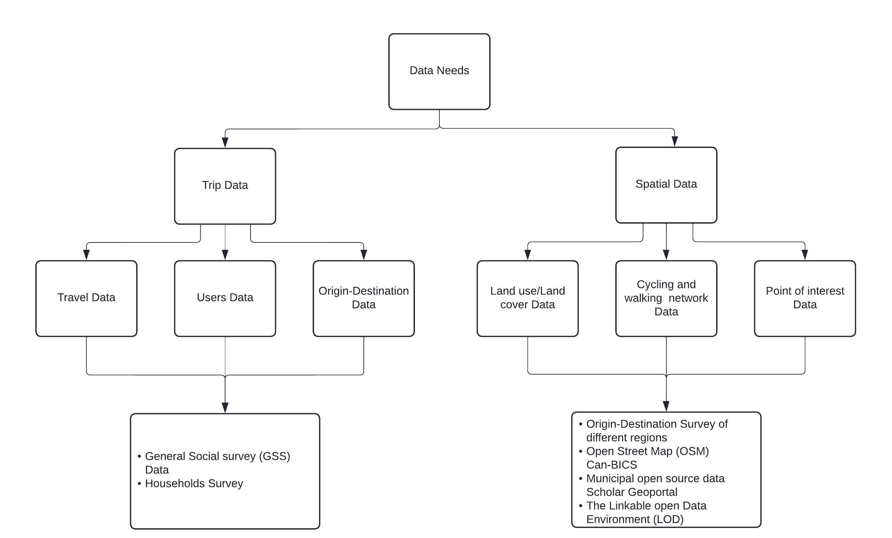

<!--
Above is the YAML (YAML Ain't Markup Language) header that includes a lot of 
metadata used to produce the document.  Be careful with spacing in this header!

If you'd prefer to not include a Dedication, for example, simply delete the section entirely, or silence them (add # before each line). 

If you have other LaTeX packages you would like to include, delete the # before header-includes and list the packages after hyphens on new lines.

If you'd like to include a comment that won't be produced in your resulting file enclose it in a block like this.

If you receive a duplicate label error after knitting, make sure to delete the index.Rmd file and then knit again.
-->

```{r include_packages, echo=FALSE, include = FALSE}
# This chunk ensures that the macdown package is
# installed and loaded. This macdown package includes
# the template files for the thesis.
if(!require(remotes))
  install.packages("remotes", repos = "http://cran.rstudio.com")
if(!require(macdown))
  remotes::install_github("paezha/macdown")


if (!require("remotes")) 
  install.packages("remotes", repos = "https://cran.rstudio.org")
remotes::install_github("rstudio/bookdown")
remotes::install_github("ismayc/thesisdown")
```


<!--
The acknowledgements, preface, dedication, and abstract are added into the PDF
version automatically by inputting them in the YAML at the top of this file.
-->

<!-- The {.unnumbered} option here means that the introduction will be 
"Chapter 0." You can also use {-} for no numbers on chapters.
-->


<!--

BEGINNING HERE ADD THE DOCUMENTS THAT CONFORM THE MAIN BODY OF THE THESIS

Instead the files and their order are defined in `_bookdown.yml`. This prevents the README.Rmd file from being picked up when rendering.
-->

```{r eval=!knitr::is_latex_output(), child=here::here("01-introduction.Rmd")}

```

```{r eval=!knitr::is_latex_output(), child=here::here("02-data-sources-needs.Rmd")}

```

```{r eval=!knitr::is_latex_output(), child=here::here("03-active-impedance-functions.Rmd")}

```

```{r eval=!knitr::is_latex_output(), child=here::here("04-conclusion.Rmd")}

```

```{r eval=!knitr::is_latex_output(), child=here::here("99-references.Rmd")}

```


<!--chapter:end:index.Rmd-->

<!--
This is for including Chapter 1.  Notice that it's also good practice to name your chunk.  This will help you debug potential issues as you knit.  The chunk above is called intro and the one below is called chapter1.  Feel free to change the name of the Rmd file as you wish, but don't forget to change it here from chap1.Rmd.
-->

# Introduction

The challenge of addressing sustainable transportation is increasingly recognized as a crucial issue in contemporary global societies. The European Environment Agency (2020) highlights a growing awareness of the numerous and significant adverse effects of transportation, which threaten all three pillars of sustainability [@european2020first]. These detrimental effects are predominantly evident in urban regions, yet these areas also emerge as the primary arenas for developing and implementing innovative solutions. A key strategy among these is the shift from predominantly carbon-dependent and motorized personal transport to more active, non-motorized modes of mobility, recognized as one of the most effective approaches for promoting sustainable transportation.

Based on this approach, active mobility sets itself apart from other transportation modalities with its unique benefits. Research by Koszowski et al. (2019) illustrates that active mobility offers carbon neutrality, spatial efficiency, and considerable health advantages. This form of transportation is gaining preference among many urban dwellers over public transit, as evidenced by the rapid expansion of urban infrastructure designed to facilitate active travel [@koszowski2019active; @dunning2020surprising; @laverty2020covid]. However, challenges remain, such as the decline in public transportation use and the potential rise in car usage, which pose significant threats to achieving sustainable transportation goals[@aloi2020effects;@beck2020insights]. Despite these challenges, active mobility is viable in cities where walking and cycling account for a significant share of multi-modal transportation and play a pivotal role in shaping urban mobility and advancing sustainability.

The necessity for active mobility extends beyond just the development of transportation infrastructure; it requires an all-encompassing approach that integrates both spatial and transportation considerations. This holistic perspective leads to the recognition of 'accessibility' as an essential theoretical framework, adept at addressing the intertwined challenges of transportation and urban planning in a cohesive manner. Hansen's seminal definition of accessibility in 1959 as 'the potential of opportunities for interaction' laid the foundation for this approach [@hansen1959accessibility]. As a result of this, Geurs and van Wee (2004) further underscore the significance of examining how the spatial distribution of activities aligns with the ease of accessing these activities from different points within an urban setting [@geurs2004]. Additionally, Koenig (1980) draws attention to the crucial elements of assessing both the geographical distribution of activities and their accessibility, thereby providing a comprehensive lens through which urban mobility can be understood and enhanced. This integrated perspective of accessibility not only facilitates a deeper understanding of urban dynamics but also guides the development of more effective strategies for sustainable urban mobility [@koenig1980indicators].

Because of the wide range of factors influencing accessibility, numerous and diverse accessibility metrics have been developed. As identified by Handy and Niemeier (1997), Geurs and van Wee (2004), Miller (2005), and Paez et al. (2012), these metrics vary in their level of detail and ease of implementation. One approach, person-based measures, focuses on the accessibility level experienced by an individual [@handy1997measuring;@geurs2004; @miller2005place;@paez2012measuring; @owen2015modeling ]. This method integrates land use and transportation system characteristics with an individual's spatial and temporal constraints. Although person-based measures offer valuable insights into individual accessibility experiences, they present considerable challenges in assessing land use and transportation systems on a regional scale. An alternative approach is utility-based measures, as van Wee (2016) described. These measures evaluate the economic benefits resulting from network changes and can be incorporated into traditional cost-benefit analyses. Despite covering most accessibility components, utility-based measures are seldom applied in practice due to difficulties in interpretation and communication [@van2016role].
On the other hand, location-based metrics are more frequently employed in planning, offering a comprehensive view of regional accessibility [@boisjoly2017insider]. These metrics assess the ease of reaching destinations from a specific location, considering both the spatial distribution of opportunities (like jobs or healthcare services) and mobility between locations. The transportation aspect of this approach, which typically focuses on travel time or distance, is often mode-specific [@hansen1959accessibility; @vickerman1974accessibility; @handy1993regional; @geurs2004; @owen2015modeling]. Common location-based metrics include the cumulative-opportunities measure, which calculates reachable opportunities within a given travel cost threshold, and the gravity-based measure, which uses a distance-decay function to weigh opportunities based on their relative distance or travel time.

It is important to note that, in comparison to motorized transportation, there has been little research into accessibility metrics in the realm of active transportation. This study aims to address this gap by comprehensively analyzing various accessibility metrics employed in active transportation research. The initial phase of this investigation involves thoroughly examining the metrics used in existing studies on active transportation. Subsequently, the research delves into the data requirements for calculating these accessibility metrics. A critical aspect of this inquiry is determining the feasibility of accessing and utilizing the necessary data, particularly in active transportation modes such as cycling and walking. The study seeks to ascertain whether the acquisition and application of such data are practicable under the typical conditions encountered in active transportation scenarios. This exploration not only contributes to a deeper understanding of the methodological challenges in measuring accessibility in active transportation but also provides insights into the potential for implementing these metrics in practical urban planning and policy-making.

Furthermore, a significant body of literature has contributed to assessing accessibility levels for active modes of transportation in recent decades, generally agreeing on two primary components for measuring accessibility: (1) the location and attractiveness of urban opportunities (benefit side) and (2) the impedance of travel from origins in the network to the destinations (cost side). Specifically, the calculation of accessibility using impedance functions has emerged as a crucial research topic that has garnered substantial attention from scholars in the fields of transport planning, urban geography, and sustainable development [@frank2005linking; @krizek2005perspectives; @currie2010quantifying; @iacono2010; @yang2012walking; @millward2013active; @nassir2016utility; @saghapour2017measuring; @wu2019measuring]. The impedance function, in its various forms, measures the willingness to travel a certain distance to reach desired destinations. It is a valuable tool for analyzing spatial patterns of travel behavior and can be used for any mode of transportation planning [@millward2013active]. So, there is limited information on the willingness of some individuals to walk or cycle greater distances. Equally, there needs to be more data on how distance affects the nature of the activity, the desirability of the destinations, and the characteristics of those embarking on the trip in different contexts. Hence, it is imperative to investigate the evolution of impedance function over time due to its inherently dynamic nature, which fluctuates in response to the evolution of transportation networks and shifts in urban spatial configurations [@iacono2008access; @iacono2010].

Various impedance functions have been utilized to describe the distribution of walking and cycling trips, both in general and for specific purposes [@iacono2008access; @iacono2010; @larsen2010beyond; @yang2012walking; @millward2013active; @vale2017influence; @li2020approach]. Scholars place significant emphasis on selecting an appropriate impedance function, leading to a diverse range of cost decay functions being employed. These various specifications primarily vary in their treatment of the influence of distance, consequently impacting the accessibility measurement [@de2009exponential; @reggiani2011accessibility; @osth2016new; @itf2017linking]. However, negative exponential distance-decay functions are commonly used in assessing non-motorized accessibility, capturing the willingness of individuals to walk or cycle to destinations [@handy1997measuring; @geurs2001accessibility; @iacono2010; @vega2012using; @millward2013active; @vale2017influence; @li2020approach]. The merit of this function lies in its ability to attribute decreasing influences to more remote opportunities, thereby offering a more accurate estimation for shorter journeys, especially those undertaken by non-motorized modes [@iacono2010; @kanafani1983transportation; @fotheringham1989spatial].

In addition to determining the form of the impedance function, extracting accurate travel times from existing network models can be challenging, which limits the options and makes distance a more practical choice [@handy1997measuring; @iacono2010; @yang2012walking; @arranz2019measuring]. Furthermore, researchers specializing in active modes of transportation have faced challenges stemming from a need for more objective data concerning walking and cycling behavior. Estimating specialized impedance functions specific to non-motorized modes requires appropriate travel survey data that can capture pedestrian and cycle behavior. Often, researchers have resorted to relying on retrospective questionnaires, which assess subjective aspects such as the frequency and duration of walking and cycling activities. Notably, regional household travel surveys, including trips made by non-motorized modes, have been employed for this purpose [@iacono2010; @millward2013active]. In contrast to these localized surveys, some datasets provide a nationwide perspective, encompassing travel for various trip purposes and offering insights into details like travel episode origins, destinations, and time-based lengths. This comprehensive approach furnishes a more holistic understanding of active transportation behavior on a national scale. Nevertheless, only some studies, such as Yang et al. (2012), have examined active travel behavior nationally [@yang2012walking].

Addressing the previously identified gaps and precisely the challenge of using uniform decay curves, such as the negative exponential function for both cycling and walking in accessibility assessments, this study endeavors to identify the most appropriate distance decay function for various destinations and time periods.  Our research delves into the complexities of actual travel behavior, emphasizing active transportation modes. We utilize historical data from the General Social Survey (GSS) from 1986 to 2015 in Canada to calculate the impedance function for cycling and walking trips. By doing so, this study conducts a comparative analysis of travel behaviors associated with these two modes.
Moreover, we recognize that non-work travel encompasses a spectrum of trip intentions and diverse traveler behaviors, making the impedance function an essential analytical tool for examining non-work accessibility. Grengs (2015) emphasizes the importance of crafting distinct functions for each travel purpose, a principle that guides our analysis [@grengs2015nonwork]. Our investigation will encompass a variety of trip intents, ranging from commutes to homes, workplaces, or educational institutions to social visits, outdoor activities, business trips, shopping, cultural outings to libraries, museums, or theaters, dining out, and engaging in religious practices. By drawing on a nationally representative sample of Canadian residents, our research intends to bridge the empirical data gap concerning the frequency and duration of typical pedestrian and cycling trips for different purposes. In doing so, it aspires to provide a nuanced understanding of active travel behavior. Ultimately, this comprehensive analysis seeks to contribute meaningfully to the ongoing conversation on active transportation, shedding light on its role in shaping travel behavior and accessibility.

<!--chapter:end:01-introduction.Rmd-->

# Data Sources and Needs for Active Travel-Based Accessibility Analysis: A Canadian Perspective {#rmd-basics}

## Abstract


Active transportation is critical in developing robust and healthy urban transportation policies. As the focus of transportation needs analysis in cities shifts from mobility to accessibility, there is an increasing urgency to evaluate accessibility through cycling and walking. These modes possess distinct characteristics such as lower speeds, shorter trips, and potentially different purposes than motorized travel. Consequently, the data inputs necessary for assessing accessibility differ from those used for motorized travel accessibility studies. This review examines the data sources and requirements for implementing active accessibility analysis. It reviews the geographic accessibility measures and data specific to walking and cycling, as employed in recent literature. Various aspects are compared between walking and cycling accessibility measures, including metrics, origins, destinations considered, geographic scales, and travel time or distance calculations. By comparing approaches for walking and cycling, this report also highlights potential considerations, challenges, and questions that arise when envisioning the future of active travel accessibility-based analysis. While the discussion in this review primarily focuses on the Canadian context, the insights gleaned may have broader applications in other national contexts.


## Introduction

For decades, transportation planning has been focused on providing mobility for the private car, initially introduced in North America as a solution to challenges arising from rapid urbanization and replicated in other regions [@angotti1996latin; @brown2009planning]. However, it has become evident that mobility centered on the private car is inefficient, inequitable, and unsustainable and requires immediate attention. This includes environmental issues such as climate change [@chapman2007transport], as well as numerous other social [@boschmann2008toward; @lucas2012transport; @lucas2019new], health [@khreis2016health; @milne2012public], and equity concerns [@bocarejo2012transport; @martens2012justice; @pereira2017distributive].Transportation initiatives have sought to foster mobility polycultures, which include a diverse range of transportation alternatives, in order to reduce car dependency [@lavery2013driving; @millera2011]. Polycultures are resilient and adaptable systems, offering mobility substitutes like information technologies. Notably, these systems are more intricate than monocultures, necessitating a more comprehensive range of mobility technologies and enhanced coordination between modes and travelers. As a result, active travel modes like walking and cycling are pivotal in urban areas, as they contribute to the establishment of robust and health-oriented urban transportation polycultures [@millera2011; @lavery2013driving; @lira2021].

Cycling and walking are highly effective modes of transportation for short- and mid-range travel within urban areas. However, urban planning and transportation policies have predominantly prioritized automobile travel, often neglecting other modes of transportation [@brown2009; @wiersma2020; @brezina2020; @koglin2020; @ruffino2021]. This approach has led to concerns regarding the negative externalities of the current car-centric transportation system. Simultaneously, there is increasing recognition and awareness of the numerous co-benefits offered by active mobility, including improvements in public health, enhanced efficiency, and increased social inclusion  [@banister2005unsustainable; @garling2014handbook; @gossling2019social; @mueller2015health]. Traditionally, transportation planning has primarily revolved around facilitating motorized travel, strongly emphasizing accommodating cars. Both transportation and land use systems have been designed to achieve mobility, often measured through efficiency metrics that disregard the underlying purpose of travel, which is reaching destinations [@handy1997measuring].

The concept of generating mobility appears straightforward when planning for affordable motorized travel, particularly in an era where automobile users have been deliberately shielded from bearing the total cost of their travel, often without even being aware of it [@taylor2006]. However, recognizing the inherent contradiction of pursuing mobility while striving to mitigate its negative consequences, the transportation literature has long advocated shifting from mobility-centered planning to accessibility-based planning [@handy1997measuring; @unit2003]. Transportation accessibility is commonly defined as the capacity of transportation-land use systems to provide access to various opportunities [@paez2012], and this approach directly challenges the shortcomings of mobility-focused planning by emphasizing the ability to reach destinations effectively. While adopting accessibility-based planning in practice has yielded mixed results [@boisjoly2017; @proffitt2019], there are compelling reasons to believe that the future lies in embracing accessibility as a fundamental principle of urban planning [@handy2020]. By prioritizing accessibility, planners can better align transportation systems with the needs of individuals and communities, ultimately leading to more sustainable, equitable, and efficient urban environments.

The significance of accessibility-based planning becomes even more apparent when considering active modes of transportation. Why would someone prefer longer trips if they could reach their destinations in shorter ones? Unlike motorized travel, pedestrians and cyclists cannot be shielded from the costs associated with their journeys, as the physical effort required to reach destinations is inherently palpable [@hsu2014; @iseki2014; @paez2020]. With the growing interest in active travel-based accessibility (ATB accessibility) worldwide [@arranz2019; @li2020; @ortega2021evaluating; @rosas2020], transportation scholars have built upon decades of accessibility research that predominantly focused on motorized travel. 


In principle, accessibility analysis is versatile enough to be applied to ATB accessibility analysis. However, it is crucial to acknowledge the distinctions between motorized and active travel and how these differences can influence the implementation of accessibility measures with a focus on active modes [@iacono2010]. Active modes of transportation have captivated the attention of researchers due to their profound implications and unique advantages in terms of the environment, health, and social inclusion [@pucher2010walking; @rojas2011health; @rojas2012replacing; @otero2018health; @koszowski2019active; @tinessa2021walkability]. They have been linked to various health benefits, such as improved longevity [@hakim1998effects], enhanced cognitive function [@weuve2004physical], and better quality of life [@strawbridge1996successful; @leveille1999aging]. Moreover, active modes are perceived as cleaner, more efficient, and more sustainable forms of transportation [@bhopal1995cycling]. Active travel also presents an excellent alternative for mobility, reducing transportation costs for families, promoting gender equality, fostering resilient infrastructure, and contributing to the aesthetic value of the environment [@koszowski2019active]. Furthermore, active travel improves accessibility for individuals who do not have access to other modes of transportation and contributes to the development of local and regional economies. However, compared to motorized travel, active travel entails slower speeds, occurs on more minor scales, poses more significant safety risks due to the higher likelihood of severe injuries in collisions, is used to reach potentially different destinations, and involves costs, such as physical exertion, which are typically disregarded in motorized travel analysis [@ng2017cyclist; @akgun2018cyclist; @pokorny2018conflicts; @oehl2019cyclists; @useche2019healthy].

The objective of the present study is to investigate active travel-based (ATB) accessibility, with a specific focus on data sources and requirements, utilizing Canada as a case study. This research is motivated by a recent Canadian project establishing data-driven standards for analyzing transportation equity. A thorough understanding of how the input data influences the analysis and outcomes is essential to propose methods that can be applied uniformly across regions. It is worth noting that other reviews on ATB accessibility measures have been conducted [@geurs2004; @iacono2010; @maghelal2011; @talen2013; @vale2016active]. This paper's contribution lies in addressing a literature gap by focusing on the data requirements for various ATB accessibility measures, comparing measures that can be consistently implemented in diverse contexts, and identifying the data needs for their standardized implementation.


## Background

Transportation planning has emerged as a distinct field primarily focused on mobility, which refers to the ease of movement. In this context, mobility indicators such as travel speed and time have been proposed, mainly focusing on motorized transportation [@banister2008sustainable]. The concept of accessibility, on the other hand, has long been adopted in spatial and transportation research to evaluate the quality and extent of relationships between the spatial development of an area and its transportation system. Hansen's seminal work 1959 defined accessibility as "the potential of opportunities for interaction," quantifying the number and variety of opportunities accessible from a specific location through the transportation system. This groundbreaking research led to a shift in perspective, emphasizing the inclusion of accessibility as a performance indicator in land use and transportation plans, offering an alternative to mobility-centered planning [@koenig1980indicators; @morris1979accessibility; @wachs1973physical]. Moreover, researchers argued that improved accessibility reflects economic and social benefits within the network, particularly regarding the land value and quality of life [@koenig1980indicators; @wachs1973physical]. In recent years, accessibility has become a critical component in land use and transportation planning, particularly regarding social equity, economic development, and environmental impacts [@banister2008sustainable; @handy2002accessibility; @lucas2012transport; @preston2007accessibility]. For instance, Geurs and van Wee (2004) deconstructed the concept of accessibility into four elements: land use, transportation, time, and individual factors. **Land use** encompasses the quality, quantity, and spatial distribution of destination places such as schools, jobs, hospitals, and recreational facilities and the demand for opportunities at origin places. **Transportation** refers to the transportation system itself, including the disutility experienced by individuals when traveling from an origin to a destination using a specific mode. **Time** accounts for time constraints regarding the availability of opportunities throughout the day and the time available for individuals to access such opportunities. Finally, the **individual** factor considers individuals' or groups' specific capabilities and needs, influenced by factors such as income, education level, travel mode availability, age, and household situation. Overall, this body of literature highlights the significance of accessibility as a comprehensive and integrated approach in transportation and land use planning, encompassing various dimensions and recognizing its multifaceted benefits.

Mobility-based approaches emphasize reducing travel time, whereas accessibility planning aims to ensure that all individuals have reasonable travel times to a diverse range of destinations. Consequently, accessibility planning prioritizes active and public transportation and incorporates land use policies that minimize distances between activities [@banister2008sustainable]. Accessibility refers to the ease of reaching valuable destinations, and its calculation requires the implementation of various access measures depending on research objectives, transportation modes, data requirements, activities, land use patterns, and travel costs over connecting transport infrastructure. Consequently, different aspects of accessibility have led to the development of multiple measurement methods and indicators, including proximity, cumulative, gravity, utility-based, and space-time prism models as the prevailing approaches [for example, @geurs2004; @kelobonye2019relative; @lee2010reexamining; @neutens2015accessibility; @paez2010accessibility; @vandenbulcke2009mapping]. However, there are debates and disagreements concerning evaluating this concept [@castiglione2006application; @fan2012impact; @wang2015gis].

In general, accessibility can be measured at either the individual-based or locational level (place-based) [@miller2005place]. Place-based metrics focus on the physical separation of critical locations, such as an origin and potential destinations, considering the land use and transportation components. Cumulative-opportunity accessibility and gravity accessibility are examples of place-based metrics, reflecting the extent to which people can reach and utilize services, amenities, and opportunities within a specific geographic area, such as a neighborhood, city, or region. On the other hand, individual-based metrics consider individuals' space-time behavior and assess the degree to which a person can access and utilize services, amenities, and opportunities based on personal characteristics, including age, gender, income, mobility, and health status. Space-time accessibility and utility accessibility fall under the category of individual-based metrics. Individual-based accessibility recognizes individuals' unique needs and preferences, considering their ability to access various transportation modes, travel routes, and types of transportation. Sometimes, individual-based accessibility is integrated into location-based studies by stratifying the population based on age groups, socioeconomic characteristics or segmenting destinations [@harris2001accessibility; @vale2009sustainable; @paez2010accessibility; @fan2012impact; @legrain2015and; @legrain2016travelling]. These two approaches are interconnected, and individual-based measures can be viewed as a particular case of place-based measures, where the impedance function and cost remain constant across destinations.

Location-based accessibility offers a notable advantage in terms of ease of computation (Bhat, 2000). Researchers typically rely on average travel time between two points, population data, and aggregated activity data when calculating place-based accessibility. Consequently, cumulative-opportunity accessibility emerges as one of the most widely employed methods for assessing accessibility. Furthermore, space-time accessibility examines how individuals can engage in desired activities while encountering various constraints [@miller1991modelling; @kwan1998; @lee1998application]. This framework is based on Hagerstrand's (1970) time geography model, which identifies three factors influencing individual accessibility. The first factor is capability constraint, where people can only engage in activities when awake and face travel impediments at all times. The second constraint is coupling, which mandates specific tasks to be performed at designated times. For instance, individuals typically remain at their workplace during working hours (e.g., 8 AM to 5 PM). The final constraint is the authority constraint, which encompasses activity opening hours. As a result, individuals may be unable to access a park late at night due to its closure. Space-time accessibility, as measured by Ilag's (1970) study, captures the number of activities that can be accomplished under various constraints [@ilagcrstrand1970people]. According to the research, space-time accessibility (i.e., person-based accessibility) is considered a superior measure to cumulative-opportunity accessibility (i.e., place-based accessibility) since it accounts for an individual's actual travel behavior. It is attributed to space-time accessibility incorporating temporal variations in transportation systems, activities, and individuals' unique travel patterns.

In contrast, place-based accessibility, which does not fully address temporal constraints, may yield inaccuracies when assessing accessibility. On the other hand, space-time accessibility considers temporal variations in activities[@fransen2015identifying; @boisjoly2017]. Place-based accessibility assumes that all activities are carried out during hours chosen at random by researchers. However, activities are only available during their regular business hours. It is necessary to incorporate factors relevant to active transportation to formulate a comprehensive accessibility formula for active transportation modes. Presented here is one potential formula as an illustration equation \@ref(eq:accessibility):

\begin{equation}
A^{pk}_i = \sum _{j=1} ^ {J} g(O^ k_{j}) f(c^p_{ij})
\label{eq:accessibility}
\end{equation}


With functions for the opportunities that allow this equation \@ref(eq:opportunities-function): 
\begin{equation}
g(O_j) = O_j
\label{eq:opportunities-function}
\end{equation}

\noindent as well as possibly agglomeration effects as in equation \@ref(eq:agglomeration-effects): 

\begin{equation}
g(O_j) = O^\alpha_j
\label{eq:agglomeration-effects}
\end{equation}

This type of accessibility measure is based on Hansen's work in 1959, which quantifies accessibility by considering the number of reachable opportunities through an impedance function, also known as spatial decay. The impedance function decreases opportunities as travel costs increase, encompassing factors such as time, money, and other relevant variables. Various formulas, including negative power, exponential, lognormal, and log-logistic, can be employed to compute the impedance function [@hansen1959accessibility; @ingram1971concept; @reggiani2011accessibility; @geurs2003evaluation; @vale2016active]. In the formula, $A_i$, $O_j$, and $C_{ij}$ represent matrices of accessibility opportunities and costs, respectively. Following the development of @levinson2020towards, the functions (g and f) discount opportunities and costs based on the diminishing value of opportunities concerning both number and cost. The matrix of weighted opportunities $O_j$ can consider different activity types, times of day, and available modes. In contrast, the matrix of cost elements $C_{ij}$ can incorporate total social costs or generalized internal costs, depending on the specific objectives [@levinson2020towards].

The formulation of the decay function's cumulative opportunities (rectangular) can be expressed as equation \@ref(eq:decay-functions-cumulative-opportunities):
\begin{equation}
f(c^p_{ij}) = 
\begin{cases}
  1 & \text{if } c^p_{ij} \le \gamma^p \\
  0 & \text{otherwise}
\end{cases}
\label{eq:decay-functions-cumulative-opportunities}
\end{equation}

In addition, The widely used exponential decay formulation in gravity models is frequently given by equation \@ref(eq:exponential-distance-decay): 

\begin{equation}
f(c^p_{ij}) = \exp(-\theta c^p_{ij})
\label{eq:exponential-distance-decay}
\end{equation}

Generally, proximity plays a significant role in determining preferences for opportunities, with closer options being preferred over more distant ones [@miller2004tobler]. Furthermore, studies have shown that fewer trips occur between distant locations than nearby ones, indicating that interaction is less likely in remote areas[@ingram1971concept]. To calibrate travel impedance functions, researchers often utilize trip likelihood or trip rate data from travel surveys, allowing for a better understanding of interaction patterns[@geurs2001accessibility; @ingram1971concept]. Therefore, impedance functions effectively capture reduced interaction between different places, and trip rates can serve as valuable calibration parameters for the travel impedance function $f(C_{ij})$.

Calculating individual-based accessibility in active modes (e.g., walking, cycling) can pose challenges due to various factors. The significant constraints involved in determining individual-based accessibility in active modes are as follows:

1. Individual transportation preferences significantly influence accessibility. People have varying preferences for modes of transportation, with some preferring walking or cycling, while others opt for public transportation or driving. Different factors like distance, time, safety, and comfort contribute to these personal preferences.

2. Physical ability: Similar to place-based accessibility, individual-based accessibility in active modes is heavily influenced by personal physical ability. Individuals with disabilities or health issues may face difficulties or limitations when it comes to traveling on foot or by bike, thereby reducing their accessibility.

3. Time constraints: Time-saving considerations can impact accessibility as people may choose faster modes of transportation, such as driving or public transportation, which can diminish accessibility in active modes. It is essential to acknowledge that individual-based accessibility varies for each person due to factors like time of day, purpose, and individual constraints [@miller1991modelling]. Constraints arise from spatial and temporal characteristics that restrict an individual's activity choices [@chi2013impact; @pred1977choreography; @miller1991modelling; @miller2009field]. Time constraints can be illustrated using a time-space diagram, which accounts for the available time and the transportation system's performance [@ilagcrstrand1970people]. The space-time prism, incorporating an individual's activity schedule, allows for measuring access to multiple activities and activity participation time based on behavioral rules [@miller1991modelling]. Accessibility is determined by the total number of opportunities within the space-time prism, encompassing all possible paths while considering time constraints [@tong2015transportation]. Thus, although opportunities may be spatially accessible, the time available for individuals to reach and engage in these activities is limited. This perspective leads to a constraints-based or people-based accessibility measure [@wu2001computational].

4. Weather conditions, similar to place-based accessibility, can affect individual-based accessibility in active modes. During extreme weather, individuals may be less inclined to walk or cycle, reducing their ability to choose these modes.

5. Infrastructure: The quality and availability of infrastructure, such as sidewalks, bike lanes, and pedestrian crossings, significantly influence individual-based accessibility in active modes. Poor infrastructure in certain areas can discourage people from choosing active modes of transportation, consequently reducing their accessibility options.

Accessibility measures in active modes encompass various measures, including activity-based, distance-based, topological or infrastructure-based, utility-based, walkability, and bikeability. Activity-based measures, such as gravity-based and cumulative opportunities measures, employ the gravity model to assess accessibility by weighting opportunities based on a travel impedance function. These measures consider both the size of opportunities and the cost of traveling to them to evaluate the accessibility of a place. Distance-based measures focus on analyzing the proximity of facilities, including the distance to the nearest opportunity, the number of opportunities within a defined distance or time, the average distance to all opportunities, and the average distance to a specified number of closest opportunities. Infrastructure-based measures exclusively rely on street and transportation network features and are not sensitive to the spatial distribution of activities. Utility-based measures, also known as benefit measures, are derived from microeconomic random utility theory and describe accessibility as the outcome of rational decision-making among various destination transportation alternatives [@kwan1998; @halden2000accessibility; @geurs2001accessibility; @apparicio2008comparing]. Walkability and bikeability measures assess the distribution of people, households, or jobs over a specific area or quantify the diversity of land uses, such as offices, housing, retail, entertainment, and services, within a given region [@frank2003health; @leslie2007walkability]. Accurate accessibility measures for walking or cycling trips can aid transport planners in making informed decisions regarding infrastructure provision for non-motorized transportation [@iacono2010; @devkota2012planning].

Moreover, calculating ATB accessibility in both approaches requires multiple data sets relating to travel behavior and land use. Unfortunately, this process has been hindered by the scarcity of suitable data [@iacono2010]. Specifically, there is a lack of information regarding the spatial aspects of walking and cycling behavior, such as the origins and destinations of travel episodes, routes taken, and durations and distances involved. Consequently, researchers often rely on data obtained from local or national questionnaires and local maps to fulfill the required data requirements [@iacono2010; @levine2010zoned; @devkota2012planning; @yang2012walking; @millward2013active]. Additionally, the available data tend to be highly location-specific or confined to a limited geographic area, thereby inadequately covering the broad scope of large-scale survey instruments, such as national transportation surveys [@ulmer2003evaluating; @achuthan2007measuring].


## Methods for ATB accessibility analysis

Accessibility measures in active transportation modes can be categorized into two main types: location-based and individual-based. Location-based measures focus on assessing distances to opportunities from specific locations, while individual-based measures consider people's temporal and spatial constraints. In their study, Vale et al. (2016) classified location-based accessibility measures into four primary groups. Firstly, activity-based measures encompass gravity-based measures, also known as attraction-accessibility or potential measures, as well as cumulative opportunities measures, which are also referred to as isochrones or contour measures. These measures have been extensively employed in studies investigating non-motorized accessibility [@iacono2010; @lowry2012assessment; @millward2013active; @prins2014many; @li2020]. Secondly, topology infrastructure-based measures involve conducting topological analyses of the network [@hull2012accessibility; @lundberg2012accessibility]. Thirdly, distance-based measures encompass analyzing the proximity of facilities [@apparicio2008comparing; @sadler2011application]. Lastly, the fourth category comprises utility-based measures, also known as benefit measures [@geurs2004; @hunt2007influences; @vale2009sustainable; @el2011place].

One significant reason for the prevalent usage of location-based measures, as opposed to individual-based measures, in active transportation modes, is their potential compatibility with regional travel forecasting models. These models rely on data from various sources to predict travel patterns and demands across different regions. Employing location-based measures, such as coded networks, makes it easier to extract travel times and distances between different areas [@iacono2010; @saghapour2017measuring]. However, there are limitations associated with using location-based measures for active travel modes:
1) Active travel modes demonstrate less sensitivity to travel times and levels of network congestion when compared to motorized modes.
2) Route choices for walking and cycling often involve qualitative, experiential, or challenging-to-measure factors [@hunt2007influences; @tilahun2007trails; @iacono2010].
3) Measuring active transport accessibility entirely relies on travel diary data.
4) Existing methods for evaluating cycling accessibility have not adequately addressed the accessibility of cycling destinations in terms of service area [@landis1997real; @harkey1998development; @harkey1998Development; @landis2003intersection].
Some studies have examined the level of services provided by the bicycle network, such as the Bicycle Compatibility Index (BCI) or Bicycle Level of Service (BLOS). However, these measures primarily assess the performance of the bicycle network based on various geometric factors, including the width of bicycle routes, pavement conditions, route types, and connectivity. Nevertheless, other methods focus on bikeability in terms of the accessibility of different destinations for bicycles as a mode of transportation. These methods evaluate the potential for cycling using travel behavior data [@espada2011application; @wahlgren2012exploring; @rybarczyk2014measuring; @milakis2015people].

### Activity-based measures

Activity-based measures encompass two types: gravity-based measures (also known as Hansen-type measures) [@hansen1959accessibility]) and cumulative opportunities measures. Gravity-based measures also referred to as attraction-accessibility or potential measures, consider the number of opportunities weighted by the associated travel cost. These measures utilize a travel impedance function that assigns higher value to opportunities closer to proximity. Scholars have emphasized the importance of selecting an appropriate impedance function, resulting in the application of various functions such as power, negative exponential, logistic, and Gaussian functions [@iacono2010; @lowry2012assessment; @vasconcelos2012evaluation; @vale2017influence]. In a recent study by Vale and Pereira (2017), twenty pedestrian accessibility measures were examined, and it was found that the modified Gaussian and exponential functions demonstrated the highest robustness for modeling walking accessibility. On the other hand, cumulative opportunity measures, also known as isochrones or contour measures, quantify the number of opportunities within a specified catchment area [@vale2016active].

A gravity-based measure is derived from the denominator of the gravity model and is weighted by opportunities based on an impedance function. This function can be represented as equation \@ref(eq:gravity-measures):[@vale2016active]:

\begin{equation}
A_i = \sum_{j = 1}^{J} W_{j} f(c_{ij})
\label{eq:gravity-measures}
\end{equation}

The equation \@ref(eq:gravity-measures) provides the measure of accessibility from the origin location $i$, where $W_j$ represents the relevant opportunities found at $j$, and $f(c_{ij})$ denotes the cost of moving between $i$ and $j$. The function $f()$ defines a kernel centered around location $i$. Activity-based measures are valuable in complementary opportunities, such as jobs, services, people, and parks. In these scenarios, access to more opportunities and proximity (as modeled in gravity-based models) is advantageous.

Cumulative opportunities, also referred to as isochrones or contour measures, count the number of opportunities within a specified catchment area. In contrast to the utility measure, which assesses accessibility based on the "net utility" gained from travel, the cumulative measure quantifies accessibility by considering the total number of reachable opportunities and their associated travel costs. In contrast with gravity-based measures, in a cumulative measure (equation \@ref(eq:gravity-measures)), the distance decay function is binary and calculated using equation \@ref(eq:binary): 

\begin{equation}
f(c_{ij} \le \gamma _i) = 
\begin{cases}
  1 & \text{if } c_{ij} \le \gamma _i \\
  0 & \text{otherwise}
\end{cases}
\label{eq:binary}
\end{equation}


In the equation \@ref(eq:binary), $\gamma$ represents the threshold value. According to this formula, all opportunities located within the $\gamma$ threshold are considered accessible. Additionally, $f(c)$ is an indicator function that yields a value of 1 if the logical statement in the function's argument is valid (i.e. if the cost of reaching $j$ from $i$ does not exceed the bandwidth parameter value), and 0 otherwise. Alternative distance-decay functions (such as inverse distance or negative exponential) can generate smoother map patterns, as discussed by [@o2003aggregate]. However, they require more parameters and introduce distance- or cost-discounted schemes that are more challenging to interpret. Prior research has indicated that cumulative opportunity measures exhibit a high degree of correlation, irrespective of the distance-decay function employed [@kwan1998]. Consequently, our preference lies with simplicity and interpretability when selecting our accessibility indicator.

### Distance-based measures

Distance-based measures consider accessibility in terms of proximity, whether travel distance, time, or a generalized cost measure between locations. A distance measure analyzes the closest facilities using the following four criteria:
1. Distance to the nearest opportunity
2. The number of opportunities within a specified distance or time
3. The average distance to all opportunities
4. The average distance to a defined number of the closest opportunities [@apparicio2008comparing]. These measures are applicable when destinations such as hospitals, transit stops, and convenience stores can be seen as substitutes for each other. This assumption is based on the idea that individuals generally prefer accessing the nearest facility.

In distance-based accessibility measures, distance is considered as the travel impedance. Typically, four types of distances are employed: 1) Euclidean distance, which is commonly used for walkability assessments, especially in health studies [@apparicio2008comparing], 2) Manhattan distance, 3) shortest network distance [@lundberg2012accessibility; @hochmair2015assessment], and 4) shortest network time [@pearce2006neighbourhoods; @paez2012]. Furthermore, there are two approaches to measuring distance. The first method calculates the distance to the closest facility of each type, determining the distance from each zone centroid to the closest or the first n closest facilities (e.g., medical centers). The second method calculates the distance to all nearby facilities, based on the concept of floating catchment areas, which considers the closest facility irrespective of distance. It measures the distance from each zone center to the closest or the first closest facilities of different types (e.g., medical centers, shopping centers,  and so on).

Distance to nearest location is calculated based on equation \@ref(eq:distance-based-accessibility):

\begin{equation}
A^{ip} = \min_{j \in L^p} (d_{ij})
\label{eq:distance-based-accessibility}
\end{equation}

In this equation \@ref(eq:distance-based-accessibility), $A^{ip}$ is the accessibility of zone $i$ to the location of type p, $L^p$ is a set of locations of type p, and $(d_{ij})$ is distance (or travel time for a given mode) from i to location j in set $L_p$. This measure is consistent with a straightforward location model in which the nearest location is always chosen with a probability of 1.0. (equation \@ref(eq:distance-based-measure))

\begin{equation}
P^{ip}_j = 
\begin{cases}
  1 & \text{if } d_{ij} = \min_{j \in L^p} d_{ij} \\
  0 & \text{otherwise}
\end{cases}
\label{eq:distance-based-measure}
\end{equation}


In equation \@ref(eq:distance-based-measure), $P_j^{ip}$ represents the probability of selecting location $j$ for purpose $p$, given that one is situated in zone $i$. However, this measure suffers from two limitations. Firstly, it needs to account for the size or attractiveness of locations. Secondly, it does not investigate the cumulative impact of having access to multiple locations. Consequently, it is not advisable to employ this method as a standalone measure when calculating accessibility.

### Topological or infrastructure-based measures

Topological-based measures consider accessibility in terms of the street network rather than access from origins to destinations. Topology measures may evaluate network connectivity, the quality of infrastructure within a catchment area, or some combination of connectivity and infrastructure quality. Indeed, this measure emphasizes infrastructure evaluation. Such approaches are applicable in the context of planning -- for example, in identifying priorities for development or identifying potential impacts of redevelopment.

Topological-based measures examine accessibility in terms of the street network rather than considering access from origins to destinations. These measures evaluate network connectivity, infrastructure quality within a defined catchment area, or a combination of connectivity and infrastructure quality. This approach primarily focuses on assessing infrastructure. Such methods find application in planning contexts, such as prioritizing development initiatives or identifying potential impacts of redevelopment.


There are three types of topological measures: The first group evaluates the level of service (LOS) within a floating catchment area (FCA)[@sisson2006suitability]. The second type is similar to the first one. However, this one used a pre-defined spatial unit to evaluate LOS, and this is based on the segment instead of the point [@emery2011wabsa; @horacek2012sneakers; @lowry2012assessment]. The third one is very different since traffic is not considered a relevant parameter [@hoedl2010bikeability; @zielstra2011comparative; @jabbari2021accessibility]. These measures are based on the evaluation of network segments' infrastructure characteristics and include variables such as the sidewalk or bike path availability, quality, and length, among others.

### Utility-based measures

Utility-based measures assess accessibility by considering individual preferences and utilizing the log-sum of discrete choice models applied to destination choice analysis [@ben2021disaggregate]. This approach, often referred to as the benefit measure, offers a more accurate representation of individual accessibility compared to location-based measures. Furthermore, individual-based accessibility provides more representative measurements than place-based accessibility and reflects the population's access. Aggregating accessibility through this method is a commonly used approach [@geurs2003evaluation; @wachs1973physical]. The utility-based measure can be calculated using two methods:

They are assuming that a decision-maker perceives the utility of a destination as $U_j = V_j + \epsilon_j$, where $\epsilon_j$ represents the individual's idiosyncratic deviation in terms of how they perceive the utility of alternative j relative to the population's average utility, $V_j$. The person chooses the alternative that generates the maximum perceived utility, $U_j$. Under commonly used assumptions, the probability that j is the alternative with the maximum utility and is thus chosen can be calculated using the multinomial logit (MNL) model (equation \@ref(eq:utility-based-measure))[@train2009discrete]:

\begin{equation}
P_j^{ip} = \frac{e^{V_j}}{\sum_{j' \in L^{ip}} e^{V_{j'}}} = \frac{e^{\beta z_j}}{\sum_{j' \in L^{ip}} e^{\beta z_{j'}}}
\label{eq:utility-based-measure}
\end{equation}


In equation \@ref(eq:utility-based-measure), ${V_j} = \beta{Z_j}$ represents the systematic utility of alternative $j$, where ${Z_j}$ is a vector of explanatory variables, and $\beta$ is a row vector of parameters.

The actual perceived maximum utility is unobservable. However, in the case of the MNL model, it has been demonstrated [@ben1985discrete] that the expected maximum utility $(I^{ip})$ associated with this choice can be calculated using the following equation, denoted as equation \@ref(eq:maximum-utility):

\begin{equation}
I^{ip} = E\left[ \max_j (U_j) \right] = \ln\left(\sum_{j \in L^{ip}} e^{\beta z_j} \right)
\label{eq:maximum-utility}
\end{equation}

That is, it is the natural logarithm of the denominator of the logit choice model (sometimes referred to as the "log sum" term). Further, it can also be shown that this expected maximum utility is the consumer's surplus for this choice. Thus, it is a standard measure of economic benefit. Given this, Ben-Akiva and Lerman (1985) argue that it also provides a behaviorally and economically sound definition of accessibility: accessibility for a given activity is the expected utility derived from participation in this activity, which is the consumer surplus associated with it. That is equation \@ref(eq:Accessibility-maximum-utility):


\begin{equation}
A^{p}_i = \ln \left(\sum_{j \in L^{ip}} e^{\beta z_j} \right)
\label{eq:Accessibility-maximum-utility}
\end{equation}


In our analysis, Tables \ref{tab:table_1} and Tables \ref{tab:table_2} methodically categorize studies based on the various metrics employed to assess accessibility via active transportation modes, explicitly walking and cycling. This categorization highlights the varied methodological approaches adopted in the field. Our literature review indicates that a diverse array of measures has been applied in the context of cycling to analyze accessibility. These range from simple distance-based metrics to more complex models. Conversely, the majority of studies focusing on walking accessibility have predominantly utilized active-based measures. In addition, a limited number of studies have incorporated utility-based measures. These metrics generally evaluate the economic benefits and utilities derived from changes in the network, providing a different perspective on accessibility. However, a comparative analysis conducted by Vale et al. (2016) illuminates a notable discrepancy in the research volume focused on cycling-specific accessibility relative to walking. Their comprehensive review, which encompasses 84 papers on walking and cycling accessibility published up to September 2013, reveals a significant skew towards walking-oriented studies. This imbalance underscores the need for more focused research on cycling accessibility to better understand and enhance this active transportation mode [@vale2016active].


```{r echo=FALSE, cache=FALSE, warning=FALSE}
library(knitr)
library(kableExtra)

# Ensure the output is in LaTeX for a PDF document
options(knitr.table.format = "latex")

# Create the table
table1 <- data.frame(
  "Type.of.metric" = c("Activity-based", "", "", "Distance-based", "", "Topology-based"),
  "Study" = c("Murphy and Owen (2019)", "Faghih Imani, Miller et al. (2019)", "Wu, Lu et al. (2019)", "Houde, Apparicio et al. (2018)", "Prez, Buck et al. (2017)", "Mekuria (2012)"),
  "Measure" = c("Gap in Cumulative Access to Job Opportunities: A Comparative Analysis of LTS 1-4 Based on Weighted Accessibility by Worker Count", "Cumulative Access to Opportunities: Employment and Population Analysis Using Calculated Isochrones for LTS 1-4.", "Utilizing a Gravity-Based Approach: Evaluating Accessibility to Points of Interest at Metro Stations through a Lognormal Distance Decay Function (Validated by the Distribution of Bicycle-Metro Trip Data)", "Proximity to Cycling Infrastructure: 1. Network distance to the closest segment of the cycling network. 2. Network distance to exclusive bicycle pathways", "1. Dedicated Cycling Network Accessibility: The distance from the centroid of each census tract to the closest segment of the bicycle network was evaluated to ascertain the accessibility level of the respective tracts. 2. Traffic Stress Assessment: The Level of Traffic Stress (LTS) network was employed to gauge accessibility within the district.", "Network Connectivity Assessed by LTS 1-4: This measures the percentage of trips and nodes connected within the network"),
  "Traveltime.distanceThresholds" = c("20 mins (Tested 5 to 6 mins)", "30 mins", "2.5 Km", "", "", ""),
  "Origins.Destinations" = c("Census block centroids", "Dissemination area centroids", "Metro stations (origins) POIs (destinations)", "Census tract centroids (origins) Bike paths (destinations)", "census tract centroid to nearest bike network", "Home-to-work O-D pairs from regional trip  Land parcel 'attraction strength' (size and land-use attraction) (destinations)"),
  "Geographic scale" = c("Neighbourhoods -> city level", "Dissemination areas", "2.5 km buffer", "Census tracts", "The District of Columbia", "Census blocks"),
  "Traveltime.distancecalculation" = c("Network travel time 15 km/h", "Network travel time", "Euclidean distance", "Network distance", "Euclidean distance", "Network"),
  "Positive.normativeimplementations" = c("Normative", "Normative", "Normative", "Positive", "Positive", "")
)

#Changing column names
colnames(table1) <- c(
  "Metric Type",
  "Study",
  "Measure",
  "Travel Time/Distance",
  "Origins/Destinations",
  "Geographic Scale",
  "Travel Calculation",
  "positive/normative implementations"
)

# Create the styled table with the caption and additional styles
styled_table1 <- table1 %>%
  kable(format = "latex", booktabs = TRUE, align = 'c', caption = "\\label{tab:table_1}Cycling-Specific Accessibility Measures in Various Studies") %>%
  kable_styling(full_width = FALSE, latex_options=c("striped", "scale_down"))%>%
  column_spec(2:6, width = "5cm")%>%
  row_spec(0, bold = TRUE, align = "c")%>%
  landscape()
styled_table1
```


```{r echo=FALSE, cache=FALSE, warning=FALSE}

# Create the table
table_2 <- data.frame(
  "Type of metric" = c("Activity-based", "", "", "", "", "", "Utility-based", "2013"),
  "Study" = c("Cheng, Caset et al. (2019)", "eyes, Pez et al. (2014)", "Garca-Palomares, Gutirrez et al. (2013)", "Papa, Carpentieri et al. (2018)", "", "", "Blecic, Ivan, et al", ""),
  "Measure" = c("Cumulative Accessibility Opportunities: Evaluation of chess/card rooms and urban parks catered to both senior and younger adults. The park areas were assessed and given weight according to their dimensions", "Cumulative Access Opportunities to Urban Parks: An assessment was conducted focusing on park spaces designed for children, with each park's weight determined by its size. The accessibility was evaluated in two primary ways: 1. Based on individual attributes extracted from the travel survey. 2. According to various scenario profiles, such as gender, age, income, and other demographic factors", "Quality of Access Indicators for Metro Stations: The evaluation assessed the extent of the population served by these stations. Furthermore, accessibility was analyzed by distinct age groups, employing a distance decay function tailored to each age category", "Contour-Based Accessibility Evaluation: This study employed a method to determine bus service catchment areas. The analysis incorporated the number of residents served, categorized by age groups. Furthermore, catchment areas were computed both considering and disregarding the network slope", "", "", "", ""),
  "Travel time / distance threshold" = c("Variable Distance Thresholds: These were determined by considering both geographical location and socio-economic factors", "Derived from a statistical model evaluating travel patterns", "Distance thresholds of 1500m have been computed for various age categories", "Subject to the regularity of bus services", "", "", "", ""),
  "Origins / Destinations" = c("Locations derived from the travel survey (as origins) include parks and chess/card rooms (as destinations)", "Locations sourced from the household travel survey are juxtaposed with rasterized parks, having dimensions of 25x25 meters, which serve as the destinations", "Metro stations serve as the origins, while populations are assessed at the transport-zone level", "Bus stops", "", "", "", ""),
  "Geographic scale" = c("Traffic analysis zones", "Dissemination areas (weighted average)", "1500m metro station catchment areas", "Hexagonal cells 50m", "", "", "", ""),
  "Travel time / distance calculation" = c("Network distance", "Euclidean distance", "Network distance", "Network distance Walking speeds dependent on age", "", "", "", ""),
  "positive / normative implementations" = c("Positive", "Normative", "Normative", "Normative", "", "", "", "")
)

#Changing column names
colnames(table_2) <- c(
  "Metric Type",
  "Study",
  "Measure",
  "Travel Time/Distance",
  "Origins/Destinations",
  "Geographic Scale",
  "Travel Calculation",
  "positive/normative implementations"
)

# Create the styled table with the caption and additional styles
styled_table_2 <- table_2 %>%
  kable(format = "latex", booktabs = TRUE, caption = "\\label{tab:table_2}Walking-Specific Accessibility Measures in Various Studies") %>%
  kable_styling(full_width = FALSE, latex_options=c("striped", "scale_down"))%>%
  column_spec(2:6, width = "5cm")%>%
  row_spec(0, bold = TRUE, align = "c")%>%
  landscape()
styled_table_2

```


 

### Walkability measures

Walkability indices can be defined based on both the social and physical environment, serving as predictive indicators of active travel and physical activity in accessing facilities. These indices measure the usability of the built environment for individuals who walk to various destinations and for different purposes (e.g., from a clear origin to a specific set of destinations) [@saelens2008built; @blevcic2015walkability; @vale2016active; @dovey2020walkability]. It is essential to note the distinction between gravity- and distance-based accessibility measures and the walkability index. While walkability considers area characteristics surrounding origins and destinations in its calculation, it still needs to consider route characteristics.

There are four main categories of walkability measures: Frank's Walkability Index, Walk Score, Objective Walkability Index (OWI), and Graz's Walkability Index. In Frank's index, the walkability score is determined by summing normalized scores across factors identified based on the concept of walkability. Residential density, land-use mix, retail floor area ratio, and intersection density are used to measure walkability. Grasser, Van Dyck, et al. (2013) further enhanced Frank's index for assessing European cities by incorporating population density, household density, entropy index for land-use mix, and three-way intersection density, resulting in the Graz walkability index [@grasser2013objectively]. Additionally, other theory-based methods, such as OWI, have been proposed. Weiss, Maantay, et al. (2010) developed OWI, which includes street connectivity, land-use mix, pedestrian safety, neighborhood aesthetics, neighborhood safety, and neighborhood infrastructure[@weiss2010promoting]. In 2011, Duncan, Aldstadt et al. (2011) introduced a Walk Score to measure the walkability of neighborhoods. Walk Score identifies eight types of walking attractors: errands, culture, grocery, park, dining and drinking, school, and shopping. Although Walk Score can be assessed for any location worldwide, validation is necessary for locations outside the US, Canada, Australia, and New Zealand due to incomplete geolocated data [@duncan2011validation; @WalkScore2020].

Most studies assessing walkability have utilized Frank's index and Walk Score [@frank2005linking; @frank2006many; @frank2010development; @vale2016active]. The critical difference between these approaches lies in the methodology employed. Walk Score utilizes a gravity-based approach, where opportunities are weighted using a distance decay function, while the Walkability Index relies on a cumulative opportunities measure. Table \ref{tab:table_3} summarizes this categorization.


```{r echo=FALSE, cache=FALSE, warning=FALSE}

# Create the table data
table_3 <- data.frame(
  Methods = c("Frank's Walkability Index","","","","","","","","","","","","","","","","","","","","","","","","","","", "The Walk Score calculates a numerical value by evaluating the walking distance to amenities across nine distinct amenity categories","","", "The Graz Walkability Index is devised, building upon the foundational structure of the American City and Frank's walkability indices" ,"",""),
  Author = c("Frank et al. (2005a,b), Frank et al., (2010)","","","","Manaugh and El-Geneidy (2011)","","","", "Adhikari et al.,(2021)", "","","", "Azmi et al., (2013)", "","", "Liao et al., (2020)", "","","", "Arellana et al., (2021)", "","","", "Ruiz-Padillo et al., (2018)", "","","","Duncan et al., (2011)","","","Grasser et al. (2017)", "",""),
  Variables = c("Net residential/ Population density", "Retail floor area ratio","Intersection density", "Land use mix", "Net residential/ Population density", "Retail floor area ratio", "Intersection density", "Land use mix","residential density", "The commercial floor-to-area ratio", "Land-use mix", "Intersection density","Mixed-use planning", "Density", "Street connectivity", "The variables within this section are categorized into four distinct components: 1. Density, 2. Facilities, 3. Green Space, and 4. Land Use Mix", "","","","Intersection density", "Land use entropy score", "Population density", "Commercial density","Public Security", "Traffic Safety ", "Convenience and attractiveness: Street connectivity, Destination's proximity (number of shops and services), Mix of uses proximity (number of shops and services), attractiveness", "Characters of the roots:Pavement Quality, Pavement width, Slope", " Walking distance to amenities","Intersection density metrics","Average block length","Net residential/ Population density/ household density", "Intersection density", "Land use mix (entropy index for land-use mix)"),
  Data = c("Travel-related data have been gleaned from the Census Journey to Work, and this encompasses information pertinent to both specified regions.", "Household Travel Survey Data census-based demographic data", "","","Information pertaining to retail entities, encompassing both shopping centers and educational institutions, was meticulously extracted from the comprehensive Dun and Bradstreet business database. Subsequently, this extracted information was synergistically amalgamated with a weighted intersection index to yield a more holistic and representative overview of the retail landscape in the studied regions", "A comprehensive database, consisting of more than 100,000 postal code points, was employed, as procured from Walk Score, to ensure the meticulous analysis and accuracy of the assessed variables within the study", "Data at the household level, along with characteristics pertaining to travel behavior, have been acquired from the 2003 Montral OriginDestination survey to facilitate a detailed and nuanced analysis of prevailing travel patterns and preferences", "Census tract level demographic data derived from Statistics Canada","Demographic characteristics of participants ", "","", "", "Data was gathered by using the questionnaire survey", "The study inquires into the accessibility experienced by residents, specifically focusing on their ability to walk from their homes to community facilities or services located within walkable catchment areas, thereby assessing the proximity and availability of essential services and amenities in relation to residential locations", "The respondents specified the estimated duration they presumed would be required to walk from their residences to the closest destination, thus providing insights into perceived proximity and accessibility to nearby locations or amenities","As a source of walking frequency data, the Dutch national travel survey", "Data pertaining to the neighborhood was utilized as a source for acquiring socio-demographic and physical neighborhood variables, serving as control variables in the analysis. These encompassed factors such as gender, age, income status, employment status, household composition, and migratory background, each contributing to a multifaceted understanding of the demographic and social structure of the respective neighborhoods", "All variables related to walkability were extracted from the Esri-open postcode plane, coupled with data sourced from the Central Bureau of Statistics (CBS)", "","latest household Origin Destination survey","Land use data, the location of commercial zones, the population, and the characteristics of the walking trips from each zone (TAZ)", "","","Census tracts were used that including size and number of households","","","","The Google AJAX Search Application Programming Interface (API) furnishes the requisite data utilized in determining the Walk Score","","","The data pertaining to outcomes were extracted from a survey that is cross-sectional and representative in nature ", "Walking (for at least 10 min) and cycling (in the warm season) ", ""),
  Descriptions = c("","","","","For each trip purpose, nine distinct models were developed, each employing a different walkability metric in every iteration (Walk Score, walk opportunities, the Walkability Index at four distinct scales, and three variations of sizes for the pedestrian shed connectivity measure)", "he walkability index was developed at four distinct scales, employing 400, 800, and 1200m network buffers, in addition to the application at the census tract level","A simplistic gravity-based measure was employed to assign greater weight to proximate locations in comparison to those more distanced", "", "The walkability index employs 1 km pedestrian (walksheds) mapping pedestrian-accessible routes surrounding each postal code centroid", "Each walkshed is equivalent to roughly 1015 minutes of walking duration, a time frame frequently employed to evaluate perceived closeness to amenities and services","","","The selection of community facilities or services was contingent upon the availability of services provided within a radius of 400 meters, equivalent to approximately 5 minutes of walking", "A total of thirteen community facilities and services were analyzed, encompassing a diverse range of essential and recreational amenities, including grocery stores or supermarkets, parks, and both indoor and outdoor recreational facilities", "","dThe density variables within this study are meticulously categorized into three distinctive types: population density, population density, intersection density, and business property density", "The variables related to facilities are classified into two main categories: firstly, the distance to the closest facility, calculated as the average distance from the central point of the respective neighborhood; secondly, the number of accessible facilities within a 1 km radius originating from the neighborhood's center", "Variables associated with green space consider both the cumulative area and the diversity of open green spaces and recreational areas. These variables account for the various forms of green and recreational spaces available, offering insights into the environmental and leisure components within the studied area", "Land Use Mix Variables: Distinct lower-level land-use variables were employed, each expressed as a percentage of the total land area attributed to that specific land-use", "Calculated potential accessibility", "This metric assesses accessibility to a spectrum of opportunities including shopping, employment, education, and institutions ","","","Every census tract was categorized based on three distinct variables: the rate of motorization, the density of commercial and service establishments, and the average slope", "","","", "","","","The current research documents the findings associated with both the 1000m circular buffer and the 1500m street network buffer", "",""),
  positive_normative_implementations = c("Normative","","","", "Normative","","","","Normative","","","","Normative","","", "Normative","","","","Normative","","","", "Normative","","","", "Normative","","","Normative","","")
)

#Changing column names
colnames(table_3) <- c(
  "Methods",
  "Author",
  "Variables",
  "Data",
  "Descriptions",
  "positive/normative implementations"
)

# Create the styled table with the caption and additional styles
styled_table_3 <- table_3 %>%
  kable(format = "latex", booktabs = TRUE,longtable = TRUE, caption = "\\label{tab:table_3}Studies examining walkability") %>%
  kable_styling(full_width = FALSE, latex_options=c("striped"), font_size = 8)%>%
  column_spec(1:6, width = "3cm")%>%
   row_spec(0, bold = TRUE, align = "c")%>%
  landscape()
styled_table_3
```


### Bikeability measures

Bikeability can be defined in various ways, encompassing the ability of individuals to bike, the suitability of the urban landscape for biking, and the likelihood of choosing bicycles as a mode of transportation or leisure [@krizek2009explaining; @winters2013mapping; @nielsen2018bikeability]. Notably, several scientists have described the bikeability index. In 2012, Lowry, Callister, et al. explained it as a measure of the comfort and convenience of an entire bikeway network for accessing important destinations, highlighting its exclusive focus on bicycle travel [@lowry2012assessment]. Furthermore, Winters, Brauer, et al. (2013) presented the Bikeability Index, which incorporates the three fundamental measures along with factors such as the length of bicycle routes, slope, and separation from car traffic. Each variable is assigned a score from 1 to 10, which is then summed to produce the final bikeability score [@winters2013mapping].

The assessment of bikeability in an environment involves considering the following characteristics:

-   The suitability of the townscape or infrastructure, including bicycle tracks, crossings, and parking facilities, as described by Lowry, Callister et al. (2012) as "bicycle suitability"[@lowry2012assessment].

-   NThe delineation of neighborhoods based on Euclidean distance rather than network distance [@greenberg2005does; @nielsen2018bikeability]

-   Explicit polygon features created around specific trajectories of individual respondents, such as buffers or ellipsoids, or based on the topology of the transport network [@madsen2014developing; @frank2017international].

-   The presence of connected infrastructures as a functional component of entire towns and urban fabrics [@lowry2012assessment]. According to Lowry, Callister et al. (2012), this covers the term "Bikeability." In the following, Table \ref{tab:table_4}  prepares some of the studies that used the bikeability index.


```{r echo=FALSE, cache=FALSE, warning=FALSE}

# Create the table data
table_4 <- data.frame(
  Author = c("Lowry, Callister et al. (2012)","","","Nielsen and Skov-Petersen (2018)","","","McNeil (2011)","","","Saghapour (2017)","","","",""),
  Study_area = c("Moscow, Idaho","","","Denmark","","","Portland, Oregon","","","Melbourne, Australia","","","",""),
  Measure = c("A bikeability assessment devised based on the widely adopted accessibility equation known as Hansen's model", "The objective of this computation is to identify the optimal routes connecting zone i with each respective destination j","","This research provides a detailed micro-level analysis of factors influencing bikeability, encompassing aspects such as population density and accessibility, infrastructure provisions, as well as terrain characteristics", "The assessment of accessibility in this study was computed based on the shortest network distance between the starting points of trips","","The assessment of bike accessibility, commonly referred to as bikeability, within a neighborhood is carried out using a 20-minute neighborhood criterion specifically tailored for bicycles","Utilizing a scoring methodology to evaluate bikeability, this study introduces an innovative index for quantifying the degree of bike-friendliness within an area","","The Cycling Accessibility Index (CAI) was developed to quantify cycling accessibility within metropolitan areas. It takes into account travel distance as a factor affecting impedance and integrates cycling catchments within local areas","Using gravity-based measures of accessibility","Network models are employed to define suitable cycling catchments and construct an Origin-Destination (O-D) cost matrix for the evaluation of cycling accessibility","",""),
  Data = c("AThe term (bikeway) encompasses any road or pathway that permits bicycle travel, irrespective of whether it incorporates a dedicated bike lane","The case study community endeavors to establish an all-encompassing bikeway network that efficiently interconnects all segments while encompassing vital destinations within the region","The primary bikeway network under scrutiny in this study is composed solely of arterial roads, collector roads, and shared-use paths, with no inclusion of other road categories for assessment","The cycling-related data employed in this study was sourced from the Danish National Travel Survey","This study provides a thorough road and path classification, dividing them into seven distinct categories: roads without dedicated bicycle infrastructure, roads featuring designated bicycle lanes, roads with dedicated bicycle paths protected by curbs and/or separating strips, fully segregated paths catering to both bicycles and pedestrians, fully segregated paths exclusively for pedestrians, roads inaccessible to pedestrians and bicycles, and roads with no public access","For each trip origin, we tallied the counts of residents, jobs, retail employment, schools, high schools, and higher education institutions located within radial distances of 1 km, 2 km, 3 km, 4 km, and 5 km. These counts were subsequently integrated into the travel survey dataset.","The 2009 National Household Transportation Survey", "Geocoded data concerning parks, educational institutions, libraries, and public transit infrastructure, including light rail stations and bus routes, were sourced from Metro's Regional Land Information System","Information regarding business addresses related to various destination types was acquired from Reference USA, a data clearinghouse","The database comprised urban centers, prominent buildings, landmarks, public spaces, community facilities, and indigenous sites. These sites were considered destinations and categorized into four distinct groups based on their associated activities","A database consisting of Mesh Blocks from the 2011 Census was utilized, containing information on the total population and number of dwellings in each block", "Point of Interests (POIs) were identified and considered in the analysis includes Education Centres,health and Care Facilities, retails and Recreation Centres, and Community Services", "",""),
  Descriptions = c("The evaluation of bikeability encompasses the examination of the comfort and safety aspects of the entire bikeway network, specifically in terms of accessing crucial destinations","Impedance functions were estimated by utilizing a negative exponential function as the underlying mathematical model","Bikeability was evaluated for each commercial destination within the study area","The survey captures cycling data encompassing its use as the primary mode of transportation, as well as its role as a stage mode, such as connecting to public transport, and recreational cycling without a specific destination in mind", "The average slope of the terrain within the specified distances (measured using Euclidean distance) was taken into account in this analysis","", "This research primarily concentrated on utilitarian trips originating from homes, excluding any travel to and from workplace","Business addresses for various establishments including childcare providers, grocery stores, clothing stores, general goods stores, beauty services (such as salons and barbers), banks, mail services (such as post offices and private mail providers), laundries and cleaners, gyms, general entertainment venues (like bowling alleys and performance venues), drinking establishments, movie theaters, restaurants, coffee shops, snack shops, and religious organizations were collected and geocoded for analysis",""," The speed of 16 km/h, as adopted from the Austroads network operation planning framework, is utilized in this study","The median desirable travel time or distance was utilized in this study", "4 km buffers were computed around education centers and health and care facilities", "Service area analysis and OD-cost matrix analysis were conducted separately for each set of destinations in this study", "In this study, a median desirable travel time of 20 minutes was established for accessing community services"),
  `positive / normative implementations` = c("Positive","","","Positive","","","Normative","","","Positive","","","","")
)


#Changing column names
colnames(table_4) <- c(
  "Author",
  "Study_area",
  "Measure",
  "Data",
  "Descriptions",
  "positive/normative implementations"
)

# Create the styled table with the caption and additional styles
styled_table_4 <- table_4 %>%
  kable(format = "latex", booktabs = TRUE,longtable = TRUE, caption = "\\label{tab:table_4}Studies examining Bikeability") %>%
  kable_styling(full_width = FALSE, latex_options=c("striped"), font_size = 8)%>%
  column_spec(1:6, width = "3cm")%>%
   row_spec(0, bold = TRUE, align = "c")%>%
  landscape()
styled_table_4

```


## A framework for assessing data sources and needs

Calculating accessibility in active transportation mode requires multiple data sources. A comprehensive review of the literature revealed that various types of data, such as travel data (trips), user data (socio-economic and personal data), origin-destination data, cycling and walking network data, spatial data (boundary, land use, postal code), and additional data (such as traffic data, weather data, slope, level of traffic stress, impedance value, and speed), are essential for determining the accessibility of active transportation.

A specific type of data management system known as a data warehouse plays a vital role in integrating valuable information from diverse and heterogeneous operational data sources for decision-making purposes. It employs application tools, architectures, information services, and communication infrastructures. The collected data is consolidated into a centralized repository, referred to as a data warehouse, which enables direct querying, analysis, and the creation of logical data marts focused on specific organizational aspects [@kimball2011data]. To ensure the reliability and usability of the data, it undergoes processing steps such as cleaning, homogenization, and integration within the data warehouse, following the Extraction/Transform/Loading (ETL) process [@romero2010framework]. The first phase of data warehousing involves addressing common challenges like inconsistent data, incompatible data formats, varying data granularity, and other issues prevalent in distributed heterogeneous information services [@zhuge1996strobe]. The second step of creating the data warehouse necessitates different methodologies from those used in operational information systems. In this study, the design approach follows the multidimensional paradigm, where the fact/dimension dichotomy distinguishes the multidimensional representation of data. This representation allows for a comprehensive understanding and evaluation of data from multiple angles or dimensions of analysis. The multidimensional model is particularly suitable for non-expert users, such as knowledge workers, who are the end-users of the data warehouse. The third phase requires leveraging techniques such as aggregate navigation [@gupta1995aggregate], complex query optimization [@chaudhuri1994including], advanced indexing strategies [@lomet1990hb], and user-friendly visual interfaces for online analytical Processing (OLAP) [@chaudhuri1997overview; @colliat1996olap] and data mining [@fayyad1996data]. These capabilities enhance the navigation of aggregated data, optimize query performance, and provide user-friendly interfaces for data analysis and exploration.

This study employs a user-centered methodology to support the design of a multidimensional data warehouse and the elicitation of end-user requirements. The methodology consists of three key steps:

- The initial step involves a comprehensive analysis of the data sources to identify the multidimensional information they contain. This analysis focuses on understanding the data that can be analyzed from a multidimensional perspective without considering specific requirements at this stage.

- The second step proposes leveraging the identified multidimensional knowledge to facilitate the elicitation of user needs. By incorporating this knowledge, the analytical capabilities of the data sources are fully utilized while ensuring a balance between the requirements and the available data sources.

- Once the requirements have been established, the next step involves automatically generating the conceptual schema of the data warehouse and extracting the multidimensional knowledge from the data sources.

These three steps enable a systematic and efficient approach to designing the data warehouse and aligning it with the requirements and analytical capabilities of the available data sources. Table \ref{tab:table_5} shows required data based on each measure. Table 5, referenced in the study, is crucial in illustrating the specific data requirements associated with each identified measure. This table provides a detailed overview of the data elements necessary for each aspect of the multidimensional analysis. It categorizes the required data based on various dimensions and measures, offering a clear and organized representation of the data needs. This comprehensive tabulation is instrumental for users and designers alike, serving as a guide for understanding the data dependencies and requirements integral to the data warehouse design process. By providing this level of detail, Table \ref{tab:table_5} ensures that users can readily identify the data components relevant to their specific analytical needs, thereby enhancing the overall usability and effectiveness of the data warehouse. This table, referenced in the study, is crucial in illustrating the specific data requirements associated with each identified measure. This table provides a detailed overview of the data elements necessary for each aspect of the multidimensional analysis. It categorizes the required data based on various dimensions and measures, offering a clear and organized representation of the data needs. This comprehensive tabulation is instrumental for users and designers alike, serving as a guide for understanding the data dependencies and requirements integral to the data warehouse design process. By providing this level of detail, Table \ref{tab:table_5} ensures that users can readily identify the data components relevant to their specific analytical needs, thereby enhancing the overall usability and effectiveness of the data warehouse.


```{r echo=FALSE, cache=FALSE, warning=FALSE}

# Create the table data
table_5 <- data.frame(
  `Data / Methods` = c("Activity-based","","Distance-based","Infrastructure-based","Utility-based","Walkability","Bikeability"),
  `Travel Data` = c("Travel data is usually obtained from surveys and includes information about each trip such as duration, start point, end point, origin and destination.","","-----","-----","Travel data is required","Travel data is usually obtained from surveys and includes information about each trip such as duration, start point, end point, origin and destination", "Travel data is required and includes information about each trip such as duration, start point, end point, origin and destination"),
  `Users Data` = c("Travel behavior characteristics such as age, gender, income, can be considered if the data are available","",
    "-----","-----","Travel behavior characteristics are required such as age, gender, etc.","Travel behavior characteristics are required such as age, gender, income, car availability and etc.","-"),
  `Origin-destination Data` = c( "The origin and destinations spatial data or a database of POIs that is obtained from local map. Indeed, a database of POIs consists of the location of all of the facilities such as home, workplace, parks, schools, groceries, etc.","","Required to calculating the shortest distance to nearest facilities.","-----","-----","The origin and destinations database is required","The origin and destinations database is required"),
  `Cycling and walking network` = c("Walking and cycling network data are required for calculating time or distances (using network analysis or nearest distance) that can be obtained from both the OpenStreetMap and the local government data portals.","","Required to calculating nearest distance or time to facilities using network analysis.","Walking and cycling network data are required","Walking and cycling network data are required","Walking and cycling network data are required","Walking and cycling network data are required for calculating time or distances (using network analysis or nearest distance)"
  ),
  `Spatial data` = c("Spatial data of statistical areas such as blocks, mesh, zones, areas, etc. This data set includes some information such as population, number of dwellings, employment data, etc. This dataset is required for calculating accessibility in each area.","","Spatial data of census tracts.","Spatial data of essential services or origins/destinations are required. For example, grocery stores, hospitals, schools, bikeshare systems, etc.","Spatial data of essential services","Spatial data of net residential/ Population density, Retail floor area, Intersection density, and Land use mix are required","Spatial data of statistical areas such as blocks, mesh, zones, areas, etc. is required for calculating accessibility in each area."
  ),
  `Additional data` = c("Impedance functions are required that are usually estimated based on a negative exponential function and it is mostly based on the travel time.","Slope can be considered for calculating accessibility.","","","","","Impedance functions are required that are usually estimated based on a negative exponential function and it is mostly based on the travel time")
)

#Changing column names
colnames(table_5) <- c(
  "Data/Methods",
  "Travel data",
  "Users Data",
  "Origin-destination Data",
  "Cycling and walking network",
  "Spatial data",
  "Additional data"
)

# Create the styled table with the caption and additional styles
styled_table_5 <- table_5 %>%
  kable(format = "latex", booktabs = TRUE, longtable = TRUE, caption = "\\label{tab:table_5}Required data according to each active transportation accessibility of measure") %>%
  kable_styling(full_width = FALSE, latex_options=c("striped"), font_size = 10)%>%
  column_spec(1:7, width = "2.5cm")%>%
   row_spec(0, bold = TRUE, align = "c")%>%
  landscape()
styled_table_5
```


## Assessing Data Availability and Requirements for Calculating Active Mode Accessibility

In this section of the thesis, we embark on a comprehensive exploration of the various data sources available in Canada pertinent to studying active mode accessibility. The focus is on delineating and explicating the diverse array of data repositories, ranging from governmental databases to local urban mobility surveys, which collectively provide the necessary empirical foundation for calculating accessibility in active transportation modes such as walking and cycling. This examination is crucial for understanding the breadth and depth of data available in the Canadian context, thereby enabling a more accurate and informed analysis of active mode accessibility. The following subsections will provide detailed descriptions of each data source, highlighting their specific characteristics, the type of data they contain, and their relevance and applicability to the field of active transportation research. Figure 1.1 presents a structured overview of the classification of required data. The figure delineates two primary categories, trip data, and spatial data, which are essential for comprehensive accessibility analysis.Under Trip Data, we identify subcategories such as Travel Data, Users Data, and Origin-Destination Data. Travel Data encompasses information related to the specifics of trips, such as duration and mode of transport. Users Data provides socio-economic attributes of individuals who use active transportation. At the same time, Origin-Destination Data captures trip start and end points, which is crucial for understanding travel patterns. Spatial Data is subdivided into Land Use/Land Cover Data, Cycling and Walking Network Data, and Point of Interest Data. Land Use/Land Cover Data offers insights into areas' physical and environmental context, influencing active travel behavior. Cycling and Walking Network Data relates to the infrastructure supporting active modes of transportation, including the location of paths, bike lanes, and connectivity. Point of Interest Data details the locations that attract trips, such as workplaces, schools, and retail centers, which are vital for calculating accessibility to different destinations.

The figure further specifies key datasets used in the analysis, such as the General Social Survey (GSS) Data and Household Surveys under Trip Data, and a range of tools and databases like the Origin-Destination Survey of different regions, Open Street Map (OSM), Can-BICS, and various municipal open-source data sets under Spatial Data. This visual classification in Figure 1.1 aids in understanding the intricate web of data required for active mode accessibility calculation and highlights the comprehensive approach taken in this study to encompass the multifaceted nature of active travel behavior and its context within urban settings.

{fig-align="center" width=90% height=60%}

**General social survey (GSS)**

The General Social Survey (GSS) is a ***national*** survey conducted by Statistics Canada that collects information on Canadians' social trends and attitudes. The Survey has been conducted since 1985 and is conducted every two years, making it one of the longest-running surveys of its kind in Canada. This Survey (GSS) in Canada covers various topics related to social trends and attitudes. Some major topics covered by the Survey include Social well-being, Health, Education, Work, Family, Social networks, Crime and justice, and Time use. The Survey is designed to provide a snapshot of social trends and attitudes in Canada. It is used by researchers, policy-makers, and the general public to gain a better understanding of the social issues facing Canadians.

The Time Use Survey is a component of the General Social Survey (GSS), which has been conducted since 1986. This Survey is conducted every five years (1986, 1992, 1998, 2005, and 2015) and continues until 2020. However, the information related to the 2020 census has not been released yet. So, The most recent Survey was released in 2015. It is designed to provide information on how Canadians allocate their time to daily activities such as paid work, household chores, leisure activities, caregiving activities, and travel trips. Time Use Survey collects data on how individuals travel from one location to another during their daily activities. It includes modes of transportation such as walking, cycling, driving, and taking public transit. The Survey collects information on the start and end time of each trip, the mode of transportation used, the purpose of the trip (e.g., work, shopping, leisure), and the distance traveled. In addition, This dataset contains travel time data for people in many of the Census Metropolitan Areas (CMAs) and non-CMA areas all over Canada. CMAs include St. John's, Halifax, Saint John, Montreal, Quebec City, Toronto, Ottawa, Hamilton, Winnipeg, Regina, Saskatoon, Calgary, Edmonton, and Vancouver. The non-CMA areas of each of the ten provinces were also grouped to form ten more strata. The Survey also collects information on the characteristics of individuals and their households, such as age, sex, education, employment status, family composition, and income.

Based on the categories of data mentioned above, this database includes the following data:

-   Travel data (trips) Travel data provides information about the trips, including the mode of travel, duration of travel, and trip origins and destinations. This dataset contains 301 bicycle and 4236 walking trips in 2015. Each trip contains pumID, start time, end time, duration, origin, and destination.

- User data (Socio-economic and personal data)

Demographic variables of pedestrian and cycling users, including age, gender, and the number of households, can be obtained from this Survey.

-   Origin- destination data

In the GSS database, different travel destinations and locations are considered. Each location is identified with a specific code, as follows: home or on the property, someone else's home or property, work or school, in the neighborhood, Outdoors, Grocery store, other stores or mall, Library, museum or theatres, Sports center, field or arena, Restaurant, bar or club, Place of worship, medical, dental or another health clinic, and Elsewhere.

**Household travel survey**

One of the existing data sources that can be utilized for data needs is the household travel survey, which has been conducted in various regions throughout Canada. This survey provides access to relevant data about travel, users, and origin-destination, which are essential for calculating accessibility measures accurately. The household travel survey is a valuable resource for transportation planners, policymakers, and researchers who seek to comprehensively understand travel behavior patterns and the factors that influence them. In a household travel survey, several variables are collected, such as household levels, person level for each person, and trip level for each trip made by each household member. 

The following is an overview of the categories of data that are obtained through the household travel surveys:

```{r, echo=FALSE, cache=FALSE, warning=FALSE}


# Create the table data
table_6 <- data.frame(
  `Household levels` = c("Home location", "Dwelling type", "Household size (# people)", "Number of vehicles", "Number of bicycles", "Household income", "Home parking (#off-street spots)", "", "", "", "", ""),
  `Person level` = c("Gender", "Age", "Drivers licence", "Transit pass", "Student status", "School level", "School location", "", "", "", "", ""),
  `Trip level` = c("Origin location", "Destination location", "Trip departure time (start and end time)", "Purpose of travel (destination activity)", "Mode(s) of travel (up to 5)", "Number of vehicle occupants (if driver or passenger)", "Employment status", "Workplace location", "Parking at work and school(free or pay)", "Other occupational status", "Location of residence", "Frequency of cycling, walking, and other active mode use")
)

#Changing column names
colnames(table_6) <- c(
  "Household levels",
  "Person level",
  "Trip level"
)

# Create the styled table with the caption and additional styles
styled_table_6 <- table_6 %>%
  kable(format = "latex", booktabs = TRUE, caption = "\\label{tab:table_6}A Comprehensive Analysis of Variables in Household Travel Surveys") %>%
  kable_styling(full_width = FALSE, latex_options=c("striped"), font_size = 10)%>%
  column_spec(1:3, width = "5cm")%>%
   row_spec(0, bold = TRUE, align = "c")
styled_table_6

```


**Transportation Tomorrow Survey (TTS)**

The Transportation Tomorrow Survey (TTS) is a comprehensive survey (a series of population-based cross-sectional travel surveys) that gathers information about how and where people travel. The survey aims to gather detailed information about the travel patterns of households and individuals. Since 1986, the Greater Toronto Area (GTA) has been implementing the Transportation Tomorrow Survey (TTS) program every five years, which has proven to be a highly effective way of collecting travel behavior data. The Transportation Tomorrow Survey (TTS) is part of an ongoing data collection program by the Transportation Information Steering Committee (TISC). The survey data (2016, 2011, 2006, 2001, 1996, 1991, and 1986) are currently under the care of the Data Management Group. This group is responsible for maintaining the TTS databases and making appropriate travel information available for any urban transportation study in the area.

In 1986, the survey covered the Greater Toronto and Hamilton Area (GTHA), which included the Municipality of Metropolitan Toronto and the Regional Municipalities of Durham, York, Peel, Halton, and Hamilton. In 1991, the survey area was expanded to include the municipalities adjacent to the GTHA boundary, known as the 'fringe area.' The 1996 survey included all of the GTHA, plus several additional regions, including Peterborough County, the City of Peterborough, Victoria County, the Town of Orangeville, Simcoe County, the City of Barrie, Wellington County, the City of Guelph, Waterloo Region, and Niagara Region. In 2001, the survey area changed again, with the addition of Simcoe County and the City of Orillia and the exclusion of the Regional Municipality of Waterloo and Northumberland County. The 2006 survey area included the Regional Municipality of Waterloo, the City of Brantford, and Dufferin County, with interviews conducted in Brant County during interviewer training. The 2011 and 2016 TTS survey areas, including Brant County, were the same as in 2006.

TTS database includes ***Household attributes*** (such as Regional municipality of household, geocode of household, UTM X and Y coordinate of the household, Type of dwelling unit, Number of persons in the household, Day of week trip data, Number of vehicles, Number of persons possessing a driver's licence in the household, Number of full or part time workers in the household, Number of full or part time students in the household, Number of household trips on trip day, and Household's total income), ***Person attributes*** (such as person number within the household, age, gender, possession of a driver's licence, possession of a transit pass, employment status of the person, person's occupation type, student status of person, school codes (Starting from 2001), regional/Local municipality of person's usual place of work, UTM X and Y coordinate of person's usual place of work, geocode person's usual place of work, number of trips made by the individual on trip day, and number of trips made by individual on trip day with primary mode being public transit), ***Trip attributes*** (such as trip number for persons in household, start time of the trip, Primary mode of the trip (public transit, bicycle and walking), purpose of the trip (home-based work (i.e. home-to-work or work-to-home), home-based-school, home-based-discretionary, non-Home-based), origin purpose of the trip, Regional municipality of trip origin, planning district of trip origin, 2001 and 2006 traffic zone of trip origin, UTM X and Y coordinate of trip origin, Method used to geocode trip origin, destination purpose of the trip (second and subsequent school trips, daycare (not in 1986), entertainment (1986 only), facilitate passenger, home, linked trip (1991 only), marketing/ Shopping (not in 1991), second and subsequent work trips, first school trip of the day, first work trip of the day and others), regional municipality of trip destination, planning district of trip destination, 2001 and 2006 traffic zone of trip destination, UTM X and Y coordinate of trip destination, method used to geocode trip destination, straight line trip length in kilometres, manhattan distance trip length in kilometres).

The information collected through the TTS provides valuable insights into travel patterns in a given region. It can help transportation planners and policymakers better understand the needs of travelers and make informed decisions about transportation infrastructure and services. By analyzing the data collected through the TTS, planners can identify trends and patterns in travel behavior, such as the most popular modes of transportation and the busiest travel times, and use this information to develop more effective transportation policies and programs.

**Autorit rgionale de transport mtropolitain survey(ARTM)**

The Montreal OD (Origin-Destination) survey is a large-scale cross-sectional household travel survey conducted every five years since 1970 in the Montreal metropolitan area (1970, 1974, 1978, 1982,1987, 1993, 1998, 2003, 2008, 2013, and 2018). The survey covers 5% of the population residing in the Montreal metropolitan area and is conducted by the Autorit Rgionale de Transport Mtropolitain (ARTM).

Its purpose is to provide an accurate picture of all the trips made by region residents during an average weekday for all modes of transportation, such as walking, cycling, bus, metro, train, and car. They are descriptive surveys that provide a statistical portrait of the different characteristics of people's trips. For each documented trip, the surveys identify the origin, destination, purpose, departure time, and all the different modes of transport used. Other socio-demographic variables are also collected. It is primarily a survey conducted through telephone interviews that aims to provide a general overview of all trips made by region residents, regardless of the mode of transport used. The 2018 OD survey included a web questionnaire component for the first time. In addition, this survey covers an increasingly larger territory that spans the entire metropolitan region, from the major cities of Montreal, Laval, and Longueuil to the north and south crowns.

The survey collects detailed information on each trip made by all individuals in ***each surveyed household*** (such as home location, size, vehicle ownership, and number of cars), **each person in the household** (age, gender, income, education level, driving license ownership, principal occupation, public transit monthly pass ownership), and **each trip** made by each person of 5 years and older ( such as departure time, origin and destination locations, trip purpose, mode sequence, and others).

**[Vancouver panel survey (VTS)](https://vancouver.ca/streets-transportation/annual-transportation-survey.aspx)**

The Vancouver Panel Survey is a longitudinal survey of households living in Vancouver, British Columbia, Canada (Vancouver's nine transportation zones). The survey is conducted annually, and its primary goal is to provide a comprehensive picture of travel behavior and trends over time, as well as the impact of policies and interventions on these trends. The primary component of this survey is a travel diary in which individuals record the details of the trips they make on an assigned weekday. This trip data is then compared to the previous panel surveys conducted from 2018 to 2019 (2008,2011, 2013, and 2019), allowing analysis of transportation trends.

The survey collects detailed information on personal and household characteristics, including age, gender, income, education, and employment status. It also gathers information on travel behavior, including trip purpose (such as work, school, recreational/social/entertainment, home, work business trip, shopping, personal business, restaurant, drop off/pick up, and drive someone ), mode of transportation (Auto, transit, cycling, walking, and other), travel distance, start time for each of their recorded trips, travel time, trip rates, VKT, origin-destination patterns (The daily origin and destination (O-D) patterns for Vancouver residents based on geocoded trip-end coordinates), average trip distances (Trip lengths were estimated using the distance matrix from TransLink's Regional Transportation Model's shortest distance assignment) and trip frequency.

One of the unique features of the survey is the collection of data on active transportation, such as walking and cycling. This data evaluates the effectiveness of policies and interventions promoting sustainable transportation modes.

In addition to travel behavior and personal characteristics, the survey collects information on attitudes and perceptions related to transportation and the built environment. This information is used to inform policies and interventions to improve transportation options and promote sustainable and healthy communities.

**[Origin- Destination survey of National Capital Region](http://www.ncr-trans-rcn.ca/surveys/o-d-survey)**

The Origin-Destination (OD) survey of the National Capital Region (NCR) in Canada is a comprehensive travel survey that aims to gather detailed information on the travel behavior of residents in the region. This survey was conducted in 1986, 1995, 2005, and 2011 and is currently being conducted again in 2022. The Origin-Destination (O-D) Survey examines the "who, where, why, when, and how" of trips made by residents of the National Capital Region (NCR), resulting in extensive, up-to-date information on current daily trip patterns of area residents in rural areas, growing suburbs, mature neighborhoods and downtown areas alike. The survey is a joint project of the TRANS Committee, comprised of the National Capital Commission, the City of Ottawa, the City of Gatineau, the Ontario and Quebec Ministries of Transportation, and the transit agencies of Ottawa and Gatineau.

Total trip numbers account for the age five and older population for the 2011 O-D survey and the age 11 and older for the 2005 O-D survey. In addition, The survey did not capture commercial trips or trips generated outside of the National Capital Region. The survey is designed to capture all trips made by residents in the NCR, including the trip origin and destination (includes different districts in this region such as Ottawa Inner Area, Ottawa West, Merivale, Ottawa East, Alta Vista), purpose (such as home, work, school, shopping, leisure, personal and others(include visiting friends and family, health-related trips, and other), and pick up or drop off), time of travel, distance of travel, and mode of transportation. The survey covers various transportation modes, such as walking, cycling, public transit, and driving.

The survey also collects personal and household information such as age, gender, income, education, household size, driver's license, household vehicle availability, and employment status. These variables are used to understand how travel behavior varies by demographic group and to identify potential disparities in access to transportation.

**[Origin- Destination survey of Capital Regional District (CRD)](https://www.crd.bc.ca/project/regional-transportation/origin-destination-household-travel)**

The Capital Regional District (CRD) conducted a comprehensive trip diary (origin-destination, or O-D) survey. The survey profiles residents' travel behavior. The profile will aid the CRD in its Regional Growth Strategy, the Regional Transportation Plan, and other ongoing sustainable planning initiatives. The 2017 survey updates surveys conducted in 2011, 2006, and 2001.

The 2017 study area of the survey consisted of all 13 incorporated municipalities in the CRD, the Juan de Fuca Electoral Area, and Salt Spring Island. Most of the reporting described below covers the 13 incorporated municipalities and the Juan de Fuca Electoral Area: this area corresponds to the area covered by the Regional Growth Strategy. It is defined as the "Regional Planning Area" (RPA). Households from Salt Spring Island were included in order to build a better picture of travel between these regions and the RPA and of the travel patterns of Salt Spring Island residents. The Southern Gulf Islands and the CVRD were omitted.

Demographic variables

The demographics of the RPA's residents are essential indicators of travel. The key factors are population (people make trips), households (members of households coordinate their trips, including household size, age, employment, and type of dwelling ), and the vehicle available to each household.

Travel variables

The survey collects information on trip origins and destinations, travel modes used, trip purposes (such as Work / work-related, Post-secondary school, School, Personal business, Recreation / social, Dining / Restaurant, Shopping, Pick-up/drop-off passengers, home, and others), and the time of day that trips are taken.

**Origin- Destination survey of Nanaimo City**

The City of Nanaimo recently initiated the Nanaimo Transportation Master Plan (NTMP) process. In preparation for the development of the NTMP, the City undertook a Pre-Plan Consultation Process in 2011, which included open houses and surveys to identify key themes and priorities to be considered during the development of the NTMP.

The Origin-Destination (OD) survey of Nanaimo City collects data on the daily travel patterns of residents and visitors. The survey covers a wide range of travel-related information, including the purpose of the trip (Commute, Exercise, Recreation, Shopping/Errands, and others), mode of transportation, trip distance, trip duration, and demographics of the travelers.

The survey provides detailed information on the different modes of transportation used by travelers, including driving, walking, cycling, and public transit. It also documents the frequency and duration of each mode of transportation, and the distance traveled.

In addition to travel-related data, the survey also collects information on demographic factors such as age, gender, education level, income, and employment status. This data provides insights into how different groups of people travel within the City and helps identify any disparities in transportation access and mobility.

**[Edmonton and Region Household Travel Survey(ERHTS)](https://www.edmonton.ca/transportation/traffic_reports/travel-pattern-analysis)**

The Edmonton and Region Household Travel Survey (ERHTS) is a comprehensive travel survey conducted in the Edmonton Metropolitan Region, Alberta, Canada, in 1994, 2005, and 2015. The ERHTS was conducted using a combination of online and paper-based surveys, with participants randomly selected from over 46,000 residential addresses in the Edmonton region. The report describes the weekday travel patterns of the Edmonton Capital Region residents. It travels between the Region and the City of Edmonton. The survey collected data on travel behavior over a 24-hour weekday period, with participants being asked to report all trips taken, including their purpose, mode of transportation, and time of travel.

The survey aims to collect data on travel behavior patterns of households residing in the Region and demographic characteristics of the population. The travel variables collected in the survey include the number of trips made, trip duration, distance traveled (The length of trips taken is an indicator of the spatial characteristics of travel and the extent to which people are willing to or forced to travel to complete activities), mode of transportation (car driver, car passenger, walk, transit, school bus, bicycle, and other), travel purpose (such as Work, Post-Secondary, School, Shopping, Social / Recreation, Personal Business, Pick up/Drop off, and other), and travel time. Personal variables include age, gender, education level, employment status, and household income. In addition to travel and personal variables, the survey collected information on household characteristics, including the number of household members, vehicles owned, and housing type.

The survey found that the most common mode of transportation for all trip purposes was driving, with 78% of all trips made by private vehicles. Walking was the second most common mode of transportation, accounting for 10% of all trips. Public transportation was used for only 6% of all trips, and cycling for 3%. The survey also found that the average trip distance was 8.7 km, and the average travel time was 29 minutes.

**[Calgary and Region Travel and Activity Survey (CARTAS)](https://www.calgary.ca/planning/transportation/surveys.html?redirect=/travelsurveys)**

The Calgary and Region Travel and Activity Survey (CARTAS) was conducted in 2012. Household travel surveys have been conducted approximately every ten years since 1964 and provide critical information to decision-makers on how travel behavior and influences change over time. The CARTAS study area includes The City of Calgary, the Municipal District of Foothills, Rockyview County, Wheatland County, and all the towns and villages within those boundaries, including Airdrie, Chestermere, Cochrane, High River, Okotoks, Nanton, and Strathmore. The survey's primary purpose is to collect information to update the Regional Transportation Model (RTM). However, these surveys offer a unique insight into the characteristics of travel in Calgary and the surrounding region.

The travel data collected in the survey include information on the frequency of travel, the length of trips, and the types of transportation used, such as walking, cycling, public transit, and private vehicles. The survey also collected information on the number of people traveling together, the trip's purpose, and the time of day the trip was made.

The personal variables collected in the survey include demographic information, such as age, gender, income, education level, and employment status. The survey also collected information on household characteristics, such as the number of people living in the household, the number of vehicles owned by the household, and the availability of alternative modes of transportation, such as bicycles and public transit.

The survey data were used to analyze travel patterns and trends, assess transportation infrastructure needs, and evaluate the effectiveness of transportation policies and programs. The data have been made available to the public. They can be used by researchers, policymakers, and other stakeholders to inform decision-making and planning related to transportation and urban development in Calgary and the surrounding areas.

**City of Saskatoon Household Travel Survey**

The 2013 Saskatoon Travel Survey is a comprehensive study of travel behavior in Saskatoon, Canada. The survey gathered information about residents' travel habits, including mode choice, trip purposes, and travel times.

The survey collected data from households within the city limits of Saskatoon through telephone interviews, asking questions about each individual's travel on a typical weekday and weekend day. In addition to travel data, personal characteristics such as age, gender, employment status, and household size were also collected.

The travel data collected in the survey includes trip purpose, mode of transportation, origin and destination, time of travel, and travel distance. The survey also collected data on the frequency of travel, such as the number of trips taken by each individual in a week and the types of destinations visited.

The survey also included a mode choice analysis to better understand the factors influencing people's travel choices, such as personal and trip characteristics.

The data collected from the survey has been used to inform transportation planning and policy in Saskatoon, as well as to understand deeply the travel behavior of residents in the city. The information has been used to identify areas where improvements to the transportation system could be made, such as increasing transit service or building new cycling infrastructure.

**Okanagan Travel Survey (OTS)**

The City of Kelowna, City of Vernon, Regional District of Central Okanagan, West Kelowna, Lake Country, Peachland, and Westbank First Nation, along with the BC Ministry of Transportation and Infrastructure, have collaborated to conduct the Okanagan Travel Survey (OTS). The smartTRIPS program, part of the Sustainable Transportation Partnership of the Central Okanagan (STPCO), supported the survey's execution. The OTS employs a methodology that conducts a household travel survey every five years in the Central Okanagan and City of Vernon region. This type of survey gathers information on the daily travel patterns of each five-year-old or older household member based on their travel on the previous day. This survey was conducted in 2007, 2013, and 2018. Like the objectives of the previous Okanagan Travel Surveys conducted in 2007 and 2013, the data collected through the 2018 OTS creates a repository of residents' travel habits. This data can serve as a foundation for developing policies and transportation plans in the Central Okanagan and The City of Vernon. Additionally, the 2018 OTS contributes to the larger aim of tracking regional travel trends and establishing a regional transportation demand model for the area.

The Okanagan Travel Survey conducted in 2018 recorded the journeys taken by individuals within a specific region during a regular working day that lasted 24 hours. The survey measured the number of personal trips made for different reasons from one location to another. These trips were taken at a specific time of day and made using any of the five available modes of transportation.

The 2018 survey was a household-based survey that collected demographic information on all household members and travel characteristics. Data is as follows:

-   household data includes address, dwelling type, number of householders, number of vehicles available to householders, number of working bicycles available to householders, and Household Income.

- Person-level data for each person in the household includes gender, age, driver's license, student status, school level, employment status, workplace location, and type of occupation.

-   Trip level data for each trip made by each household includes origin (Geocode origin XY coordinates), destination (Geocode destination XY coordinates), trip departure time, trip arrival time, trip purpose (or activity at destination location such as travel to Work, post-Secondary School, School, restaurant, recreation (gym, swimming, etc.), social outing / meet friends, shopping, personal business, pick up and drop off a passenger, home and others ), mode of travel (such as auto driver, auto passenger, public transit, school bus, bicycle, walked, motorcycle or moped/scooter), transit route(s), number of vehicle occupants, vehicle availability for trip (if not by automobile and household has vehicles), and additional information about trip (open-ended response

**Winnipeg Area Travel Survey (WATS)**

The Winnipeg Area Travel Survey (WATS)is a travel 'origin-destination' survey conducted in autumn 2007. The survey covered the entire City of Winnipeg and the surrounding area within a 100-km radius of downtown Winnipeg. The 2007 WATS is the first all household-based trip survey ever done in Winnipeg. In combination with traffic counts, on-board transit ridership counts, and demographic and employment data from the Census of Canada and other sources, the 2007 survey provides both a reliable profile of current conditions and a means to measure trends in local travel.

Typical of origin-destination surveys, there are three categories: household, person, and trip data. As noted, trip data were collected only for household members 11 years and older. The 2007 survey was a travel survey that collected demographic information on all household members and travel characteristics. The dataset is as follows:

Household data consists of location, household size, number of vehicles, type of dwelling, and household income.

Person data includes age, gender, driver's license, occupation status (worker, student, retiree, etc.), usual place of work or school, long-term physical disability, labor force status, hours of work, and education.

Trip data includes origin, destinations, purpose of travel(such as work, work-related, school, shopping, social/recreational, restaurant, medical/dental visit, drive someone somewhere / go pick someone up, return home), mode(s) of travel (such as car driver, car passenger, Winnipeg Transit, intercity bus, other transit, private transportation service, school bus, water taxi3 / ferry, taxi, handi-Transit, bicycle, walk, and motorcycle / moped), departure time, arrival time, If transit: use of park and ride lot, line(s) used, transfer point(s).

\newpage
**The London Household Travel Survey**

In 2016, the London Household Travel Survey was conducted to offer an in-depth understanding of the travel patterns of individuals residing in the City of London and the nearby Census Metropolitan Area. Vital data concerning travel making, preferences, and attitudes was collected during the Survey to support the development of infrastructure and services for road users, public transport passengers, cyclists, and pedestrians. Earlier editions of this Survey were conducted in 1987, 2002, and 2009. This Survey collected data on various variables related to households, persons, and trips.

For households, the Survey collected data on the location of residence, the number of people living in the household, driver's license, age and gender, employment status, and income. It also gathered data on the type of dwelling, such as whether it was a single-family home or an apartment, and the availability of cars and bikes in the household.

For persons, the Survey collected data on their age, gender, employment status, education level, and income. It also asked about their travel behavior, such as how often they traveled, what modes of transportation they used, and their travel purposes.

For trip data, the Survey collected data on the location of origin and destination for each trip, the purpose of the trip (work, post-secondary school, school, shopping/recreational, other discretionary), the mode of transportation used (such as auto driver, auto passenger, transit, walk/cycle, and others), the time of day, the distance traveled, and the duration of the trip. It also gathered information on the origins and destinations of the trips, such as the home address and the location of the destination.

**Kingston Household Travel Survey**

The 2019 Kingston Household Travel Survey (KHTS) was undertaken with a random sample of households in the City of Kingston. Previous household travel surveys of Kingston residents were conducted in 2002 and 2008. The 2019 survey builds on the legacy of the previous surveys while expanding the depth of the data collected and providing more detailed reporting on travel patterns captured by the survey. The survey gathered information on household and demographic characteristics relevant to understanding travel patterns. It also captured detailed trip information for residents aged 5+ years, providing a snapshot of the 24-hour travel patterns throughout a typical fall weekday.

The survey's objectives were to gather information to assist the City of Kingston in transportation planning and promote sustainable modes of transportation, such as walking, cycling, and public transitthe survey aimed to identify travel patterns and behavior and opportunities to reduce the reliance on single-occupancy vehicles.

This survey collected information on various aspects of travel and socio-demographic characteristics, such as:

-   Household data consists of age, gender, income, student number in a household, type of dwellings, access to automobile, access to a bicycle, transit Passes, and employment status.

-   Trip data includes frequency and purpose of trips (such as usual work, work-related, post-secondary school, attending K-12 school, shopping, personal business, restaurant, recreation, social, serving passengers, return home, and other), modes of transportation used (such as auto Driver, auto Passenger, Kingston transit, School Bus, Walk, Bicycle, and others), trip distances, and travel times.

**North Shore Transportation Survey**

The North Shore Transportation Survey (NSTS) 2019 is a biennial survey of North Shore residents that tracks key transportation metrics associated with residents' travel patterns. The Survey is an initiative of the City of North Vancouver (CNV), District of North Vancouver (DNV), and District of West Vancouver (DWV). This Survey collected data on various variables related to households, persons, and trips as follows:

-   Participant Characteristics: describes the characteristics of North Shore residents and their households, as captured by the Survey, including age, gender, household, employment, health status, occupation, bike access, and vehicle access characteristics. These characteristics are captured to better understand travelers' needs, challenges, and patterns. The results are based on the survey sample with selected information from the 2016 census.

-   Daily trip characteristics: provides a snapshot of daily (24-hour) travel patterns from the trips reported by survey participants and includes location, trip demand, purpose (such as usual work, work-related, school, personal business, restaurant, recreation, social, serve passenger, return home and others ), mode share (Auto Driver, Auto Passenger, Transit, Walk, bicycle, and others), and distribution (include the trip origin and destinations).

The following table is an overview of data sources from various household travel surveys conducted across Canada, as explained before. The detailed breakdown by survey, year, and data type provides a comprehensive overview of the methodologies. It focuses on travel surveys across Canadian regions. It details the type of data collected in these surveys, categorized into three main sections: Household Data, Person Data, and Trip Data. The table lists multiple surveys, such as the General Social Survey (GSS), Transportation Tomorrow Survey (TTS), and Autorit rgionale de transport mtropolitain survey (ARTM), among others. For each survey, the table specifies the year or years of the survey and the kind of information collected. For instance, the GSS is conducted every five years, such as in 1986, 1992, 1998, 2005, 2010, and 2015 collected household data ( including dwelling type, household size, and household income), personal data (such as gender, age, student status, school level, and employment status), and trip data (including modes of travel, the purpose of travel, start time and end time). Each survey's data points vary, focusing on demographic information such as household size, income, and employment status. In contrast, others delve into trip specifics like start and end times, trip purposes, and travel modes. 


```{r echo=FALSE, cache=FALSE, warning=FALSE}

# Create the table data
Survey <- c("General social survey (GSS)", "", "", "", "", "Transportation Tomorrow Survey survey (TTS)", "", "", "", "", "", "", "", "Autorit rgionale de transport mtropolitain survey (ARTM)", "", "", "", "", "", "", "", "", "", "", "Vancouver panel survey (VTS)", "", "", "", "", "", "", "Origin-Destination survey of National Capital Region", "", "", "", "", "", "Origin-Destination survey of Capital Regional District (CRD)", "", "", "", "", "Origin-Destination survey of Nanaimo City", "", "", "", "", "Edmonton and Region Household Travel Survey (ERHTS)", "", "", "", "", "", "Calgary and Region Travel and Activity Survey (CARTAS)", "", "", "", "", "", "City of Saskatoon Household Travel Survey", "", "", "", "", "Okanagan Travel Survey (OTS)", "", "", "", "", "", "", "", "Winnipeg Area Travel Survey (WATS)", "", "", "", "", "", "The London Household Travel Survey", "", "", "", "", "", "Kingston Household Travel Survey", "", "", "", "","North Shore Transportation Survey (NSTS)", "", "", "", "", "")

Year_of_Survey <- c("1986", "1992", "1998", "2005", "2015", "1991", "1996", "2001", "2006", "2011", "2016", "", "", "1970", "1974", "1978", "1982", "1987", "1993", "1998", "2003", "2008", "2013", "2018", "2008", "2011", "2013", "2019","", "", "", "1986", "1995", "2005", "2011", "", "", "2001","2006", "2011", "2016", "", "2011", "", "", "", "", "1994", "2005", "2015", "", "", "", "2012", "", "", "", "", "", "2013", "", "", "", "", "2007", "2013", "2018", "", "", "", "", "", "2007", "", "", "", "", "", "1987", "2002", "2009", "2016", "", "", "2002", "2008", "2019", "", "", "2019", "", "", "", "", "")
Year_of_Survey <- c(Year_of_Survey, rep(NA, length(Survey) - length(Year_of_Survey)))

Household_Data <- c("Dwelling type", "Household size", "Household income", "", "", "Regional municipality of household", "geocode of household", "Type of dwelling unit", "Number of persons in the household", "Number of vehicles", "drivers licence in the household","Households total income", "", "Home location", "Size of household", "Vehicle ownership", "number of cars in households", "", "", "","", "", "", "", "Home location","Size of household", "Vehicle ownership","", "", "", "", "Size of household", "household vehicle availability", "vehicle ownership", "", "", "","Households size", "Type of dwelling", "vehicle available to each household", "", "", "Household size", "Type of Dwelling", "Number of vehicle", "", "", "Household income", "Number of household members","Type of dwelling", "Number of vehicle", "", "", "number of people in the household","number of vehicles","Household income", "Number of vehicle","","", "Household size", "Household income", "Number of vehicle", "", "", "Location", "Dwelling type", "Number of householdes", "Number of vehicle", "Number of bicycle", "Household Income", "", "", "household size", "Number of vehicles", "Type of dwelling", "Household income", "", "", "Location of residence", "Number of people living in the household", "Type of dwelling", "Availability of cars", "Availability of bicycle" , "", "Type of dwellings", "student number in a household", "Access to car", "Access to bicycle", "Transit Passes", "Household employment", "health status", "bike access", "vehicle access", "", "")
Household_Data <- c(Household_Data, rep(NA, length(Survey) - length(Household_Data)))

Personal_Data <- c("Gender", "Age", "Student status", "School level", "Employment status", "Person number within the household", "Age", "Gender", "Transit pass", "Employment status of the person", "Persons occupation type", "Student status of person", "School codes", "Age", "Gender", "Income", "Education level", "Driving license ownership", "Main occupation", "Public transit monthly pass ownership", "", "", "", "", "Age", "Gender", "Income", "Education", "Employment", "", "", "Age", "Gender", "Income","Education", "drivers licence", "Employment status", "Age", "Gender", "Employment", "", "", "Age", "Gender", "Employment status","Income","Education",  "Age", "Gender", "Employment status", "Education", "", "", "Age", "Gender", "Income", "Education", "Employment", "", "Age", "Gender", "Employment status", "", "", "Age", "Gender", "Drivers licence", "Student status", "School level", "Employment level", "Workplace location", "Type of occupation", "Age", "Gender", "Drivers licence", "Occupation status", "Usual place of work or school", "Labor force status", "Age", "Gender", "Drivers licence", "Employment status","Income", "", "Age", "Gender",  "Employment status","Income", "", "Age", "Gender", "", "", "", "")
Personal_Data <- c(Personal_Data, rep(NA, length(Survey) - length(Personal_Data)))

Trip_Data <- c("Mode(s) of travel", "Purpose of travel", "Start Time", "End Time", "", "Trip number for persons in household", "Start Time", "End Time", "Mode of the trip", "Purpose of the trip", "Geocode of origins and destinations", "", "", "Origins location", "Destination location", "Trip purpose", "Mode of transportation", "Start Time", "End Time", "", "", "", "", "", "Trip purpose", "Mode of transportation", "Travel distance", "Start Time", "End Time", "Geocoded origin and destination", "Trip frequency", "Trip origion and destination", "purpose of trip", "Time of travel", "Mode of transportation", "", "", "Trip origins and destinations", "travel modes", "trip purposes", "Start Time", "End Time", "Purpose of the trip", "Mode of transportation", "Trip distance", "Trip duration", "", "Number of trips", "Trip duration", "Distance traveled", "Mode of transportation", "Travel purpose", "Travel time", "Frequency of travel", "Length of trips", "Mode of transportation", "Trip purpose","Start Time", "End Time", "Trip purpose", "Mode of transportation", "Origin and destination", "Time of travel", "Travel distance", "Geocode origin and destination coordinates", "Trip departure time", "Trip arrival time", "Trip purpose", "Mode of travel", "", "", "", "Origin and destinations", "Purpose of travel", "Mode(s) of travel", "Departure time", "Arrival time", "", "Modes of transportation", "Travel purposes", "Start Time", "End Time", "Location of origin and destination", "Distance traveled", "Frequency of trip", "Purpose of trips", "Modes of transportation", "Trip distances", "Travel times","Location of origin and destination", "Trip demand", "Purpose of travel", "Mode of travel", "Origin and destination", "Occupation")
Trip_Data <- c(Trip_Data, rep(NA, length(Survey) - length(Trip_Data)))

table_7 <- data.frame(
  Survey = Survey,
  Year_of_Survey = Year_of_Survey,
  Household_Data = Household_Data,
  Personal_Data = Personal_Data,
  Trip_Data = Trip_Data
)


# Create the styled table with the caption and additional styles
styled_table_7 <- table_7 %>%
  kable(format = "latex", booktabs = TRUE, longtable = TRUE, caption = "\\label{tab:table_7}Analysis of Data Sources in Various Surveys Across Canada") %>%
  kable_styling(full_width = FALSE, latex_options=c("striped"), font_size = 8)%>%
  column_spec(1:5, width = "3cm")%>%
   row_spec(0, bold = TRUE, align = "c")%>%
  landscape()
styled_table_7

```

**The Linkable Open Data Environment (LOD)**

The Linkable Open Data Environment (LODE) is an exploratory initiative that aims to enhance the use and harmonization of open microdata primarily from municipal, provincial, and federal sources. It was compiled by the Centre for Special Business Projects (CSBP) at Statistics Canada in 2020.

This database includes variables such as address, postal code, city, province, and latitude and longitude of each facility and includes a Canada-wide Open Database of educational facilities (this database covers facilities such as ***early childhood education, kindergarten, elementary, secondary, and post-secondary institutions***, and ***specific vocational training centers***. The database does not include virtual educational institutions.) healthcare facilities (including ambulatory healthcare services, hospitals, and nursing and residential care facilities), cultural and art facilities (such as arts or cultural centers, artists, festival sites, galleries, heritage or historic sites, library or archive, museum, theatre/performance and concert hall, and miscellaneous), and recreational and sports facilities (including trails(such as urban and rural trails or pathways for walking, hiking, or biking), sports fields, arenas (facilities where sports and recreational activities take place), athletic parks, beaches, casinos, community centers, gyms, marinas, parks and green spaces, playgrounds, pools, race tracks, ice rinks, skate parks, splash pads, stadiums, miscellaneous), and Businesses (this database contains addresses of business, name, type of business and locations).

-   [The Open Database of Buildings](https://www.statcan.gc.ca/en/lode/databases/odb)

The inputs for the ODB are datasets provided by municipal, regional, or provincial sources available to the general public through open government portals under various types of open data licenses. The current database version (version 2.0) contains approximately 4.4 million records and includes provinces and territories where open building footprints were found during the collection period. Each data provider attached a different set of variables to their building footprints within the original datasets. The variables included in the ODB are as follows: Latitude, Longitude, Area, Perimeter, Data provider, Census subdivision unique identifier, Census subdivision, name, and Unique building ID.

-   [The Open Database of Educational Facilities](https://www.statcan.gc.ca/en/lode/databases/odef)

The Open Database of Educational Facilities (ODEF) is a collection of open data containing the names, types, and locations of education facilities across Canada. It is made available under the Open Government Licence - Canada. The inputs for the ODEF are primarily datasets provided by municipal, regional, or provincial sources available to the general public through open government portals under various types of open data licenses or otherwise published on their web pages and released under an open license with their permission. The variables included in the ODEF are as follows: Facility Name, Facility Type, Authority Name, International Standard Classification of Education (ISCED), Level, Official Language Minority School Status, Address, Unit, Street Number, Street Name, Municipality Name, Province, Postal Code, Province Unique Identifier, Census Subdivision Name, Census Subdivision Unique Identifier, Census Metropolitan Area Name, Census Metropolitan Area Unique Identifier, Longitude, Latitude, Geocoding Source, Source ID, Unique ID.

-   [The Open Database of Healthcare Facilities](https://www.statcan.gc.ca/en/lode/databases/odhf)

The inputs for the ODHF are datasets whose sources include regional health authorities, provincial, territorial, and municipal governments, and public healthcare and professional healthcare bodies. These datasets were available under various types of open data licenses, e.g., in an open government portal or as publicly available data. In some instances, data were obtained directly from administrative sources. Details of the sources used are available in the ODHF metadata. This dataset includes ambulatory healthcare services, hospitals, and nursing and residential care facilities. The variables included in the ODHF are as follows: Index, Facility Name, Source Facility, Type, ODHF Facility Type, Provider, Unit, Street Number, Street Name, Postal Code, City, Province or Territory, Source-Format Street Address, Census Subdivision Name, Census Subdivision Unique Identifier, Province or Territory Unique Identifier, Latitude, Longitude.

-   [The Open Database of Cultural and Art Facilities](https://www.statcan.gc.ca/en/lode/databases/odcaf)

The Open Database of Cultural and Art Facilities (ODCAF) collects open data containing cultural and art facilities' names, types, and locations across Canada. This dataset includes arts or cultural centers, artists, festivals, galleries, heritage or historic sites, libraries or archives, museums, theatre/performance and concert halls, and miscellaneous.

-   [The Open Database of Recreational and Sport Facilities](https://www.statcan.gc.ca/en/lode/databases/odrsf)

The Open Database of Recreational and Sports Facilities (ODRSF) is a collection of open data containing the names, types, and locations of recreational and sports facilities across Canada. Recreational and sports facilities include trails(such as urban and rural trails or pathways for walking, hiking, or biking), sports fields, arenas (facilities where sports and recreational activities take place), athletic parks, beaches, casinos, community centers, gyms, marinas, parks and green spaces, playgrounds, pools, race tracks, ice rinks, skate parks, splash pads, stadiums, miscellaneous).

-   The Open Database of Businesses

The Open Database of Businesses contains addresses of business names and locations. It also includes information on the type of business and legal nature of business when supplied by the data providers.

-   The Open Database of Infrastructures

The Open Database of Infrastructure contains the name and location of significant transport and physical infrastructures such as airports, railway stations, bridges, elevated roads, etc. Infrastructures are classified by type. Records are compiled from open sources and publicly available data (with permission from the data owners).

\newpage
**Can-BICS**

-   Cycling and walking networks

Can-BICS is a classification system of five broad bicycle facilities assigned to three categories: high, medium, and low comfort, based on the facility's contribution to user safety and comfort while cycling. 1) High comfort includes low-stress routes that are comfortable for most people, including those of all ages and abilities, with a record for best safety, for example, cycle tracks, local street bikeways, and bike paths. 2) medium comfort is low- or medium-stress routes that are comfortable for some people but whose safety requires careful design, such as multi-use paths (A two-way paved path shared by cyclists, pedestrians, and other users). 3) Low-comfort bikeways are high-stress routes comfortable for a few people, with little or no additional safety, compared to no bicycle facility, such as painted bike lanes designated by bicycle and diamond pavement markings and signs exclusively for cyclists. Moreover, 4) non-conforming bicycle facilities do not meet minimum Can-BICS standards, such as non-conforming - trails (these are multi-use trails with unpaved surfaces), non-conforming -- major roads (shared lanes on significant roads provide connectivity), and non-conforming - other.

**OpenStreetMap (OSM)**


Another source for obtaining cycling and walking networks is OpenStreetMap (OSM). This dataset is a collaborative global map used for active transportation research. OSM considered cycle lanes, tracks, and sidewalks. A cycle lane lies within the roadway (on-road), whereas a cycle track is separate from the road (off-road). Tracks are typically separated from the road by, e.g., curbs, parking lots, grass verges, trees, etc., as well, trails line that indicates the paths or routes suitable for walking, hiking, bicycling, and other outdoor activities from 2015 to 2019 can be obtained from scholars Geoportal.

**Municipal open data**

Municipal open data is a standard source of bicycling infrastructure data, and city governments are making this spatial data for bicycling infrastructure. Some cities in Canada, such as Toronto, Montreal, Vancouver, etc., have this dataset. However, open data of different cities use different definitions for bicycling infrastructure, and they may have different levels of timeliness, completeness, and documentation [@schoner2014missing]. For example, for bicycle facilities, the City of Toronto Open Data portal consists of a high-resolution geospatial data set with attributes accumulated from several sources of cycle tracks or bike lanes, road classification (local, collector, minor arterial, etc.), number of lanes, directions, stop signs and signalized intersections. (City of Toronto, 2017).


**[City of Toronto](https://open.toronto.ca/catalogue/?search=point&sort=score%20desc)**


-  Cycling and pedestrian Networks

The Toronto bikeways dataset illustrates the city's existing cycling network, including shared and dedicated bikeways. The Toronto bikeways dataset contains the following types of bikeways: cycle tracks, bicycle lanes (including buffered bike lanes and contra-flow bike lanes), neighborhood routes with sharrows (including wayfinding sharrows), multi-use trails (including off-road and in-boulevard), as well as signed cycling routes.

The Pedestrian Network (pednet) was created by the DAV team at the City of Toronto, and it is based on the sidewalk inventory from Transportation Services, Toronto road centrelines, and manual collection from aerial imagery. Pednet is integrated with centerline intersections, traffic signals, pedestrian crosswalks and crossovers, traffic signal data from Transportation Services, as well as other City of Toronto datasets.

-  Points of Interest (POI) :

Cultural Hotspot: The Cultural Hotspot covers various locations and diverse neighborhoods, each with distinct characteristics. This dataset provides information about attractions that interest locals and tourists, including public art installations, murals, historically and architecturally significant buildings, parks, restaurants, and other noteworthy establishments.

School Locations - All Types: The present dataset encompasses a geographical file specifically designed for the City of Toronto, encompassing the entirety of the points denoting the locations of schools. Furthermore, the dataset includes information regarding private schools.

Green Spaces: This dataset includes parks and other open spaces within the City of Toronto.

**Land use and Land cover**

Property Boundaries: This data is a GIS file that outlines the geographical area of all properties in the City of Toronto.

Park and Recreation Facility: This dataset provides information on the recreation facilities administered by Toronto's Parks, Forestry, and Recreation Division.

Green Spaces includes parks and other open spaces within the City of Toronto.

**[City of Hamilton](https://open.hamilton.ca/)**


***Cycling and pedestrian Networks***

-   Recreational Pathways

A pathway is defined as land dedicated to pathway use, the pathway is mapped, signage exists, and has a recreational purpose. Pathways may support a range of non-motorized recreational uses such as walking, hiking, and bicycling. It includes the length (kilometers) of all paved and unpaved maintained recreational pathways that fall under municipal responsibility or control and if the municipality incurs costs to maintain those pathways. This data excludes non-developed footpaths, sidewalks, and pathways that link to roadways and does not include unpaved trails maintained by others, such as the Bruce Trail and similar trail systems.

-   Trails This dataset includes the location of recreational trails owned or maintained by the City of Hamilton, including walking/hiking trails and off-street bikeways. Types include:

Multi-Use Path Paved Multi-Use Recreational Trail Unpaved (Stone) Multi-Use Recreational Trail Stairs (with or without Bicycle troughs) Trail/Cycling Networks (Trans Canada, Waterfront, others)

-   Road Sidewalk This dataset includes the edge of the sidewalks in Hamilton, and it captured from the 2019 aerial photography

-   Bikeways The dataset encompasses the currently available on-street bikeways in Hamilton, which incorporates proposed enhancements and infrastructural linkages to neighboring municipalities. The bikeways include Designated Bike Lanes, Bicycle Paths, Bike Routes (cautionary un-signed and signed on-street), and Paved Shoulders.

***Land use and Land cover***

-   Housing Placements

Housing Placements depicted are the initial occurrence that housing has been secured for unique individuals participating in a City-funded homelessness program: Intensive Case Management (ICM), Rapid Re-housing (RRH), and Transitional Living Program (TLP).

***Points of Interest (POI)***

-   Hospitals: includes the location of hospitals in Hamilton (2022).

-   libraries: This dataset showcases the locations of libraries in Hamilton. The latest version of this dataset was released in 2022.

-   Park Sports Fields: The dataset comprises a comprehensive inventory of sports fields in Hamilton. It encompasses many sporting facilities, including soccer fields, baseball diamonds, tennis courts, and other venues.

-   Places of Worship: Location of buildings used for religious congregations.

-   Recreation and Community Centers contain the location of recreation and community centers in Hamilton.

-   Tourism Points of Interest includes the location of points of interest in Hamilton.

-   Beaches: This data contains the location of the City of Hamilton's public recreational swimming beaches.

-   Educational Institutions: This dataset provides information regarding the geographic placement of all educational institutions and schools situated within the boundaries of Hamilton. The categorization encompasses various educational levels, including Elementary, Middle, Secondary, Post Secondary, Alternative Education, and Adult Learning establishments.

***Census Population, Age and Gender***

In the 2021 Census, Statistics Canada introduced the concept of gender. Given that the non-binary population is small, data aggregation to a two-category gender variable was necessary to protect the responses' confidentiality. In these cases, individuals in the category "non-binary persons" are distributed into the other two gender categories and are denoted by the "+" symbol.

Data is derived from custom tabulations of Statistic Canada's Census obtained by the City of Hamilton as a consortium member of the Canadian Community Economic Development Network (CCEDNet) Community Data Program.

**[City of Vancouver](https://opendata.vancouver.ca/explore)**

***Cycling and pedestrian Networks***

***Bikeways***

This dataset contains information about bikeways in the City of Vancouver. These bikeways follow street centrelines, so their placement in the street right of way is approximate. This dataset is maintained manually. This dataset includes data on shorter bikeway segments, which can differ from how the bikeways are displayed in the Vancouver Cycling Map.

***Land use and Land cover***

-   Property addresses

The property addresses dataset contains addresses used for parcel polygon display. Please note: These addresses are the primary addresses displayed in VanMap and do not represent a complete set of all addresses. Some addresses are duplicated because they appear more than once on VanMap.

- Property parcel polygons

The property parcel polygons are assessment-based land polygons.

***Points of Interest (POI)***

-   Parks: This data set provides information on the names and locations of City parks.

-   Cultural Spaces: This data set provides locations and attributes of cultural spaces in the City of Vancouver, University Endowment Lands, and Musqueam Community.

-   Schools: This dataset includes the name, address, location, and category of schools in Vancouver.

-   Libraries: This data set contains the name, address, latitude, and longitude of each of the City's public libraries.

**[City of Halifax](https://catalogue-hrm.opendata.arcgis.com/search?tags=Halifax%20Open%20Data)**

***Cycling and pedestrian Networks***

-   Bike Infrastructure and Suggested Routes

Line representation of existing and suggested bike routes and infrastructure within the Halifax Regional Municipality. This dataset includes Bike Facility ID, Bike Facility Type, Bike Facility Name, Street Name, Bike Facility Implementation, Pilot Project or Permanent, One Side Only, Direction, Install Year, Physical Protection.

-   Active Travelways

Active Travel Ways is a Linear representation of assets that includes trails, sidewalks, walkways, pathways, and Multi-Use Pathways.

-   Pedestrian Oriented Commercial Streets

The location of pedestrian-oriented commercial streets defined in the Regional Centre Land Use By-law is depicted as a linear representation.

-   Trails Single line representations of trails either owned, maintained, or of interest to HRM.

***Land use and Land cover***

-   Outdoor Recreation: Polygon representations of HRM-owned or maintained outdoor recreation areas such as active use areas, sports fields, sports courts, ball diamonds, and water-related areas.

***Points of Interest (POI)***

-   Bus Stops Point represents bus stop locations along roadways, terminals, and park-and-ride facilities.

-   Outdoor Recreation Equipment: Points representation of HRM-owned or maintained outdoor recreation equipment such as playground equipment, outdoor gym equipment, basketball hoops, and modular ramps.

-   Park Recreation Features: Represent various owned or maintained outdoor recreational uses.

-   Schools: This dataset includes the school locations in Halifax.

**[City Of Waterloo](https://data.waterloo.ca/search?tags=base%20data)**

***Cycling and pedestrian Networks***

- Active Transportation

Active Transportation represents active transportation infrastructure, including cycling, sidewalks, walkways, and pathways (trails).

- Trail and Sidewalk Clearing

This dataset provides Sidewalks and Trails plowed or shoveled by the City.

- Walkability

This dataset combines sidewalks, trails, and links, forming a continuous network. To be used in conjunction with the road network. Walkability is a measure of how accommodating the built environment is to walking. This dataset is a work in progress and will be updated as new information becomes available.

***Points of Interest (POI)***

-   Places of Worship
-   Points of Interest: Point locations of various points of interest within the City of Waterloo.
-   Schools

**[City Of Kitchener](https://data.waterloo.ca/search?tags=base%20data)**

***Cycling and pedestrian Networks***

-   Trails - Community trails are multi-use pathways that exist throughout the city.

-   Sidewalk: The sidewalk inventory provides information on the location of sidewalks along the right of way in the city.

-   Cycling Infrastructure: The cycling data contains bicycle lanes, signed bicycle routes, and pathways.

-   Crosswalk: The crosswalk inventory provides information and the location of crosswalks along the right of way in the city

***Points of Interest (POI)***

-   Parks: This dataset includes the shapefile of parks in Kitchener.

-   Libraries: This dataset includes Kitchener Public Library (KPL) locations.

-   Playgrounds

-   Business Directory: This dataset contains a list of businesses operating in the City of Kitchener in 2017.

-   Landmarks include: education facilities, government services, parks, emergency services, entertainment, points of interest, and more

-   Points of Interest: Point locations of various points of interest within the City of Kitchener

-   Arenas and Outdoor Ice Rinks

-   Pools and Splash Pads

-   Places of Worship

-   Public Art and Industrial Artifacts

-   Sports facilities

-   Education Facility

-   Community Centres

-   Museums

-   Hospitals


**[City Of Burlington](https://data.waterloo.ca/search?tags=base%20data)**

***Cycling and pedestrian Networks***

* Pedestrian Network: The pedestrian network contains the location and details about all pathways and sidewalks in the City of Burlington.

* Cycling Network: Physical cycling facilities within the City of Burlington. Facilities include bike lanes, paved shoulders, shared use (sharrows), off-road, and adjacent road multiuse paths.

***Points of Interest (POI)***

* City of Burlington Address points

* Transit Bus Stops

* Public art 
* Parks Points
* Libraries
* Facilities: This dataset includes arenas, pools, community centers, park facilities, etc. It also includes joint venture features.

\newpage
Table \ref{tab:table-8} presents a structured overview of the availability of different data types across several travel-related datasets in Canada. The table is organized into seven categories: Travel Data, Users Data, Origin-Destination Data, Cycling and Walking Data, Spatial Data, and Additional Data, which we explained in Table 1.5. Each category corresponds to a specific type of information that might be useful for active travel-based accessibility analysis.
The General Social Survey (GSS), Transportation Tomorrow Survey (TTS) of Toronto, and Autorit rgionale de transport mtropolitain (ARTM) survey of Montreal are comprehensive datasets that provide a wide range of information, covering most of the data categories identified. For instance, the GSS and TTS both include Travel, Users, and Origin-Destination Data, with TTS also offering insights into Cycling and Walking as well as Spatial Data, indicating its extensive coverage of travel behaviors and patterns.
On the other hand, localized datasets such as the Vancouver open data and Montreal open data, although not as comprehensive as the GSS or TTS, still offer valuable information in specific categories, including Origin-Destination and Cycling and Walking data, which are essential for urban planning and promoting active transportation modes.
This categorization and subsequent analysis highlight the richness and diversity of data available for transportation and urban planning in Canada. It demonstrates the potential for these datasets to inform policy-making and infrastructure development, particularly in enhancing active travel accessibility and understanding spatial dynamics within urban environments. The datasets that provide additional data, such as stress levels from the Canadian Business Counts (CBC) dataset, suggest opportunities for multidimensional analyses that can incorporate psychological factors into accessibility studies.

```{r Table8, echo=FALSE, cache=FALSE, warning=FALSE}

# Create the data frame for the table
table_8 <- data.frame(
  Dataset = c(
    "General social survey (GSS)",
    "Transportation Tomorrow Survey (TTS) of Toronto",
    "Autorit rgionale de transport mtropolitain (ARTM) survey of Montreal",
    "The Linkable Open Data Environment (LODE)",
    "Can-BICS",
    "open street map",
    "Toronto open data",
    "Vancouver open data",
    "Montreal open data"
  ),
  `Travel Data` = c("Y", "Y", "Y", "-", "-", "-", "-", "-", "-"),
  `Users Data` = c("Y", "Y", "Y", "-", "-", "-", "-", "-", "-"),
  `Origin-Destination Data` = c("Y", "Y", "Y", "Y", "-", "-", "-", "-", "-"),
  `Cycling and Walking data` = c("-", "Y", "Y", "-", "Y", "Y", "Y", "Y", "Y"),
  `Spatial data` = c("-", "Y", "Y", "-", "-", "Y", "-", "-", "-"),
  `additional data` = c("-", "Y", "Y", "-", "Stress Level", "-", "-", "-", "-")
)

#Changing column names
colnames(table_8) <- c(
  "Dataset",
  "Travel Data",
  "Users Data",
  "Origin-Destination Data",
  "Cycling and Walking data",
  "Spatial data",
  "Additional data"
)

# Create the styled table with the caption and additional styles
styled_table_8 <- table_8 %>%
  kable(format = "latex", booktabs = TRUE, caption = " \\label{tab:table-8} Availability of datasets") %>%
  kable_styling(full_width = FALSE, latex_options=c("striped", "scale_down"), font_size = 8)%>%
  column_spec(1:5, width = "3cm")%>%
   row_spec(0, bold = TRUE, align = "c")
styled_table_8
```

## Important considerations and possible challenges

### Travel time/distance thresholds

Travel time and distance thresholds are essential for assessing accessibility for active transportation modes, such as walking and cycling. These metrics are pivotal as they delineate what is deemed accessible, significantly influencing the outcomes of accessibility studies. However, the challenge lies in determining these thresholds, which necessitates a delicate equilibrium between empirical evidence and normative presumptions.

A notable issue with conventional normative methods, as identified by Pez, Scott, and Morency (2012), is their underlying assumption that individuals invariably opt for the nearest available opportunity. This is compounded by their reliance on intuitively set distance thresholds, which may oversimplify the multifaceted nature of human mobility and the variance in individual preferences. This could potentially result in a skewed depiction of accessibility. In contrast, models of positive accessibility present a more nuanced approach by recognizing deprivation areas based on actual use patterns rather than normative benchmarks, thus eschewing the need for arbitrary thresholds. Nevertheless, this approach is contingent upon the availability of detailed data regarding trip distributions and distances, a requirement that might pose a significant constraint [@paez2012measuring;@dai2011racial; @luo2003measures].

The task of selecting appropriate travel time or distance thresholds is critically acknowledged for its substantial impact on research outcomes in accessibility studies. This selection process demands a refined strategy that accommodates different thresholds for varied modes of transportation to accurately reflect their distinct attributes and the diverse abilities of different demographic groups. Despite this necessity, a notable inconsistency persists in applying these thresholds, even within the same mode, highlighting an imperative for a more unified methodological approach.

Research, such as the study conducted by Xing et al. (2018), has delved into the sensitivity of accessibility outcomes to different time thresholds, exploring ranges between 15 to 35 minutes. These investigations generally reveal minimal variance within such intervals, suggesting that adopting a multimodal approach could mitigate overestimations and preserve uniformity across varied time thresholds. Yet, the definitive influence of threshold selection on accessibility metrics warrants further investigation. Furthermore, applying universal thresholds across all destination types and demographic groups fails to account for the heterogeneity in mobility needs and capacities. For instance, Saghapour (2017) underlines the necessity of differentiating thresholds based on destination types, advocating for distinct travel times for accessing retail and recreational centers versus community services. Similarly, imposing identical thresholds on all age groups neglects the unique mobility challenges seniors and children encounter, who may navigate slower or require more effort to traverse identical distances. While such distinctions have been recognized in the context of walking, their application to cycling remains inadequately addressed, suggesting a potential avenue for methodological refinement in accessibility studies [@xing2018measuring;@saghapour2017measuring ]. In the following, Table \ref{tab:table_9}  shows the thresholds of bicycle and walking travel time and distance in different studies.

```{r Table9, echo=FALSE, cache=FALSE, warning=FALSE}
# Sample data
table_9 <- data.frame(
  `Distance/Time thresholds` = c(
    "Neilson and Fowler (1972), \\ O'Neill, Ramsey et al. (1992), \\ Hsiao, Lu et al. (1997), \\ Murray and Wu (2003), \\ Zhao, Chow et al. (2003), \\ Kimpel, Dueker et al. (2007), \\ Gutirrez and Garca-Palomares (2008)",
    "Lam and Morrall (1982)",
    "O'Sullivan and Morrall (1996)",
    "Arasan, Rengaraju et al. (1996)",
    "Nicholls (2001), Smoyer?Tomic, \\ Hewko et al. (2004)",
    "Zhao, Chow et al. (2003)",
    "Van Herzele and Wiedemann (2003)",
    "Tsou, Hung et al. (2005)",
    "",
    "",
    "Schlossberg, Agrawal et al. (2007)",
    "Alshalalfah and Shalaby (2007)",
    "Larsen and Gilliland (2008)",
    "Manaugh and El-Geneidy (2011)",
    "Daniels and Mulley (2013)",
    "",
    ""
  ),
  Description = c(
    "The most common standard measure \\ of walking distance to transit \\ stops and stations has been 400 m (0.25 miles).",
    "In Calgary, Canada, observed a median \\ walking distance to bus stops of 292 m, \\ while the average was 327 m and the \\ 75th percentile, 450 m.",
    "distinguished between walking to light-rail \\ transit stations in the suburbs and in the \\ central business district. They found an \\ average distance of 649 m and a 75th \\ percentile equal to 840 m in the former, \\ while the average distance was 326 metres \\ and the 75th percentile was 419 metres \\ in the latter (Calgary, Canada)",
    "an average critical trip time is \\ 20 min for walking.",
    "used a distance of 0.8 km as a reasonable \\ threshold for walking trips (the threshold is \\ not specific to a population group)",
    "in southeast Florida, the number of riders \\ walking over half a mile (800m) was negligible.",
    "Maximum distance from home to: \\ 1) Residential green (150 m); \\ Neighborhood green (400 m); \\ Quarter green (800 m); \\ District green (1600 m); \\ City green (3200 m); \\ Urban forest (5000 m)",
    "Defined varying distances that depended \\ on the type of facility:",
    " the service range of municipal facilities \\ such as town parks, universities, museums \\ and dump sites cover the entire city.",
    " community facilities, including junior \\ and senior high schools, transformer \\ stations, etc., are typically in the 2 km range.",
    " The service range of neighborhood \\ facilities like playgrounds and elementary \\ schools is typically in the 1 km range.",
    "walking distances to rail transit stations \\ in Portland, WA, and San Francisco, were \\ a median distance of 0.47 miles (756 m)",
    "showed that among transit users, 60 % \\ live within 300 m from their stop and \\ 80 % within 500 m in Canada.",
    "Population within 500 m walk \\ distance of supermarkets",
    "used 400, 800 and 1200 m thresholds \\ for calculating walkability score",
    "the mean walking distance to bus service \\ 461 m with 75th percentile at 566 m.",
    "In the same study they found mean walking \\ to rail around 805 m and the 75th percentile \\ at 1,018 m. Also, it is clear that these \\ distances are significantly beyond the 400 m \\ for buses and 800 for rail."
  )
)

#Changing column names
colnames(table_9) <- c(
  "Distance/Time thresholds",
  "Description"
)

# Create the styled table with the caption and additional styles
styled_table_9 <- table_9 %>%
  kable(format = "latex", booktabs = TRUE, longtable = TRUE, caption = "\\label{tab:table_9}Thresholds of walking and cycling travel time and distance") %>%
  kable_styling(full_width = FALSE, latex_options=c("striped"), font_size = 12)%>%
  column_spec(1:2, width = "9cm")%>%
   row_spec(0, bold = TRUE, align = "c")%>%
  landscape()
styled_table_9
```

### Impedance functions

Impedance function is used to describe the willingness of cyclists and pedestrians to travel to a destination as a function of cost (distance, time, etc.); it is a component of accessibility [@iacono2010; @yang2012walking; @arranz2019]. The impedance function obtained by fitting to a real dataset provides a continuous description of cycling and walking probability at different costs. The spatial distribution of bicycle and pedestrian travel can be expressed using distance decay functions [@iacono2010] as the travel distance is a limiting factor for implementing use[@larsen2011travel]. Distance decay functions describe the effect of distance on spatial interactions and typically express distance as a function of travel impedance (time or cost). Rybarczyk and Wu (2010) identified the importance of the spatial patterns of bicycle facilities and local network connectivity when studying accessibility. Furthermore, increased connectivity within a network also allows for increased accessibility[@rybarczyk2010bicycle].

Some researchers have argued that -- like maximum travel thresholds -- distance-decay rates should differ according to trip purpose and different population groups [@garcia2013walking; @wu2019measuring]. Similarly, researchers also argue that walking and cycling impedance functions should be calculated separately due to their differing travel speeds and maximum travel ranges [@cheng2019investigating]. For example, the distance-decay curve for work trips shown in Figure \@ref(fig:initiative) assumes that cyclists are half as likely to reach a work destination 20 minutes away than one 10 minutes away. Therefore, jobs 20 minutes away would be applied half the weight of jobs 10 minutes away. These cycling weights differ slightly from walking trips since fewer people are willing to walk longer to work. While adjusting the distance-decay functions by mode has the potential to improve accuracy, it can also be said that a consistent approach to measuring accessibility across modes is preferable due to the possibility of causing one mode to seem less accessible when applying different decay functions (State et al. Initiative, 2021).

Regarding the types of impedance functions considered, a negative exponential curve is familiar [@saghapour2017measuring; @wu2019measuring] -- example shown in Figure \@ref(fig:initiative). However, some studies have also calculated study-specific distance-decay curves based on trip data rather than assuming a standard function. Wu, Lu et al. (2019) calculated a distance-decay function using data from Shenzhen's dockless bicycle-sharing system. Their findings show that a lognormal distance decay best fits the distribution of bike-sharing trips, with the willingness to cycle increasing up to 500m and decreasing after that. Garca-Palomares, Gutirrez et al. (2013) took a similar approach to measure walking accessibility to metro stations and found a linear distance-decay trend that varied significantly by age [@garcia2013walking; @wu2019measuring].

```{r initiative,echo = FALSE, fig.cap="Example travel time decay functions by mode for work vs non work trips (Source: State Smart Transportation Initiative - based on data from 2017 National Household Travel Survey)", out.width="0.9\\linewidth", fig.align="center"}
include_graphics(path = "figure/ch02-Fig-02.jpg")
```

### Slope

One of the factors associated with the natural environment that affects bicycle and walking trips is the slope. Hence, pedestrians and cyclists will travel out of their way to bypass segments with steep slopes. For them, small positive increments in slope decrease travel speeds while increasing energy use and travel time. Besides, due to the differences in efforts to go up-slope versus down-slope, pedestrians and cyclists may not select the same way. It is referred to as anisotropic movement [@ebener2005physical].

Few studies have considered slope in measures of active accessibility. However, it is acknowledged as an essential factor since people often avoid routes with significant elevation gain, and routes with steep slopes may significantly impact accessibility. Often, network analyst tools use the shortest path from the road network, which may not reflect actual cycling or walking behavior. Vale, Saraiva, et al. (2015) concluded that slopes should always be included in the accessibility of bicycling and that they are also crucial for walking. However, it is mainly absent from walking accessibility measures [@vale2016active]. However, the greater availability of elevation data and advances in research in various disciplines offer opportunities to understand the behavior of individuals better when traveling in infrastructure-poor contexts and challenge assumptions surrounding the most significant costs to be minimized. Papa, Carpentieri, et al. (2018) also highlighted a significant difference in catchment areas when including versus excluding the slope attribute (33% $km^2$ difference for adults over 75) [@papa2018measuring]. Wood, Jones et al. (2018) studied the sensitivity in distance calculation to variations in three travel-time modeling approaches, taking as reference a model that accounted for variations in land cover and directionality in slope (anisotropy). They found that an approach based on measuring Euclidean distances on a flat surface underestimated the distance traveled relative to the reference. The second approach, which calculated the distances constrained to a road network, also varied substantially from the reference, underestimating it in some areas and overestimating it in others. Finally, the third approach, which accounted for land cover and elevation but ignored the directionality of slopes, slightly underestimated travel times [@wood2018pedestrian].

Lundberg (2012) examined the local cycling and walking networks through Geographic Information Systems (GIS) using accessibility. They extracted a percent slope raster layer from the DEM layer obtained from part of the National Elevation Dataset (NED). The percent slope of the DEM ranged from 0 to 360. In Arc Map, the rise equals the run when the slope angle equals 45 degrees. Expressed as a percentage, the slope of this angle is 100%. As the slope angle approaches vertical (90o), the percentage slope approaches infinity. An X  and Y coordinate was first calculated for the start point of each line segment. Next, an X and Y coordinate was calculated for the endpoint of each line segment. Arc Map's 3D Analyst extension was used to convert the street network into a 3D layer, at which point the percent slope could be calculated as the Z-value for each line segment in the network. A Z-value (elevation) was calculated at each line segment's start and end points. The equation \@ref(eq:slope) was used to derive the percent slope for each line segment: 

\begin{equation}
\frac{End_z - Start_z}{\sqrt{(End_x - Start_x)^2 + (End_y - Start_y)^2}} \times 100
\label{eq:slope}
\end{equation}


Slope values indicate uphill travel, while negative slope values indicate downhill travel. In this regard, they proposed different walking and cycling speeds based on the different slopes using Parkin and Rotheram's (2010) findings on the impact of slopes on bicycle travel speeds[@parkin2010design]. Table \ref{tab:table_10}  summarizes the various bicycle travel speeds used in the GIS modeling.

\newpage

```{r table10, echo=FALSE, cache=FALSE, warning=FALSE}
# Data
table_10 <- data.frame(
  Slope = c(-10, -7, -5, -2, 0, 2, 5, 7, 10),
  `Speed(mph)` = c(18.8, 17.1, 16.1, 14.5, 13.4, 11.7, 8.9, 7.2, 4.5)
)

#Changing column names
colnames(table_10) <- c(
  "Slope",
  "Speed(mph)"
)

# Create the styled table with the caption and additional styles
styled_table_10 <- table_10 %>%
  kable(format = "latex", booktabs = TRUE, longtable = TRUE, caption = "\\label{tab:table_10}Bicycle travel speeds used in GIS modeling", align = c('c', 'c')) %>%
  kable_styling(full_width = FALSE, latex_options=c("striped"), font_size = 12)%>%
  column_spec(1:2, width = "5cm")%>%
   row_spec(0, bold = TRUE, align = "c")
styled_table_10
```
Pedestrian travel speeds were also calculated based on the effect of slope. Tobler's hiking function was used to identify the effect of slope on travel speed. The equation \@ref(eq:modified-formula) represents the modified Tobler's formula adjusted for percent slope as follows:

\begin{equation}
V = 6 e^{-3.5 |s + 0.05|}
\label{eq:modified-formula}
\end{equation}


Where v is velocity, e is the base for natural logarithms, and s is the slope in percent. Table \ref{tab:table_11}  summarizes a pedestrian's travel speed used in the modeling in GIS.

```{r table11, echo=FALSE, cache=FALSE, warning=FALSE}
# Data
table_11 <- data.frame(
  Slope = c(10, 7.5, 5, 2.5, 0, -2.5, -5, -7.5, -10),
  `Speed(mph)` = c(1.6, 2.1, 2.4, 2.8, 3.1, 3.6, 3.1, 2.6, 2.3)
)

#Changing column names
colnames(table_11) <- c(
  "Slope",
  "Speed(mph)"
)

# Create the styled table with the caption and additional styles
styled_table_11 <- table_11 %>%
  kable(format = "latex", booktabs = TRUE, longtable = TRUE, caption = "\\label{tab:table_11}Pedestrian travel speeds used in GIS modeling", align = c('c', 'c')) %>%
  kable_styling(full_width = FALSE, latex_options=c("striped"), font_size = 12)%>%
  column_spec(1:2, width = "5cm")%>%
   row_spec(0, bold = TRUE, align = "c")
styled_table_11
```

In another study, Paez et al. (2020) calculated the slope from the vertical and horizontal displacements. The instantaneous slope $m$ is given by the derivative of $y = f(x)$ concerning $x$. This is given by the equation \@ref(eq:calculating-the-slope-from-the-vertical-and-horizontal-displacements) [@paez2020]:

\begin{equation}
m = \frac{\Delta V}{\Delta h}
\label{eq:calculating-the-slope-from-the-vertical-and-horizontal-displacements}
\end{equation}

In a DEM layer, two physical aspects of the landscape related to resistance can be obtained directly from the grid: the vertical and horizontal displacement between nodes i and j. $\Delta V$ and $\Delta h$ are vertical and horizontal displacements, respectively. This slope is linked to speed via Tobler's formula for hiking travel using equation \@ref(eq:slope-linked-to-speed-via-formula)[@tobler1993three]:

\begin{equation}
S = 100 e^{-3.5 |m + 0.5|}
\label{eq:slope-linked-to-speed-via-formula}
\end{equation}

Where the speed S is in $m/min$, the amount of speed can be converted into travel time in minutes if it is divided the distance by speed using equation \@ref(eq:amount-of-speed):

\begin{equation}
t = \frac{d_i}{100 e^{-3.5 |m + 0.5|}} = \frac{1}{100} d_i e^{3.5 |m + 0.5|}
\label{eq:amount-of-speed}
\end{equation}


Where $d_i$ can be the distance on the surface as discussed above or can be approximated by the horizontal distance $\Delta h$, as seen in Figure \@ref(fig:surface-distance), travel time tends to increase as the slope increases. Figure \@ref(fig:surface-distance) by [@paez2020] illustrates the calibrated results of a bespoke walking cost function that factors in varying terrain gradients and their impact on travel efficiency.  


```{r surface-distance, echo = FALSE, fig.cap="Relationship between surface distance/travel time and slope, adapted from Higgins, C. D. (2021). 'Hiking with Tobler: Tracking Movement and Calibrating a Cost Function for Personalized 3D Accessibility.' Findings, September.", out.width="0.9\\linewidth", fig.align="center"}
include_graphics(path = "figure/ch02-Fig-03.jpg")
```

\newpage

### Weather

Other factors that are associated with the natural environment and have also been shown to affect cycling and walking trips are as follows: weather, temperature, shade, and aesthetics. The type of weather an individual has to travel through has been identified as a principal factor in the decision process for employing non-motorized travel modes. The pinnacle conditions that individuals consider using non-motorized travel include dry weather and pleasant temperatures (60 to 75) [@zacharias2001pedestrian]. High shade cover over a network and available aesthetics along a route increase the rates for non-motorized travel [@zahran2008cycling].

### Level of Traffic Stress

Several of the cycling accessibility approaches incorporate bicycle infrastructure using the level of traffic stress (LTS) [@imani2019cycle; @murphy2019implementing]. Furth first proposed the LTS method, Mekuria et al. (2016) to categorize street segments into four categories based on the number of lanes, the presence of a parking lane, the speed limit, the bike lane and parking lane width, and any bike lane blockage [@furth2016network]. Faghih Imani et al. (2019) and Murphy and Owen (2019) compare cycling accessibility measures using different LTS categories to calculate service areas. Both studies exclude highways and high-volume roads from the network and classify them into LTS categories using attribute information from the network dataset and the City of Toronto open data and OSM data, respectively[@imani2019cycle; @murphy2019implementing].

The Canadian Bikeway Comfort and Safety (Can-BICS) Classification System aims to provide a standard nomenclature for bicycle facilities based on user safety and comfort. The Can-BICS classification categorizes bicycling facilities into high, medium, and low comfort infrastructure. There is some general alignment between the Can-BICS categories and LTS criteria. However, there are a few main differences:

Local street bikeways are classified as high comfort using Can-BICS, but either LTS 1 or 2, depending on the number of lanes.

Painted bike lanes may be assigned LTS 1 to 4 depending on the speed, width, and presence of parking lanes, whereas in Can-BICS, painted lanes are low-comfort facilities.

Trails and park walkways are LTS 1 but may be categorized as non-conforming Can-BICS facilities depending on the trail surface (e.g., gravel or dirt vs. paved).

```{r table12, echo=FALSE, cache=FALSE, warning=FALSE}

# Data
table_12 <- data.frame(
  `Facility Type` = c("Cycle tracks", "Local street bikeway", "Bike paths", "Multi-use paths", "Painted Bike lanes", "Park trails and walkways"),
  `Can-BICS Class` = c("High comfort", "High comfort", "High comfort", "Medium comfort", "Low comfort", "Non-conforming"),
  `LTS Category` = c("1", "1 or 2", "1", "1", "1 to 4", "1")
)

#Changing column names
colnames(table_12) <- c(
  "Facility Type",
  "Can-BICS Class",
  "LTS Category"
)

# Create the styled table with the caption and additional styles
styled_table_12 <- table_12 %>%
  kable(format = "latex", booktabs = TRUE, longtable = TRUE, caption = "\\label{tab:table_12}The Canadian Bikeway Comfort and Safety (Can-BICS) Classification System", align = c('c', 'c')) %>%
  kable_styling(full_width = FALSE, latex_options=c("striped"), font_size = 12)%>%
  column_spec(1:2, width = "5cm")%>%
   row_spec(0, bold = TRUE, align = "c")
styled_table_12
```


### Origins/destinations & applying weights

How opportunities are measured depends on the type of opportunity and whether one or multiple opportunity types are considered. For example, the studies measuring job accessibility or number of people served by transit consider a total count, whereas for urban park access, Reyes et al. (2014) and Cheng et al. (2019) consider cell counts to account for park area[@reyes2014walking; @cheng2019investigating]. Among walkability and bikeability indices, weights are expected to be applied to the variables depending on the goals for analysis [@frank2010development; @vale2016active; @arellana2021walk].

Most studies focus on origin-based accessibility (access to destinations); however, Vale et al. (2015) argue that accessibility to destinations is also essential. For example, individuals may reside in highly accessible areas but work in low-accessibility areas. In this respect, topology-based measures may be preferred, or it may be helpful to consider accessibility regarding the population served around destinations of interest[@vale2016active].

## Summary

Overall, there remains considerable variation in the accessibility measures applied in walking and cycling. Among the four main types of active accessibility measures identified, most recent studies use an activity-based approach, either measuring cumulative opportunities (within a catchment area / weighted by distance from the origin) or measuring gravity models. The activity-based approaches mainly vary regarding the travel time, distance thresholds, and weighting impedance functions considered.

For instance, many of the walking approaches aim to incorporate a variable walking threshold (depending on age or location). At the same time, this is not seen within the context of cycling -- where prioritization of measures by route infrastructure is more apparent. Conversely, attention to infrastructure type, or comfort and safety, is not seen among pedestrian-focused studies.

When selecting an accessibility measure, there is a trade-off between complexity and measure interpretability. While adding more complexity or multiple indices for different population groups may increase accuracy, a simple and easy-to-implement measure may be more critical for widespread use.

## Discussion

Eliciting user needs data is discovering requirements for a project by accessing available knowledge sources and communicating with stakeholders who directly or indirectly influence the requirements. Among the available requirements elicitation techniques, the most common and effective elicitation technique is interviews with stakeholders[@engelbrektsson2000eliciting; @browne2001empirical; @friedrich2007towards; @hadar2014role]. As a result, in this section, we discuss some of the questions required to extract data users' requirements.

```{r Flowchart,echo = FALSE, fig.cap="Elicitation data needs in interview", out.width="0.9\\linewidth", fig.align="center"}
knitr::include_graphics("figure/ch02-Fig-04.png")
```
Figure \@ref(fig:Flowchart) presented is a structured approach for eliciting user needs data in the context of evaluating transportation projects or policies with a focus on accessibility, particularly walking and cycling modes. The flowchart is designed through a comprehensive set of questions tailored to gather detailed information from organizations on their current practices, preferences, and data needs related to accessibility analysis. The starting point questions whether the organization has previously used the accessibility method to evaluate transportation projects or policies focused on active travel modes like walking and cycling. This dichotomous branch leads to two separate pathways:
If 'Yes':
The flowchart prompts the interviewer to inquire about the specific accessibility measurement tools the organization has used and their preferences among these.
Questions then delve into the modes of transportation, types of destinations analyzed, and whether analyses consider different traveler capabilities, reflecting inclusivity in their assessments.
The organization's perspective on the importance of individual traveler characteristics and the scale at which accessibility analysis is implemented are probed.
The flowchart encourages asking about the evaluation of accessibility by active travel and the data utilized, probing for additional relevant data sources that may be outside the organization's current use or awareness.
If 'No':
The flowchart shifts focus to understanding current methods used by the organization for analyzing transportation and land use policy, awareness and perception of accessibility as an analysis method, and the respondent's own description of accessibility.
It explores the organization's potential interest in using accessibility analysis and the expected data needs for such analysis, particularly concerning active travel.
The flowchart ends by emphasizing the need for interviewers to understand any other relevant data sources the organization is aware of but not currently using, whether these are publicly available, and what their ideal data would be to support accessibility by active travel.


<!--chapter:end:02-data-sources-needs.Rmd-->

# A Historical Analysis of the Evolution of Active Travel Behaviour in Canada {#math-sci}

## Abstract

#ALL THIS SHOULD HAVE ALREADY BEEN DONE IN THE NOTEBOOKS IN FOLDER data-inputs; here you should be calling analysis-ready data

This research delves into urban planning, focusing on sustainable mobility and utilizing a historical approach to analyze active travel behavior in Canada. The main objective of this study is an in-depth examination of impedance functions, which are important tools in accessibility analysis because they capture traveler responses to the geographical distance between origins and destinations. This study empirically calibers these functions by leveraging time-use data and assessing the propensity for walking or cycling to various destinations, including home, work, school, grocery stores, restaurants, sports venues, etc. Utilizing data from Canada's General Social Survey (GSS) Cycles 2, 7, 12, 19, 24, and 29, the research offers a comprehensive historical view of active mobility trends over the past 35 years. These surveys, primarily focused on time use, furnish detailed information on travel duration via active modes such as cycling and walking, along with the purpose of each trip. The analysis concentrates on Canadian Census Metropolitan Areas (CMAs), revealing patterns in active travel. The findings indicate a preference for walking to grocery stores and other retail outlets, particularly after work or school. Cycling trips, conversely, are most frequently directed toward sports centers and arenas after work or school. The study uncovers pronounced distance-decay effects in active travel, highlighting the impact of distance on travel mode choices. This study not only sheds light on the behaviors of active travelers in Canada during the examined period but also offers valuable impedance functions. These findings are instrumental for future active accessibility analyses within the Canadian context, providing insights and tools for urban planning to foster sustainable travel behaviors.

Keywords: Impedance function, Accessibility, Active travel mode

## Introduction

There has been an increasing interest in urban and transportation planning regarding the concept that cities can influence travel behavior. This is accomplished by creating an environment that prioritizes accessibility and provides a range of transportation options. This ultimately encourages the adoption of sustainable modes of transportation that are more convenient and attractive, such as walking, cycling, and using public transport. In this context, accessibility refers to the ease individuals can reach desired destinations, essential services, and various amenities in their urban environment [@iacono2008access]. As a result, In the past few decades, active transportation modes have garnered significant interest in urban mobility research and policy-making, primarily for their prospective role in enhancing urban sustainability [@hino2014built; @lamiquiz2015effects]. To illustrate this, there has been an increase in research focusing on non-motorized transportation methods, including walking, cycling, and public transportation, as their importance in promoting sustainable mobility solutions has been recognized [@handy1993regional; @clifton2001evaluating; @frank2001built; @krizek2005perspectives; @sallis2004active; @vandenbulcke2009mapping; @wu2019measuring]. It is important to note that walking and cycling accessibility are closely linked, and both active transport modes contribute to the overall concept of "active accessibility" or "non-motorized accessibility." By considering and improving active accessibility in urban and transportation planning, cities can create an environment that facilitates and encourages active modes of transport. This approach helps reduce dependence on private vehicles and promotes healthier and more sustainable travel behavior among residents.

In recent decades, a large body of literature has contributed to assessing the accessibility of active transportation. These studies agree that there are two primary components for measuring accessibility: (1) the location and attractiveness of urban opportunities (benefit side) and (2) the barrier to travel from the origin in the network to the destination (cost side). In particular, calculating accessibility using impedance functions has become an important research topic that has received much attention from scholars in the fields of transportation planning, urban geography, and sustainable development [@frank2005linking; @krizek2005perspectives; @currie2010quantifying; @iacono2010; @yang2012walking; @millward2013active; @nassir2016utility; @saghapour2017measuring; @wu2019measuring]. In its various forms, the impedance function serves as a measure of the willingness to travel a certain distance to achieve desired goals. It is a valuable tool for analyzing spatial patterns of travel behavior [@taylor1975distance; @fotheringham1981spatial; @kwan1998space; @eldridge1991warped; @luoma1993threshold; @papa2012gravity; @yang2012walking; @millward2013active; @vale2017influence]. According to these definitions, areas with higher accessibility are those characterized by a lower impedance when traveling to desirable destinations. In other words, the greater the distance between two points, the less likely they can be reached on foot or by bike [@hansen1959accessibility; @pirie1979measuring; @handy1997measuring; @geurs2001accessibility; @bhat2002development; @church2003measuring; @kwan2003recent; @geurs2004; @levinson2005access; @cascetta2013new]. So, there needs to be more information on the willingness of some individuals to walk or cycle greater distances. Equally, there needs to be more data on how distance affects the nature of the activity, the desirability of the destinations, and the characteristics of those embarking on the trip in different contexts. Hence, it is imperative to investigate the evolution of impedance function over time due to its inherently dynamic nature, which fluctuates in response to the evolution of transportation networks and shifts in urban spatial configurations [@iacono2008access; @iacono2010]. Luoma, Mikkonen, and Palomaki (1993) provided evidence highlighting a diminishing distance decay parameter over time, attributing this trend to enhanced travel velocities and the maturation of transportation infrastructures [@luoma1993threshold]. Subsequent research by Mikkonen and Luoma (1999) delved into elucidating the factors behind these noted shifts in the parameters of gravity models over periods [@mikkonen1999parameters].

Various impedance functions have been utilized to describe the distribution of walking and cycling trips, both in general and for specific purposes [@iacono2008access; @iacono2010; @larsen2010beyond; @yang2012walking; @millward2013active; @vale2017influence; @li2020approach]. When assessing accessibility using impedance functions, different cost decay functions have been employed, including **threshold functions** (e.g., step function) and **smooth cost decay functions** (e.g., inverse-potential, log-normal, logistic, exponential square-root, and half-life function) [@de2009exponential; @reggiani2011accessibility; @osth2016new; @itf2017linking]. Scholars place significant emphasis on selecting an appropriate impedance function, leading to a diverse range of functions being employed. These various specifications primarily vary in their treatment of the influence of distance, consequently impacting the accessibility measurement. However, negative exponential distance-decay functions are commonly used in assessing non-motorized accessibility, capturing the willingness of individuals to walk or cycle to destinations [@handy1997measuring; @geurs2001accessibility; @iacono2010; @vega2012using; @millward2013active; @vale2017influence; @li2020approach]. The merit of this function lies in its ability to attribute decreasing influences to more remote opportunities, thereby offering a more accurate estimation for shorter journeys, especially those undertaken by non-motorized modes [@iacono2010; @kanafani1983transportation; @fotheringham1989spatial].

In addition to determining the form of the impedance function, the analyst must also specify the variable used to measure impedance, which can be either time, cost, or a combination of both. Previous studies have employed both of these measures, and there are instances where the generalized cost concept has also been applied. The choice between time and distance as the impedance variable has been found to be acceptable based on previous research [@iacono2010; @hull2012accessibility; @sun2012measuring; @lowry2012using; @vasconcelos2012evaluation ]. However, when it comes to non-motorized travel modes, extracting accurate travel times from existing network models can be challenging, which limits the options and makes distance a more practical choice [@handy1997measuring; @iacono2010; @yang2012walking; @arranz2019measuring]. Furthermore, researchers specializing in active modes of transportation have faced challenges stemming from a need for more objective data concerning walking and cycling behavior. Estimating specialized impedance functions specific to non-motorized modes requires appropriate travel survey data that can capture pedestrian and cycle behavior. Often, researchers have resorted to relying on retrospective questionnaires, which assess subjective aspects such as the frequency and duration of walking and cycling activities. Notably, regional household travel surveys, including trips made by non-motorized modes, have been employed for this purpose [@iacono2010; @millward2013active].

In contrast to these localized surveys, some datasets provide a nationwide perspective, encompassing travel for various trip purposes and offering insights into details like travel episode origins, destinations, and time-based lengths. This comprehensive approach furnishes a more holistic understanding of active transportation behavior. Nevertheless, only some studies, such as Yang et al. (2012), have examined active travel behavior nationally. Addressing the previously identified gaps and precisely the challenge of using uniform decay curves, such as the negative exponential function for both cycling and walking in accessibility assessments, this study endeavors to identify the most appropriate distance decay function for various destinations and time periods.  Our research delves into the complexities of actual travel behavior, emphasizing active transportation modes. We utilize historical data from the General Social Survey (GSS) from 1986 to 2015 in Canada to calculate the impedance function for cycling and walking trips. By doing so, this study conducts a comparative analysis of travel behaviors associated with these two modes.

Moreover, we recognize that non-work travel encompasses a spectrum of trip intentions and diverse traveler behaviors, making the impedance function an essential analytical tool for examining non-work accessibility. Grengs (2015) emphasizes the importance of crafting distinct functions for each travel purpose, a principle that guides our analysis [@grengs2015nonwork]. Our investigation will encompass a variety of trip intents, ranging from commutes to homes, workplaces, or educational institutions to social visits, outdoor activities, business trips, shopping, cultural outings to libraries, museums, or theaters, dining out, and engaging in religious practices. By drawing on a nationally representative sample of Canadian residents, our research intends to bridge the empirical data gap concerning the frequency and duration of typical pedestrian and cycling trips for different purposes. In doing so, it aspires to provide a nuanced understanding of active travel behavior. Ultimately, this comprehensive analysis seeks to contribute meaningfully to the ongoing conversation on active transportation, shedding light on its role in shaping travel behavior and accessibility.


## Background

Accessibility is conceptualized as the potential to access geographically dispersed opportunities, considering the challenges associated with reaching them [@paez2012measuring]. The positioning of resources concerning users, the transportation infrastructure, and how spatial relations and distances impact the potential utilization of amenities are fundamental considerations in accessibility and mobility modeling. Typically, the effect of distance on potential use is expressed by "Impedance functions" or "Distance Decay functions" [@hansen1959accessibility; @koenig1980indicators; @fotheringham1981spatial]. These functions are integral in transportation planning, commonly incorporated into forecasting models to interpret urban travel behaviors for each mode. They are typically shaped from estimates grounded in sample data distributions that mirror fluctuations in individuals' propensity to travel different distances to reach opportunities. This importance is underscored by their prevalent use in understanding accessibility to specific locations and areas covered by different services [@hsiao1997use; @zhao2003forecasting; @iacono2010; @li2020approach]. Fundamentally, accessing opportunities is tied to the travel costs to a destination. Indeed, the main goal of the impedance function is to depict the diminishing intensity of interaction as the separation between locations augments. These functions delineate how an increase in distance or associated travel costs inversely affects potential usage; in essence, distant facilities are less likely to be used compared to those in closer proximity[@hansen1959accessibility; @koenig1980indicators; @fotheringham1981spatial; @skov2001estimation]. In addition, the impedance function captures people's tendency to reduce the number of trips they take exponentially as the distance increases. The ''distance-decay'' effect suggests that adding one unit of distance to a long trip is less significant than adding one unit to a shorter trip [@carrothers1956historical]. The essence of the impedance function, as highlighted by Carrothers (1956), suggests a nuanced understanding of travel behavior, particularly in how distance or time additions impact trips of varying lengths. This concept is further elaborated upon by the idea that the perceived friction or impedance per unit of distance does not remain constant but diminishes with increasing distance. Essentially, any additional distance or time incurred is felt more acutely for shorter trips, creating a higher friction or impedance against movement. This phenomenon is due to the disproportionately greater friction per unit of distance for shorter distances compared to longer ones. Conversely, when considering longer movements, an additional unit of distance or time becomes relatively less significant. For example, in an urban context, the friction against movement within a densely populated area for a given distance is generally higher than the same distance in a less densely developed space. This implies that the effect of an extra mile or minute is more substantial when added to a shorter trip than to a longer one. Hence, the impedance function reflects this diminishing sensitivity to distance or time increments as the length of the trip increases, aligning with the principle that the impact of additional distance or time diminishes as the total trip length extends.

Examining impedance functions concerning different transportation modes and destinations is a valuable foundation for comprehending the travel behavior attributed to each mode. The parameters of impedance functions offer insights into the spatial coverage provided by each mode of transportation. By segmenting modal trips based on their purposes, comparing the distribution of trips between various purposes for each transportation mode (work-related and non-work purposes) becomes possible. Empirically derived impedance functions offer valuable evidence that can be utilized to examine and substantiate various claims about travel behavior, thus supporting urban planning endeavors. For instance, the current interest in creating "livable" communities revolves around loosely held assumptions regarding individuals' willingness to walk and cycle to different destinations. A common belief is that people are generally willing to walk up to a quarter of a mile to access most locations [@untermann1984accommodating]. However, there remains limited information regarding whether specific individuals are open to walking or cycling longer distances and, if so, how much farther they are willing to travel. Moreover, there needs to be more evidence concerning the influence of trip characteristics, destination attractiveness, and individual characteristics on the impact of distance on walking and cycling behaviors[@geurs2006accessibility].

Since Hansen's foundational research, various categories of accessibility measures have been developed, such as active-based, infrastructure-based, individual-based, and utility-based indicators [@hansen1959accessibility; @geurs2004]. Accessibility metrics, particularly those of the gravity type or potential measures, have been extensively utilized in active modes [@miller2005place]. These measures primarily stem from the gravity model, where an impedance function weighs opportunities. In fact, these are designed by weighting opportunities within an area according to an attraction measure and then diminishing each based on an impedance measure [for example, @geertman1995gis; @handy1993regional]. Equation 2.1 expresses the general representation of the accessibility equation:

\begin{equation}
A_{ik}^{pt} = \sum_{j=1}^J g(O_j^t) f(C_{ij}^p)
\label{eq:gen}
\end{equation}

Research demonstrates that two primary types of accessibility indicators are predominantly used in studies. According to equation \@ref(eq:gen), the first one revolves around **Opportunities**, which are weighted by an impedance (characterized by a relevant decreasing function of travel cost or time required to access these opportunities. The accessibility measure $A^ {pt}_{ik}$ signifies accessibility from an origin i at a specific time t to a particular destination type k tailored for an individual of type p. The function $g(O^t_{jk})$ quantifies the appeal of opportunities categorized under type k at destination j, accessible at time t. Simultaneously, $f(C^p_{ij})$ represents the impedance while traveling from origin i to destination j for a person belonging to type p. It's worth noting that the functional form $f()$ delineates an impedance decay function. Meanwhile, $C^p_{ij}$ signifies the generalized travel cost, potentially encompassing factors such as time, distance, and exertion.

Within the gravity model, the second variable concerns the cost associated with the spatial gap between a trip's start and end points (origins and destinations). Moreover, the third pivotal variable, crucial for constructing this model, involves the mathematical formulation delineating the travel impedance between origins and destinations. This "cost" can be articulated in terms of physical distance, travel duration, financial outlay, or a fusion of these elements. Among these, travel duration emerges as the chief cost measure and is the metric chosen for this particular investigation[@handy1993regional; @fotheringham1989spatial; @grengs2004measuring; @hess2005access]. In fact, when selecting a format for the impedance function, the researcher must determine which variable (time, cost, or both) will measure impedance. Historically, both these measures have been employed, with specific instances incorporating the concept of generalized cost [@handy1997measuring]. For non-motorized travel modes, however, the prevalent choice is distance, attributed to the challenges in obtaining precise travel times from existing network models designed for walking and bicycling. Previous studies indicate that adopting either time or distance as the impedance variable is appropriate [@handy1997measuring]. While the first two variables are derived from the attributes of the built environment, the impedance parameter captures aspects of human behavior, making its determination an intricate undertaking.

The second type pertains to the **Cumulative-opportunity** metrics, often referred to as **isochronic indices**. These evaluate accessibility by determining the number or proportion of opportunities available within a specified travel duration or distance from a reference point. These metrics avoid making presumptions about travel decay. They utilize a rectangular function, categorizing travel as "acceptable" within certain thresholds and "unacceptable" beyond them. One of the main complexities with these metrics is deciding on the appropriate cutoff point. This decision can be based on prevailing mobility patterns of the population, or it can mirror established norms, conventions, or the researcher's informed projections [@vickerman1974accessibility]. This metric can be interpreted as a specialized solution of Equation 2.2. In this context, the impedance function is designated as 1 when $C_{ij}< x$ and 0 when $C_{ij} > x$.


\begin{equation}
C_{ij} =
\begin{cases}
  1 & \text{if } c_{ij} \le x \\
  0 & \text{if } c_{ij} > x
\end{cases}
\label{eq:Rectangular form of impedance function}
\end{equation}

The study of travel behaviors has resulted in the development of various mathematical functions that have been carefully developed by comparing observed walking and cycling trips with predefined mathematical distributions over time. The choice of the impedance function is critical, as it is deeply intertwined with the gravitational force of travel, subsequently influencing accessibility evaluation outcomes [@breheny1978measurement; @kwan1998space; @talen1998assessing]. It should be noted that the domain of transportation research has seen an increased focus on various formulations related to accessibility. Pre-eminent research in this domain has been presented by the likes of Song (1996), Handy and Niemeier (1997), Handy and Clifton (2001), and Iacono et al. (2010)[@song1996some; @handy1997measuring; @clifton2001evaluating; @iacono2010]. While the majority of these studies focus on automobile transportation, Iacono et al. (2010), Millward et al. (2013), and Vale et al. (2017) investigate active modes of transportation, such as walking and cycling. Their findings show that the attractiveness of destinations declines significantly beyond a mile.

The choice of the most appropriate impedance function and the associated parameters can significantly vary, especially when considering different modes of travel, particularly within the realm of active transportation, as well as the specific purpose of the journey [@iacono2008access; @iacono2010; @larsen2010beyond; @millward2013active]. In the domain of impedance function modeling for travel behavior analysis, both a simple inverse power function and a negative exponential function, typically based on distance or travel time, are frequently employed. However, these conventional models have been criticized for their rapid attenuation near the origin, as highlighted in Ingram's seminal work in 1971. Ingram pointed out that these traditional functions tend to diminish more quickly than empirical data would suggest, particularly in proximity to the starting point of travel. To address this limitation, he proposed the use of a modified Gaussian function. This alternative model is characterized by a slower decline rate near the origin and a less steep fall-off at greater distances, providing a more realistic representation of travel behavior over varying distances. The modified Gaussian function holds distinct advantages over its counterparts, including a slower rate of decline in proximity to the origin and a more gradual approach to zero as distances increase, setting it apart from the rapid decay exhibited by the negative exponential and inverse power functions[@ingram1971concept]. Despite the theoretical promise of the Gaussian function, as proposed by Ingram (1971), our comprehensive review of the existing literature did not reveal any specific research applications of this function to assess accessibility within the context of active transportation. To our knowledge, only Kwan (1998) stands out as the sole researcher to have employed a Gaussian function to evaluate automobile accessibility [@kwan1998space; @vale2017influence]. This absence of utilization in the active transportation context underscores a notable research gap, leaving the opportunity for future investigations to explore the potential advantages and implications of adopting the modified Gaussian function for assessing accessibility in walking and cycling.

Researchers, from Stewart (1941) to Haggett (2001), have reached a consensus regarding the non-linear nature of inverse distance-decay functions in human geographical applications [@stewart1941inverse; @taylor1971distance; @taylor1983distance; @johnston1973frictions;@robinsonm; @haggett2001geography]. At the same time, simplistic functions may not aptly reflect the observed data on distance-interaction intensity graphs, and intricate distance-decay functions have been promoted by Taylor (1983) and Robinson (1998). Among these functions, bell-shaped curves, such as the Tanner function, March's function, and the Box-Cox function, have gained prominence, directed by multiple parameters [@richardson1969elements;@gaudry1981inverse; @taylor1983distance; @mandel1997disaggregate; @robinsonm; @tiefelsdorf2003misspecifications;@de2011modelling; @paez2012measuring; @halas2014distance; @martinez2013new; @van2001accessibility]. Mozolin et al. (2000) introduced an approach that integrates distance and employment numbers, visualized in a 3D diagrammatic representation [@mozolin2000trip]. However, while these functions provide precise fits for specific scenarios, their general application across varying contexts may be limited.

As mentioned, the choice of impedance functions plays a pivotal role in modeling accessibility, particularly when analyzing travel behavior within urban environments. Among the various mathematical forms that can represent impedance functions, the negative exponential function has emerged as the dominant choice in traditional transportation planning models and recent studies [@meyer1984urban; @gutierrez1996european; @kwan1998space; @apparicio2008comparing; @iacono2008access; @iacono2010; @larsen2010beyond; @millward2013active]. Its prevalence in the literature can be attributed to several factors, including its compatibility with travel behavior theory and its ability to effectively estimate shorter trips, particularly those associated with non-motorized modes of transportation. As Song (1996) noted in his examination of alternative accessibility measures, the negative exponential form $(e ^-\beta x)$ stands out as the most useful in explaining population distribution due to its gradual decline, which aligns with empirical data and accurately captures the influence of proximity on accessibility [@song1996some]. This choice of impedance function aligns with the rationale that a more gradual decline near the origin is essential for estimating shorter trips, a characteristic highly relevant to active modes of transportation, such as walking and cycling. This preference for the negative exponential form is further corroborated by the work of Kanafani (1983), who highlighted its suitability for modeling non-motorized modes, emphasizing its capacity to better estimate shorter trips compared to the power function. The ubiquity of the negative exponential form in recent studies and its adaptability to various urban contexts make it a well-suited candidate for estimating impedance functions, as indicated by a record of numerous empirical applications [@kanafani1983transportation; @fotheringham1989spatial; @de2009exponential; @iacono2010; @signorino2011gravity; @prins2014many].

Furthermore, recent investigations into impedance functions have shed light on their effectiveness in modeling walking accessibility, with particular attention to the negative exponential form. In the study conducted by Vale and Pereira (2017), which examined 20 pedestrian accessibility measures, both the modified Gaussian and exponential functions were found to be robust choices for accurately modeling walking accessibility. These findings corroborate the suitability of the negative exponential form for capturing the nuanced patterns of walking behavior within urban areas. Vale and Pereira's research introduced a novel cumulative Gaussian function that considers cumulative opportunities at close distances (e.g., 200 or 400 meters) and a modified Gaussian curve for longer distances. These functions showcase the adaptability and versatility of impedance modeling, especially in the context of active travel and pedestrian accessibility analysis [@vale2017influence]. Thus, while alternative impedance functions may be considered in specific scenarios, the dominance of the negative exponential form underscores its utility as a fundamental choice for estimating impedance functions, mainly when dealing with active modes of transportation and urban accessibility modeling. We present a detailed exposition of the most widely recognized impedance functions to further elaborate on this aspect. These include the inverse power, negative exponential, modified Gaussian, logarithmic normal distribution, cumulative opportunities (both rectangular and linear), gamma, and Log-logistic decay functions. Each model offers a unique lens through which the relationship between distance or travel time and accessibility can be understood, thereby providing a comprehensive toolkit for urban planners and researchers to analyze and predict travel patterns in various contexts.

- **Inverse Power equation** 

The Inverse Power function is defined as (\@ref(eq:inverse)):

\begin{equation}
f(t_{ij}) =
\begin{cases}
  1 & \text{if } t_{ij} \le 1 \\
  t_{ij}^{-\beta} & \text{otherwise}
\end{cases}
\label{eq:inverse}
\end{equation}

This function posits that impedance is inversely proportional to travel time $(t_{ij})$ (represents the travel time between location i (origin) and location j (destination))raised to the power of $\beta$, a parameter to be estimated. For travel times less than or equal to one unit, the impedance is set to 1, reflecting a baseline accessibility. As the travel time increases beyond one unit, the function decays according to the power of $\beta$, indicating a diminishing probability of a traveler choosing a destination as the distance increases.


- **Negative Exponential equation** 

The Negative Exponential function (\@ref(eq:negative-exponential)) is given by:

\begin{equation}
f(t_{ij}) = e^{-\beta t_{ij}}
\label{eq:negative-exponential}
\end{equation}

This model suggests that impedance decreases exponentially with increasing travel time $(t_{ij})$. The parameter $\beta$ represents the decay rate, with higher values indicating a faster decrease in accessibility with increasing travel time. This function is widely used due to its simplicity and ability to model the rapid drop-off in accessibility over distance.

- **Modified Gaussian equation** 

The Modified Gaussian function is expressed as (\@ref(eq:modified-gaussian)):

\begin{equation}
f(t_{ij}) = e^{-\frac{t_{ij}^2}{2}}
\label{eq:modified-gaussian}
\end{equation}

This function follows a Gaussian distribution pattern, implying that the impedance decreases in a bell-shaped curve as travel time increases, with a slower decline near the origin and a less steep drop at larger distances. It captures the gradual reduction in accessibility with distance more realistically than the exponential or power functions.

- **Logarithmic normal distribution function equation** 

Presented as Equation \@ref(eq:logarithmic-normal)[@wu2019measuring]:

\begin{equation}
f(c_{ij}) = \alpha \frac{1}{\sqrt{2\pi} x \sigma} e^{-\frac{(\ln t - \mu)^2}{2\sigma^2}}
\label{eq:logarithmic-normal}
\end{equation}

Here, the variable $x$ represents the distance traveled in active modes. The parameters, represented as $\alpha$, $\mu$, and $\sigma$, hold significant importance in this analysis as they undergo estimation. Together, these parameters exert control over the shape of the curve under investigation. The function accounts for impedance distribution across different travel times in a log-normal format, offering a more nuanced view of accessibility. [@wu2019measuring].

- **Cumulative Opportunities Rectangular Function** 

Defined as Equation \@ref(eq:cumulative-rectan):

\begin{equation}
f(t_{ij}) =
\begin{cases}
  1 & \text{if } t_{ij} \le t \\
  0 & \text{otherwise}
\end{cases}
\label{eq:cumulative-rectan}
\end{equation}

This function assumes a binary approach to accessibility. For travel times $(t_{ij})$ below a certain threshold $t$, full accessibility (value 1) is granted. Beyond this threshold, accessibility rapidly drops to zero, representing a stark division between accessible and inaccessible areas.

- **Cumulative Opportunities Linear** 

The equation of cumulative opportunities linear is as follows (Equation \@ref(eq:cumulative-linear)): 

\begin{equation}
f(t_{ij}) =
\begin{cases}
  1 - \frac{t_{ij}}{\bar{t}} & \text{if } t_{ij} \le \bar{t} \\
  0 & \text{otherwise}
\end{cases}
\label{eq:cumulative-linear}
\end{equation}

This linear function provides a gradual decrease in accessibility with an increase in travel time up to a particular average time $\bar{t}$. Beyond this average time, accessibility is considered zero. This model is beneficial for representing a more gradual decay in accessibility than the abrupt drop-off in the rectangular model.

- **Gamma distribution** 

The formula of this function is presented below  (Equation \@ref(eq:gamma-imped))

\begin{equation}
f(c_{ij}) = 
\begin{cases}
\frac{1}{\sigma^\alpha\Gamma(\alpha)} c_{ij}^{\alpha-1} \cdot e^{-\frac{c_{ij}}{\sigma}} & \text{if } 0 \leq c_{ij} < \infty  \text{ and } \alpha, \sigma > 0 \\
0 & \text{otherwise}
\end{cases}
\label{eq:gamma-imped}
\end{equation}

The Gamma function introduces a flexible model, parameterized by $\alpha$ and $\sigma$, to represent impedance. This function can adjust its shape significantly based on the parameter values, offering a versatile tool for modeling various types of decay patterns in travel behavior.


- **Log-logistic decay functions** 

The log-logistic function was displayed in Equation \@ref(eq:log-logistic-decay-functions).

\begin{equation}
f(c_{ij}) = \frac {1}{1+ \exp(a + b\ln c_{ij})}
\label{eq:log-logistic-decay-functions}
\end{equation}

In this context, the variable $c_{ij}$ denotes the travel time between locations $i$ and $j$, while parameters $a$ and $b$ are the subject of estimation. In this log-logistic model, the impedance is a function of the natural logarithm of travel time $\ln c_{ij}$. Parameters $a$and $b$ define the steepness of the decay curve. This function is helpful for scenarios where a logistic decay pattern is more representative of the travel behavior being modeled [@thorsen1999network].


- **Beta distribution**

The Beta distribution has probability density function (\@ref(eq:beta-functions))


\begin{equation}
f(c_{ij}) = 
\begin{cases}
\frac{1}{B(\alpha, \beta)} c_{ij}^{\alpha - 1}(1 - c_{ij})^{\beta - 1} & \text{if } 0 \leq c_{ij} < \infty \\
0 & \text{otherwise}
\end{cases}
\label{eq:beta-functions}
\end{equation}

The Equation \@ref(eq:beta-functions) represents the probability density function of the Beta distribution, a continuous probability distribution with two shape parameters. In this formula, $c_{ij}$is a specific impedance or cost between a point $i$ and point $j$ which is between 0 and 1, inclusive. It represents the possible outcomes of the Beta distribution, where $c_{ij}$ is the probability of an event occurring. $\alpha$ is the first shape parameter, and $\beta$ is the second shape parameter. These parameters control the shape of the Beta distribution, where both are positive and more than 0. They can be any positive real numbers, and they determine the behavior of the probability density function, dictating where most of the distribution's "weight" is. The term $B(\alpha, \beta)$ in the denominator is the Beta function, which is a normalization constant to ensure that the total probability integrates to 1 over the interval from 0 to 1. The Beta function is related to the Gamma function and is defined for positive values of $\alpha$ and $\beta$. It ensures that the probability density function is scaled correctly. This formula gives us the likelihood of $c_{ij}$ when the distribution is defined by particular $\alpha$ and $\beta$ parameters.

- **Poisson distribution**

\begin{equation}
P(c_{ij} = k) = \frac{\lambda^k e^{-\lambda}}{k!}, \quad \text{for } k = 0, 1, 2, \ldots
\label{eq:poisson-functions}
\end{equation}

The Poisson distribution (\@ref(eq:poisson-functions)) is a discrete probability distribution that expresses the likelihood of a given number of events occurring within a fixed interval of time or space, assuming these events occur with a known constant mean rate and independently of the time since the last event. It is named after the French mathematician Simon Denis Poisson. In Equation \@ref(eq:poisson-functions), $P(c_{ij} =k)$ represents the probability that the impedance between point $i$ and point $j$ is exactly $k$. The impedance could refer to various factors such as travel time, cost, or distance that might impede the movement or flow between these two points.$\lambda$ is the average rate of impedance observed in the system or estimated from data. It represents the expected number of impedances that occur over a given interval. In the context of accessibility, it could be the average number of barriers or frictions encountered when traveling between different locations. $k$ is the actual observed number of impedances; for example, this could be the actual number of barriers experienced on a particular route. The use of the Poisson distribution to model impedance is based on the assumption that the events (or impedances) occur randomly and independently within a given spatial or temporal frame of reference.


-  **Weibull distribution**

The Weibull distribution with shape $\alpha$ and scale $\theta$ has a probability density function as follows:

\begin{equation}
f(c_{ij}) =
\begin{cases}
\left( \frac{\alpha}{\theta}\right) \left( \frac{c_{ij}}{\theta}\right)^{\alpha - 1} e^{-\left(\frac{c_{ij}}{\theta}\right)^\alpha} & \text{if } 0 \leq c_{ij} \\
0 & \text{otherwise}
\end{cases}
\label{eq:weibull-functions}
\end{equation}

The Weibull distribution (Equation \@ref(eq:weibull-functions)) is a continuous probability distribution used to model various data types, particularly where the data shows a changing failure rate over time. This flexibility makes the Weibull distribution especially suited to reliability analysis, life data analysis, and modeling failure times. $f(c_{ij})$ represents the probability density function (pdf) of the Weibull distribution, with $c_{ij}$ being the variable of interest. here, $c_{ij}$ would represent the impedance value, such as time or cost associated with traveling between two points. $\alpha$ is the shape parameter of the Weibull distribution. It determines the form of the probability distribution function and can indicate whether the failure rate is increasing, constant, or decreasing over time. In fact,it would shape the distribution of impedance experiences, such as whether impedances are more common as trips get longer or shorter. $\theta$ is the scale parameter of the Weibull distribution. It stretches or compresses the distribution along the horizontal axis and is akin to the 'characteristic life' in reliability terminology.

Based on the above description, the inverse power, negative exponential, and modified Gaussian functions consistently diminish the influence of opportunities as travel time increases, governed by an impedance parameter $\beta$ that incorporates travel cost considerations. Originating from early gravity models of spatial interaction [@stewart1948demographic; @zipf1949human], the inverse power function exhibits a rapid decrease in opportunity influence as travel time lengthens. While power functions draw parallels with Newtonian physics, their direct applicability to human travel behavior has faced scrutiny [@sen2012gravity]. In contrast, the negative exponential function adopts a more gradual approach. Supported by robust theoretical foundations rooted in entropy maximization [@wilson1971family] and choice behavior theory [@fotheringham1989spatial], this function has emerged as a de facto standard in applied accessibility analysis due to its theoretically sound underpinnings. On the other hand, the modified Gaussian function displays a considerably gentler decline in influence near its origin and an overall slower decay rate. 

## Materials and Methods

### The GSS survey

IIt is critical to have appropriate travel survey data that includes pedestrian and cycling activities to derive impedance functions appropriate for non-motorized modes. The optimal approach would involve a dedicated survey, intricately designed to capture these specific behaviors predominantly, or data collected from Global Positioning Systems---an option that typically has higher costs. When these specific datasets are unavailable, a broader regional household travel survey can be employed, provided it encompasses trips made by non-motorized means [@iacono2010]. In this research, we utilized data from the General Social Survey (GSS), which is administered by Statistics Canada, to delve into active travel behavior in Canada. The GSS provides a comprehensive cross-sectional snapshot of the Canadian population through telephone surveys established in 1985. The study area for the GSS encompasses the entirety of Canada, from the famous cities like Toronto, Vancouver, and Montreal to the more serene and remote locations in provinces like Newfoundland and Labrador, Nunavut, and Yukon. It ensures a diverse and comprehensive representation of the Canadian demographic and lifestyle mosaic by casting such a wide net. These surveys encompass an array of socio-demographic inquiries combined with questions concentrating on specific core themes, such as health, time use, and aspects like social support and aging (Statistics Canada, 2015). One of the standout features of the GSS is its recurring "time use" cycle, which delves into the daily activities of Canadians. This cycle captures the amount of time individuals allocate to various tasks and the sequence, location, and concurrent activities, offering a holistic view of Canadians' daily lives. The questions within this cycle have been adapted and refined over the years to reflect the changing dynamics of daily life, ensuring that the data remains pertinent and contemporary.

In order to investigate the historical active travel behavior in Canada, Six GSS cycles were thoroughly considered for this study, namely those from 1986, 1992, 1998, 2005, 2010, and 2015. The 1986 cycle is notable because it was the first national random sample examining Canadian time-use patterns. Data filtering was essential given the research focus on travel behavior, particularly walking and cycling. It required an exhaustive extraction of entries relevant to these two travel modes. Each GSS Cycle is derived from two microdata sources: the Main and Episode files.  The Main file comprises questionnaire responses and associated data from participants, while the Episode files furnish detailed insights into every activity episode reported by the respondents. For this study, we employed the episode files to establish a comprehensive dataset for impedance function analysis. This dataset encompasses variables such as individual ID, start time, end time, time duration, origins and destinations of each walking and cycling trip, and weight. It should be noted that each record represents a single activity in a respondent's day, ensuring that all episodes collectively span twenty-four hours (or 1440 minutes). The weight parameter signifies the number of time-use episodes that a particular record in the Episode File represents.

Before diving into the analysis, performing preliminary steps to ensure data consistency across different time-use surveys was essential. Over the years, these surveys used diverse coding schemes for activities and contexts. Therefore, harmonizing these coding systems was crucial. The classifications of various activities have evolved from 1986 to 2015. To achieve uniformity, we synchronized the activity categories from 2005, 2010, and 2015 and similarly aligned those from 1986, 1992, and 1998. As a result, for the earlier years (1986, 1992, and 1998), trip origins and destinations were categorized as "home," "other's home," and "work or school." In the later years (2005, 2010, and 2015), these categories expanded to include "Restaurant, bar or club," "Place of worship," "Grocery store, other stores or mall," "outdoors," and "Library, museum or theater." Additionally, it is essential to note that the 1986 dataset solely comprises walking data, with no records of cycling trips for that year. This careful standardization of data across different periods was fundamental for a coherent and accurate analysis of travel behavior trends.

The decision to tap into the time series data of the GSS is motivated by the opportunity it offers to discern and analyze evolving patterns over an extended time frame. This approach spans three decades and facilitates a comprehensive longitudinal assessment of walking and cycling trends in Canada. This depth of temporal coverage is instrumental in capturing the nuances and shifts in travel behaviors over time.

### Estimating impedance function parameters

The foundation of our study rested upon the calculation of impedance functions for walking and cycling trips in each of the six years (1986, 1992, 1998, 2005, 2010, and 2015) under investigation. As mentioned before, the impedance function is a fundamental construct for examining travel behavior, encapsulating the factors influencing the ease or difficulty of traversing a particular route. Diving deeper into travel behavior variations, we acknowledged that behaviors are shaped by the mode of travel (such as walking or cycling), the trip's purpose, and the location specifics of the trip's origin and destination [@geurs2006accessibility; @iacono2008access; @iacono2010; @larsen2010beyond; @millward2013active]. This insight underscored the challenge of generalizing a single impedance function, given that different travel modes and purposes necessitate differing functions. So, in this research, we endeavored to compute the impedance function individually for each destination and mode of transportation. We employed the R programming language to initiate this process and leveraged the "fitdistrplus" package. Our approach was methodical, commencing with a comprehensive exploratory analysis. We generated skewness and kurtosis graphs, providing valuable visual representations of the distributional characteristics inherent in the travel time duration for walking and cycling trips each year.

The selection of an appropriate probability distribution was pivotal in our analysis. By closely scrutinizing the skewness and kurtosis graphs, we aimed to identify the probability distribution that most faithfully mirrored the empirical characteristics of our data. This step was crucial to ensure the subsequent calculations accurately captured the underlying travel behavior. In the quest for the optimal distribution, we systematically evaluated various probability distribution models, including but not limited to the normal, gamma, exponential, and Weibull distributions. Our choice of the most suitable distribution hinged on statistical metrics, including the Akaike Information Criterion (AIC) and Bayesian Information Criterion (BIC). These criteria facilitated a quantitative assessment of the goodness of fit for different distributional models. Additionally, we leveraged the maximum likelihood estimation (MLE) method, utilizing the Nelder-Mead optimization algorithm available within the {fitdistrplus} package [@delignette2015fitdistrplus]. It ensured precise estimation of distribution parameters, underlining the rigor of our impedance function calculation.

Following a thorough process of model selection and parameter estimation, we calculated the impedance function. This crucial component assesses the resistance or difficulties associated with walking and cycling trips for each year and destination, considering the different weights of various factors. In defining the impedance function, we identified travel time as the critical metric for measuring trip impedance (cost). This choice is based on the premise that walking and cycling usually do not incur direct monetary costs, aligning with the concepts presented in previous research [@hamidi2014applying]. This approach allows for a more precise evaluation of the impediments pedestrians and cyclists face over time and across different destinations.

## Results and discusion

### Descriptive analysis of walking and cycling trips from 1986 to 2015

The General Social Survey (GSS) data emerged as an invaluable repository in our detailed examination of active travel behavior in Canada. It provided a comprehensive view of individual preferences and behaviors about active modes of transportation, specifically walking and cycling. By focusing on the years 1986 to 2015, we sought to capture the evolution of active travel against the backdrop of crucial urban development changes, societal shifts in attitudes towards health and the environment, and modifications in transportation infrastructure and policies.

```{r load_pkgs, include = FALSE, message=FALSE}
# List of packages required for this analysis
#pkg <- c("dplyr", "ggplot2", "knitr", "bookdown", "fitdistrplus", "tidyverse", "readxl", "splitstackshape","tibble", "readr", "tabulate", "janitor", "flextable", "tidyr", "gt", "xtable", "kableExtra")

# Load packages
library(dplyr) # A Grammar of Data Manipulation
library(here)
library(ggplot2) # Create Elegant Data Visualisations Using the Grammar of Graphics
library(knitr) # A General-Purpose Package for Dynamic Report Generation in R
library(fitdistrplus) # Help to Fit of a Parametric Distribution to Non-Censored or Censored Data
library(tidyverse) # Easily Install and Load the 'Tidyverse'
library(readxl) # Read Excel Files 
library(splitstackshape) # Stack and Reshape Datasets After Splitting Concatenated Values
library(tibble) # Simple Data Frames
library(readr) # Read Rectangular Text Data
library(tabulate) # Pretty Console Output for Tables
library(janitor) # Simple Tools for Examining and Cleaning Dirty Data
library(flextable) # Functions for Tabular Reporting
library(tidyr) # Tidy Messy Data
library(xtable) # Export Tables to LaTeX or HTML
library(extrafont) # Tools for Using Fonts
library(kableExtra)
library(reshape2)
library(RColorBrewer)
```


```{r}
load(paste0(here(), "/data/walking_1986.Rda"))
load(paste0(here(), "/data/walking_1992.Rda"))
load(paste0(here(), "/data/walking_1998.Rda"))
load(paste0(here(), "/data/walking_2005.Rda"))
load(paste0(here(), "/data/walking_2010.Rda"))
load(paste0(here(), "/data/walking_2015.Rda"))
load(paste0(here(), "/data/cycling_1992.Rda"))
load(paste0(here(), "/data/cycling_1998.Rda"))
load(paste0(here(), "/data/cycling_2005.Rda"))
load(paste0(here(), "/data/cycling_2010.Rda"))
load(paste0(here(), "/data/cycling_2015.Rda"))
load(paste0(here(), "/data/cycling_data.Rda"))
load(paste0(here(), "/data/walking_data.Rda"))
load(paste0(here(), "/data/walking_1986_f.Rda"))
load(paste0(here(), "/data/walking_1992_f.Rda"))
load(paste0(here(), "/data/walking_1998_f.Rda"))
load(paste0(here(), "/data/walking_2005_f.Rda"))
load(paste0(here(), "/data/walking_2010_f.Rda"))
load(paste0(here(), "/data/walking_2015_f.Rda"))
load(paste0(here(), "/data/cycling_1992_f.Rda"))
load(paste0(here(), "/data/cycling_1998_f.Rda"))
load(paste0(here(), "/data/cycling_2005_f.Rda"))
load(paste0(here(), "/data/cycling_2010_f.Rda"))
load(paste0(here(), "/data/cycling_2015_f.Rda"))

```


```{r creating an integrated data, include=FALSE,  cache=FALSE}
# creating an integrated data frame from 1986 to 2015
trip <- rbind(walking_2015, cycling_2015, walking_2010, cycling_2010, walking_2005, cycling_2005, cycling_1998, walking_1998, walking_1992, cycling_1992, walking_1986)

# Change cyclingtrip in cycling_2010 to cycling 
unique_modes <- unique(trip$MODE)
print(unique_modes)
trip$MODE[trip$MODE == "cyclingtrip"] <- "cycling"

# Change the name of some values in the dest column in the dataset 
# Ensure that 'dest_label' is the correct column name
trip <- trip %>%
  mutate(dest_label = case_when(
    dest_label == "Restaurant/bar" ~ "Restaurant, bar or club",
    dest_label == "Outdoors away from home" ~ "outdoors",
    dest_label == "Library" ~ "Library, museum or theatre",
    TRUE ~ dest_label  # This line ensures other values remain unchanged
  ))
```


```{r, echo=FALSE, cache=FALSE}

# Assuming 'trip' is your initial data frame and it's already been loaded.

# Filter out trips with DURATION greater than 90
trip_filtered <- trip %>%
  filter(DURATION <= 90)

# Calculate the count of trips for each mode and year
trip_counts <- trip_filtered %>%
  group_by(YEAR, MODE) %>%
  summarise(Count = n(), .groups = "drop") %>%
  pivot_wider(names_from = YEAR, values_from = Count)

# Process the data for the desired format
stats_data <- trip_filtered %>%
  group_by(YEAR, MODE) %>%
  summarise(
    min = min(DURATION),
    mean = mean(DURATION),
    max = max(DURATION),
    .groups = "drop"
  ) %>%
  pivot_longer(cols = c(min, mean, max), names_to = "Statistic", values_to = "Value") %>%
  pivot_wider(names_from = YEAR, values_from = Value)

# Combining counts and stats_data
final_data <- bind_rows(
  trip_counts %>% mutate(Statistic = "Count"),
  stats_data
) %>%
  mutate(MODE = factor(MODE, levels = c("walking", "cycling"))) %>%
  arrange(MODE, Statistic) %>%
  dplyr::select(MODE, Statistic, everything()) %>%
  mutate(across(where(is.numeric), ~ round(.x, 0)))

# Create a new 'label_mode' column that labels the mode at the first occurrence
final_data <- final_data %>%
  group_by(MODE) %>%
  mutate(label_mode = if_else(row_number() == 1, as.character(MODE), "")) %>%
  ungroup() %>%
  dplyr::select(-MODE) %>%
  rename(MODE = label_mode) %>%
  relocate(MODE, .before = 1)

# Ensure that 'MODE' column is a factor with levels in the order you want them to appear
final_data$MODE <- factor(final_data$MODE, levels = unique(final_data$MODE))

# Rename the 'MODE' column to 'Mode' before generating the table
final_data <- final_data %>%
  rename(Mode = MODE)

# Generate the table with the corrected mode labels
styled_table_13 <- final_data %>%
  kable(format = "latex", booktabs = TRUE, longtable = TRUE, 
        caption = "\\label{tab:table_13}Descriptive Analysis of Active Transportation Modes: Walking and Cycling Statistics from 1986 to 2015", 
        align = c('l', 'l', rep('c', ncol(final_data) - 2))) %>%
  kable_styling(full_width = FALSE, latex_options = c("striped"), font_size = 12) %>%
  column_spec(1, bold = TRUE) %>%
  add_header_above(c(" " = 2, "Year" = ncol(final_data) - 2)) %>%  # Corrected this line
  collapse_rows(columns = 1, valign = "top", latex_hline = "major") 

# Print the table
styled_table_13

```


Our primary method was rooted in descriptive analysis. We parsed vast quantities of data to discern overarching patterns and trends. A salient feature emerging from this analysis was the duration of trips undertaken.Table 2.1 contains a detailed compilation of descriptive statistics showing the fluctuating patterns of walking and cycling trips between 1986 and 2015. The data is categorized under two principal modes of transit: walking and cycling, with each category further explored through four statistical metrics: count, maximum (max), mean, and minimum (min), each quantified in minutes. In the walking trips section, the 'count' metric represents the number of recorded trips for each year. The journey began in 1986 with 384 recorded walking trips, escalating to 1,473 by 1992, indicating a burgeoning preference for walking during this period. The peak was reached in 1998 with 1,657 trips, which increased to an unprecedented 5,517 trips by 2005, possibly reflecting societal shifts toward healthier lifestyles or environmental concerns. However, post-2005, a downward trend emerged, with counts reducing to 4,360 trips in 2010 and further to 2,796 in 2015, possibly due to changing urban landscapes or the advent of alternative transportation modes. 

The 'max' time invested in walking trips is a constant 90 minutes across the years, suggesting a stable group of individuals who consistently engage in longer-duration walks, perhaps for exercise or leisure. However, the 'mean' walking time varies: it starts at 24 minutes in 1986, drops to 17 minutes in 1992, and finally to 10 minutes in 1998. This trend reverses slightly to 12 minutes in both 2005 and 2010 and ascends to 16 minutes in 2015. This fluctuation in average walking time could reflect evolving urban designs, societal pace, or changing durations in individuals' routines. The 'min' walking time, initially stable at 1 minute, drops to nonexistence in 2005 and 2010, then rebounds to 5 minutes in 2015, perhaps echoing the introduction and subsequent enforcement of minimum exercise guidelines.

For cycling trips, data is absent for 1986. Starting in 1992, 126 trips are noted, dipping marginally to 119 in 1998, then more than doubling to 325 by 2005indicative of a surge in cycling popularity, potentially driven by environmental campaigns or improvements in cycling infrastructure. The count declined to 214 trips in 2010 but experienced a marginal recovery to 217 trips by 2015. The 'max' cycling time experiences a gradual reduction from 90 minutes in the early years to 80 minutes by 2015, possibly reflecting advancements in bicycle technology or changes in cyclists behaviors. The 'mean' time initially recedes from 24 minutes in 1992 to 18 minutes in 2005, then modestly increases, culminating at 22 minutes in 2015, suggesting that the average trip becomes slightly longer, which could be due to several factors such as increased commuting distances or a rise in recreational cycling. The 'min' cycling time shows a sharp decline to 1 minute in 2005 and 2010, paralleling the walking trend, before climbing back to 5 minutes in 2015, which could indicate cycling's growing popularity as a short-distance travel alternative.

As highlighted in Table \ref{tab:table_13}, throughout the 30 years under study, the duration of walking trips was consistently lower than that of cycling trips. To quantify this discrepancy, the mean duration for walking trips was approximately 33% of the corresponding duration for cycling trips, underscoring the inherent differences in these modes of transportation. An intriguing trend was observed between the years 1986 to 2005. The average duration of walking and cycling trips decreased significantly over the last two decades. Various factors might have precipitated this trend, such as urban sprawl, increased reliance on motorized transport, or societal preferences for faster modes of transportation. However, the subsequent decade (2005-2015) witnessed a marked reversal in this trend. The average duration for walking and cycling trips stabilized and began showing signs of resurgence. It could indicate many factors: growing urbanization leading to more accessible destinations, increased awareness and initiatives promoting health and sustainability, changes in urban planning that prioritize active modes of travel and improving required infrastructure, or a combination of these elements. This resurgence suggests a renewed and possibly growing affinity towards walking and cycling as viable modes of transportation.


```{r Trip, echo=FALSE, cache=FALSE, warning=FALSE, results="asis"}

# Filter for walking and cycling trips, selected years, and duration <= 90
trip_stats_data <- trip %>%
  filter(MODE %in% c("Walking", "cycling"), YEAR %in% c(1986, 1992, 1998), DURATION <= 90) %>%
  group_by(YEAR, dest_label, MODE) %>%
  summarise(
    Count = n(),
    min = min(DURATION),
    median = median(DURATION),
    max = max(DURATION),
    .groups = "drop"
  )

# Calculate percentages
total_counts <- trip_stats_data %>% group_by(YEAR, MODE) %>% summarise(total_count = sum(Count), .groups = "drop")
trip_stats_data <- left_join(trip_stats_data, total_counts, by = c("YEAR", "MODE"))
trip_stats_data$Percentage <- round((trip_stats_data$Count / trip_stats_data$total_count) * 100, 1)

# Group by YEAR, MODE, and dest, then summarize
trip_stats_data <- trip_stats_data %>%
  group_by(YEAR, MODE, dest_label) %>%
  summarise(
    Count = sum(Count),
    min = min(min),  # Minimum of minimum durations per group
    median = median(median),  # Median of median durations per group
    max = max(max),  # Maximum of maximum durations per group
    total_count = sum(total_count),
    Percentage = mean(Percentage),
    .groups = "drop"
  )

# Pivot data for the table layout
wide_data <- trip_stats_data %>%
  pivot_wider(
    id_cols = c(dest_label, MODE),
    names_from = YEAR,
    values_from = c(min, median, max, Percentage)
  )

# Adjust column names for clarity and consistency
wide_data <- wide_data %>%
 dplyr::select(
    dest_label, MODE,
    min_1986, median_1986, max_1986, Percentage_1986,
    min_1992, median_1992, max_1992, Percentage_1992,
    min_1998, median_1998, max_1998, Percentage_1998
  )

# Arrange rows based on MODE and then the decreasing percentage of year 1998
wide_data <- wide_data %>% 
  arrange(MODE, desc(Percentage_1998))

wide_data <- wide_data %>% 
  rename(
    P_86 = Percentage_1986,
   P_92 = Percentage_1992,
    P_98 = Percentage_1998,
   min_86 = min_1986,
   min_92 = min_1992,
   min_98 = min_1998,
   med_86 = median_1986,
   med_92 = median_1992,
   med_98 = median_1998,
   max_86 = max_1986,
   max_92 = max_1992,
   max_98 = max_1998
  )

# Create a new 'label_mode' column that labels the mode at the first occurrence
wide_data <- wide_data %>%
  group_by(MODE) %>%
  mutate(label_mode = if_else(row_number() == 2, as.character(MODE), "")) %>%
  ungroup() %>%
  dplyr::select(-MODE) %>%
  rename(MODE = label_mode) %>%
  relocate(MODE, .before = 2)

styled_table_14 <- wide_data %>%
  kable(
    format = "latex", 
    booktabs = TRUE, 
    longtable = TRUE, 
    caption = "\\label{tab:table_14}Comparative Trip Statistics by Transportation Mode and Destination: 1986, 1992, and 1998",
    col.names = c("Destination", "Mode","Minimum","Median","Maximum", "Percentage", "Minimum","Median","Maximum", "Percentage", "Minimum","Median","Maximum", "Percentage")
  ) %>%
  kable_styling(full_width = FALSE, latex_options=c("striped", "scale_down"), font_size = 6) %>%
  column_spec(1:14, width = "1cm") %>%
  add_header_above(c(" " = 2, "1986" = 4, "1992" = 4, "1998" = 4)) %>%
  row_spec(0, bold = TRUE, align = "c") %>%
  column_spec(6, border_right = TRUE) %>%
  column_spec(10, border_right = TRUE) %>%
  landscape()

styled_table_14

```

```{r echo=FALSE, cache=FALSE, warning=FALSE}


# Filter for walking and cycling trips, selected years, and duration <= 90
trip_stats_data <- trip %>%
  filter(MODE %in% c("Walking", "cycling"), YEAR %in% c(2005, 2010, 2015), DURATION <= 90) %>%
  group_by(YEAR, dest_label, MODE) %>%
  summarise(
    Count = n(),
    min = min(DURATION),
    median = median(DURATION),
    max = max(DURATION),
    .groups = "drop"
  )

# Calculate percentages
total_counts <- trip_stats_data %>% group_by(YEAR, MODE) %>% summarise(total_count = sum(Count), .groups = "drop")
trip_stats_data <- left_join(trip_stats_data, total_counts, by = c("YEAR", "MODE"))
trip_stats_data$Percentage <- round((trip_stats_data$Count / trip_stats_data$total_count) * 100, 1)

# Group by YEAR, MODE, and dest, then summarize
trip_stats_data <- trip_stats_data %>%
  group_by(YEAR, MODE, dest_label) %>%
  summarise(
    Count = sum(Count),
    min = min(min),  # Minimum of minimum durations per group
    median = median(median),  # Median of median durations per group
    max = max(max),  # Maximum of maximum durations per group
    total_count = sum(total_count),
    Percentage = mean(Percentage),
    .groups = "drop"
  )

# Pivot data for the table layout
wide_data <- trip_stats_data %>%
  pivot_wider(
    id_cols = c(dest_label, MODE),
    names_from = YEAR,
    values_from = c(min, median, max, Percentage)
  )


# Adjust column names for clarity and consistency
wide_data <- wide_data %>%
 dplyr::select(
    dest_label, MODE,
    min_2005, median_2005, max_2005, Percentage_2005,
    min_2010, median_2010, max_2010, Percentage_2010,
    min_2015, median_2015, max_2015, Percentage_2015
  )

# Arrange rows based on MODE and then the decreasing percentage of year 2015
wide_data <- wide_data %>% 
  arrange(MODE, desc(Percentage_2015))

wide_data <- wide_data %>% 
  rename(
    P_05 = Percentage_2005,
   P_10 = Percentage_2010,
    P_15 = Percentage_2015,
   min_05 = min_2005,
   min_10 = min_2010,
   min_15 = min_2015,
   med_05 = median_2005,
   med_10 = median_2010,
   med_15 = median_2015,
   max_05 = max_2005,
   max_10 = max_2010,
   max_15 = max_2015
  )

# Create a new 'label_mode' column that labels the mode at the first occurrence
wide_data <- wide_data %>%
  group_by(MODE) %>%
  mutate(label_mode = if_else(row_number() == 2, as.character(MODE), "")) %>%
  ungroup() %>%
  dplyr::select(-MODE) %>%
  rename(MODE = label_mode) %>%
  relocate(MODE, .before = 2)


styled_table_15 <- wide_data %>%
  kable(
    format = "latex", 
    booktabs = TRUE, 
    longtable = TRUE, 
    align = c(rep("c", ncol(wide_data))),
    caption = "\\label{tab:table_15}Comparative Trip Statistics by Transportation Mode and Destination: 2005, 2010, and 2015",
    col.names = c("Destination", "Mode","Minimum","Median","Maximum", "Percentage", "Minimum","Median","Maximum", "Percentage", "Minimum","Median","Maximum", "Percentage")
  ) %>%
  kable_styling(full_width = FALSE, latex_options=c("striped", "scale_down"), font_size = 6) %>%
  column_spec(1:14, width = "1cm") %>%
  add_header_above(c(" " = 2, "2005" = 4, "2010" = 4, "2015" = 4)) %>%
  row_spec(0, bold = TRUE, align = "c") %>%
  column_spec(6, border_right = TRUE) %>%
  column_spec(10, border_right = TRUE) %>%
  landscape()

styled_table_15


```

Tables \ref{tab:table_14} and \ref{tab:table_15} thoroughly explore trip statistics by transportation mode and destination for the years 1986, 1992, 1998, 2005, 2010, and 2015. These tables detail the minimum, median, and maximum trip durations, accompanied by their respective percentages, which reflect the proportion of trips within each category. The temporal measures are presented in minutes. An analytical comparison of the tables reveals evolving patterns in transportation behaviors over time, with a particular emphasis on walking and cycling.

Table \ref{tab:table_14} reveals that for the year 1986, the dataset is limited to walking trips, as cycling data is not available, possibly indicating a lack of cycling infrastructure or lower cycling popularity at that time. Walking to home destinations represents a significant portion of trips, with a median duration of 15 minutes and a maximum of 90 minutes. Also, walking trips to one's home had a median duration of 15 minutes and a maximum of 90, accounting for over 40% of trips, suggesting walking was a reasonably common mode of travel. In contrast, trips to work or school were less frequent, at 14.6%, with similar median and maximum durations. Walking trips to one's home had a median duration of 15 minutes and a maximum of 90, accounting for over 40% of trips, suggesting walking was a reasonably common mode of travel. In contrast, trips to work or school were less frequent, at 14.6%, with similar median and maximum durations mirroring those to home, indicating that walking served as a secondary mode of commute.

By 1992, cycling data appears, indicating an introduction or increased adoption of this mode of travel. The median cycling times to home and other destinations are relatively low at 20 and 10 minutes, respectively. However, the maximum times are substantial (90 and 70 minutes), suggesting some cyclists were willing to travel longer distances. Walking trips to home still dominate, with an increased percentage of nearly 59% and the median time remaining 10 minutes. The data might suggest an increasing tendency to reside closer to workplaces or schools or improved pedestrian access. Moreover, the percentages, reflective of the trip count, showed that over half of the commutes to home were done by bicycle. The presence of cycling trips to work or school is not recorded, which might suggest limited adoption or data collection constraints for this purpose. In 1998, walking trips to one's home accounted for 61.2% of the total trips, a substantial increase from 43.5% in 1986. The median duration of these trips remained consistent at 10 minutes over the years, with a maximum duration of 90 minutes. This indicates a strong preference for walking as a mode of transport to home, possibly due to various factors such as the proximity of residential areas to city centers, increased walkability of cities, or a heightened societal focus on physical health and environmental consciousness.

In comparison, walking trips to work or school comprised 20.5% of trips in 1998, a slight increase from 14.6% in 1986. The median duration for these trips was 6.5 minutes, notably lower than for walking trips home. It could suggest that work or school destinations were, on average, closer to the individuals' starting points or that there was a selective preference for walking to work or school only when the distance was relatively short. The percentage of walking trips to 'other' destinations was 28.2%, with a median duration of 5 minutes and a maximum of 90 minutes. The 'other' category likely encompasses a variety of destinations such as shopping, leisure activities, or social visits, which may be more dispersed in location, hence the broader range in trip durations.

Moving to Table 2.3, by 2005, a variety of destinations are included, such as grocery stores and restaurants, indicating a more detailed analysis of trip purposes. Cycling to work or school sees a high median time of 15 minutes and a maximum of 75 minutes, illustrating that cycling has become a more prominent mode of transportation for longer distances, possibly due to improved cycling infrastructure or increased environmental awareness. In addition, In 2005, the destination with the maximum percentage of walking was the trip to home, holding a significant 44.3%. It suggests that walking to work or school was the most common trip purpose among pedestrians. The second most common walking trip was to work or school, with a percentage of 17.1%, followed by grocery store destinations at 12.5%. The least common walking destinations were Library, museum, and theater locations, which held a negligible percentage, possibly due to their infrequency or distance from residential areas. The destination with the highest percentage for cycling was also to home, at 48.9%. This percentage, while higher than that of walking, reflects a considerable number of individuals opting to cycle for their commutes. The second and third most popular cycling destinations were work or school (22.5%), followed by grocery stores (10.2%).

By 2010, the median durations for cycling to work or school increased to 15.0 minutes. The trend shifts slightly between 2005 to 2010. The maximum percentage for walking trips remained home, albeit decreased to 43.6%. The second most common destination for walking was work or school at 15%, followed by grocery stores at 13.3%. The least common was again library, museum, and theater locations, similar to 2005, suggesting a consistent pattern over the years.
Cycling to home reached its peak in 2010, with the highest percentage at 51.4%, overtaking walking for this destination and indicating a surge in cycling's popularity for commuting. However, the second destination remains work or school with 25.7%, and the third destination was changed to restaurants and bars, which increased to 10.3%.


In 2015, the median time for cycling trips to home and work or school decreased (15.0 and 10.0 minutes, respectively) compared to 2010, which might indicate more efficient cycling conditions or a shift in the locations of homes relative to workplaces. Walking trips maintain a steady percentage, especially to home, which could signal a consistent preference for walking as a reliable and health-conscious mode of transportation. In 2015, walking home with 46.7 was the most popular destination for walking. Also, walking to work or school increased to 17.1%, tying with cycling for the destination with the highest percentage. It suggests a balancing out of the preferences between the two modes for commuting. The third most common walking trip was to grocery stores, which increased to 12.7%, and the fourth was trips to restaurants at 8.9%. The least common walking destination was to places of worship or business, which had the smallest percentage, reflecting their specific and potentially less frequent nature.
Cycling, while experiencing a decrease in the percentage of home travel compared to 2010, remained a significant mode of transportation for that purpose. In 2015, the specific percentages for other cycling destinations allocated to work or school and grocery stores increased to 31.8 and decreased to 7.4%.

When comparing walking and cycling, it is evident that cycling has been embraced for longer-distance commutes over time, as seen in the extended median and maximum durations. While maintaining a significant share of trips, mainly to home destinations, walking tends to be favored for shorter distances. This preference may reflect walking's inherent limitations in speed and convenience over longer distances compared to cycling.
The evolution from 2005 to 2015 suggests an increasing preference for shorter, more efficient trips, potentially indicative of changing urban designs and lifestyles that favor convenience and time-saving. The data points to a population increasingly incorporating cycling into their routine for various trip purposes, reflecting broader trends towards sustainable transportation and active lifestyles. Overall, these statistics offer valuable insights into the dynamics of urban transportation, highlighting the gradual but distinct shifts in how people choose to travel within their cities. These shifts are influenced by a confluence of factors, including urban development, cultural trends, environmental considerations, and transportation policies aimed at promoting active transport modes.


```{r Heatmap_walking_2015, echo=FALSE, cache=FALSE, include=FALSE}
#Creating walking heatmap in 2015

# Ensure WGHT_EPI is numeric
walking_2015$WGHT_EPI <- as.numeric(as.character(walking_2015$WGHT_EPI))

# Calculate the count of each pair of the orig-dest trip and their weighted counts
trip_counts <- walking_2015 %>%
  group_by(orig_label, dest_label) %>%
  summarize(count_each_trip = n(), # Count the number of trips for each unique origin-destination pair
            weighted_count = sum(WGHT_EPI)) # Calculate weighted count for each origin-destination pair

# Calculate the total weighted count for normalization
total_weighted_count <- sum(trip_counts$weighted_count)

# Calculate percentages and round to 2 decimal places
trip_counts <- trip_counts %>%
  mutate(percentage = round((weighted_count / total_weighted_count) * 100, 2))

# Get the maximum percentage value for the legend
max_percentage <- max(trip_counts$percentage, na.rm = TRUE)

# Reshape data for heatmap
heatmap_data <- dcast(trip_counts, orig_label ~ dest_label, value.var = "percentage")

# Convert the data frame to a matrix for the heatmap
heatmap_matrix <- as.matrix(heatmap_data[,-1]) # Remove the first column (orig)
rownames(heatmap_matrix) <- heatmap_data$orig # Assign row names from the 'orig' column

# Melt the matrix for use with ggplot
heatmap_melted <- melt(heatmap_matrix, varnames = c("Origin", "Destination"))

# Create the ggplot object and assign it to a variable
heatmap_plot_2015 <- ggplot(heatmap_melted, aes(x = Destination, y = Origin, fill = value)) +
  geom_tile(color = "white") +
  scale_fill_gradientn(colors = RColorBrewer::brewer.pal(9, "YlOrRd"), 
                       na.value = "gray95", 
                       limits = c(0, max(heatmap_melted$value, na.rm = TRUE)), 
                       breaks = c(0, max(heatmap_melted$value, na.rm = TRUE)), 
                       labels = c("0%", paste0(max(heatmap_melted$value, na.rm = TRUE), "%"))) +
  labs(x = "Destination", y = "Origin", fill = "Percentage") +
  theme_minimal() +
  theme(axis.text.x = element_text(angle = 45, hjust = 1),
        axis.text.y = element_text(angle = 0, vjust = 0.5))

# Display the heatmap
print(heatmap_plot_2015)

# Save the ggplot object as a jpg file
ggsave("heatmap_w_2015.svg", plot = heatmap_plot_2015, width = 6, height = 6, dpi = 600)

```


```{r Heatmap_walking_2010, echo=FALSE, cache=FALSE, include=FALSE}
# Creating walking heatmap in 2010

# Ensure WGHT_EPI is numeric
walking_2010$WGHT_EPI <- as.numeric(as.character(walking_2010$WGHT_EPI))

# Calculate the count of each pair of the orig-dest trip and their weighted counts
trip_counts <- walking_2010 %>%
  group_by(orig_label, dest_label) %>%
  summarize(count_each_trip = n(), # Count the number of trips for each unique origin-destination pair
            weighted_count = sum(WGHT_EPI)) # Calculate weighted count for each origin-destination pair

# Calculate the total weighted count for normalization
total_weighted_count <- sum(trip_counts$weighted_count)

# Calculate percentages and round to 2 decimal places
trip_counts <- trip_counts %>%
  mutate(percentage = round((weighted_count / total_weighted_count) * 100, 2))

# Get the maximum percentage value for the legend
max_percentage <- max(trip_counts$percentage, na.rm = TRUE)

# Reshape data for heatmap
heatmap_data <- dcast(trip_counts, orig_label ~ dest_label, value.var = "percentage")

# Convert the data frame to a matrix for the heatmap
heatmap_matrix <- as.matrix(heatmap_data[,-1]) # Remove the first column (orig)
rownames(heatmap_matrix) <- heatmap_data$orig # Assign row names from the 'orig' column

# Melt the matrix for use with ggplot
heatmap_melted <- melt(heatmap_matrix, varnames = c("Origin", "Destination"))

# Create the ggplot object and assign it to a variable
heatmap_plot_2010 <- ggplot(heatmap_melted, aes(x = Destination, y = Origin, fill = value)) +
  geom_tile(color = "white") +
  scale_fill_gradientn(colors = RColorBrewer::brewer.pal(9, "YlOrRd"), 
                       na.value = "gray95", 
                       limits = c(0, max(heatmap_melted$value, na.rm = TRUE)), 
                       breaks = c(0, max(heatmap_melted$value, na.rm = TRUE)), 
                       labels = c("0%", paste0(max(heatmap_melted$value, na.rm = TRUE), "%"))) +
  labs(x = "Destination", y = "Origin", fill = "Percentage") +
  theme_minimal() +
  theme(axis.text.x = element_text(angle = 45, hjust = 1),
        axis.text.y = element_text(angle = 0, vjust = 0.5))

# Display the heatmap
print(heatmap_plot_2010)

# Save the ggplot object as a jpg file
ggsave("heatmap_w_2010.jpg", plot = heatmap_plot_2010, width = 6, height = 6, dpi = 600)

```


```{r Heatmap_walking_2005, echo=FALSE, cache=FALSE, include=FALSE}

# Creating walking heatmap in 2005
# Ensure WGHT_EPI is numeric
walking_2005$WGHT_EPI <- as.numeric(as.character(walking_2005$WGHT_EPI))

# Calculate the count of each pair of the orig-dest trip and their weighted counts
trip_counts <- walking_2005 %>%
  group_by(orig_label, dest_label) %>%
  summarize(count_each_trip = n(), # Count the number of trips for each unique origin-destination pair
            weighted_count = sum(WGHT_EPI)) # Calculate weighted count for each origin-destination pair

# Calculate the total weighted count for normalization
total_weighted_count <- sum(trip_counts$weighted_count)

# Calculate percentages and round to 2 decimal places
trip_counts <- trip_counts %>%
  mutate(percentage = round((weighted_count / total_weighted_count) * 100, 2))

# Get the maximum percentage value for the legend
max_percentage <- max(trip_counts$percentage, na.rm = TRUE)

# Reshape data for heatmap
heatmap_data <- dcast(trip_counts, orig_label ~ dest_label, value.var = "percentage")

# Convert the data frame to a matrix for the heatmap
heatmap_matrix <- as.matrix(heatmap_data[,-1]) # Remove the first column (orig)
rownames(heatmap_matrix) <- heatmap_data$orig # Assign row names from the 'orig' column

# Melt the matrix for use with ggplot
heatmap_melted <- melt(heatmap_matrix, varnames = c("Origin", "Destination"))

# Create the ggplot object and assign it to a variable
heatmap_plot_2005 <- ggplot(heatmap_melted, aes(x = Destination, y = Origin, fill = value)) +
  geom_tile(color = "white") +
  scale_fill_gradientn(colors = RColorBrewer::brewer.pal(9, "YlOrRd"), 
                       na.value = "gray95", 
                       limits = c(0, max(heatmap_melted$value, na.rm = TRUE)), 
                       breaks = c(0, max(heatmap_melted$value, na.rm = TRUE)), 
                       labels = c("0%", paste0(max(heatmap_melted$value, na.rm = TRUE), "%"))) +
  labs(x = "Destination", y = "Origin", fill = "Percentage") +
  theme_minimal() +
  theme(axis.text.x = element_text(angle = 45, hjust = 1),
        axis.text.y = element_text(angle = 0, vjust = 0.5))

# Display the heatmap
print(heatmap_plot_2005)

# Save the ggplot object as a jpg file
ggsave("heatmap_w_2005.jpg", plot = heatmap_plot_2005, width = 6, height = 6, dpi = 600)

```


```{r Heatmap_walking_1998, echo=FALSE, cache=FALSE, include=FALSE} 

# Creating walking heatmap in 1998
# Ensure WGHT_EPI is numeric
walking_1998$WGHT_EPI <- as.numeric(as.character(walking_1998$WGHT_EPI))

# Calculate the count of each pair of the orig-dest trip and their weighted counts
trip_counts <- walking_1998 %>%
  group_by(orig_label, dest_label) %>%
  summarize(count_each_trip = n(), # Count the number of trips for each unique origin-destination pair
            weighted_count = sum(WGHT_EPI)) # Calculate weighted count for each origin-destination pair

# Calculate the total weighted count for normalization
total_weighted_count <- sum(trip_counts$weighted_count)

# Calculate percentages and round to 2 decimal places
trip_counts <- trip_counts %>%
  mutate(percentage = round((weighted_count / total_weighted_count) * 100, 2))

# Get the maximum percentage value for the legend
max_percentage <- max(trip_counts$percentage, na.rm = TRUE)

# Reshape data for heatmap
heatmap_data <- dcast(trip_counts, orig_label ~ dest_label, value.var = "percentage")

# Convert the data frame to a matrix for the heatmap
heatmap_matrix <- as.matrix(heatmap_data[,-1]) # Remove the first column (orig)
rownames(heatmap_matrix) <- heatmap_data$orig # Assign row names from the 'orig' column

# Melt the matrix for use with ggplot
heatmap_melted <- melt(heatmap_matrix, varnames = c("Origin", "Destination"))

# Create the ggplot object and assign it to a variable
heatmap_plot_1998 <- ggplot(heatmap_melted, aes(x = Destination, y = Origin, fill = value)) +
  geom_tile(color = "white") +
  scale_fill_gradientn(colors = RColorBrewer::brewer.pal(9, "YlOrRd"), 
                       na.value = "gray95", 
                       limits = c(0, max(heatmap_melted$value, na.rm = TRUE)), 
                       breaks = c(0, max(heatmap_melted$value, na.rm = TRUE)), 
                       labels = c("0%", paste0(max(heatmap_melted$value, na.rm = TRUE), "%"))) +
  labs(x = "Destination", y = "Origin", fill = "Percentage") +
  theme_minimal() +
  theme(axis.text.x = element_text(angle = 45, hjust = 1),
        axis.text.y = element_text(angle = 0, vjust = 0.5))

# Display the heatmap
print(heatmap_plot_1998)

# Save the ggplot object as a jpg file
ggsave("heatmap_w_1998.jpg", plot = heatmap_plot_1998, width = 6, height = 6, dpi = 600)

```


```{r Heatmap_walking_1992, echo=FALSE, cache=FALSE, include=FALSE}

# Creating walking heatmap in 1992
# Ensure WGHT_EPI is numeric
walking_1992$WGHT_EPI <- as.numeric(as.character(walking_1992$WGHT_EPI))

# Calculate the count of each pair of the orig-dest trip and their weighted counts
trip_counts <- walking_1992 %>%
  group_by(orig_label, dest_label) %>%
  summarize(count_each_trip = n(), # Count the number of trips for each unique origin-destination pair
            weighted_count = sum(WGHT_EPI)) # Calculate weighted count for each origin-destination pair

# Calculate the total weighted count for normalization
total_weighted_count <- sum(trip_counts$weighted_count)

# Calculate percentages and round to 2 decimal places
trip_counts <- trip_counts %>%
  mutate(percentage = round((weighted_count / total_weighted_count) * 100, 2))

# Get the maximum percentage value for the legend
max_percentage<- max(trip_counts$percentage, na.rm = TRUE)

# Reshape data for heatmap
heatmap_data <- dcast(trip_counts, orig_label ~ dest_label, value.var = "percentage")

# Convert the data frame to a matrix for the heatmap
heatmap_matrix <- as.matrix(heatmap_data[,-1]) # Remove the first column (orig)
rownames(heatmap_matrix) <- heatmap_data$orig # Assign row names from the 'orig' column

# Melt the matrix for use with ggplot
heatmap_melted <- melt(heatmap_matrix, varnames = c("Origin", "Destination"))

# Create the ggplot object and assign it to a variable
heatmap_plot_1992 <- ggplot(heatmap_melted, aes(x = Destination, y = Origin, fill = value)) +
  geom_tile(color = "white") +
  scale_fill_gradientn(colors = RColorBrewer::brewer.pal(9, "YlOrRd"), 
                       na.value = "gray95", 
                       limits = c(0, max(heatmap_melted$value, na.rm = TRUE)), 
                       breaks = c(0, max(heatmap_melted$value, na.rm = TRUE)), 
                       labels = c("0%", paste0(max(heatmap_melted$value, na.rm = TRUE), "%"))) +
  labs(x = "Destination", y = "Origin", fill = "Percentage") +
  theme_minimal() +
  theme(axis.text.x = element_text(angle = 45, hjust = 1),
        axis.text.y = element_text(angle = 0, vjust = 0.5))

# Display the heatmap
print(heatmap_plot_1992)

# Save the ggplot object as a jpg file
ggsave("heatmap_w_1992.jpg", plot = heatmap_plot_1992, width = 6, height = 6, dpi = 600)

```

```{r Heatmap_walking_1986, echo=FALSE, cache=FALSE, include=FALSE}

# Creating walking heatmap in 1986
# Ensure WGHT_EPI is numeric
walking_1986$WGHT_EPI <- as.numeric(as.character(walking_1986$WGHT_EPI))

# Calculate the count of each pair of the orig-dest trip and their weighted counts
trip_counts <- walking_1986 %>%
  group_by(orig_label, dest_label) %>%
  summarize(count_each_trip = n(), # Count the number of trips for each unique origin-destination pair
            weighted_count = sum(WGHT_EPI)) # Calculate weighted count for each origin-destination pair

# Calculate the total weighted count for normalization
total_weighted_count <- sum(trip_counts$weighted_count)

# Calculate percentages and round to 2 decimal places
trip_counts <- trip_counts %>%
  mutate(percentage = round((weighted_count / total_weighted_count) * 100, 2))

# Get the maximum percentage value for the legend
max_percentage <- max(trip_counts$percentage, na.rm = TRUE)

# Reshape data for heatmap
heatmap_data <- dcast(trip_counts, orig_label ~ dest_label, value.var = "percentage")

# Convert the data frame to a matrix for the heatmap
heatmap_matrix <- as.matrix(heatmap_data[,-1]) # Remove the first column (orig)
rownames(heatmap_matrix) <- heatmap_data$orig # Assign row names from the 'orig' column

# Melt the matrix for use with ggplot
heatmap_melted_1986 <- melt(heatmap_matrix, varnames = c("Origin", "Destination"))

# Create the ggplot object and assign it to a variable
heatmap_plot_1986 <- ggplot(heatmap_melted_1986, aes(x = Destination, y = Origin, fill = value)) +
  geom_tile(color = "white") +
  scale_fill_gradientn(colors = RColorBrewer::brewer.pal(9, "YlOrRd"), 
                       na.value = "gray95", 
                       limits = c(0, max(heatmap_melted_1986$value, na.rm = TRUE)), 
                       breaks = c(0, max(heatmap_melted_1986$value, na.rm = TRUE)), 
                       labels = c("0%", paste0(max(heatmap_melted_1986$value, na.rm = TRUE), "%"))) +
  labs(x = "Destination", y = "Origin", fill = "Percentage") +
  theme_minimal() +
  theme(axis.text.x = element_text(angle = 45, hjust = 1),
        axis.text.y = element_text(angle = 0, vjust = 0.5))

# Display the heatmap
print(heatmap_plot_1986) 

# Save the ggplot object as a jpg file
ggsave("heatmap_w_1986.jpg", plot = heatmap_plot_1986, width = 6, height = 6, dpi = 600)
```


```{r Heatmap_cycling_2015,echo=FALSE, cache=FALSE, include=FALSE }

# Creating cycling heatmap in 2015
# Ensure WGHT_EPI is numeric
cycling_2015$WGHT_EPI <- as.numeric(as.character(cycling_2015$WGHT_EPI))

# Calculate the count of each pair of the orig-dest trip and their weighted counts
trip_counts <- cycling_2015 %>%
  group_by(orig_label, dest_label) %>%
  summarize(count_each_trip = n(), # Count the number of trips for each unique origin-destination pair
            weighted_count = sum(WGHT_EPI), .groups = 'drop') # Calculate weighted count for each origin-destination pair

# Calculate the total weighted count for normalization
total_weighted_count <- sum(trip_counts$weighted_count)

# Calculate percentages and round to 2 decimal places
trip_counts <- trip_counts %>%
  mutate(percentage = round((weighted_count / total_weighted_count) * 100, 2))

# Get the maximum percentage value for the legend
max_percentage <- max(trip_counts$percentage, na.rm = TRUE)

# Reshape data for heatmap
heatmap_data <- dcast(trip_counts, orig_label ~ dest_label, value.var = "percentage")

# Convert the data frame to a matrix for the heatmap
heatmap_matrix <- as.matrix(heatmap_data[,-1]) # Remove the first column (orig)
rownames(heatmap_matrix) <- heatmap_data$orig # Assign row names from the 'orig' column

# Melt the matrix for use with ggplot
heatmap_melted <- melt(heatmap_matrix, varnames = c("Origin", "Destination"))

# Create the ggplot object and assign it to a variable
heatmap_plot_c_2015 <- ggplot(heatmap_melted, aes(x = Destination, y = Origin, fill = value)) +
  geom_tile(color = "white") +
  scale_fill_gradientn(colors = RColorBrewer::brewer.pal(9, "YlOrRd"), 
                       na.value = "gray95", 
                       limits = c(0, max(heatmap_melted$value, na.rm = TRUE)), 
                       breaks = c(0, max(heatmap_melted$value, na.rm = TRUE)), 
                       labels = c("0%", paste0(max(heatmap_melted$value, na.rm = TRUE), "%"))) +
  labs(x = "Destination", y = "Origin", fill = "Percentage") +
  theme_minimal() +
  theme(axis.text.x = element_text(angle = 45, hjust = 1),
        axis.text.y = element_text(angle = 0, vjust = 0.5))

# Display the heatmap
print(heatmap_plot_c_2015)

# Save the ggplot object as a jpg file
ggsave("heatmap_c_2015.jpg", plot = heatmap_plot_c_2015, width = 6, height = 6, dpi = 600)

```

```{r Heatmap_cycling_2010,echo=FALSE, cache=FALSE, include=FALSE }
# Creating cycling heatmap in 2010
# Ensure WGHT_EPI is numeric
cycling_2010$WGHT_EPI <- as.numeric(as.character(cycling_2010$WGHT_EPI))

# Calculate the count of each pair of the orig-dest trip and their weighted counts
trip_counts <- cycling_2010 %>%
  group_by(orig_label, dest_label) %>%
  summarize(count_each_trip = n(), # Count the number of trips for each unique origin-destination pair
            weighted_count = sum(WGHT_EPI), .groups = 'drop') # Calculate weighted count for each origin-destination pair

# Calculate the total weighted count for normalization
total_weighted_count <- sum(trip_counts$weighted_count)

# Calculate percentages and round to 2 decimal places
trip_counts <- trip_counts %>%
  mutate(percentage = round((weighted_count / total_weighted_count) * 100, 2))

# Get the maximum percentage value for the legend
max_percentage <- max(trip_counts$percentage, na.rm = TRUE)

# Reshape data for heatmap
heatmap_data <- dcast(trip_counts, orig_label ~ dest_label, value.var = "percentage")

# Convert the data frame to a matrix for the heatmap
heatmap_matrix <- as.matrix(heatmap_data[,-1]) # Remove the first column (orig)
rownames(heatmap_matrix) <- heatmap_data$orig # Assign row names from the 'orig' column

# Melt the matrix for use with ggplot
heatmap_melted <- melt(heatmap_matrix, varnames = c("Origin", "Destination"))

# Create the ggplot object and assign it to a variable
heatmap_plot_c_2010 <- ggplot(heatmap_melted, aes(x = Destination, y = Origin, fill = value)) +
  geom_tile(color = "white") +
  scale_fill_gradientn(colors = RColorBrewer::brewer.pal(9, "YlOrRd"), 
                       na.value = "gray95", 
                       limits = c(0, max(heatmap_melted$value, na.rm = TRUE)), 
                       breaks = c(0, max(heatmap_melted$value, na.rm = TRUE)), 
                       labels = c("0%", paste0(max(heatmap_melted$value, na.rm = TRUE), "%"))) +
  labs(x = "Destination", y = "Origin", fill = "Percentage") +
  theme_minimal() +
  theme(axis.text.x = element_text(angle = 45, hjust = 1),
        axis.text.y = element_text(angle = 0, vjust = 0.5))

# Display the heatmap
print(heatmap_plot_c_2010)

# Save the ggplot object as a jpg file
ggsave("heatmap_c_2010.jpg", plot = heatmap_plot_c_2010, width = 6, height = 6, dpi = 600)

```


```{r Heatmap_cycling_2005,echo=FALSE, cache=FALSE, include=FALSE }

# Creating cycling heatmap in 2005
# Ensure WGHT_EPI is numeric
cycling_2005$WGHT_EPI <- as.numeric(as.character(cycling_2005$WGHT_EPI))

# Calculate the count of each pair of the orig-dest trip and their weighted counts
trip_counts <- cycling_2005 %>%
  group_by(orig_label, dest_label) %>%
  summarize(count_each_trip = n(), # Count the number of trips for each unique origin-destination pair
            weighted_count = sum(WGHT_EPI), .groups = 'drop') # Calculate weighted count for each origin-destination pair

# Calculate the total weighted count for normalization
total_weighted_count <- sum(trip_counts$weighted_count)

# Calculate percentages and round to 2 decimal places
trip_counts <- trip_counts %>%
  mutate(percentage = round((weighted_count / total_weighted_count) * 100, 2))

# Get the maximum percentage value for the legend
max_percentage <- max(trip_counts$percentage, na.rm = TRUE)

# Reshape data for heatmap
heatmap_data <- dcast(trip_counts, orig_label~ dest_label, value.var = "percentage")

# Convert the data frame to a matrix for the heatmap
heatmap_matrix <- as.matrix(heatmap_data[,-1]) # Remove the first column (orig)
rownames(heatmap_matrix) <- heatmap_data$orig # Assign row names from the 'orig' column

# Melt the matrix for use with ggplot
heatmap_melted_2005 <- melt(heatmap_matrix, varnames = c("Origin", "Destination"))

# Create the ggplot object and assign it to a variable
heatmap_plot_c_2005 <- ggplot(heatmap_melted_2005, aes(x = Destination, y = Origin, fill = value)) +
  geom_tile(color = "white") +
  scale_fill_gradientn(colors = RColorBrewer::brewer.pal(9, "YlOrRd"), 
                       na.value = "gray95", 
                       limits = c(0, max(heatmap_melted_2005$value, na.rm = TRUE)), 
                       breaks = c(0, max(heatmap_melted_2005$value, na.rm = TRUE)), 
                       labels = c("0%", paste0(max(heatmap_melted_2005$value, na.rm = TRUE), "%"))) +
  labs(x = "Destination", y = "Origin", fill = "Percentage") +
  theme_minimal() +
  theme(axis.text.x = element_text(angle = 45, hjust = 1),
        axis.text.y = element_text(angle = 0, vjust = 0.5))

# Display the heatmap
print(heatmap_plot_c_2005)

# Save the ggplot object as a jpg file
ggsave("heatmap_c_2005.jpg", plot = heatmap_plot_c_2005, width = 6, height = 6, dpi = 600)

```


```{r Heatmap_cycling_1998,echo=FALSE, cache=FALSE, include=FALSE }

# Creating cycling heatmap in 1998
# Ensure WGHT_EPI is numeric
cycling_1998$WGHT_EPI <- as.numeric(as.character(cycling_1998$WGHT_EPI))

# Calculate the count of each pair of the orig-dest trip and their weighted counts
trip_counts <- cycling_1998 %>%
  group_by(orig_label, dest_label) %>%
  summarize(count_each_trip = n(), # Count the number of trips for each unique origin-destination pair
            weighted_count = sum(WGHT_EPI), .groups = 'drop') # Calculate weighted count for each origin-destination pair

# Calculate the total weighted count for normalization
total_weighted_count <- sum(trip_counts$weighted_count)

# Calculate percentages and round to 2 decimal places
trip_counts <- trip_counts %>%
  mutate(percentage = round((weighted_count / total_weighted_count) * 100, 2))

# Get the maximum percentage value for the legend
max_percentage <- max(trip_counts$percentage, na.rm = TRUE)

# Reshape data for heatmap
heatmap_data <- dcast(trip_counts, orig_label ~ dest_label, value.var = "percentage")

# Convert the data frame to a matrix for the heatmap
heatmap_matrix <- as.matrix(heatmap_data[,-1]) # Remove the first column (orig)
rownames(heatmap_matrix) <- heatmap_data$orig # Assign row names from the 'orig' column

# Melt the matrix for use with ggplot
heatmap_melted_1998 <- melt(heatmap_matrix, varnames = c("Origin", "Destination"))

# Create the ggplot object and assign it to a variable
heatmap_plot_c_1998 <- ggplot(heatmap_melted_1998, aes(x = Destination, y = Origin, fill = value)) +
  geom_tile(color = "white") +
  scale_fill_gradientn(colors = RColorBrewer::brewer.pal(9, "YlOrRd"), 
                       na.value = "gray95", 
                       limits = c(0, max(heatmap_melted_1998$value, na.rm = TRUE)), 
                       breaks = c(0, max(heatmap_melted_1998$value, na.rm = TRUE)), 
                       labels = c("0%", paste0(max(heatmap_melted_1998$value, na.rm = TRUE), "%"))) +
  labs(x = "Destination", y = "Origin", fill = "Percentage") +
  theme_minimal() +
  theme(axis.text.x = element_text(angle = 45, hjust = 1),
        axis.text.y = element_text(angle = 0, vjust = 0.5))

# Display the heatmap
print(heatmap_plot_c_1998)

# Save the ggplot object as a jpg file
ggsave("heatmap_c_1998.jpg", plot = heatmap_plot_c_1998, width = 6, height = 6, dpi = 600)

```

```{r Heatmap_cycling_1992,echo=FALSE, cache=FALSE, include=FALSE }

# Creating cycling heatmap in 1992
# Ensure WGHT_EPI is numeric
cycling_1992$WGHT_EPI <- as.numeric(as.character(cycling_1992$WGHT_EPI))

# Calculate the count of each pair of the orig-dest trip and their weighted counts
trip_counts <- cycling_1992 %>%
  group_by(orig_label, dest_label) %>%
  summarize(count_each_trip = n(), # Count the number of trips for each unique origin-destination pair
            weighted_count = sum(WGHT_EPI), .groups = 'drop') # Calculate weighted count for each origin-destination pair

# Calculate the total weighted count for normalization
total_weighted_count <- sum(trip_counts$weighted_count)

# Calculate percentages and round to 2 decimal places
trip_counts <- trip_counts %>%
  mutate(percentage = round((weighted_count / total_weighted_count) * 100, 2))

# Reshape data for heatmap
heatmap_data <- dcast(trip_counts, orig_label ~ dest_label, value.var = "percentage")

# Convert the data frame to a matrix for the heatmap
heatmap_matrix <- as.matrix(heatmap_data[,-1]) # Remove the first column (orig)
rownames(heatmap_matrix) <- heatmap_data$orig # Assign row names from the 'orig' column

# Melt the matrix for use with ggplot
heatmap_melted_1992 <- melt(heatmap_matrix, varnames = c("Origin", "Destination"))

# Create the ggplot object for the heatmap
heatmap_plot_c_1992 <- ggplot(heatmap_melted_1992, aes(x = Destination, y = Origin, fill = value)) +
  geom_tile(color = "white") +
  scale_fill_gradientn(colors = RColorBrewer::brewer.pal(9, "YlOrRd"), 
                       na.value = "gray95", 
                       limits = c(0, max(heatmap_melted_1992$value, na.rm = TRUE)), 
                       breaks = c(0, max(heatmap_melted_1992$value, na.rm = TRUE)), 
                       labels = c("0%", paste0(max(heatmap_melted_1992$value, na.rm = TRUE), "%"))) +
  labs(x = "Destination", y = "Origin", fill = "Percentage") +
  theme_minimal() +
  theme(axis.text.x = element_text(angle = 45, hjust = 1),
        axis.text.y = element_text(angle = 0, vjust = 0.5))

# Display the heatmap
print(heatmap_plot_c_1992)

# Save the ggplot object as a jpg file
ggsave("heatmap_c_1992.jpg", plot = heatmap_plot_c_1992, width = 6, height = 6, dpi = 600)

```

Figure 1 and Figure 2, as depicted, serve as a comprehensive visual compilation of walking and cycling trip data spanning nearly three decades, from 1986 to 2015. These heat maps employ a nuanced color gradient to translate complex data into an easily interpretable format. The spectrum of colors, from deep, rich tones to pale hues, corresponds directly to the percentage of trips along various origins and destinations, with the darkest shades representing the highest percentage between origins and destinations. Lighter shades denote pathways less traveled, offering a clear visual distinction between the frequented and less frequented corridors of pedestrian/cyclist movement.

The 2015 heat map particularly highlights the dominance of trips originating from homes. Walking trips from home to work or school represent a notable 13.2%, depicted as the darkest cell on the map. This indicates a preference for walking as a mode of transport for commuting in Canada. In contrast, the map also reveals walking trips from workplaces or schools back to homes at 13.91%, indicating a return flow in commuting patterns. Additionally, home-originating trips to other homes, accounting for 9.22%, might reflect short neighborhood walks for purposes like exercise or dog walking. Trips from home to grocery stores, other stores, or malls, making up 7.14% of the trips, suggest a shift in walking frequency for shopping purposes. Trips originating from other homes are also prominent, especially to homes (6.95%), possibly indicating social visitation patterns. Trips from home to restaurants, bars, or clubs, at 4.88%, reveal a social and recreational aspect of walking trips. However, walking trips starting outdoors are less frequent, with the highest being trips to homes at 0.51%. The lower end of the spectrum includes origins like businesses, libraries, museums, theaters, and places of worship, indicating these as less common walking paths. For example, business-to-restaurant, bar, or club trips are a mere 0.11%.

The 2010 heatmap shows the most frequent walking trips from home to work or school, constituting 9.93% of all trips and emphasizing walking in daily commutes. The return trips from work or school to home also show a high percentage at 9.34%. Notably, trips from other's homes back to home, at 8.54%, may indicate a tendency for walking during social visitations. The third and fourth most common routes are from home to shopping destinations and back, accounting for 6.51% and 8.7% of the trips, respectively. Walking trips from home to restaurants or bars make up 3.28%, highlighting walking's role in leisure activities. Less frequent trips include those to libraries, places of worship, and outdoors, indicated by lighter shades on the heatmap. In 2005, the most prevalent walking trip was from home to work or school, accounting for 13.22% of all walking trips. The data further reveals that walking trips from other's homes to homes, at 8.3%, signify a notable trend in social visitations. Shopping-related walking trips also show high frequencies. Leisure activities like walking to restaurants or bars account for 3.61%. Less common trips include those to libraries, places of worship, and outdoors.

The 1998 heatmap reveals a predominance of trips from home to other's homes, at 21.83%, emphasizing the role of pedestrian mobility in maintaining social connections. Commuting trips, such as from home to work or school, constitute 11.56% of the trips. However, trips within the work or school category are least frequent at 1.7%. In 1992, the most frequent walking trips were within the home category, at 27.85%, likely encompassing leisure, dog walking, or short errands. Social visitations also represent a significant portion, at 15.88%. Commuting trips from home to work or school made up 18.62% of the walking trips, with return trips being less frequent at 14.73%. Trips originating from other's homes show diverse figures, with 'other's home' to 'home' trips being quite prevalent at 17%. Lastly, in 1986, most walking trips occurred between homes and other's homes, with trips from other's homes to homes being most prevalent at 29.21%. It underscores the importance of walking in maintaining social ties. Commuting trips, represented at 11.56%, suggest a smaller proportion of walking trips compared to social visits. Intracategory trips from home to home, likely representing leisure walks, accounted for 6.01%. Walking trips within the work or school category were low at 1.7%, possibly due to limited walking opportunities during work or school.

Over nearly three decades, the trends in walking trips reveal significant shifts in the patterns and preferences of pedestrians. In the earlier years, such as 1986 and 1992, walking trips were predominantly characterized by social visitations, as evidenced by the high percentage of trips between 'home' and 'other's home. In 1986, these social trips constituted the majority of walking activities, with 29.21% from 'other's home' to 'home' and 21.83% in the reverse direction. By 1992, there was a notable increase in intracategory 'home' trips (27.85%), suggesting a rise in walking for leisure or short errands within the neighborhood. This shift highlights transitioning from walking predominantly for social purposes to incorporating more leisure and short-distance errands.

In contrast, in the later years, especially in 2005 and 2015, there has been a clear trend towards walking being more frequently used for commuting purposes. In 2005, the commute from 'home' to 'work or school' was the most prevalent walking trip, accounting for 13.22% of all walking trips. Similarly, in 2015, walking trips from home to work or school represented the highest percentage (13.2%), indicating an increased reliance on walking as a primary mode of transportation for commuting. This transition from social to commuting purposes reflects broader changes in urban lifestyles and possibly improvements in pedestrian infrastructure, making walking a more viable option for daily commutes. The data also shows a consistent pattern of return trips from work or school to home, further underscoring the bidirectional nature of commuting trips.
These changing patterns indicate how the role of walking in urban environments has evolved. Initially, it served primarily as a means of social connectivity and short leisurely activities. Over time, however, it has increasingly become a key component of the daily commute, reflecting changes in urban planning, societal habits, and possibly environmental consciousness. The heat maps' changing color gradients over the years visually encapsulate this evolution, marking a shift in the urban pedestrian landscape


 
\clearpage
\newpage
\thispagestyle{empty}
\begin{landscape}

```{r heat-w, echo=FALSE, out.width='100%', fig.cap="Percentage of walking Trips Categorized by Origin and Destination", fig.align="center"}
knitr::include_graphics("figure/ch03-Fig01.jpg")
```
\end{landscape}
\clearpage


In 2015, bicycles were clearly preferred as a primary mode of transportation, especially for commuting from 'home' to 'work or school,' accounting for 32.73% of all cycling trips. It underscores the bicycle's role in daily commutes, reflecting a commitment to environmental sustainability and fitness. The return journey from work or school to home also showed a significant volume, representing 30.38% of trips, indicating a balanced bidirectional commuting pattern. Besides commuting, cycling for errands and social visitations was notable, with trips to grocery stores and other retail destinations making up 5.41% and trips for social purposes to another's home at 3.66%. Leisure activities, including visits to restaurants, bars, or clubs, accounted for 2.06% of trips. Additionally, trips from home to home were reported at 4.58%, highlighting cycling's role in local mobility.

Commuting remained a key cycling activity in 2010, with 27.97% of trips made from 'home' to 'work or school' and 25.38% in the opposite direction, reinforcing the bicycle's importance in daily travel. Social interactions played a significant role, with 8.71% of trips from 'home' to 'other's home' integrating bicycles into the social fabric of Canadian life. Errands and dining or entertainment purposes remained consistent with previous years, at 5.01% and 2.06%, respectively. Home-to-home trips accounted for 5.97%, underscoring the versatility of cycling for various personal needs.

By 2005, the landscape of cycling trips showed a diverse usage pattern, with commuting still at 18.74% for trips from 'work or school' to 'home'. The data highlights the bicycle's vital role in Canadian daily life as a reliable mode of transport. Interestingly, trips from 'home' to 'home' constituted 7.85% of the total, indicating that a significant portion of cycling activity was dedicated to local and recreational mobility. Social and errand cycling, at 7.06% and 7.15%, respectively, along with recreational trips, at 2.07%, show the broadening scope of cycling beyond mere commuting.

In 1998, the data presented a deep color saturation on the heat map for trips from 'work or school' to 'home' and vice versa, with 26.64% and 30.75% of trips, respectively, highlighting a strong bidirectional commuting behavior. The role of bicycles in social visitation was also significant, with 13.53% of trips from 'home' to 'other's home' and 20.74% for the return journey. Home-to-home trips were 4.18%, pointing to the growing trend of using bicycles for a mix of commuting, social, and recreational purposes.The bicycle's essential role in commuting was further reinforced in 1992 when data showed that 26.13% of cycling trips were made from "home" to "work or school," with a sizable return trip percentage of 20.33%. Social visitations also featured prominently, with 20.74% of trips from 'other's home' back to 'home', indicating the bicycle's role in facilitating community connectivity. Cycling trips within the 'home' category, indicating a variety of local uses, were at 15.03%.

Over the years, the cycling trends in Canada have shown an evolving pattern, with a consistent emphasis on commuting while also demonstrating an increasing integration of bicycles into various aspects of urban life. In 2015, cycling was predominantly used for commuting, with 32.73% of trips from 'home' to 'work or school' and a nearly equal percentage for the return journey. This trend reflects a strong environmental and fitness consciousness in urban Canadian society. Comparatively, in 2010, while commuting still remained the primary use of bicycles (27.97% for going to work or school and 25.38% for returning), there was a noticeable increase in cycling for social visitations, accounting for 8.71% of trips. This shift indicates a broader adoption of cycling beyond utilitarian purposes, embedding it more deeply into the social fabric.

In earlier years, such as 2005 and 1998, the emphasis on commuting was still apparent but with a slightly different focus. For instance 2005, the most prevalent cycling route was from work or school to home, constituting 18.74% of trips. This difference in the direction of the dominant route might suggest variations in cycling habits or available infrastructure at the time. In 1998, the data showed a balance between commuting and social interactions, with high percentages for trips from work or school to home (26.64%) and from 'home' to 'other's home' (13.53%). This balance demonstrates the role of bicycles in fostering community interactions and local mobility. Going back to 1992, cycling for commuting (26.13%) and social visitations (20.74%) were also significant, highlighting the bicycle's longstanding role in facilitating professional and interpersonal connectivity.

Overall, these trends across different years illustrate a consistent reliance on bicycles for commuting in Canada, coupled with a growing appreciation of their role in social and recreational activities. The shifting percentages and patterns of use reflect changing urban lifestyles, advancements in cycling infrastructure, and an increasing recognition of the bicycle as a versatile, environmentally friendly, and health-conscious mode of transportation in Canadian cities


\clearpage
\newpage
\thispagestyle{empty}
\begin{landscape}

```{r heat-c, echo=FALSE, out.width='100%', fig.cap="Percentage of cycling Trips Categorized by Origin and Destination", fig.align="center"}
knitr::include_graphics("figure/ch03-Fig02.jpg")
```
\end{landscape}
\clearpage


### Impedance function analysis

The impedance function figures presented in this section illuminate the changes in walking and cycling trip durations to various destinations across Canada over an extensive period from 1986 to 2015. These distance decay curves are pivotal to understanding impedance functions and are critical for travel behavior analysis. A fundamental idea of spatial interaction is represented by their depiction of the decreasing probability of selecting walking or cycling as a mode of transportation as the distance between the origin and the destination increases. This idea states that the likelihood of traveling between two points decreases with increasing distance. These curves also indicate the critical points at which a person's tendency to walk or cycle abruptly decreases.

Our exploration of distance decay curves for walking and cycling trips to diverse destinations utilized the General Social Survey (GSS) dataset, enabling an examination of how these curves vary across transportation modes and destination types over time. The data shed light on the frequency and characteristics of walking and cycling trips, with the years 2005, 2010, and 2015 featuring a wide range of destinations, from homes to workplaces, schools, other people's homes, grocery stores, retail outlets, malls, outdoor spaces, restaurants, bars, clubs, libraries, museums, theaters, and places of worship. This breadth of destination types signifies a marked expansion from the data of earlier years (1986, 1992, and 1998), which cataloged trips primarily to homes, other people's homes, and work or school. This evolution in data collection reflects a growing understanding of the complex nature of urban mobility and the diverse purposes that motivate walking and cycling trips, providing a comprehensive foundation for analyzing distance decay and its implications for urban planning and sustainable transportation strategies. 

A methodical statistical approach was adopted to determine the appropriate distribution for modeling the distance decay curves for different destinations. The analysis began with generating Cullen and Frey graphs utilizing the fitdistrplus package in R, a graphical tool pivotal for suggesting plausible distributions by plotting the square of skewness against excess kurtosis. This step paved the way for selecting potential distributions for further assessment. Upon identifying potential distributions, an empirical evaluation was conducted to fit several candidate distributions to the data, specifically targeting distributions such as Gamma, Weibull, normal, lognormal, poisson, logistic, and Exponential, among others. Each distribution was fitted using maximum likelihood estimation (MLE), with the added complexity of weights incorporated into the fitting process. This was a crucial step as the dataset included a weight variable, which is a fundamental weighting element used for estimating the frequency of activities conducted by the Canadian population as recorded in the dataset. It aims to portray the broader behavioral patterns of the population accurately.

To objectively assess the fit of each distribution, model selection criteria such as the Akaike Information Criterion (AIC), Bayesian Information Criterion (BIC), and log-likelihood (logLik) were employed. These criteria are critical in not only capturing the goodness of fit but also penalizing the complexity of the model to prevent overfitting. AIC and BIC provide a balance between the model's accuracy and complexity, where lower values are indicative of a more economical model. The log-likelihood directly measures the probability of observing the given data under the assumed statistical model, with higher values signaling a better fit. The distribution that manifested the lowest AIC and BIC, coupled with the highest log-likelihood, was deemed the most suitable for representing the distance decay curve for each specific destination in each year. This rigorous statistical procedure ensured that the chosen distribution was the most fitting given the empirical data, reflecting both the underlying process and the observed variations. The approach guarantees that the final model is not only statistically robust but also reliable for interpreting the distance decay effect within the study context. Despite initial considerations for traditional diagnostic methods such as residual analysis and Q-Q plots, these techniques proved incompatible with the complexities of weighted data. The variable "WGHT_EPI" in the dataset weighting variable is essential for representing the Canadian population's activity frequencies at the episode level. While the fitdistrplus package accommodates weights in estimation, it does not extend this functionality to diagnostic plots, which are typically unweighted. Consequently, the reliance on information criteria like AIC and BIC, adjusted for weighted data, became instrumental in guiding our selection of the most robust and representative model for our analysis, marking a methodological stride in our statistical practice.

Following the detailed statistical analysis, we present four comprehensive tables that encapsulate AIC, BIC, and log-likelihood values of each destination by mode and year (Tables \ref{tab:table_16},\ref{tab:table_17}, \ref{tab:table_18}, and \ref{tab:table_19}). These tables summarize the fitting process for each distribution evaluated, illuminating the decision-making process for selecting the most suitable distribution for each destination category. The tables illustrate our model selection process, highlighting the distribution that emerged as the best fit for each specific context based on the lowest AIC and BIC values and the highest log-likelihood scores. The first table delineates the statistical metrics for walking trips, while the second table deals with trips made by bicycle. Each table is organized to showcase the comparison across different years, thus offering insights into the temporal dynamics of travel behavior and the evolution of distance decay characteristics. By presenting the diagnostics in this tabular format, we aim to provide a clear and accessible reference demonstrating the distributional trends and patterns discerned from the GSS dataset.


```{r table-imw1, echo=FALSE, cache=FALSE, warning=FALSE, message=FALSE}

# Filter the dataframe to only include specific destinations
desired_destinations <- c("Home", "work or school", "Other's home")
walking_data_filtered <- walking_data[walking_data$Destinations %in% desired_destinations,]

# Round the numeric columns to two decimal places
numeric_columns <- c("logLik_1986", "AIC_1986", "BIC_1986",
                    "logLik_1992", "AIC_1992", "BIC_1992", 
                     "logLik_1998", "AIC_1998", "BIC_1998")
walking_data_filtered[numeric_columns] <- round(walking_data_filtered[numeric_columns], 2)

# Define column names with line breaks for wrapping
col_names <- c("Destinations", "Impedance\nFunction",
               "logLik\n1986", "AIC\n1986", "BIC\n1986", "Selected\nFunction\n1986",
               "logLik\n1992", "AIC\n1992", "BIC\n1992", "Selected\nFunction\n1992",
               "logLik\n1998", "AIC\n1998", "BIC\n1998", "Selected\nFunction\n1998")

# Create the table with wrapped column titles
kable_styling <- kable(walking_data_filtered[c("Destinations", "Impedance_Function",
                                               "logLik_1992", "AIC_1986", "BIC_1986", "Selected_Function_1986",
                                               "logLik_1992", "AIC_1992", "BIC_1992", "Selected_Function_1992",
                                               "logLik_1998", "AIC_1998", "BIC_1998", "Selected_Function_1998")],
                       caption = "\\label{tab:table_16}Impedance functions and selection criteria across different destinations for walking trips (1986, 1992 and 1998)",
    col.names = c("Destinations", "Distribution Functions","logLik","AIC","BIC", "Selected Function", "logLik","AIC","BIC", "Selected Function", "logLik","AIC","BIC", "Selected Function"),
                       format = "latex", booktabs = TRUE, linesep = "", escape = FALSE) %>%
  collapse_rows(columns = 1, valign = "top") %>%
  kable_styling(full_width = F, font_size = 7, latex_options = c("striped", "hold_position")) %>%
  column_spec(1, bold = T, border_right = TRUE, width = "2.0cm") %>%
  column_spec(2, italic = T, width = "1.5cm") %>%
  column_spec(3, width = "0.75cm") %>%
  column_spec(4, width = "0.75cm") %>%
  column_spec(5, width = "0.75cm") %>%
  column_spec(6, width = "0.75cm") %>%
  column_spec(7, width = "0.75cm") %>%
  column_spec(8, width = "0.75cm") %>%
  column_spec(9, width = "0.75cm") %>%
  column_spec(10, width = "1.0cm") %>%
  column_spec(11, width = "0.75cm") %>%
  column_spec(12, width = "0.75cm") %>%
  column_spec(13, width = "0.75cm") %>%
  column_spec(14, width = "1.0cm") %>%
  add_header_above(c(" " = 2, "1986" = 4, "1992" = 4, "1998" = 4)) 

# Print the table in landscape orientation
landscape(kable_styling)

```


```{r table-imw2, echo=FALSE, cache=FALSE, warning=FALSE, message=FALSE}

# Filter the dataframe to only include specific destinations
desired_destinations <- c("Home", "work or school", "Other's home", "Outdoors")
walking_data_filtered <- walking_data[walking_data$Destinations %in% desired_destinations,]

# Round the numeric columns to two decimal places for the years 2005, 2010, and 2015
numeric_columns <- c("logLik_2005", "AIC_2005", "BIC_2005",
                     "logLik_2010", "AIC_2010", "BIC_2010",
                     "logLik_2015", "AIC_2015", "BIC_2015")
walking_data_filtered[numeric_columns] <- round(walking_data_filtered[numeric_columns], 2)

# Define column names with line breaks for wrapping for the new years
col_names <- c("Destinations", "Impedance\nFunction",
               "logLik\n2005", "AIC\n2005", "BIC\n2005", "Selected\nFunction\n2005",
               "logLik\n2010", "AIC\n2010", "BIC\n2010", "Selected\nFunction\n2010",
               "logLik\n2015", "AIC\n2015", "BIC\n2015", "Selected\nFunction\n2015")

# Create the table with wrapped column titles for the new years
kable_styling <- kable(walking_data_filtered[c("Destinations", "Impedance_Function",
                                      "logLik_2005", "AIC_2005", "BIC_2005", "Selected_Function_2005",
                                      "logLik_2010", "AIC_2010", "BIC_2010", "Selected_Function_2010",
                                      "logLik_2015", "AIC_2015", "BIC_2015", "Selected_Function_2015")],
                       caption = "\\label{tab:table_17}Impedance functions and selection criteria across different destinations for walking trips (2005, 2010, and 2015).",
    col.names = c("Destinations", "Distribution Functions","logLik","AIC","BIC", "Selected Function", "logLik","AIC","BIC", "Selected Function", "logLik","AIC","BIC", "Selected Function"),
                       format = "latex", booktabs = TRUE, linesep = "", escape = FALSE) %>%
  collapse_rows(columns = 1, valign = "top") %>%
  kable_styling(full_width = F, font_size = 7, latex_options = c("striped", "hold_position")) %>%
  column_spec(1, bold = T, border_right = TRUE, width = "2.0cm") %>%
  column_spec(2, italic = T, width = "1.5cm") %>%
  column_spec(3, width = "0.75cm") %>%
  column_spec(4, width = "0.75cm") %>%
  column_spec(5, width = "0.75cm") %>%
  column_spec(6, width = "0.75cm") %>%
  column_spec(7, width = "0.75cm") %>%
  column_spec(8, width = "0.75cm") %>%
  column_spec(9, width = "0.75cm") %>%
  column_spec(10, width = "1.0cm") %>%
  column_spec(11, width = "0.75cm") %>%
  column_spec(12, width = "0.75cm") %>%
  column_spec(13, width = "0.75cm") %>%
  column_spec(14, width = "1.0cm") %>%
  add_header_above(c(" " = 2, "2005" = 4, "2010" = 4, "2015" = 4)) 

# Print the table in landscape orientation
landscape(kable_styling)


```


```{r table-imw3, echo=FALSE, cache=FALSE, warning=FALSE, message=FALSE}

# Filter the dataframe to only include specific destinations
desired_destinations <- c("Grocery store", "Restaurant", "Library", "Place of worship")
walking_data_filtered <- walking_data[walking_data$Destinations %in% desired_destinations,]

# Round the numeric columns to two decimal places for the years 2005, 2010, and 2015
numeric_columns <- c("logLik_2005", "AIC_2005", "BIC_2005",
                     "logLik_2010", "AIC_2010", "BIC_2010",
                     "logLik_2015", "AIC_2015", "BIC_2015")
walking_data_filtered[numeric_columns] <- round(walking_data_filtered[numeric_columns], 2)

# Define column names with line breaks for wrapping for the new years
col_names <- c("Destinations", "Impedance\nFunction",
               "logLik\n2005", "AIC\n2005", "BIC\n2005", "Selected\nFunction\n2005",
               "logLik\n2010", "AIC\n2010", "BIC\n2010", "Selected\nFunction\n2010",
               "logLik\n2015", "AIC\n2015", "BIC\n2015", "Selected\nFunction\n2015")

# Create the table with wrapped column titles for the new years
kable_styling <- kable(walking_data_filtered[c("Destinations", "Impedance_Function",
                                      "logLik_2005", "AIC_2005", "BIC_2005", "Selected_Function_2005",
                                      "logLik_2010", "AIC_2010", "BIC_2010", "Selected_Function_2010",
                                      "logLik_2015", "AIC_2015", "BIC_2015", "Selected_Function_2015")],
    col.names = c("Destinations", "Distribution Functions","logLik","AIC","BIC", "Selected Function", "logLik","AIC","BIC", "Selected Function", "logLik","AIC","BIC", "Selected Function"),
                       format = "latex", booktabs = TRUE, linesep = "", escape = FALSE) %>%
  collapse_rows(columns = 1, valign = "top") %>%
  kable_styling(full_width = F, font_size = 7, latex_options = c("striped", "hold_position")) %>%
  column_spec(1, bold = T, border_right = TRUE, width = "2.0cm") %>%
  column_spec(2, italic = T, width = "1.5cm") %>%
  column_spec(3, width = "0.75cm") %>%
  column_spec(4, width = "0.75cm") %>%
  column_spec(5, width = "0.75cm") %>%
  column_spec(6, width = "0.75cm") %>%
  column_spec(7, width = "0.75cm") %>%
  column_spec(8, width = "0.75cm") %>%
  column_spec(9, width = "0.75cm") %>%
  column_spec(10, width = "1.0cm") %>%
  column_spec(11, width = "0.75cm") %>%
  column_spec(12, width = "0.75cm") %>%
  column_spec(13, width = "0.75cm") %>%
  column_spec(14, width = "1.0cm") %>%
  add_header_above(c(" " = 2, "2005" = 4, "2010" = 4, "2015" = 4)) 

# Print the table in landscape orientation
landscape(kable_styling)


```


```{r table-imc1,echo=FALSE, cache=FALSE, warning=FALSE, message=FALSE}

# Filter the dataframe to only include specific destinations
desired_destinations <- c("Home", "work or school", "Other's home")
cycling_data_filtered <- cycling_data[cycling_data$Destinations %in% desired_destinations,]

# Round the numeric columns to two decimal places
numeric_columns <- c("logLik_1992", "AIC_1992", "BIC_1992", 
                     "logLik_1998", "AIC_1998", "BIC_1998")
cycling_data_filtered[numeric_columns] <- round(cycling_data_filtered[numeric_columns], 2)

# Define column names with line breaks for wrapping
col_names <- c("Destinations", "Impedance\nFunction",
               "logLik\n1992", "AIC\n1992", "BIC\n1992", "Selected\nFunction\n1992",
               "logLik\n1998", "AIC\n1998", "BIC\n1998", "Selected\nFunction\n1998")

# Create the table with wrapped column titles

kable_styling <- kable(cycling_data_filtered[c("Destinations", "Impedance_Function",
                                               "logLik_1992", "AIC_1992", "BIC_1992", "Selected_Function_1992",
                                               "logLik_1998", "AIC_1998", "BIC_1998", "Selected_Function_1998")],
                       caption = "\\label{tab:table_18}Impedance functions and selection criteria across different destinations for cycling trips (1992 and 1998)",
                       col.names = col_names, # Assuming col_names variable is defined as shown before
                       format = "latex", booktabs = TRUE, linesep = "", escape = FALSE) %>%
  collapse_rows(columns = 1, valign = "top") %>%
  kable_styling(full_width = F, font_size = 7, latex_options = c("striped", "hold_position")) %>%
  column_spec(1, bold = T, border_right = TRUE) %>%
  column_spec(2, italic = T) %>%
  add_header_above(c(" " = 2, "1992" = 4, "1998" = 4))

# Print the table in landscape orientation
landscape(kable_styling)

```


```{r table-imc2,echo=FALSE, cache=FALSE, warning=FALSE, message=FALSE}

# Filter the dataframe to only include specific destinations
desired_destinations <- c("Home", "work or school", "Other's home", "Outdoors")
cycling_data_filtered <- cycling_data[cycling_data$Destinations %in% desired_destinations,]

# Round the numeric columns to two decimal places for the years 2005, 2010, and 2015
numeric_columns <- c("logLik_2005", "AIC_2005", "BIC_2005",
                     "logLik_2010", "AIC_2010", "BIC_2010",
                     "logLik_2015", "AIC_2015", "BIC_2015")
cycling_data_filtered[numeric_columns] <- round(cycling_data_filtered[numeric_columns], 2)

# Define column names with line breaks for wrapping for the new years
col_names <- c("Destinations", "Impedance\nFunction",
               "logLik\n2005", "AIC\n2005", "BIC\n2005", "Selected\nFunction\n2005",
               "logLik\n2010", "AIC\n2010", "BIC\n2010", "Selected\nFunction\n2010",
               "logLik\n2015", "AIC\n2015", "BIC\n2015", "Selected\nFunction\n2015")

# Corrected column names for "destinations" to "Destinations" and "Impedance Function" to "Impedance_Function"
kable_styling <- kable(cycling_data_filtered[c("Destinations", "Impedance_Function",
                                               "logLik_2005", "AIC_2005", "BIC_2005", "Selected_Function_2005",
                                               "logLik_2010", "AIC_2010", "BIC_2010", "Selected_Function_2010",
                                               "logLik_2015", "AIC_2015", "BIC_2015", "Selected_Function_2015")],
                       caption = "\\label{tab:table_19}Impedance functions and selection criteria across different destinations for cycling trips (2005, 2010, and 2015).",
    col.names = col_names, # Use the corrected col_names for wrapped column titles
                       format = "latex", booktabs = TRUE, linesep = "", escape = FALSE) %>%
  collapse_rows(columns = 1, valign = "top") %>%
  kable_styling(full_width = F, font_size = 7, latex_options = c("striped", "hold_position")) %>%
  column_spec(1, bold = T, border_right = TRUE, width = "2.0cm") %>%
  column_spec(2, italic = T, width = "1.5cm") %>%
  column_spec(3, width = "0.75cm") %>%
  column_spec(4, width = "0.75cm") %>%
  column_spec(5, width = "0.75cm") %>%
  column_spec(6, width = "0.75cm") %>%
  column_spec(7, width = "0.75cm") %>%
  column_spec(8, width = "0.75cm") %>%
  column_spec(9, width = "0.75cm") %>%
  column_spec(10, width = "1.0cm") %>%
  column_spec(11, width = "0.75cm") %>%
  column_spec(12, width = "0.75cm") %>%
  column_spec(13, width = "0.75cm") %>%
  column_spec(14, width = "1.0cm") %>%
  add_header_above(c(" " = 2, "2005" = 4, "2010" = 4, "2015" = 4)) 

# Print the table in landscape orientation
landscape(kable_styling)


```


```{r table-imc3, echo=FALSE, cache=FALSE, warning=FALSE, message=FALSE}

# Filter the dataframe to only include specific destinations
desired_destinations <- c("Grocery store", "Restaurant")
cycling_data_filtered <- cycling_data[cycling_data$Destinations %in% desired_destinations,]

# Round the numeric columns to two decimal places for the years 2005, 2010, and 2015
numeric_columns <- c("logLik_2005", "AIC_2005", "BIC_2005",
                     "logLik_2010", "AIC_2010", "BIC_2010",
                     "logLik_2015", "AIC_2015", "BIC_2015")
cycling_data_filtered[numeric_columns] <- round(cycling_data_filtered[numeric_columns], 2)

# Define column names with line breaks for wrapping for the new years
col_names <- c("Destinations", "Impedance\nFunction",
               "logLik\n2005", "AIC\n2005", "BIC\n2005", "Selected\nFunction\n2005",
               "logLik\n2010", "AIC\n2010", "BIC\n2010", "Selected\nFunction\n2010",
               "logLik\n2015", "AIC\n2015", "BIC\n2015", "Selected\nFunction\n2015")

# Corrected column names in the kable() call
kable_styling <- kable(cycling_data_filtered[c("Destinations", "Impedance_Function",
                                      "logLik_2005", "AIC_2005", "BIC_2005", "Selected_Function_2005",
                                      "logLik_2010", "AIC_2010", "BIC_2010", "Selected_Function_2010",
                                      "logLik_2015", "AIC_2015", "BIC_2015", "Selected_Function_2015")],
                       col.names = col_names,
                       format = "latex", booktabs = TRUE, linesep = "", escape = FALSE) %>%
  collapse_rows(columns = 1, valign = "top") %>%
  kable_styling(full_width = F, font_size = 7, latex_options = c("striped", "hold_position")) %>%
  column_spec(1, bold = T, border_right = TRUE, width = "2.0cm") %>%
  column_spec(2, italic = T, width = "1.5cm") %>%
  column_spec(3, width = "0.75cm") %>%
  column_spec(4, width = "0.75cm") %>%
  column_spec(5, width = "0.75cm") %>%
  column_spec(6, width = "0.75cm") %>%
  column_spec(7, width = "0.75cm") %>%
  column_spec(8, width = "0.75cm") %>%
  column_spec(9, width = "0.75cm") %>%
  column_spec(10, width = "1.0cm") %>%
  column_spec(11, width = "0.75cm") %>%
  column_spec(12, width = "0.75cm") %>%
  column_spec(13, width = "0.75cm") %>%
  column_spec(14, width = "1.0cm") %>%
  add_header_above(c(" " = 2, "2005" = 4, "2010" = 4, "2015" = 4))

# Print the table in landscape orientation
landscape(kable_styling)
```


The figures below illustrate the frequency distribution of travel times for walking and cycling to various destinations, as modeled by impedance functions over a range of years. Each graph shows a curve representing the scaled frequency of trips against the trip duration in minutes for a specific year, with the peak of the curve indicating the most common trip duration. The red dots and dashed lines highlight the mode of the distribution, which is the most frequently observed trip duration. The multiple curves within each year show the variability or sensitivity of the model under different assumptions or parameters.
From these figures, we can infer trends in travel behavior for walking and cycling over time. For instance, a shift in the peak towards the right over the years would suggest an increase in the average duration of trips, possibly due to several factors such as urban sprawl, changes in urban design, or evolving societal preferences. Conversely, a shift towards the left would suggest a decrease in trip duration, potentially indicating improved walking and cycling infrastructure, leading to shorter and possibly more convenient trips.
These figures encapsulate a wealth of information about travel behavior and serve as a visual summary of the underlying data collected for walking and cycling trips to different destinations. They provide a snapshot of the changes in travel time preferences or requirements across the studied years, which is valuable for urban planners and policymakers aiming to understand and promote sustainable modes of transportation.

```{r, echo=FALSE, message=FALSE}
# preparing data set in order to create impedance function graphs to different destinations
#walking
walking_2015_f <- walking_2015_f %>%
  mutate(f_t = coalesce(f_300, f_301, f_302, f_303, f_305, f_306, f_307, f_309, f_310))
walking_2010_f <- walking_2010_f %>%
  mutate(f_t = coalesce(f_1, f_2, f_3, f_6, f_9))
walking_2005_f <- walking_2005_f %>%
  mutate(f_t = coalesce(f_1, f_2, f_3, f_4, f_5, f_6, f_9, f_10))
walking_1998_f <- walking_1998_f %>%
  mutate(f_t = coalesce(f_1, f_2, f_3))
walking_1992_f <- walking_1992_f %>%
  mutate(f_t = coalesce(f_1, f_2, f_3))
walking_1986_f <- walking_1986_f %>%
  mutate(f_t = coalesce(f_1, f_2, f_3))

walking_data_f <- bind_rows(walking_2015_f, walking_2010_f, walking_2005_f,walking_1998_f, walking_1992_f,walking_1986_f )

#Cycling
cycling_2015_f <- cycling_2015_f %>%
  mutate(f_t = coalesce(f_300, f_301, f_303, f_306, f_309))
cycling_2010_f <- cycling_2010_f %>%
  mutate(f_t = coalesce(f_1, f_2, f_3, f_6, f_9))
cycling_2005_f <- cycling_2005_f %>%
  mutate(f_t = coalesce(f_1, f_2, f_3, f_4, f_6, f_9))
cycling_1998_f <- cycling_1998_f %>%
  mutate(f_t = coalesce(f_1, f_2, f_3))
cycling_1992_f <- cycling_1992_f %>%
  mutate(f_t = coalesce(f_1, f_2, f_3))
cycling_data_f <- bind_rows(cycling_2015_f, cycling_2010_f, cycling_2005_f,cycling_1998_f, cycling_1992_f )
```


```{r impedance_function_graph_walking_Home, cache=FALSE, include=FALSE, message=FALSE, echo=FALSE}

# Find the peaks for 'home' destination for each year
home_peaks <- walking_data_f %>%
  filter(dest_label == "home") %>%
  group_by(YEAR) %>%
  summarize(peak_duration = DURATION[which.max(f_t)], peak_ft = max(f_t)) %>%
  ungroup()

# Plot the data with adjusted text size and common y-axis limits
home_plot <- ggplot(walking_data_f, aes(x = DURATION, y = f_t)) +
  geom_line(data = walking_data_f %>% filter(dest_label != "home"), aes(group = dest), color = "grey40", size = 0.5, alpha = 0.5) +
  geom_line(data = walking_data_f %>% filter(dest_label == "home"), aes(group = YEAR), color = "cyan3", size = 1.2) +
  # Add red dashed lines from the peaks to the x-axis
  geom_segment(data = home_peaks, aes(x = peak_duration, y = peak_ft, xend = peak_duration, yend = 0),
               color = "red", linetype = "dashed", size = 0.5) +
  geom_point(data = home_peaks, aes(x = peak_duration, y = peak_ft), color = "red", size = 3) +
  # Add text annotations for the peak durations on the x-axis
  geom_text(data = home_peaks, aes(x = peak_duration, y = 0, label = peak_duration), 
            color = "red", size = 3, hjust = 1.5, vjust = -0.5) +
  labs(title = "Modeling distance decay curves of walking for home destination",
       x = "Duration (minutes)",
       y = "Frequency (scaled)") +
  facet_wrap(~YEAR, scales = "free_y") +
  theme_minimal(base_size = 12) +
  theme(
    plot.margin = unit(c(1, 1, 2, 1), "lines"),
    axis.line = element_line(color = "grey40"),
    axis.text.x = element_text(color = "grey40", size = 10),
    axis.text.y = element_text(color = "grey40", size = 10),
    axis.ticks = element_line(color = "grey40"),
    plot.title = element_text(hjust = 0.5, size = 14, family = "Times New Roman"),
    strip.text = element_text(color = "grey40", family = "Times New Roman"),
    panel.grid.major = element_blank(),
    panel.grid.minor = element_blank(),
    panel.background = element_rect(fill = "white", color = NA),
    strip.background = element_rect(fill = "white", color = NA),
    panel.spacing = unit(0.5, "lines"),
    aspect.ratio = 1/2
  ) +
  scale_y_continuous(limits = c(0, max(home_peaks$peak_ft, na.rm = TRUE)), expand = expansion(mult = c(0.05, 0.05))) +
  scale_x_continuous(expand = expansion(mult = c(0.05, 0.05)))

```


\newpage
\begin{landscape}
\centering

```{r home-wi, echo=FALSE, out.width='110%', fig.cap="Modeling distance decay curves of walking to home destination"}
knitr::include_graphics("figure/ch03-Fig03.jpg")
```
\end{landscape}
\clearpage

\newpage
\begin{landscape}
\centering
```{r home-ci, echo=FALSE, out.width='110%', fig.cap="Modeling distance decay curves of cycling to home destination"}
knitr::include_graphics("figure/ch03-Fig04.jpg")
```
\end{landscape}
\clearpage


```{r impedance_function_graph_cycling_Home-2015, cache=FALSE, include=FALSE, message=FALSE, echo=FALSE}

# Find the peaks for 'home' destination for each year
home_c_peaks <- cycling_data_f %>%
  filter(dest_label == "home") %>%
  group_by(YEAR) %>%
  summarize(peak_c_duration = DURATION[which.max(f_t)], peak_c_ft = max(f_t)) %>%
  ungroup()

# Plot the data with adjusted text size and common y-axis limits
home_c_plot <- ggplot(cycling_data_f, aes(x = DURATION, y = f_t)) +
  geom_line(data = cycling_data_f %>% filter(dest_label != "home"), aes(group = dest_label), color = "grey40", size = 0.5, alpha = 0.5) +
  geom_line(data = cycling_data_f %>% filter(dest_label == "home"), aes(group = YEAR), color = "cyan3", size = 1.2) +
  # Add red dashed lines from the peaks to the x-axis
  geom_segment(data = home_c_peaks, aes(x = peak_c_duration, y = peak_c_ft, xend = peak_c_duration, yend = 0),
               color = "red", linetype = "dashed", size = 0.5) +
  geom_point(data = home_c_peaks, aes(x = peak_c_duration, y = peak_c_ft), color = "red", size = 3) +
  # Add text annotations for the peak durations on the x-axis
  geom_text(data = home_c_peaks, aes(x = peak_c_duration, y = 0, label = peak_c_duration), 
            color = "red", size = 3, hjust = 1.5, vjust = -0.5) +
  labs(title = "Modeling distance decay curves of cycling for home destination",
       x = "Duration (minutes)",
       y = "Frequency (scaled)") +
  facet_wrap(~YEAR, scales = "free_y") +
  theme_minimal(base_size = 12) +
  theme(
    plot.margin = unit(c(1, 1, 2, 1), "lines"),
    axis.line = element_line(color = "grey40"),
    axis.text.x = element_text(color = "grey40", size = 10),
    axis.text.y = element_text(color = "grey40", size = 10),
    axis.ticks = element_line(color = "grey40"),
    plot.title = element_text(hjust = 0.5, size = 14, family = "Times New Roman"),
    strip.text = element_text(color = "grey40", family = "Times New Roman"),
    panel.grid.major = element_blank(),
    panel.grid.minor = element_blank(),
    panel.background = element_rect(fill = "white", color = NA),
    strip.background = element_rect(fill = "white", color = NA),
    panel.spacing = unit(0.5, "lines"),
    aspect.ratio = 1/2
  ) +
  scale_y_continuous(limits = c(0, max(home_c_peaks$peak_c_ft, na.rm = TRUE)), expand = expansion(mult = c(0.05, 0.05))) +
  scale_x_continuous(expand = expansion(mult = c(0.05, 0.05)))


```

Figure \@ref(fig:home-wi) illustrates the shifting patterns in walking trip behavior to home destinations over several years. The red dashed lines and points highlight the peak travel times that individuals are inclined to walk from their origins to home. A discernible trend of the peak point moving toward shorter durations indicates a diminishing willingness to engage in longer walking trips. For instance, the peak travel time in 1986 was around 10 minutes, which then steadily reduced in the following years, with the 2015 data showing the peak remaining at approximately 10 minutes. The walking trip graphs consistently show that the frequency of trips declines sharply with increased travel time, a characteristic of non-motorized transportation. The leftward shift in peak frequency points to a growing reluctance to extend walking durations, potentially due to factors such as urban expansion, increased use of private vehicles, enhancements in public transportation, or shifts in societal norms and lifestyle choices.

Conversely, Figure \@ref(fig:home-ci) captures the progression of cycling trip behavior for home trips in Canada from 1992 to 2015. Unlike walking trips, the cycling data reveals an elongation in the peak travel time. In 1992, the average travel time was approximately five minutes. This number has gradually increased over time, with a peak of 15 minutes in 2015. This ascending trend underscores a heightened propensity to cycle for longer periods when returning home. The motivation behind this shift could be multifaceted, encompassing enhancements in cycling infrastructure, a heightened emphasis on physical fitness and environmental sustainability, and the gradual adoption of cycling as a favored means of transportation for increasingly longer distances. Walking trip patterns significantly differ from the cycling pattern, reflecting an expanding tolerance for extended travel times. This discrepancy might result from the inherent distinctions between the two forms of transportation. Because cycling is a faster mode of transportation, it has probably benefited from better pathways and social developments that support active travel. This has allowed cyclists to cover longer distances more comfortably and easily. The distribution of cycling trip frequencies, while still demonstrating a decrease as travel time lengthens, presents a less pronounced decline compared to walking trips. This suggests a wider acceptance of longer cycling durations. The progressive shift in peak travel times over the years could be attributed to amplified investments in cycling infrastructure, such as the introduction of bike lanes and the proliferation of bike-sharing initiatives, coupled with an overall rise in cycling's popularity.

```{r impedance_function_graph_walking_work, cache=FALSE, include=FALSE, message=FALSE, echo=FALSE}
# Find the peaks for '"work or school"' destination for each year
work_peaks <- walking_data_f %>%
  filter(dest_label == "work or school") %>%
  group_by(YEAR) %>%
  summarize(peak_duration = DURATION[which.max(f_t)], peak_ft = max(f_t)) %>%
  ungroup()

# Plot the data with adjusted text size and common y-axis limits
work_plot <- ggplot(walking_data_f, aes(x = DURATION, y = f_t)) +
  geom_line(data = walking_data_f %>% filter(dest_label != "work or school"), aes(group = dest_label), color = "grey40", size = 0.5, alpha = 0.5) +
  geom_line(data = walking_data_f %>% filter(dest_label == "work or school"), aes(group = YEAR), color = "deeppink2", size = 1.2) +
  # Add red dashed lines from the peaks to the x-axis
  geom_segment(data = work_peaks, aes(x = peak_duration, y = peak_ft, xend = peak_duration, yend = 0),
               color = "red", linetype = "dashed", size = 0.5) +
  geom_point(data = work_peaks, aes(x = peak_duration, y = peak_ft), color = "red", size = 3) +
  # Add text annotations for the peak durations on the x-axis
  geom_text(data = work_peaks, aes(x = peak_duration, y = 0, label = peak_duration), 
            color = "red", size = 3, hjust = 1.5, vjust = -0.5) +
  labs(title = "Modeling distance decay curves of walking for work or school destination",
       x = "Duration (minutes)",
       y = "Frequency (scaled)") +
  facet_wrap(~YEAR, scales = "free_y") +
  theme_minimal(base_size = 12) +
  theme(
    plot.margin = unit(c(1, 1, 2, 1), "lines"),
    axis.line = element_line(color = "grey40"),
    axis.text.x = element_text(color = "grey40", size = 10),
    axis.text.y = element_text(color = "grey40", size = 10),
    axis.ticks = element_line(color = "grey40"),
    plot.title = element_text(hjust = 0.5, size = 14, family = "Times New Roman"),
    strip.text = element_text(color = "grey40", family = "Times New Roman"),
    panel.grid.major = element_blank(),
    panel.grid.minor = element_blank(),
    panel.background = element_rect(fill = "white", color = NA),
    strip.background = element_rect(fill = "white", color = NA),
    panel.spacing = unit(0.5, "lines"),
    aspect.ratio = 1/2
  ) +
  scale_y_continuous(limits = c(0, max(work_peaks$peak_ft, na.rm = TRUE)), expand = expansion(mult = c(0.05, 0.05))) +
  scale_x_continuous(expand = expansion(mult = c(0.05, 0.05)))

```


\begin{landscape}

```{r work-wi, echo=FALSE, fig.cap="Modeling distance decay curves of walking to work or school destinations", out.width="90%", fig.align="center"}
include_graphics(path = "figure/ch03-Fig05.jpg")
```


```{r work-ci, echo=FALSE, fig.cap="Modeling distance decay curves of cycling to work or school destinations", out.width="90%", fig.align="center"}
include_graphics(path = "figure/ch03-Fig06.jpg")
```
\end{landscape}


```{r impedance_function_graph_cycling_work, cache=FALSE, include=FALSE, message=FALSE, echo=FALSE}

# Find the peaks for 'work or school' destination for each year
work_c_peaks <- cycling_data_f %>%
  filter(dest_label == "work or school") %>%
  group_by(YEAR) %>%
  summarize(peak_c_duration = DURATION[which.max(f_t)], peak_c_ft = max(f_t)) %>%
  ungroup()

# Plot the data with adjusted text size and common y-axis limits
work_c_plot <- ggplot(cycling_data_f, aes(x = DURATION, y = f_t)) +
  geom_line(data = cycling_data_f %>% filter(dest_label != "work or school"), aes(group = dest_label), color = "grey40", size = 0.5, alpha = 0.5) +
  geom_line(data = cycling_data_f %>% filter(dest_label == "work or school"), aes(group = YEAR), color = "deeppink2", size = 1.2) +
  # Add red dashed lines from the peaks to the x-axis
  geom_segment(data = work_c_peaks, aes(x = peak_c_duration, y = peak_c_ft, xend = peak_c_duration, yend = 0),
               color = "red", linetype = "dashed", size = 0.5) +
  geom_point(data = work_c_peaks, aes(x = peak_c_duration, y = peak_c_ft), color = "red", size = 3) +
  # Add text annotations for the peak durations on the x-axis
  geom_text(data = work_c_peaks, aes(x = peak_c_duration, y = 0, label = peak_c_duration), 
            color = "red", size = 3, hjust = 1.5, vjust = -0.5) +
  labs(title = "Modeling distance decay curves of cycling for work or school destination",
       x = "Duration (minutes)",
       y = "Frequency (scaled)") +
  facet_wrap(~YEAR, scales = "free_y") +
  theme_minimal(base_size = 12) +
  theme(
    plot.margin = unit(c(1, 1, 2, 1), "lines"),
    axis.line = element_line(color = "grey40"),
    axis.text.x = element_text(color = "grey40", size = 10),
    axis.text.y = element_text(color = "grey40", size = 10),
    axis.ticks = element_line(color = "grey40"),
    plot.title = element_text(hjust = 0.5, size = 14, family = "Times New Roman"),
    strip.text = element_text(color = "grey40", family = "Times New Roman"),
    panel.grid.major = element_blank(),
    panel.grid.minor = element_blank(),
    panel.background = element_rect(fill = "white", color = NA),
    strip.background = element_rect(fill = "white", color = NA),
    panel.spacing = unit(0.5, "lines"),
    aspect.ratio = 1/2
  ) +
  scale_y_continuous(limits = c(0, max(work_c_peaks$peak_c_ft, na.rm = TRUE)), expand = expansion(mult = c(0.05, 0.05))) +
  scale_x_continuous(expand = expansion(mult = c(0.05, 0.05)))

```


Figure \@ref(fig:work-wi) captures the evolution of walking trip behavior to work or school destinations over selected years. The graphs reveal an interesting trend: while there is some fluctuation, there is a general decrease in the peak travel time duration. For instance, in 1986, the peak travel time was approximately 10 minutes; by 2015, it had reduced slightly, suggesting a preference for shorter walking commutes. This could indicate an adjustment in urban layouts that brings residences closer to work and school locations or a shift in employment or education patterns that favors proximity. The graphs show a sharp decrease in the frequency of walking trips as the travel time increases, indicating a strong preference for shorter commutes. The decreasing peak frequency over the years could reflect improved access to alternative modes of transport or an increase in the use of private vehicles, which could reduce the need for longer walking trips.

Figure \@ref(fig:work-ci) presents the trends for cycling trips to work or school destinations. In contrast to walking, the peak travel times for cycling vary over the years. In 1992, the most frequent travel time was nearly 10 minutes, but by 2015, the peak shifted to around 15 minutes. This indicates a growing acceptance or necessity of cycling for slightly longer durations to reach work or school. The increase in peak travel times might be associated with several factors, including expanding city boundaries, making longer commutes more common, or improving cycling infrastructure that make longer distances more feasible and safe for cyclists. For both walking and cycling, the frequency of trips decreases markedly as the duration increases. However, cycling trips show a broader acceptance for longer durations, likely due to the increased speed and efficiency of travel by bike compared to walking. The data suggests a social shift towards embracing cycling for daily commutes, which investments in cycling-friendly city planning could support, the availability of bike-sharing programs, and initiatives to encourage active transportation for health and environmental benefits.

```{r impedance_function_graph_walking_other home, cache=FALSE, include=FALSE, message=FALSE, echo=FALSE}
# Find the peaks for 'other's home' destination for each year
other_peaks <- walking_data_f %>%
  filter(dest_label == "other's home") %>%
  group_by(YEAR) %>%
  summarize(peak_duration = DURATION[which.max(f_t)], peak_ft = max(f_t)) %>%
  ungroup()

# Plot the data with adjusted text size and common y-axis limits
other_plot <- ggplot(walking_data_f, aes(x = DURATION, y = f_t)) +
  geom_line(data = walking_data_f %>% filter(dest_label != "other's home"), aes(group = dest_label), color = "grey40", size = 0.5, alpha = 0.5) +
  geom_line(data = walking_data_f %>% filter(dest_label == "other's home"), aes(group = YEAR), color = "darkorchid3", size = 1.2) +
  # Add red dashed lines from the peaks to the x-axis
  geom_segment(data = other_peaks, aes(x = peak_duration, y = peak_ft, xend = peak_duration, yend = 0),
               color = "red", linetype = "dashed", size = 0.5) +
  geom_point(data = other_peaks, aes(x = peak_duration, y = peak_ft), color = "red", size = 3) +
  # Add text annotations for the peak durations on the x-axis
  geom_text(data = other_peaks, aes(x = peak_duration, y = 0, label = peak_duration), 
            color = "red", size = 3, hjust = 1.5, vjust = -0.5) +
  labs(title = "Modeling distance decay curves of walking for other's home destination",
       x = "Duration (minutes)",
       y = "Frequency (scaled)") +
  facet_wrap(~YEAR, scales = "free_y") +
  theme_minimal(base_size = 12) +
  theme(
    plot.margin = unit(c(1, 1, 2, 1), "lines"),
    axis.line = element_line(color = "grey40"),
    axis.text.x = element_text(color = "grey40", size = 10),
    axis.text.y = element_text(color = "grey40", size = 10),
    axis.ticks = element_line(color = "grey40"),
    plot.title = element_text(hjust = 0.5, size = 14, family = "Times New Roman"),
    strip.text = element_text(color = "grey40", family = "Times New Roman"),
    panel.grid.major = element_blank(),
    panel.grid.minor = element_blank(),
    panel.background = element_rect(fill = "white", color = NA),
    strip.background = element_rect(fill = "white", color = NA),
    panel.spacing = unit(0.5, "lines"),
    aspect.ratio = 1/2
  ) +
  scale_y_continuous(limits = c(0, max(other_peaks$peak_ft, na.rm = TRUE)), expand = expansion(mult = c(0.05, 0.05))) +
  scale_x_continuous(expand = expansion(mult = c(0.05, 0.05)))

```

\begin{landscape}
```{r other-wi, echo=FALSE, fig.cap="Modeling distance decay curves of walking to other's home destination", out.width="90%", fig.align="center"}
include_graphics(path = "figure/ch03-Fig07.jpg")
```


```{r other-ci, echo=FALSE, fig.cap="Modeling distance decay curves of cycling to other's home destination", out.width="90%", fig.align="center"}
include_graphics(path = "figure/ch03-Fig08.jpg")
```
\end{landscape}

```{r impedance_function_graph_cycling_other home, cache=FALSE, include=FALSE, message=FALSE, echo=FALSE}

# Find the peaks for 'other's home' destination for each year
other_c_peaks <- cycling_data_f %>%
  filter(dest_label == "other's home") %>%
  group_by(YEAR) %>%
  summarize(peak_c_duration = DURATION[which.max(f_t)], peak_c_ft = max(f_t)) %>%
  ungroup()

# Plot the data with adjusted text size and common y-axis limits
other_c_plot <- ggplot(cycling_data_f, aes(x = DURATION, y = f_t)) +
  geom_line(data = cycling_data_f %>% filter(dest_label != "other's home"), aes(group = dest), color = "grey40", size = 0.5, alpha = 0.5) +
  geom_line(data = cycling_data_f %>% filter(dest_label == "other's home"), aes(group = YEAR), color = "darkorchid3", size = 1.2) +
  # Add red dashed lines from the peaks to the x-axis
  geom_segment(data = other_c_peaks, aes(x = peak_c_duration, y = peak_c_ft, xend = peak_c_duration, yend = 0),
               color = "red", linetype = "dashed", size = 0.5) +
  geom_point(data = other_c_peaks, aes(x = peak_c_duration, y = peak_c_ft), color = "red", size = 3) +
  # Add text annotations for the peak durations on the x-axis
  geom_text(data = other_c_peaks, aes(x = peak_c_duration, y = 0, label = peak_c_duration), 
            color = "red", size = 3, hjust = 1.5, vjust = -0.5) +
  labs(title = "Modeling distance decay curves of cycling for other's home destination",
       x = "Duration (minutes)",
       y = "Frequency (scaled)") +
  facet_wrap(~YEAR, scales = "free_y") +
  theme_minimal(base_size = 12) +
  theme(
    plot.margin = unit(c(1, 1, 2, 1), "lines"),
    axis.line = element_line(color = "grey40"),
    axis.text.x = element_text(color = "grey40", size = 10),
    axis.text.y = element_text(color = "grey40", size = 10),
    axis.ticks = element_line(color = "grey40"),
    plot.title = element_text(hjust = 0.5, size = 14, family = "Times New Roman"),
    strip.text = element_text(color = "grey40", family = "Times New Roman"),
    panel.grid.major = element_blank(),
    panel.grid.minor = element_blank(),
    panel.background = element_rect(fill = "white", color = NA),
    strip.background = element_rect(fill = "white", color = NA),
    panel.spacing = unit(0.5, "lines"),
    aspect.ratio = 1/2
  ) +
  scale_y_continuous(limits = c(0, max(other_c_peaks$peak_c_ft, na.rm = TRUE)), expand = expansion(mult = c(0.05, 0.05))) +
  scale_x_continuous(expand = expansion(mult = c(0.05, 0.05)))

```

Figure \@ref(fig:other-wi) maps the trends in walking trips to another person's home across a span of years. In 1986, the peak was observed at a travel time of roughly 10 minutes, suggesting a preference for short walking trips. Furthermore, most walking trips were completed in under 50 minutes during these years, emphasizing a strong inclination towards relatively short distances.
There are noticeable fluctuations in the peak travel times from 1986 to 2015. For example, in 2005, the peak duration for walking trips to another's home contracts was less than 2 minutes, indicating a shift towards even shorter trips compared to previous years. This shift could reflect changes in urban design, such as more compact neighborhoods or increased use of other transportation modes. By 2010, the willingness to walk extended to trips under 40 minutes for all purposes, signaling a slight increase in the acceptance of longer walks. However, by 2015, the data shows a return to shorter durations for the peak times, with the most common walking trips hovering around 10 minutes again. Turning to cycling, Figure \@ref(fig:other-ci) reveals the evolution of cycling trip behavior to another's home. In contrast to walking, cycling trips exhibit a gradual increase in the peak travel time. From an average of approximately 5 minutes in 1992, there is a discernible upward trend, with trips averaging less than 25 minutes in 1998 and rising further to an average of less than 50 minutes by 2015. It suggests not only an increasing willingness to cycle for longer periods but also possibly a rise in the number of destinations becoming accessible via cycling, reflecting improvements in cycling infrastructure or a growing cultural trend towards embracing cycling for various trip purposes. In both walking and cycling modes, the trend towards shorter trips dominates, with a marked decrease in trip frequency as duration increases. Nonetheless, the data on cycling suggests a growing acceptance of cycling as a viable mode of transport for longer distances over the years, likely due to its efficiency and the positive influence of environmental sustainability movements that promote cycling.

```{r impedance_function_graph_walking_grocery, cache=FALSE, include=FALSE, message=FALSE, echo=FALSE}
# Find the peaks for 'Grocery store, other stores or mall' destination for each year
grocery_peaks <- walking_data_f %>%
  filter(dest_label == "Grocery store, other stores or mall") %>%
  group_by(YEAR) %>%
  summarize(peak_duration = DURATION[which.max(f_t)], peak_ft = max(f_t)) %>%
  ungroup()

# Plot the data with adjusted text size and common y-axis limits
grocery_plot <- ggplot(walking_data_f, aes(x = DURATION, y = f_t)) +
  geom_line(data = walking_data_f %>% filter(dest_label != "Grocery store, other stores or mall"), aes(group = dest), color = "grey40", size = 0.5, alpha = 0.5) +
  geom_line(data = walking_data_f %>% filter(dest_label == "Grocery store, other stores or mall"), aes(group = YEAR), color = "red3", size = 1.2) +
  # Add red dashed lines from the peaks to the x-axis
  geom_segment(data = grocery_peaks, aes(x = peak_duration, y = peak_ft, xend = peak_duration, yend = 0),
               color = "red", linetype = "dashed", size = 0.5) +
  geom_point(data = grocery_peaks, aes(x = peak_duration, y = peak_ft), color = "red", size = 3) +
  # Add text annotations for the peak durations on the x-axis
  geom_text(data = grocery_peaks, aes(x = peak_duration, y = 0, label = peak_duration), 
            color = "red", size = 3, hjust = 1.5, vjust = -0.5) +
  labs(title = "Modeling distance decay curves of walking for Grocery store, other stores or mall destination",
       x = "Duration (minutes)",
       y = "Frequency (scaled)") +
  facet_wrap(~YEAR, scales = "free_y") +
  theme_minimal(base_size = 12) +
  theme(
    plot.margin = unit(c(1, 1, 2, 1), "lines"),
    axis.line = element_line(color = "grey40"),
    axis.text.x = element_text(color = "grey40", size = 10),
    axis.text.y = element_text(color = "grey40", size = 10),
    axis.ticks = element_line(color = "grey40"),
    plot.title = element_text(hjust = 0.5, size = 14, family = "Times New Roman"),
    strip.text = element_text(color = "grey40", family = "Times New Roman"),
    panel.grid.major = element_blank(),
    panel.grid.minor = element_blank(),
    panel.background = element_rect(fill = "white", color = NA),
    strip.background = element_rect(fill = "white", color = NA),
    panel.spacing = unit(0.5, "lines"),
    aspect.ratio = 1/2
  ) +
  scale_y_continuous(limits = c(0, max(grocery_peaks$peak_ft, na.rm = TRUE)), expand = expansion(mult = c(0.05, 0.05))) +
  scale_x_continuous(expand = expansion(mult = c(0.05, 0.05)))

```


\begin{landscape}

```{r grocery-wi, echo=FALSE, fig.cap="Modeling distance decay curves of walking to grocery store, other stores or mall destinations", out.width="90%", fig.align="center"}
include_graphics(path = "figure/ch03-Fig09.jpg")
```

```{r grocery-ci, echo=FALSE, fig.cap="Modeling distance decay curves of cycling to grocery store, other stores or mall destinations", out.width="90%", fig.align="center"}
include_graphics(path = "figure/ch03-Fig10.jpg")
```
\end{landscape}


```{r impedance_function_graph_cycling_grocery, cache=FALSE, include=FALSE, message=FALSE, echo=FALSE}
# Find the peaks for 'Grocery store, other stores or mall' destination for each year
grocery_c_peaks <- cycling_data_f %>%
  filter(dest_label == "Grocery store, other stores or mall") %>%
  group_by(YEAR) %>%
  summarize(peak_c_duration = DURATION[which.max(f_t)], peak_c_ft = max(f_t)) %>%
  ungroup()

# Plot the data with adjusted text size and common y-axis limits
grocery_c_plot <- ggplot(cycling_data_f, aes(x = DURATION, y = f_t)) +
  geom_line(data = cycling_data_f %>% filter(dest_label != "Grocery store, other stores or mall"), aes(group = dest_label), color = "grey40", size = 0.5, alpha = 0.5) +
  geom_line(data = cycling_data_f %>% filter(dest_label == "Grocery store, other stores or mall"), aes(group = YEAR), color = "red3", size = 1.2) +
  # Add red dashed lines from the peaks to the x-axis
  geom_segment(data = grocery_c_peaks, aes(x = peak_c_duration, y = peak_c_ft, xend = peak_c_duration, yend = 0),
               color = "red", linetype = "dashed", size = 0.5) +
  geom_point(data = grocery_c_peaks, aes(x = peak_c_duration, y = peak_c_ft), color = "red", size = 3) +
  # Add text annotations for the peak durations on the x-axis
  geom_text(data = grocery_c_peaks, aes(x = peak_c_duration, y = 0, label = peak_c_duration), 
            color = "red", size = 3, hjust = 1.5, vjust = -0.5) +
  labs(title = "Modeling distance decay curves of cycling for Grocery store, other stores or mall destination",
       x = "Duration (minutes)",
       y = "Frequency (scaled)") +
  facet_wrap(~YEAR, scales = "free_y") +
  theme_minimal(base_size = 12) +
  theme(
    plot.margin = unit(c(1, 1, 2, 1), "lines"),
    axis.line = element_line(color = "grey40"),
    axis.text.x = element_text(color = "grey40", size = 10),
    axis.text.y = element_text(color = "grey40", size = 10),
    axis.ticks = element_line(color = "grey40"),
    plot.title = element_text(hjust = 0.5, size = 14, family = "Times New Roman"),
    strip.text = element_text(color = "grey40", family = "Times New Roman"),
    panel.grid.major = element_blank(),
    panel.grid.minor = element_blank(),
    panel.background = element_rect(fill = "white", color = NA),
    strip.background = element_rect(fill = "white", color = NA),
    panel.spacing = unit(0.5, "lines"),
    aspect.ratio = 1/2
  ) +
  scale_y_continuous(limits = c(0, max(grocery_c_peaks$peak_c_ft, na.rm = TRUE)), expand = expansion(mult = c(0.05, 0.05))) +
  scale_x_continuous(expand = expansion(mult = c(0.05, 0.05)))

```

The distance decay curves in Figure \@ref(fig:grocery-wi) and Figure \@ref(fig:grocery-ci) reflect the frequency of walking and cycling trips to grocery stores, other stores, or malls for the years where data is available, specifically 2005, 2010, and 2015. Analyzing the distance decay curves provided in Figure \@ref(fig:grocery-wi) for walking trips, we see a clear evolution in consumer behavior over a decade. In 2005, the peak frequency of walking trips to shopping destinations was approximately 4 minutes, reflecting a preference for very close proximity to these destinations. However, by 2010, the peak sharply decreases to a travel time of around 2 minutes, indicating an even stronger preference for shopping destinations within a very short walking distance. Notably, in 2015, the data illustrates a reversal in this trend, with the peak frequency rising to around 10 minutes. This increase suggests that by 2015, individuals were more inclined to walk longer distances to reach grocery stores, other stores, or malls, which could be due to changes in urban development or a renewed interest in walking as a form of exercise and sustainable travel.

For cycling trips, shown in Figure \@ref(fig:grocery-ci), we witness a different pattern of change. The peak frequency in 2005 shows that the most common travel time for cycling to shopping destinations was around 5 minutes, suitable for quick and convenient trips. This duration represents a mode of transport that is efficient for nearby stores but utilized less for farther distances. Moving forward to 2015, we observe a dramatic increase in the peak travel time to around 10 minutes. This significant rise indicates a marked shift towards the willingness to cycle longer to reach shopping destinations.
In summary, the data from the provided graphs point to a change in the travel patterns of consumers over the years. While walking trips for shopping initially showed a trend towards extremely short distances, there was a notable shift towards longer durations by 2015. Conversely, cycling trips have expanded in terms of acceptable travel time, with a marked increase in the duration of trips by 2015, reflecting a broader acceptance and possibly encouragement of cycling as a preferred mode of transportation for shopping trips.

```{r impedance_function_graph_walking_OUTDOORS, cache=FALSE, include=FALSE, message=FALSE, echo=FALSE}
# Find the peaks for 'outdoors' destination for each year
outdoors_peaks <- walking_data_f %>%
  filter(dest_label == "outdoors") %>%
  group_by(YEAR) %>%
  summarize(peak_duration = DURATION[which.max(f_t)], peak_ft = max(f_t)) %>%
  ungroup()

# Plot the data with adjusted text size and common y-axis limits
outdoors_plot <- ggplot(walking_data_f, aes(x = DURATION, y = f_t)) +
  geom_line(data = walking_data_f %>% filter(dest_label != "outdoors"), aes(group = dest_label), color = "grey40", size = 0.5, alpha = 0.5) +
  geom_line(data = walking_data_f %>% filter(dest_label == "outdoors"), aes(group = YEAR), color = "royalblue2", size = 1.2) +
  # Add red dashed lines from the peaks to the x-axis
  geom_segment(data = outdoors_peaks, aes(x = peak_duration, y = peak_ft, xend = peak_duration, yend = 0),
               color = "red", linetype = "dashed", size = 0.5) +
  geom_point(data = outdoors_peaks, aes(x = peak_duration, y = peak_ft), color = "red", size = 3) +
  # Add text annotations for the peak durations on the x-axis
  geom_text(data = outdoors_peaks, aes(x = peak_duration, y = 0, label = peak_duration), 
            color = "red", size = 3, hjust = 1.5, vjust = -0.5) +
  labs(title = "Modeling distance decay curves of walking for outdoors destination",
       x = "Duration (minutes)",
       y = "Frequency (scaled)") +
  facet_wrap(~YEAR, scales = "free_y") +
  theme_minimal(base_size = 12) +
  theme(
    plot.margin = unit(c(1, 1, 2, 1), "lines"),
    axis.line = element_line(color = "grey40"),
    axis.text.x = element_text(color = "grey40", size = 10),
    axis.text.y = element_text(color = "grey40", size = 10),
    axis.ticks = element_line(color = "grey40"),
    plot.title = element_text(hjust = 0.5, size = 14, family = "Times New Roman"),
    strip.text = element_text(color = "grey40", family = "Times New Roman"),
    panel.grid.major = element_blank(),
    panel.grid.minor = element_blank(),
    panel.background = element_rect(fill = "white", color = NA),
    strip.background = element_rect(fill = "white", color = NA),
    panel.spacing = unit(0.5, "lines"),
    aspect.ratio = 1/2
  ) +
  scale_y_continuous(limits = c(0, max(outdoors_peaks$peak_ft, na.rm = TRUE)), expand = expansion(mult = c(0.05, 0.05))) +
  scale_x_continuous(expand = expansion(mult = c(0.05, 0.05)))

```


\newpage
\thispagestyle{empty}
\begin{landscape}

```{r outdoors-wi, echo=FALSE, fig.cap="Modeling distance decay curves of walking to outdoors destinations", out.width="90%", fig.align="center"}
include_graphics(path = "figure/ch03-Fig11.jpg")
```

```{r outdoors-ci, echo=FALSE, fig.cap="Modeling distance decay curves of cycling to outdoors destinations", out.width="90%", fig.align="center"}
include_graphics(path = "figure/ch03-Fig12.jpg")
```
\end{landscape}
\clearpage


```{r impedance_function_graph_cycling_OUTDOORS, cache=FALSE, include=FALSE, message=FALSE, echo=FALSE}
# Find the peaks for 'outdoors' destination for each year
outdoors_c_peaks <- cycling_data_f %>%
  filter(dest_label == "outdoors") %>%
  group_by(YEAR) %>%
  summarize(peak_c_duration = DURATION[which.max(f_t)], 
            peak_c_ft = max(f_t), .groups = "keep") %>%
  ungroup() # Ungroup the data explicitly


# Plot the data with adjusted text size and common y-axis limits
outdoors_c_plot <- ggplot(cycling_data_f, aes(x = DURATION, y = f_t)) +
  geom_line(data = cycling_data_f %>% filter(dest_label != "outdoors"), aes(group = dest_label), color = "grey40", size = 0.5, alpha = 0.5) +
  geom_line(data = cycling_data_f %>% filter(dest_label == "outdoors"), aes(group = YEAR), color = "royalblue2", size = 1.2) +
  # Add red dashed lines from the peaks to the x-axis
  geom_segment(data = outdoors_c_peaks, aes(x = peak_c_duration, y = peak_c_ft, xend = peak_c_duration, yend = 0),
               color = "red", linetype = "dashed", size = 0.5) +
  geom_point(data = outdoors_c_peaks, aes(x = peak_c_duration, y = peak_c_ft), color = "red", size = 3) +
  # Add text annotations for the peak durations on the x-axis
  geom_text(data = outdoors_c_peaks, aes(x = peak_c_duration, y = 0, label = peak_c_duration), 
            color = "red", size = 3, hjust = 1.5, vjust = -0.5) +
  labs(title = "Modeling distance decay curves of cycling for outdoors destination",
       x = "Duration (minutes)",
       y = "Frequency (scaled)") +
  facet_wrap(~YEAR, scales = "free_y") +
  theme_minimal(base_size = 12) +
  theme(
    plot.margin = unit(c(1, 1, 2, 1), "lines"),
    axis.line = element_line(color = "grey40"),
    axis.text.x = element_text(color = "grey40", size = 10),
    axis.text.y = element_text(color = "grey40", size = 10),
    axis.ticks = element_line(color = "grey40"),
    plot.title = element_text(hjust = 0.5, size = 14, family = "Times New Roman"),
    strip.text = element_text(color = "grey40", family = "Times New Roman"),
    panel.grid.major = element_blank(),
    panel.grid.minor = element_blank(),
    panel.background = element_rect(fill = "white", color = NA),
    strip.background = element_rect(fill = "white", color = NA),
    panel.spacing = unit(0.5, "lines"),
    aspect.ratio = 1/2
  ) +
  scale_y_continuous(limits = c(0, max(outdoors_c_peaks$peak_c_ft, na.rm = TRUE)), expand = expansion(mult = c(0.05, 0.05))) +
  scale_x_continuous(expand = expansion(mult = c(0.05, 0.05)))

```


In Figure \@ref(fig:outdoors-wi), for walking trips to outdoor destinations, the blue line in the 2005 graph exhibits a peak at approximately 3 minutes, indicating that the most common duration of walking trips was very short. This peak suggests that outdoor destinations were typically close to the starting point or that there was a preference for quick, accessible outdoor activities. In 2010, we saw a similar pattern with the peak around the 3-minute mark, demonstrating a consistent preference for short walking trips over time. By 2015, the peak shifts to around 10 minutes. This increase in the most common trip duration may reflect a change in the location of outdoor spaces relative to residential areas.Turning to cycling (Figure \@ref(fig:outdoors-ci)), the blue line in the 2005 graph peaks at about 10 minutes. This suggests that the typical cycling trip to outdoor destinations was a moderate distance away, indicating that cycling was used for slightly longer but still relatively brief excursions. Across both walking and cycling trips to outdoor destinations, the observed peaks in the blue lines indicate a general trend of short-duration trips, with a notable increase in the willingness to travel longer distances by bike in recent years. 

```{r impedance_function_graph_walking_RESTAURANT, cache=FALSE, include=FALSE, message=FALSE, echo=FALSE}
# Find the peaks for 'Restaurant, bar or club' destination for each year
restaurant_peaks <- walking_data_f %>%
  filter(dest_label == "Restaurant, bar or club") %>%
  group_by(YEAR) %>%
  summarize(peak_duration = DURATION[which.max(f_t)], peak_ft = max(f_t)) %>%
  ungroup()

# Plot the data with adjusted text size and common y-axis limits
restaurant_plot <- ggplot(walking_data_f, aes(x = DURATION, y = f_t)) +
  geom_line(data = walking_data_f %>% filter(dest_label != "Restaurant, bar or club"), aes(group = dest_label), color = "grey40", size = 0.5, alpha = 0.5) +
  geom_line(data = walking_data_f %>% filter(dest_label == "Restaurant, bar or club"), aes(group = YEAR), color = "yellow2", size = 1.2) +
  # Add red dashed lines from the peaks to the x-axis
  geom_segment(data = restaurant_peaks, aes(x = peak_duration, y = peak_ft, xend = peak_duration, yend = 0),
               color = "red", linetype = "dashed", size = 0.5) +
  geom_point(data = restaurant_peaks, aes(x = peak_duration, y = peak_ft), color = "red", size = 3) +
  # Add text annotations for the peak durations on the x-axis
  geom_text(data = restaurant_peaks, aes(x = peak_duration, y = 0, label = peak_duration), 
            color = "red", size = 3, hjust = 1.5, vjust = -0.5) +
  labs(title = "Modeling distance decay curves of walking for Restaurant, bar or club destination",
       x = "Duration (minutes)",
       y = "Frequency (scaled)") +
  facet_wrap(~YEAR, scales = "free_y") +
  theme_minimal(base_size = 12) +
  theme(
    plot.margin = unit(c(1, 1, 2, 1), "lines"),
    axis.line = element_line(color = "grey40"),
    axis.text.x = element_text(color = "grey40", size = 10),
    axis.text.y = element_text(color = "grey40", size = 10),
    axis.ticks = element_line(color = "grey40"),
    plot.title = element_text(hjust = 0.5, size = 14, family = "Times New Roman"),
    strip.text = element_text(color = "grey40", family = "Times New Roman"),
    panel.grid.major = element_blank(),
    panel.grid.minor = element_blank(),
    panel.background = element_rect(fill = "white", color = NA),
    strip.background = element_rect(fill = "white", color = NA),
    panel.spacing = unit(0.5, "lines"),
    aspect.ratio = 1/2
  ) +
  scale_y_continuous(limits = c(0, max(restaurant_peaks$peak_ft, na.rm = TRUE)), expand = expansion(mult = c(0.05, 0.05))) +
  scale_x_continuous(expand = expansion(mult = c(0.05, 0.05)))

```


\newpage
\thispagestyle{empty}
\begin{landscape}

```{r restaurant-wi, echo=FALSE, fig.cap="Modeling distance decay curves of walking to restaurant, bar or club destinations", out.width="90%", fig.align="center"}
include_graphics(path = "figure/ch03-Fig13.jpg")
```

```{r restaurant-ci, echo=FALSE, fig.cap="Modeling distance decay curves of cycling to restaurant, bar or club destinations", out.width="90%", fig.align="center"}
include_graphics(path = "figure/ch03-Fig14.jpg")
```
\end{landscape}
\clearpage

```{r impedance_function_graph_cycling_RESTAURANT, cache=FALSE, include=FALSE, message=FALSE, echo=FALSE}

# Find the peaks for 'Restaurant, bar or club' destination for each year
restaurant_c_peaks <- cycling_data_f %>%
  filter(dest_label == "Restaurant, bar or club") %>%
  group_by(YEAR) %>%
  summarize(peak_c_duration = DURATION[which.max(f_t)], peak_c_ft = max(f_t)) %>%
  ungroup()

# Plot the data with adjusted text size and common y-axis limits
restaurant_c_plot <- ggplot(cycling_data_f, aes(x = DURATION, y = f_t)) +
  geom_line(data = cycling_data_f %>% filter(dest_label != "Restaurant, bar or club"), aes(group = dest_label), color = "grey40", size = 0.5, alpha = 0.5) +
  geom_line(data = cycling_data_f %>% filter(dest_label == "Restaurant, bar or club"), aes(group = YEAR), color = "yellow2", size = 1.2) +
  # Add red dashed lines from the peaks to the x-axis
  geom_segment(data = restaurant_c_peaks, aes(x = peak_c_duration, y = peak_c_ft, xend = peak_c_duration, yend = 0),
               color = "red", linetype = "dashed", size = 0.5) +
  geom_point(data = restaurant_c_peaks, aes(x = peak_c_duration, y = peak_c_ft), color = "red", size = 3) +
  # Add text annotations for the peak durations on the x-axis
  geom_text(data = restaurant_c_peaks, aes(x = peak_c_duration, y = 0, label = peak_c_duration), 
            color = "red", size = 3, hjust = 1.5, vjust = -0.5) +
  labs(title = "Modeling distance decay curves of cycling for Restaurant, bar or club destination",
       x = "Duration (minutes)",
       y = "Frequency (scaled)") +
  facet_wrap(~YEAR, scales = "free_y") +
  theme_minimal(base_size = 12) +
  theme(
    plot.margin = unit(c(1, 1, 2, 1), "lines"),
    axis.line = element_line(color = "grey40"),
    axis.text.x = element_text(color = "grey40", size = 10),
    axis.text.y = element_text(color = "grey40", size = 10),
    axis.ticks = element_line(color = "grey40"),
    plot.title = element_text(hjust = 0.5, size = 14, family = "Times New Roman"),
    strip.text = element_text(color = "grey40", family = "Times New Roman"),
    panel.grid.major = element_blank(),
    panel.grid.minor = element_blank(),
    panel.background = element_rect(fill = "white", color = NA),
    strip.background = element_rect(fill = "white", color = NA),
    panel.spacing = unit(0.5, "lines"),
    aspect.ratio = 1/2
  ) +
  scale_y_continuous(limits = c(0, max(restaurant_c_peaks$peak_c_ft, na.rm = TRUE)), expand = expansion(mult = c(0.05, 0.05))) +
  scale_x_continuous(expand = expansion(mult = c(0.05, 0.05)))

```


In the yellow line graph for 2005 (Figure \@ref(fig:restaurant-wi)), there is a distinct peak at around 3 minutes, indicating that the most common duration for walking trips to these social destinations was very short. This peak suggests that such venues were often chosen within proximity to the starting point, reflecting a preference for convenience and accessibility when deciding to walk to restaurants, bars, or clubs. The 2015 graph reveals a more pronounced change, with the peak frequency occurring around 10 minutes. This suggests an increased willingness to walk further distances to these destinations compared to previous years, possibly due to changes in the locations of such venues or a shift towards healthier lifestyle choices that include more walking. In  Figure \@ref(fig:restaurant-ci), for cycling trips in 2005, the peak in the yellow line graph is at approximately 15 minutes, indicating a preference for moderately distant venues when cycling. This duration suggests that cyclists were prepared to travel further than walkers to reach restaurants, bars, or clubs, possibly due to the speed and convenience of cycling over longer distances. The 2015 graph shows a significant shift in the peak frequency to around 15 minutes, which points to a clear trend of individuals being willing to cycle for longer periods to social destinations. Across the years, the yellow line graphs for walking and cycling to restaurants, bars, or clubs show a general pattern of trips most frequent at short to moderate durations. 


```{r impedance_function_graph_walking_WORSHIP PLACE, cache=FALSE, include=FALSE, message=FALSE, echo=FALSE}
# Find the peaks for 'Place of worship' destination for each year
place_peaks <- walking_data_f %>%
  filter(dest_label == "Place of worship") %>%
  group_by(YEAR) %>%
  summarize(peak_duration = DURATION[which.max(f_t)], peak_ft = max(f_t)) %>%
  ungroup()

# Plot the data with adjusted text size and common y-axis limits
place_plot <- ggplot(walking_data_f, aes(x = DURATION, y = f_t)) +
  geom_line(data = walking_data_f %>% filter(dest_label != "Place of worship"), aes(group = dest_label), color = "grey40", size = 0.5, alpha = 0.5) +
  geom_line(data = walking_data_f %>% filter(dest_label == "Place of worship"), aes(group = YEAR), color = "darkorange1", size = 1.2) +
  # Add red dashed lines from the peaks to the x-axis
  geom_segment(data = place_peaks, aes(x = peak_duration, y = peak_ft, xend = peak_duration, yend = 0),
               color = "red", linetype = "dashed", size = 0.5) +
  geom_point(data = place_peaks, aes(x = peak_duration, y = peak_ft), color = "red", size = 3) +
  # Add text annotations for the peak durations on the x-axis
  geom_text(data = place_peaks, aes(x = peak_duration, y = 0, label = peak_duration), 
            color = "red", size = 3, hjust = 1.5, vjust = -0.5) +
  labs(title = "Modeling distance decay curves of walking for place of worship destination",
       x = "Duration (minutes)",
       y = "Frequency (scaled)") +
  facet_wrap(~YEAR, scales = "free_y") +
  theme_minimal(base_size = 12) +
  theme(
    plot.margin = unit(c(1, 1, 2, 1), "lines"),
    axis.line = element_line(color = "grey40"),
    axis.text.x = element_text(color = "grey40", size = 10),
    axis.text.y = element_text(color = "grey40", size = 10),
    axis.ticks = element_line(color = "grey40"),
    plot.title = element_text(hjust = 0.5, size = 14, family = "Times New Roman"),
    strip.text = element_text(color = "grey40", family = "Times New Roman"),
    panel.grid.major = element_blank(),
    panel.grid.minor = element_blank(),
    panel.background = element_rect(fill = "white", color = NA),
    strip.background = element_rect(fill = "white", color = NA),
    panel.spacing = unit(0.5, "lines"),
    aspect.ratio = 1/2
  ) +
  scale_y_continuous(limits = c(0, max(place_peaks$peak_ft, na.rm = TRUE)), expand = expansion(mult = c(0.05, 0.05))) +
  scale_x_continuous(expand = expansion(mult = c(0.05, 0.05)))

```


\newpage
\thispagestyle{empty}
\begin{landscape}

```{r place-wi, echo=FALSE, fig.cap="Modeling distance decay curves of walking to place of worship destinations", out.width="90%", fig.align="center"}
include_graphics(path = "figure/ch03-Fig15.jpg")
```

\end{landscape}
\clearpage

Figure \@ref(fig:place-wi) presents the frequency of walking trips to places of worship in 2005 and 2015. In 2005, the peak frequency occurred at approximately 5 minutes, demonstrating that the most common duration for walking trips to places of worship was short. This implies that, typically, such destinations were located within close proximity to individuals' origin points, or there was a preference for accessing nearby places of worship. By 2015, there is a noticeable shift in the peak frequency to around 10 minutes, indicating a change in the walking duration to places of worship over the decade. This increase suggests that people were willing to walk a bit longer to reach their places of worship, or it could indicate that these places have become more spread out within communities, requiring longer walk times. The absence of data for the intervening years and cycling trips leaves a gap in understanding the trend over time. However, the available data from 2005 to 2015 indicates a trend of increased walking time for visits to places of worship. This could reflect changes in urban development, with places of worship being farther from residential areas or a shift in individual preferences for walking as part of their religious or spiritual practices. It is important to note that there is no data on cycling trips to places of worship destinations, which limits our ability to analyze and compare the full spectrum of non-motorized travel to places of worship. 


```{r impedance_function_graph_walking_LIBRARY, cache=FALSE, include=FALSE, message=FALSE, echo=FALSE}
# Find the peaks for 'Library, museum or theatre' destination for each year
library_peaks <- walking_data_f %>%
  filter(dest_label == "Library, museum or theatre") %>%
  group_by(YEAR) %>%
  summarize(peak_duration = DURATION[which.max(f_t)], peak_ft = max(f_t)) %>%
  ungroup()

# Plot the data with adjusted text size and common y-axis limits
library_plot <- ggplot(walking_data_f, aes(x = DURATION, y = f_t)) +
  geom_line(data = walking_data_f %>% filter(dest_label != "Library, museum or theatre"), aes(group = dest_label), color = "grey40", size = 0.5, alpha = 0.5) +
  geom_line(data = walking_data_f %>% filter(dest_label == "Library, museum or theatre"), aes(group = YEAR), color = "olivedrab4", size = 1.2) +
  # Add red dashed lines from the peaks to the x-axis
  geom_segment(data = library_peaks, aes(x = peak_duration, y = peak_ft, xend = peak_duration, yend = 0),
               color = "red", linetype = "dashed", size = 0.5) +
  geom_point(data = library_peaks, aes(x = peak_duration, y = peak_ft), color = "red", size = 3) +
  # Add text annotations for the peak durations on the x-axis
  geom_text(data = library_peaks, aes(x = peak_duration, y = 0, label = peak_duration), 
            color = "red", size = 3, hjust = 1.5, vjust = -0.5) +
  labs(title = "Modeling distance decay curves of walking for Library, museum or theatre destination",
       x = "Duration (minutes)",
       y = "Frequency (scaled)") +
  facet_wrap(~YEAR, scales = "free_y") +
  theme_minimal(base_size = 12) +
  theme(
    plot.margin = unit(c(1, 1, 2, 1), "lines"),
    axis.line = element_line(color = "grey40"),
    axis.text.x = element_text(color = "grey40", size = 10),
    axis.text.y = element_text(color = "grey40", size = 10),
    axis.ticks = element_line(color = "grey40"),
    plot.title = element_text(hjust = 0.5, size = 14, family = "Times New Roman"),
    strip.text = element_text(color = "grey40", family = "Times New Roman"),
    panel.grid.major = element_blank(),
    panel.grid.minor = element_blank(),
    panel.background = element_rect(fill = "white", color = NA),
    strip.background = element_rect(fill = "white", color = NA),
    panel.spacing = unit(0.5, "lines"),
    aspect.ratio = 1/2
  ) +
  scale_y_continuous(limits = c(0, max(library_peaks$peak_ft, na.rm = TRUE)), expand = expansion(mult = c(0.05, 0.05))) +
  scale_x_continuous(expand = expansion(mult = c(0.05, 0.05)))

```


\newpage
\thispagestyle{empty}
\begin{landscape}

```{r library-wi, echo=FALSE, fig.cap="Modeling distance decay curves of walking to library, museum or theatre destinations", out.width="90%", fig.align="center"}
include_graphics(path = "figure/ch03-Fig16.jpg")
```

\end{landscape}
\clearpage


Figure \@ref(fig:library-wi) illustrates the walking trip frequency to libraries, museums, or theaters for 2005 and 2015, as indicated by the green line curves. In 2005, the peak frequency of walking trips to these cultural destinations was approximately 7 minutes. This suggests that such venues were commonly located within a short walking distance from the trip origin, or there was a preference for nearby cultural activities that could be quickly accessed by foot. By 2015, we see a significant shift in behavior, with the peak frequency now occurring at around 10 minutes. This change over the decade may reflect a broader willingness to walk slightly longer distances to reach libraries, museums, or theaters. It is essential to note the absence of cycling data trips, which indicates a lack of available information regarding the frequency of cycling trips to these destinations. 


The distance decay curves for walking (Figure \@ref(fig:imp-w1) and Figure \@ref(fig:imp-w2)) and cycling (Figure \@ref(fig:imp-c1) and Figure \@ref(fig:imp-c2)) to different destinations and for different years from 1986 to 2015 were analyzed. The analysis revealed that the shape of the distance decay curves varied depending on the destination and the mode. The destinations for which these functions were estimated vary across different years, modes of transportation (walking and cycling), and the available data. For instance, in 2005, 2010, and 2015, the walking destinations encompassed a wide range, including home, work or school, other peoples homes, grocery stores, other retail stores or malls, outdoor spaces, restaurants, bars or clubs, libraries, museums, theaters, and places of worship. In contrast, the destinations for 1986, 1992, and 1998 were limited to just three categories: home, other peoples homes, and work or school. 

```{r impedance function-walking-2015, echo=FALSE,include=FALSE, message=FALSE, warning=FALSE}

# Filter the walking_data for the year 2015 only
walking_data_2015 <- walking_data_f %>%
  filter(YEAR == 2015)

# Define the colors for each destination
dest_colors <- c(
  "Place of worship" = "darkorange1",
  "outdoors" = "royalblue2",
  "Library, museum or theatre" = "olivedrab4",
  "Grocery store, other stores or mall" = "red3",
  "Restaurant, bar or club" = "yellow2",
  "other's home" = "darkorchid3",
  "work or school" = "deeppink2",
  "home" = "cyan3"
)

# Load the desired font family (make sure it is installed on your system)
loadfonts(device = "win")  # For Windows, or 'quartz' for Mac, or comment it out for Linux

# Calculate the peaks for each group
peaks <- walking_data_2015 %>%
  group_by(dest_label) %>%
  summarise(peak_duration = DURATION[which.max(f_t)], peak_f_t = max(f_t))


# Plot the data for the year 2015 with dashed lines and size 0.8
walking_plot_2015 <- ggplot(walking_data_2015, aes(x = DURATION, y = f_t, group = dest_label, color = dest_label)) +
  geom_line( size = 0.8) +  # Set lines to dashed and size to 0.8
  scale_color_manual(values = dest_colors) +
  geom_segment(data = peaks, aes(x = peak_duration, y = 0, xend = peak_duration, yend = peak_f_t, color = dest_label),
               linetype = "dashed", size = 0.5) +
  labs(
    title = "Modeling distance decay curves of walking for 2015",
    x = "Duration (minutes)",
    y = "Frequency",
    color = "Destination"
  ) +
  theme_minimal(base_size = 14) +
  theme(
    plot.title = element_text(hjust = 0.5, size = 14, color = "grey10", family = "Times New Roman"),
    axis.title = element_text(color = "grey10", family = "Times New Roman"),
    axis.text = element_text(color = "grey10", family = "Times New Roman"),
    legend.text = element_text(size = 10, color = "grey10", family = "Times New Roman"),  # Set legend text properties
    legend.title = element_text(size = 10, color = "grey10", family = "Times New Roman"), # Set legend title properties
    panel.grid.major = element_blank(),
    panel.grid.minor = element_blank(),
    panel.background = element_rect(fill = "white", colour = NA),
    axis.line = element_line(color = "grey10")  # Add this line to 
  ) +
  scale_x_continuous(breaks = seq(0, max(walking_data_2015$DURATION, na.rm = TRUE), by = 10))  # Add this line to adjust x-axis breaks

```

```{r impedance function-walking-2010, echo=FALSE,include=FALSE, message=FALSE, warning=FALSE}

# Filter the walking_data for the year 2010 only
walking_data_2010 <- walking_data_f %>%
  filter(YEAR == 2010)

# Define the colors for each destination
dest_colors <- c(
  "Place of worship" = "darkorange1",
  "Outdoors away from home" = "royalblue2",
  "Library, museum or theatre" = "olivedrab3",
  "Grocery store, other stores or mall" = "red3",
  "Restaurant, bar or club" = "yellow2",
  "other's home" = "darkorchid3",
  "work or school" = "deeppink2",
  "home" = "cyan3"
)

# Load the desired font family (make sure it is installed on your system)
loadfonts(device = "win")  # For Windows, or 'quartz' for Mac, or comment it out for Linux

# Calculate the peaks for each group
peaks <- walking_data_2010 %>%
  group_by(dest_label) %>%
  summarise(peak_duration = DURATION[which.max(f_t)], peak_f_t = max(f_t))


# Plot the data for the year 2010
walking_plot_2010 <- ggplot(walking_data_2010, aes(x = DURATION, y = f_t, group = dest_label, color = dest_label)) +
  geom_line(size = 1.2) +
  scale_color_manual(values = dest_colors) +
  geom_segment(data = peaks, aes(x = peak_duration, y = 0, xend = peak_duration, yend = peak_f_t, color = dest_label),
               linetype = "dashed", size = 0.5) +
  labs(
    title = "Modeling distance decay curves of walking for 2010",
    x = "Duration (minutes)",
    y = "Frequency",
    color = "Destination"
  ) +
  theme_minimal(base_size = 14) +
  theme(
    plot.title = element_text(hjust = 0.5, size = 14, color = "grey10", family = "Times New Roman"),
    axis.title = element_text(color = "grey10", family = "Times New Roman"),
    axis.text = element_text(color = "grey10", family = "Times New Roman"),
    legend.text = element_text(size = 10, color = "grey10", family = "Times New Roman"),  # Set legend text properties
    legend.title = element_text(size = 10, color = "grey10", family = "Times New Roman"), # Set legend title properties
    panel.grid.major = element_blank(),
    panel.grid.minor = element_blank(),
    panel.background = element_rect(fill = "white", colour = NA),
    axis.line = element_line(color = "grey10")  # Add this line to   
  ) +
  scale_x_continuous(breaks = seq(0, max(walking_data_2010$DURATION, na.rm = TRUE), by = 10))  # Add this line to adjust x-axis breaks

```


```{r impedance function-walking-2005, echo=FALSE,include=FALSE, message=FALSE, warning=FALSE}

# Filter the walking_data for the year 2005 only
walking_data_2005 <- walking_data_f %>%
  filter(YEAR == 2005)

# Define the colors for each destination
dest_colors <- c(
  "Place of worship" = "darkorange1",
  "outdoors" = "royalblue2",
  "Library, museum or theatre" = "olivedrab3",
  "Grocery store, other stores or mall" = "red3",
  "Restaurant, bar or club" = "yellow2",
  "other's home" = "darkorchid3",
  "work or school" = "deeppink2",
  "home" = "cyan3"
)

# Load the desired font family (make sure it is installed on your system)
loadfonts(device = "win")  # For Windows, or 'quartz' for Mac, or comment it out for Linux

# Calculate the peaks for each group
peaks <- walking_data_2005 %>%
  group_by(dest_label) %>%
  summarise(peak_duration = DURATION[which.max(f_t)], peak_f_t = max(f_t))


# Plot the data for the year 2015
walking_plot_2005 <- ggplot(walking_data_2005, aes(x = DURATION, y = f_t, group = dest_label, color = dest_label)) +
  geom_line(size = 1.2) +
  scale_color_manual(values = dest_colors) +
   geom_segment(data = peaks, aes(x = peak_duration, y = 0, xend = peak_duration, yend = peak_f_t, color = dest_label),
               linetype = "dashed", size = 0.5) +
  labs(
    title = "Modeling distance decay curves of walking for 2005",
    x = "Duration (minutes)",
    y = "Frequency",
    color = "Destination"
  ) +
  theme_minimal(base_size = 14) +
  theme(
    plot.title = element_text(hjust = 0.5, size = 14, color = "grey10", family = "Times New Roman"),
    axis.title = element_text(color = "grey10", family = "Times New Roman"),
    axis.text = element_text(color = "grey10", family = "Times New Roman"),
    legend.text = element_text(size = 10, color = "grey10", family = "Times New Roman"),  # Set legend text properties
    legend.title = element_text(size = 10, color = "grey10", family = "Times New Roman"), # Set legend title properties
    panel.grid.major = element_blank(),
    panel.grid.minor = element_blank(),
    panel.background = element_rect(fill = "white", colour = NA),
    axis.line = element_line(color = "grey10")  # Add this line to 
  )  +
  scale_x_continuous(breaks = seq(0, max(walking_data_2005$DURATION, na.rm = TRUE), by = 10))  # Add this line to adjust x-axis breaks
```


```{r impedance function-walking-1998, echo=FALSE,include=FALSE, message=FALSE, warning=FALSE}

# Filter the walking_data for the year 1998 only
walking_data_1998 <- walking_data_f %>%
  filter(YEAR == 1998)

# Define the colors for each destination
dest_colors <- c(
  "Place of worship" = "darkorange1",
  "outdoors" = "royalblue2",
  "Library, museum or theatre" = "olivedrab3",
  "Grocery store, other stores or mall" = "red3",
  "Restaurant, bar or club" = "yellow2",
  "other's home" = "darkorchid3",
  "work or school" = "deeppink2",
  "home" = "cyan3"
)

# Load the desired font family (make sure it is installed on your system)
loadfonts(device = "win")  # For Windows, or 'quartz' for Mac, or comment it out for Linux

# Calculate the peaks for each group
peaks <- walking_data_1998 %>%
  group_by(dest_label) %>%
  summarise(peak_duration = DURATION[which.max(f_t)], peak_f_t = max(f_t))


# Plot the data for the year 2015
walking_plot_1998 <- ggplot(walking_data_1998, aes(x = DURATION, y = f_t, group = dest_label, color = dest_label)) +
  geom_line(size = 1.2) +
  scale_color_manual(values = dest_colors) +
   geom_segment(data = peaks, aes(x = peak_duration, y = 0, xend = peak_duration, yend = peak_f_t, color = dest_label),
               linetype = "dashed", size = 0.5) +
  labs(
    title = "Modeling distance decay curves of walking for 1998",
    x = "Duration (minutes)",
    y = "Frequency (scaled)",
    color = "Destination"
  ) +
  theme_minimal(base_size = 14) +
  theme(
    plot.title = element_text(hjust = 0.5, size = 14, color = "grey10", family = "Times New Roman"),
    axis.title = element_text(color = "grey10", family = "Times New Roman"),
    axis.text = element_text(color = "grey10", family = "Times New Roman"),
    legend.text = element_text(size = 10, color = "grey10", family = "Times New Roman"),  # Set legend text properties
    legend.title = element_text(size = 10, color = "grey10", family = "Times New Roman"), # Set legend title properties
    panel.grid.major = element_blank(),
    panel.grid.minor = element_blank(),
    panel.background = element_rect(fill = "white", colour = NA),
    axis.line = element_line(color = "grey10")  # Add this line to 
  ) +
  scale_x_continuous(breaks = seq(0, max(walking_data_1998$DURATION, na.rm = TRUE), by = 10))  # Add this line to adjust x-axis breaks

```

```{r impedance function-walking-1992, echo=FALSE,include=FALSE, message=FALSE, warning=FALSE}

# Filter the walking_data for the year 1998 only
walking_data_1992 <- walking_data_f %>%
  filter(YEAR == 1992)

# Define the colors for each destination
dest_colors <- c(
  "Place of worship" = "darkorange1",
  "outdoors" = "royalblue2",
  "Library, museum or theatre" = "olivedrab3",
  "Grocery store, other stores or mall" = "red3",
  "Restaurant, bar or club" = "yellow2",
  "other's home" = "darkorchid3",
  "work or school" = "deeppink2",
  "home" = "cyan3"
)

# Load the desired font family (make sure it is installed on your system)
loadfonts(device = "win")  # For Windows, or 'quartz' for Mac, or comment it out for Linux

# Calculate the peaks for each group
peaks <- walking_data_1992 %>%
  group_by(dest_label) %>%
  summarise(peak_duration = DURATION[which.max(f_t)], peak_f_t = max(f_t))


# Plot the data for the year 1992
walking_plot_1992 <- ggplot(walking_data_1992, aes(x = DURATION, y = f_t, group = dest_label, color = dest_label)) +
  geom_line(size = 1.2) +
  scale_color_manual(values = dest_colors) +
  geom_segment(data = peaks, aes(x = peak_duration, y = 0, xend = peak_duration, yend = peak_f_t, color = dest_label),
               linetype = "dashed", size = 0.5) +
  labs(
    title = "Modeling distance decay curves of walking for 1992",
    x = "Duration (minutes)",
    y = "Frequency",
    color = "Destination"
  ) +
  theme_minimal(base_size = 14) +
  theme(
    plot.title = element_text(hjust = 0.5, size = 14, color = "grey10", family = "Times New Roman"),
    axis.title = element_text(color = "grey10", family = "Times New Roman"),
    axis.text = element_text(color = "grey10", family = "Times New Roman"),
    legend.text = element_text(size = 10, color = "grey10", family = "Times New Roman"),  # Set legend text properties
    legend.title = element_text(size = 10, color = "grey10", family = "Times New Roman"), # Set legend title properties
    panel.grid.major = element_blank(),
    panel.grid.minor = element_blank(),
    panel.background = element_rect(fill = "white", colour = NA),
    axis.line = element_line(color = "grey10")  # Add this line to   
  ) +
  scale_x_continuous(breaks = seq(0, max(walking_data_1992$DURATION, na.rm = TRUE), by = 10))  # Add this line to adjust x-axis breaks
```


```{r impedance function-walking-1986, echo=FALSE,include=FALSE, message=FALSE, warning=FALSE}

# Filter the walking_data for the year 1986 only
walking_data_1986 <- walking_data_f %>%
  filter(YEAR == 1986)

# Define the colors for each destination
dest_colors <- c(
  "Place of worship" = "darkorange1",
  "outdoors" = "royalblue2",
  "Library, museum or theatre" = "olivedrab3",
  "Grocery store, other stores or mall" = "red3",
  "Restaurant, bar or club" = "yellow2",
  "other's home" = "darkorchid3",
  "work or school" = "deeppink2",
  "home" = "cyan3"
)

# Calculate the peaks for each group
peaks <- walking_data_1986 %>%
  group_by(dest_label) %>%
  summarise(peak_duration = DURATION[which.max(f_t)], peak_f_t = max(f_t))


# Plot the data for the year 1986
walking_plot_1986 <- ggplot(walking_data_1986, aes(x = DURATION, y = f_t, group = dest_label, color = dest_label)) +
  geom_line(size = 1.2) +
  scale_color_manual(values = dest_colors) +
  geom_segment(data = peaks, aes(x = peak_duration, y = 0, xend = peak_duration, yend = peak_f_t, color = dest_label),
               linetype = "dashed", size = 0.5) +
  labs(
    title = "Modeling distance decay curves of walking for 1986",
    x = "Duration (minutes)",
    y = "Frequency",
    color = "Destination"
  ) +
  theme_minimal(base_size = 14) +
  theme(
    plot.title = element_text(hjust = 0.5, size = 14, color = "gray10", family = "sans"),
    axis.title = element_text(color = "grey10", family = "sans"),
    axis.text = element_text(color = "grey10", family = "sans"),
    legend.text = element_text(size = 10, color = "grey10", family = "sans"),  
    legend.title = element_text(size = 10, color = "grey10", family = "sans"),
    panel.grid.major = element_blank(),
    panel.grid.minor = element_blank(),
    panel.background = element_rect(fill = "white", colour = NA),
    axis.line = element_line(color = "grey10")  # Add this line to ensure x and y axis lines are visible
  ) +
  scale_x_continuous(breaks = seq(0, max(walking_data_1986$DURATION, na.rm = TRUE), by = 10))  # Add this line to adjust x-axis breaks
```


\newpage
\thispagestyle{empty}
\begin{landscape}

```{r imp-w1, echo=FALSE, fig.cap="Modeling distance decay curves of walking to different destinations(1986, 1992 and 1998)", out.width="100%", fig.align="center"}
include_graphics(path = "figure/ch03-Fig17.jpg")
```

```{r imp-w2, echo=FALSE, fig.cap="Modeling distance decay curves of walking to different destinations(2005, 2010, and 2015)", out.width="90%", fig.align="center"}
include_graphics(path = "figure/ch03-Fig18.jpg")
```

\end{landscape}
\clearpage


Between 1986 and 1998, the highest frequency of walking trips occurred within the 5-10 minute range. Subsequently, from 1998 to 2010, the peak shifted to the 0-5 minute range, only to return to the 5-10 minute range during the period from 2010 to 2015. Based on the findings presented in Figures \@ref(fig:imp-w1) and \@ref(fig:imp-w2), it is evident that in 2015, the majority of walking trips had a duration of less than 50 minutes. The graphical representations of walking trip patterns exhibit similar trends for destinations such as home, work or school, other peoples homes, and grocery stores. However, when it comes to recreational destinations like outdoor locations, restaurants, bars or clubs, places of worship, and libraries, individuals tend to walk for a shorter duration, typically around
40 minutes. This observation underscores the discretionary nature of entertainment-related trips, which often do not adhere to strict time constraints within an individuals daily activity schedule. In 2010, individuals exhibited a willingness to engage in walking trips of less than 40 minutes duration, regardless of their intended purposes. However, this trend experienced a decline in 2005, with the average walking trip duration decreasing to approximately less than 30 minutes for all purposes. Furthermore, between 1986 and 1998, there was a notable decrease in peoples willingness to engage
in walking trips to reach destinations such as their own homes, others homes, work, and school. Specifically, the average walking duration decreased from 70 minutes in 1986 to 40 minutes in 1998.


```{r impedance function-cycling-2015, echo=FALSE,include=FALSE, message=FALSE, warning=FALSE}

# Filter the walking_data for the year 2015 only
cycling_data_2015 <- cycling_data_f %>%
  filter(YEAR == 2015)

# Define the colors for each destination
dest_colors <- c(
  "Place of worship" = "darkorange1",
  "outdoors" = "royalblue2",
  "Library, museum or theatre" = "olivedrab3",
  "Grocery store, other stores or mall" = "red3",
  "Restaurant, bar or club" = "yellow2",
  "other's home" = "darkorchid3",
  "work or school" = "deeppink2",
  "home" = "cyan3"
)

# Load the desired font family (make sure it is installed on your system)
loadfonts(device = "win")  # For Windows, or 'quartz' for Mac, or comment it out for Linux

# Calculate the peaks for each group
peaks <- cycling_data_2015 %>%
  group_by(dest_label) %>%
  summarise(peak_duration = DURATION[which.max(f_t)], peak_f_t = max(f_t))


# Plot the data for the year 2015
cycling_plot_2015 <- ggplot(cycling_data_2015, aes(x = DURATION, y = f_t, group = dest_label, color = dest_label)) +
  geom_line(size = 1.2) +
  scale_color_manual(values = dest_colors) +
  geom_segment(data = peaks, aes(x = peak_duration, y = 0, xend = peak_duration, yend = peak_f_t, color = dest_label),
               linetype = "dashed", size = 0.5) +
  labs(
    title = "Modeling distance decay curves of cycling for 2015",
    x = "Duration (minutes)",
    y = "Frequency",
    color = "Destination"
  ) +
  theme_minimal(base_size = 14) +
  theme(
    plot.title = element_text(hjust = 0.5, size = 14, color = "grey10", family = "Times New Roman"),
    axis.title = element_text(color = "grey10", family = "Times New Roman"),
    axis.text = element_text(color = "grey10", family = "Times New Roman"),
    legend.text = element_text(size = 10, color = "grey10", family = "Times New Roman"),  # Set legend text properties
    legend.title = element_text(size = 10, color = "grey10", family = "Times New Roman"), # Set legend title properties
    panel.grid.major = element_blank(),
    panel.grid.minor = element_blank(),
    panel.background = element_rect(fill = "white", colour = NA),
    axis.line = element_line(color = "grey10")  # Add this line to
  )  +
  scale_x_continuous(breaks = seq(0, max(cycling_data_2015$DURATION, na.rm = TRUE), by = 10))  # Add this line to adjust x-axis breaks


```

```{r impedance function-cycling-2010, echo=FALSE,include=FALSE, message=FALSE, warning=FALSE}

# Filter the walking_data for the year 2010 only
cycling_data_2010 <- cycling_data_f %>%
  filter(YEAR == 2010)

# Define the colors for each destination
dest_colors <- c(
  "Place of worship" = "darkorange1",
  "Outdoors away from home" = "royalblue2",
  "Library, museum or theatre" = "olivedrab3",
  "Grocery store, other stores or mall" = "red3",
  "Restaurant, bar or club" = "yellow2",
  "other's home" = "darkorchid3",
  "work or school" = "deeppink2",
  "home" = "cyan3"
)

# Load the desired font family (make sure it is installed on your system)
loadfonts(device = "win")  # For Windows, or 'quartz' for Mac, or comment it out for Linux

# Calculate the peaks for each group
peaks <- cycling_data_2010 %>%
  group_by(dest_label) %>%
  summarise(peak_duration = DURATION[which.max(f_t)], peak_f_t = max(f_t))


# Plot the data for the year 2015
cycling_plot_2010 <- ggplot(cycling_data_2010, aes(x = DURATION, y = f_t, group = dest_label, color = dest_label)) +
  geom_line(size = 1.2) +
  scale_color_manual(values = dest_colors) +
  geom_segment(data = peaks, aes(x = peak_duration, y = 0, xend = peak_duration, yend = peak_f_t, color = dest_label),
               linetype = "dashed", size = 0.5) +
  labs(
    title = "Modeling distance decay curves of cycling for 2010",
    x = "Duration (minutes)",
    y = "Frequency",
    color = "Destination"
  ) +
  theme_minimal(base_size = 14) +
  theme(
    plot.title = element_text(hjust = 0.5, size = 14, color = "grey10", family = "Times New Roman"),
    axis.title = element_text(color = "grey10", family = "Times New Roman"),
    axis.text = element_text(color = "grey10", family = "Times New Roman"),
    legend.text = element_text(size = 10, color = "grey10", family = "Times New Roman"),  # Set legend text properties
    legend.title = element_text(size = 10, color = "grey10", family = "Times New Roman"), # Set legend title properties
    panel.grid.major = element_blank(),
    panel.grid.minor = element_blank(),
    panel.background = element_rect(fill = "white", colour = NA),
    axis.line = element_line(color = "grey10")  # Add this line to
  ) +
  scale_x_continuous(breaks = seq(0, max(cycling_data_2010$DURATION, na.rm = TRUE), by = 10))  # Add this line to adjust x-axis breaks
```


```{r impedance function-cycling-2005, echo=FALSE,include=FALSE, message=FALSE, warning=FALSE}

# Filter the cycling_data for the year 2005 only
cycling_data_2005 <- cycling_data_f %>%
  filter(YEAR == 2005)

# Define the colors for each destination
dest_colors <- c(
  "Place of worship" = "darkorange1",
  "outdoors" = "royalblue2",
  "Library, museum or theatre" = "olivedrab3",
  "Grocery store, other stores or mall" = "red3",
  "Restaurant, bar or club" = "yellow2",
  "other's home" = "darkorchid3",
  "work or school" = "deeppink2",
  "home" = "cyan3"
)

# Load the desired font family
loadfonts(device = "win")  # Adjust according to your system

# Calculate the peaks for each group
peaks <- cycling_data_2005 %>%
  group_by(dest_label) %>%
  summarise(peak_duration = DURATION[which.max(f_t)], peak_f_t = max(f_t))

# Plotting code with modified x-axis breaks and added vertical lines
cycling_plot_2005 <- ggplot(cycling_data_2005, aes(x = DURATION, y = f_t, group = dest_label, color = dest_label)) +
  geom_line(size = 1.2) +
  scale_color_manual(values = dest_colors) +
  scale_x_continuous(breaks = seq(0, 90, by = 10)) +
  geom_segment(data = peaks, aes(x = peak_duration, y = 0, xend = peak_duration, yend = peak_f_t, color = dest_label),
               linetype = "dashed", size = 0.5) +
  labs(
    title = "Modeling distance decay curves of cycling for 2005",
    x = "Duration (minutes)",
    y = "Frequency",
    color = "Destination"
  ) +
  theme_minimal(base_size = 14) +
  theme(
    plot.title = element_text(hjust = 0.5, size = 14, color = "grey10", family = "Times New Roman"),
    axis.title = element_text(color = "grey10", family = "Times New Roman"),
    axis.text = element_text(color = "grey10", family = "Times New Roman"),
    legend.text = element_text(size = 10, color = "grey10", family = "Times New Roman"),
    legend.title = element_text(size = 10, color = "grey10", family = "Times New Roman"),
    panel.grid.major = element_blank(),
    panel.grid.minor = element_blank(),
    panel.background = element_rect(fill = "white", colour = NA),
    axis.line = element_line(color = "grey10")  # Add this line t
  )

```


```{r impedance function-cycling-1998, echo=FALSE,include=FALSE, message=FALSE, warning=FALSE}
# Filter the cycling_data for the year 1998 only
cycling_data_1998 <- cycling_data_f %>%
  filter(YEAR == 1998)

# Define the colors for each destination
dest_colors <- c(
  "Place of worship" = "darkorange1",
  "outdoors" = "royalblue2",
  "Library, museum or theatre" = "olivedrab3",
  "Grocery store, other stores or mall" = "red3",
  "Restaurant, bar or club" = "yellow2",
  "other's home" = "darkorchid3",
  "work or school" = "deeppink2",
  "home" = "cyan3"
)

# Load the desired font family (make sure it is installed on your system)
loadfonts(device = "win")  # For Windows, or 'quartz' for Mac, or comment it out for Linux

# Calculate the peaks for each group
peaks <- cycling_data_1998 %>%
  group_by(dest_label) %>%
  summarise(peak_duration = DURATION[which.max(f_t)], peak_f_t = max(f_t))


# Plot the data for the year 2015
cycling_plot_1998 <- ggplot(cycling_data_1998, aes(x = DURATION, y = f_t, group = dest_label, color = dest_label)) +
  geom_line(size = 1.2) +
  scale_color_manual(values = dest_colors) +
  scale_x_continuous(breaks = seq(0, 90, by = 10)) +
  geom_segment(data = peaks, aes(x = peak_duration, y = 0, xend = peak_duration, yend = peak_f_t, color = dest_label),
               linetype = "dashed", size = 0.5) +
  labs(
    title = "Modeling distance decay curves of cycling for 1998",
    x = "Duration (minutes)",
    y = "Frequency",
    color = "Destination"
  ) +
  theme_minimal(base_size = 14) +
  theme(
    plot.title = element_text(hjust = 0.5, size = 14, color = "grey10", family = "Times New Roman"),
    axis.title = element_text(color = "grey10", family = "Times New Roman"),
    axis.text = element_text(color = "grey10", family = "Times New Roman"),
    legend.text = element_text(size = 10, color = "grey10", family = "Times New Roman"),  # Set legend text properties
    legend.title = element_text(size = 10, color = "grey10", family = "Times New Roman"), # Set legend title properties
    panel.grid.major = element_blank(),
    panel.grid.minor = element_blank(),
    panel.background = element_rect(fill = "white", colour = NA),
    axis.line = element_line(color = "grey10")  # Add this line t
  )

```

```{r impedance function-cycling-1992, echo=FALSE,include=FALSE, message=FALSE, warning=FALSE}

# Filter the cycling_data for the year 1992 only
cycling_data_1992 <- cycling_data_f %>%
  filter(YEAR == 1992)

# Define the colors for each destination
dest_colors <- c(
  "Place of worship" = "darkorange1",
  "outdoors" = "royalblue2",
  "Library, museum or theatre" = "olivedrab3",
  "Grocery store, other stores or mall" = "red3",
  "Restaurant, bar or club" = "yellow2",
  "other's home" = "darkorchid3",
  "work or school" = "deeppink2",
  "home" = "cyan3"
)

# Load the desired font family (make sure it is installed on your system)
loadfonts(device = "win")  # For Windows, or 'quartz' for Mac, or comment it out for Linux

# Calculate the peaks for each group
peaks <- cycling_data_1992 %>%
  group_by(dest_label) %>%
  summarise(peak_duration = DURATION[which.max(f_t)], peak_f_t = max(f_t))


# Plot the data for the year 1992
cycling_plot_1992 <- ggplot(cycling_data_1992, aes(x = DURATION, y = f_t, group = dest_label, color = dest_label)) +
  geom_line(size = 1.2) +
  scale_color_manual(values = dest_colors) +
  geom_segment(data = peaks, aes(x = peak_duration, y = 0, xend = peak_duration, yend = peak_f_t, color = dest_label),
               linetype = "dashed", size = 0.5) +
  labs(
    title = "Modeling distance decay curves of cycling for 1992",
    x = "Duration (minutes)",
    y = "Frequency",
    color = "Destination"
  ) +
  theme_minimal(base_size = 14) +
  theme(
    plot.title = element_text(hjust = 0.5, size = 14, color = "grey10", family = "Times New Roman"),
    axis.title = element_text(color = "grey10", family = "Times New Roman"),
    axis.text = element_text(color = "grey10", family = "Times New Roman"),
    legend.text = element_text(size = 10, color = "grey10", family = "Times New Roman"),  # Set legend text properties
    legend.title = element_text(size = 10, color = "grey10", family = "Times New Roman"), # Set legend title properties
    panel.grid.major = element_blank(),
    panel.grid.minor = element_blank(),
    panel.background = element_rect(fill = "white", colour = NA) ,
    axis.line = element_line(color = "grey10")  # Add this line t
  ) +
  scale_x_continuous(breaks = seq(0, max(cycling_data_1992$DURATION, na.rm = TRUE), by = 10))  # Add this line to adjust x-axis breaks

```


\newpage
\thispagestyle{empty}
\begin{landscape}
```{r imp-c1, echo=FALSE, fig.align="center", fig.cap="Modeling distance decay curves of cycling to different destinations(1992 and 1998)", out.width="90%"}
include_graphics(path = "figure/ch03-Fig19.jpg")
```

```{r imp-c2, echo=FALSE, fig.align="center", fig.cap="Modeling distance decay curves of cycling to different destinations(2005, 2010, and 2015)", out.width="90%"}
include_graphics(path = "figure/ch03-Fig20.jpg")
```

\end{landscape}
\clearpage

Apart from walking trips, cycling trips have shown variations in their choice of destinations between 1992 and 2015 (Figure \@ref(fig:imp-c1) and Figure \@ref(fig:imp-c2). However, due to the limited availability of data for cycling trips across different years, it was not feasible to calculate the impedance function for various destination categories. Consequently, we derived the impedance function for specific destinations, namely home, other peoples homes, work or school, grocery stores, restaurants or bars, and outdoor locations, for the years 2005, 2010, and 2015. For the years 1992 and 1998, the impedance function was specifically computed for destinations such as home, other peoples homes, and work or school. Its essential to highlight that data regarding cycling trips for the year 1986 was not accessible for analysis. In 1992, individuals exhibited a notable willingness to engage in cycling trips for an approximate duration of 90 minutes when traveling to their residences. This indicates that during that period, people were more inclined to use cycling for longer commutes to their homes. In contrast, for destinations such as others homes and work or school,cycling was favored for shorter-distance trips to these destinations, possibly due to convenience or the availability of cycling infrastructure. By 1998, the inclination to cycle for all purposes reduced to around 70 minutes. This suggests a shift in preferences towards slightly shorter cycling trips. During this time, the willingness to cycle to reach various destinations appeared to converge, possibly indicating a more balanced use of cycling for different trip types.

Furthermore, in 2005, individuals tended to cyc; le for approximately 70 minutes to reach their homes and work or school, while the duration for other destinations like grocery shopping, restaurants and bars, outdoor activities, and others was roughly 40 minutes. This might imply that, in 2005, cycling was primarily preferred for commuting to homes and workplaces or schools. The shorter durations for other destinations may be attributed to the availability of alternative modes of transportation or the proximity of these destinations. However, the willingness to cycle to reach homes and work or school decreased to 60 and 50 minutes in 2010, respectively. This reduction in cycling time may indicate a shift towards shorter commutes or a preference for alternative transportation methods during this period. Meanwhile, this duration increased to 80 minutes for cycling trips to reach homes and grocery shopping, possibly indicating an emphasis on active transportation for these essential activities. Conversely, the time required to reach work and school decreased to 60 minutes, possibly reflecting changes in commuting patterns.

A significant observation from the study period of 1986 to 2015 is the predominance of the home as both the principal origin and destination for walking trips. During the initial years of the study, specifically in 1986, 1992, and 1998, the subsequent most frequented destinations were identified as the other's home and school or workplace settings, in that order of prevalence [@millward2013active]. However, a notable shift in this pattern emerged between 2005 and 2015. Despite the continued preeminence of the home as the foremost starting point for pedestrian journeys, there was a reordering in the popularity of destinations [@millward2013active;]. Educational institutions and workplaces became the second most common endpoints for these excursions, indicating changes in the societal or infrastructural dynamics influencing pedestrian movement. Concurrently, Grocery stores and malls emerged as the third most favored destination, while visits to the homes of others experienced a decline, positioning them as the fourth most common choice. Additionally, it should be noted that restaurants, bars, clubs, and outdoors have been identified as the next significant destinations for pedestrian trips during this period.


Our investigation aligns with the body of existing research, which collectively illustrates that the duration of walking trips is characteristically shorter than those undertaken by cycling or driving. This observation is supported by Iacono et al. (2010), who delineated that walking trips are generally shorter in comparison to cycling excursions. Further reinforcing this notion, Vale et al. (2017) delineated that walking is predominantly adopted for utilitarian objectives rather than leisure, implying a tendency towards shorter, purpose-driven journeys.

Likewise, Yang et al. (2012) explored the distance decay effect whereby the frequency of trips decreases as distance increases and found it more acute for walking than for cycling. This effect underscores the inherent limitations in walking distance that are not as pronounced in cycling, likely due to the physical exertion and time investment required for longer distances on foot. Expanding on the factors influencing walking trip duration and likelihood, Wu et al. (2019) highlighted the significant role of urban design elements. Their study elucidated that land use patterns, street connectivity, and the presence and quality of pedestrian infrastructure are pivotal in shaping the impedance function for walking trips, effectively determining the ease and appeal of walking as a mode of transportation.

Moreover, Millward et al. (2013) contributed to this nuanced understanding by demonstrating that the duration of walking trips is also contingent upon the nature of the destination. Their findings suggest that utilitarian destinations, such as workplaces or stores, are typically associated with shorter walking trips, reflecting a pragmatic approach to pedestrian movement.
These studies underscore a multifaceted understanding of pedestrian mobility, highlighting the influence of physical, urban, and socio-economic factors on the duration and purpose of walking trips. This body of research not only provides a comprehensive overview of pedestrian travel behavior but also offers critical insights for urban planners and policymakers aiming to promote walking as a sustainable and healthy mode of transportation.[@iacono2008access; @iacono2010; @millward2013active; @wu2019measuring; @yang2012walking].


<!--chapter:end:03-active-impedance-functions.Rmd-->

# Conclusion {-}


This study has embarked on a comprehensive journey through three decades of active travel behavior in Canada, from 1986 to 2015, leveraging data from the General Social Survey (GSS) to shed light on individual preferences and behaviors regarding walking and cycling. This exploration is particularly relevant as it spans a period of significant urban development, evolving societal attitudes towards health and the environment, and transformations in transportation infrastructure and policies.
Our results show that walking and cycling have consistently longer trip times, with shorter walking trips. Between 1986 and 2005, this gap shrunk, suggesting the intricate interactions between urban sprawl, a greater reliance on motorized transportation, and shifting preferences.git pus From 2005 to 2015, walking and cycling trip durations increased, likely influenced by heightened urbanization, health and sustainability concerns awareness, and urban planning shifts towards active transportation.


The study also uncovered trends in trip destinations, with cycling trips in 2015 primarily directed towards homes, schools, and workplaces, highlighting cycling's emergence as a sustainable commuting option. Walking trips predominantly originated from residential areas to workplaces and educational institutions, reflecting a shift towards walking for eco-friendly and health-conscious commuting.
However, the research encountered limitations, notably in handling weighted data for statistical tests and model diagnostics. The reliance on AIC, BIC, and log-likelihood values underscores the necessity for advanced tools that accommodate weighted data, addressing a methodological gap in statistical practices. The absence of cycling data further limits our analysis, presenting an avenue for future research to explore cycling trends and its potential as an alternative transportation mode for accessing cultural venues.


In light of these limitations, future research should prioritize the development of methodologies and diagnostic tools that effectively incorporate weighted data, enhancing the robustness and representativeness of findings in survey-based analyses. Investigating cycling data could also provide a fuller picture of active travel behaviors and their implications for urban planning and policy-making.
In conclusion, this thesis presents a detailed account of the evolution of active travel behaviors in Canada over three decades, highlighting the resurgence of walking and cycling as key modes of transportation. These insights are invaluable for urban planners, policymakers, and researchers striving to foster sustainable and active transportation systems. Future research can further enrich our understanding of active travel behaviors and support efforts to promote sustainable mobility options by addressing the identified methodological challenges and exploring underrepresented areas such as cycling trends.


<!--chapter:end:04-conclusion.Rmd-->

<!--
The bib chunk below must go last in this document according to how R Markdown renders.  More info is at http://rmarkdown.rstudio.com/authoring_bibliographies_and_citations.html
-->

\backmatter

<!-- 
If you'd like to change the name of the bibliography to something else,
delete "References" and replace it.
-->

# References {-}
<!--
This manually sets the header for this unnumbered chapter.
-->
\markboth{References}{References}
<!--
To remove the indentation of the first entry.
-->
\noindent

<!--
To create a hanging indent and spacing between entries. This line may need 
to be removed for styles that don't require the hanging indent.
-->

\setlength{\parindent}{-0.20in}


<!--
This is just for testing with more citations for the bibliography at the end.  Add other entries into the list here if you'd like them to appear in the bibliography even if they weren't explicitly cited in the document.
-->

---
nocite: | 
  @angel2000, @angel2001, @angel2002a
...

<!--chapter:end:99-references.Rmd-->

